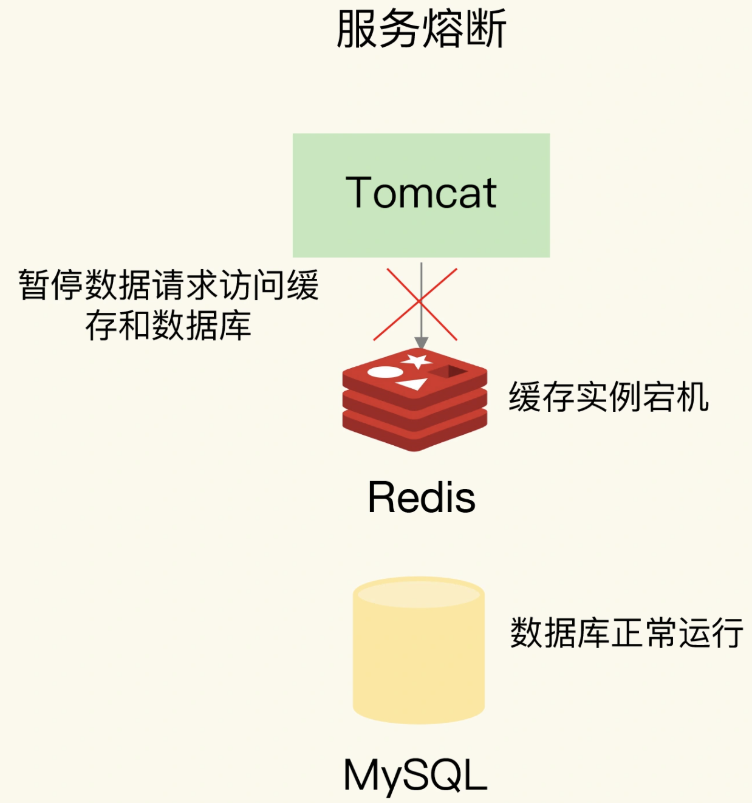
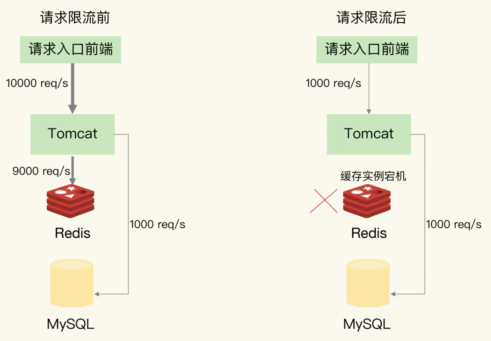
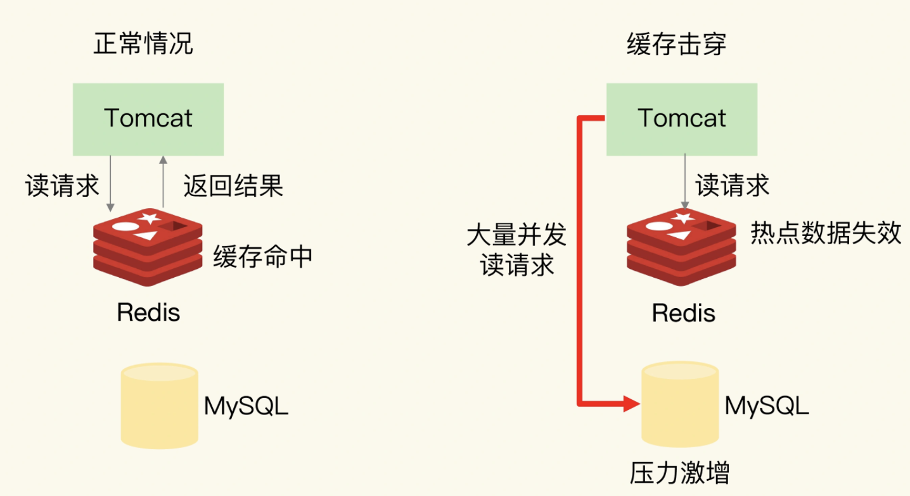
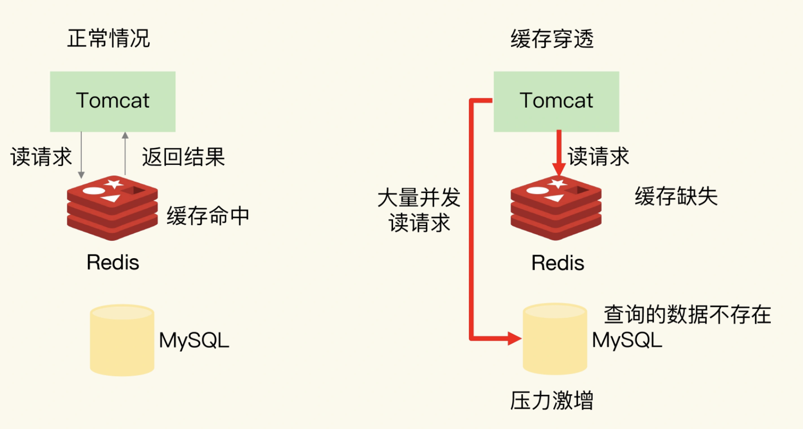
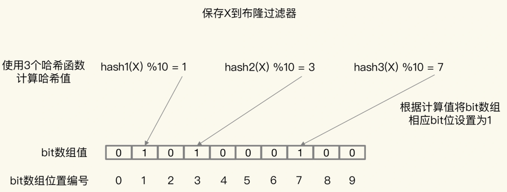

## 缓存雪崩

缓存雪崩是指大量的应用请求无法在Redis缓存中进行处理，紧接着，应用将大量请求发送到数据库层，导致数据库层的压力激增。

第一个原因是：缓存中有大量数据同时过期，导致大量请求无法得到处理。

你可以在用EXPIRE命令给每个数据设置过期时间时，给这些数据的过期时间增加一个较小的随机数（例如，随机增加1~3分钟）

服务降级，是指发生缓存雪崩时，针对不同的数据采取不同的处理方式。

- 当业务应用访问的是非核心数据（例如电商商品属性）时，暂时停止从缓存中查询这些数据，而是直接返回预定义信息、空值或是错误信息；
- 当业务应用访问的是核心数据（例如电商商品库存）时，仍然允许查询缓存，如果缓存缺失，也可以继续通过数据库读取。

**除了大量数据同时失效会导致缓存雪崩，还有一种情况也会发生缓存雪崩，那就是，Redis缓存实例发生故障宕机了，无法处理请求，这就会导致大量请求一下子积压到数据库层，从而发生缓存雪崩。**

**第一个建议，是在业务系统中实现服务熔断或请求限流机制。**

大量请求被发送到数据库进行处理。我们可以启动服务熔断机制，暂停业务应用对缓存服务的访问，从而降低对数据库的访问压力

一旦发生了缓存雪崩，数据库的每秒请求数突然增加到每秒1万个，此时，我们就可以启动请求限流机制，在请求入口前端只允许每秒进入系统的请求数为1000个，再多的请求就会在入口前端被直接拒绝服务。

## 缓存击穿

缓存击穿是指，针对某个访问非常频繁的热点数据的请求，无法在缓存中进行处理，紧接着，访问该数据的大量请求，一下子都发送到了后端数据库，导致了数据库压力激增，会影响数据库处理其他请求。缓存击穿的情况，经常发生在热点数据过期失效时。

特别频繁的热点数据，我们就不设置过期时间

## 缓存穿透

缓存穿透是指要访问的数据既不在Redis缓存中，也不在数据库中，导致请求在访问缓存时，发生缓存缺失，再去访问数据库时，发现数据库中也没有要访问的数据。此时，应用也无法从数据库中读取数据再写入缓存，来服务后续请求，这样一来，缓存也就成了“摆设”，如果应用持续有大量请求访问数据，就会同时给缓存和数据库带来巨大压力

**第一种方案是，缓存空值或缺省值。**

一旦发生缓存穿透，我们就可以针对查询的数据，在Redis中缓存一个空值或是和业务层协商确定的缺省值（例如，库存的缺省值可以设为0）。紧接着，应用发送的后续请求再进行查询时，就可以直接从Redis中读取空值或缺省值，返回给业务应用了，避免了把大量请求发送给数据库处理，保持了数据库的正常运行。

**第二种方案是，使用布隆过滤器快速判断数据是否存在，避免从数据库中查询数据是否存在，减轻数据库压力。**

- 首先，使用N个哈希函数，分别计算这个数据的哈希值，得到N个哈希值。
- 然后，我们把这N个哈希值对bit数组的长度取模，得到每个哈希值在数组中的对应位置。
- 最后，我们把对应位置的bit位设置为1，这就完成了在布隆过滤器中标记数据的操作。

