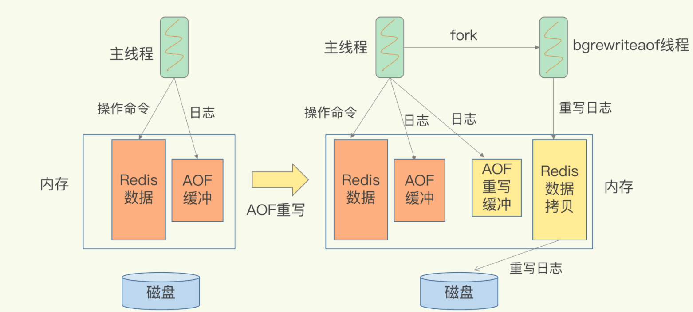

### Redis的持久化主要有两大机制，即AOF日志和RDB快照

## AOF日志

Redis是先执行命令，把数据写入内存，然后才记录日志。
AOF的记录内容：Redis收到的每一条命令，这些命令是以文本形式保存的。

```c
//aof文件
*3  //表示这条命令有三个部分
$3 //这个部分是3字符
set
$7
testkey
$9
testvalue
```

先执行命令，后记录的好处：
只记录有效的命令，不会阻塞当前的写操作。但是会执行完命令，来不及记录日志宕机。

#### 三种写回策略

+ Always,同步写回：每个写命令执行完，立马同步将日志写回磁盘
+ Everysec，每秒：每个写命令执行完，只是先把日志写到AOF文件的内存缓冲区，每个一秒把缓冲区写入磁盘
+ No，操作系统控制的写回：每个写命令执行完，只是先把日志写到aof文件的内存缓冲区，由操作系统决定何时将缓冲区

## 日志文件太大了怎么办？

AOF重写机制就是在重写时，Redis根据数据库的现状创建一个新的AOF文件。旧日志文件中的多条命令，在重写后的新日志中变成了一条命令。

AOF文件是以追加的方式，逐一记录接收到的写命令的。当一个键值对被多条写命令反复修改时，AOF文件会记录相应的多条命令。但是，在重写的时候，是根据这个键值对当前的最新状态，为它生成对应的写入命令。这样一来，一个键值对在重写日志中只用一条命令就行。

#### AOF重写会阻塞吗

每次执行重写时，主线程fork出后台的bgrewriteaof子进程。此时，fork会把主线程的内存拷贝一份给bgrewriteaof子进程，这里面就包含了数据库的最新数据。然后，bgrewriteaof子进程就可以在不影响主线程的情况下，逐一把拷贝的数据写成操作，记入重写日志。

“两处日志”又是什么呢？

因为主线程未阻塞，仍然可以处理新来的操作。此时，如果有写操作，第一处日志就是指正在使用的AOF日志，Redis会把这个操作写到它的缓冲区。这样一来，即使宕机了，这个AOF日志的操作仍然是齐全的，可以用于恢复。

而第二处日志，就是指新的AOF重写日志。这个操作也会被写到重写日志的缓冲区。这样，重写日志也不会丢失最新的操作。等到拷贝数据的所有操作记录重写完成后，重写日志记录的这些最新操作也会写入新的AOF文件，以保证数据库最新状态的记录。此时，我们就可以用新的AOF文件替代旧文件了。



