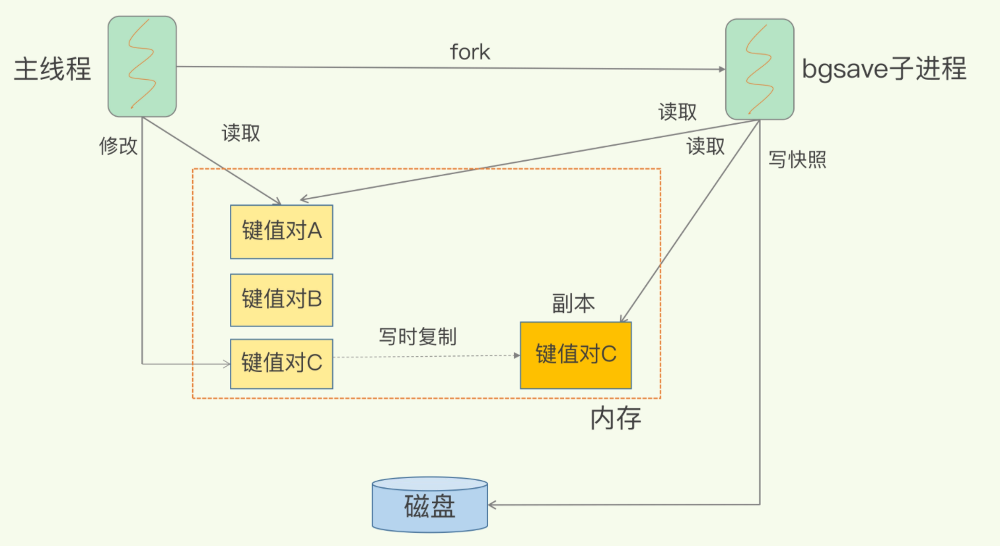

RDB就是Redis DataBase

- 对哪些数据做快照？这关系到快照的执行效率问题；
- 做快照时，数据还能被增删改吗？这关系到Redis是否被阻塞，能否同时正常处理请求。

Redis的数据都在内存中，为了提供所有数据的可靠性保证，它执行的是**全量快照**

Redis提供了两个命令来生成RDB文件，分别是save和bgsave。

- save：在主线程中执行，会导致阻塞；
- bgsave：创建一个子进程，专门用于写入RDB文件，避免了主线程的阻塞，这也是Redis RDB文件生成的默认配置。

#### 快照时数据能修改吗?

如果主线程要修改一块数据（例如图中的键值对C），那么，这块数据就会被复制一份，生成该数据的副本。然后，bgsave子进程会把这个副本数据写入RDB文件，而在这个过程中，主线程仍然可以直接修改原来的数据。

我们可以做增量快照，所谓增量快照，就是指，做了一次全量快照后，后续的快照只对修改的数据进行快照记录，这样可以避免每次全量快照的开销

Redis 4.0中提出了一个**混合使用AOF日志和内存快照**的方法。简单来说，内存快照以一定的频率执行，在两次快照之间，使用AOF日志记录这期间的所有命令操作。

