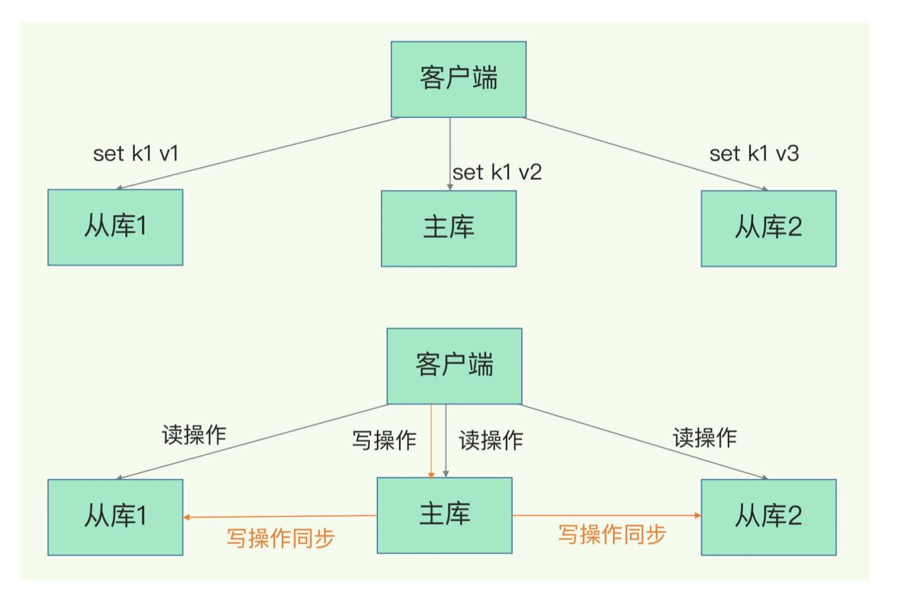

实际上，Redis提供了主从库模式，以保证数据副本的一致，主从库之间采用的是读写分离的方式。

- **读操作**：主库、从库都可以接收；
- **写操作**：首先到主库执行，然后，主库将写操作同步给从库



## 主从库间如何进行第一次同步？

当我们启动多个Redis实例的时候，它们相互之间就可以通过replicaof（Redis 5.0之前使用slaveof）命令形成主库和从库的关系

```
replicaof  172.16.19.3  6379
```


同步过程：

1. 从库和主库建立连接，并告诉主库即将进行同步，主库确认回复后，主从库之间就可以进行同步

   具体来说，从库给主库发送psync命令，表示要进行数据同步。psync命令包含了**主库的runID**和**复制进度offset**两个参数。

   - runID，是每个Redis实例启动时都会自动生成的一个随机ID，用来唯一标记这个实例。当从库和主库第一次复制时，因为不知道主库的runID，所以将runID设为“？”。
   - offset，此时设为-1，表示第一次复制。

2. 主库收到psync命令后，会用FULLRESYNC响应命令带上两个参数：主库runID和主库目前的复制进度offset，返回给从库。从库收到响应后，会记录下这两个参数
   **FULLRESYNC响应表示第一次复制采用的全量复制**

**主库将所有数据同步给从库。从库收到数据后，在本地完成数据加载**


## 主从级联模式分担全量复制时的主库压力

一次全量复制中，对于主库来说，两个耗时的操作：生成RDB文件和传输RDB文件。

从库数量很多，且都要和主库进行全量复制的话。主库忙于fork子进程生成RDB文件，进行数据全量同步。fork这个操作会阻塞主线程处理正常请求，从而导致主库响应应用程序的请求速度变慢。此外，传输RDB文件也会占用主库的网络带宽，同样会给主库的资源使用带来压力

如何减少主库压力？其实是有的，这就是“主-从-从”模式。


旦主从库完成了全量复制，它们之间就会一直维护一个网络连接，主库会通过这个连接将后续陆续收到的命令操作再同步给从库，这个过程也称为**基于长连接的命令传播**，可以避免频繁建立连接的开销


### **主从库间网络断了怎么办？**

Redis 2.8之前，如果主从库在命令传播时出现了网络闪断，那么，从库就会和主库重新进行一次全量复制，开销非常大

Redis 2.8开始，网络断了之后，主从库会采用增量复制的方式继续同步。增量复制只会把主从库网络断连期间主库收到的命令，同步给从库

##### repl_backlog_buffer

主库会把断连期间收到的写操作命令，写入replication buffer，同时也会把这些操作命令也写入repl_backlog_buffer这个缓冲区

repl_backlog_buffer是一个环形缓冲区，**主库会记录自己写到的位置，从库则会记录自己已经读到的位置**

主库和从库的写读位置在一起，这算是它们的起始位置。随着主库不断接收新的写操作，它在缓冲区中的写位置会逐步偏离起始位置，我们通常用偏移量来衡量这个偏移距离的大小，对主库来说，对应的偏移量就是master_repl_offset。主库接收的新写操作越多，这个值就会越大。从库在复制完写操作命令后，它在缓冲区中的读位置也开始逐步偏移刚才的起始位置，此时，从库已复制的偏移量slave_repl_offset也在不断增


