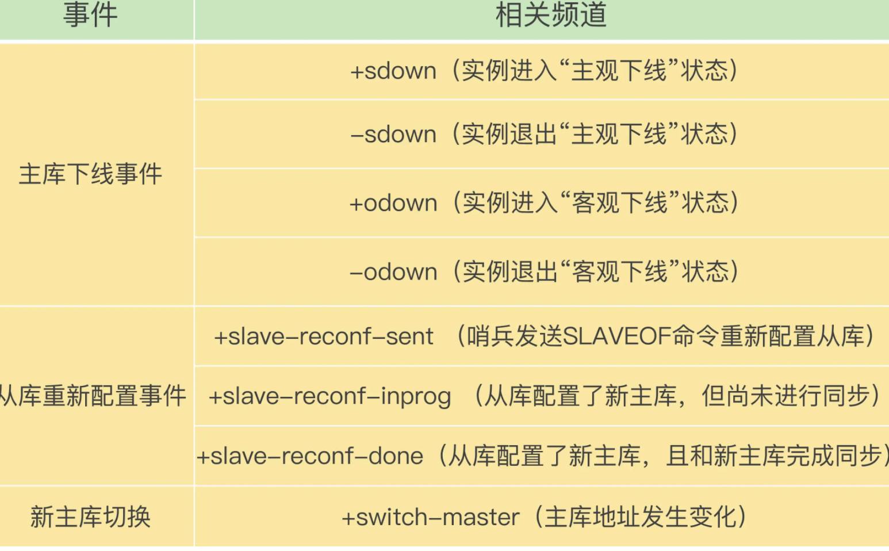

在配置哨兵的信息时，我们只需要用到下面的这个配置项，设置**主库的IP**和**端口**，并没有配置其他哨兵的连接信息。

```c
sentinel monitor <master-name> <ip> <redis-port> <quorum> 
```

## 基于pub/sub机制的哨兵集群组成

哨兵实例之间可以相互发现，要归功于Redis提供的pub/sub机制，也就是发布/订阅机制。

哨兵在主库建立起了连接，就可以在主库上发布消息了，比如说发布它自己的连接信息（IP和端口）。同时，它也可以从主库上订阅消息，获得其他哨兵发布的连接信息。当多个哨兵实例都在主库上做了发布和订阅操作后，它们之间就能知道彼此的IP地址和端口

Redis会以频道的形式，对这些消息进行分门别类的管理。**只有订阅了同一个频道的应用，才能通过发布的消息进行信息交换**。

在主从集群中，主库上有一个名为“`__sentinel__:hello`”的频道，不同哨兵就是通过它来相互发现，实现互相通信的


这是因为，在哨兵的监控任务中，它需要对主从库都进行心跳判断，而且在主从库切换完成后，它还需要通知从库，让它们和新主库进行同步。

#### **哨兵是如何知道从库的IP地址和端口的呢？**

哨兵向主库发送INFO命令来完成的。就像下图所示，哨兵2给主库发送INFO命令，主库接受到这个命令后，就会把从库列表返回给哨兵。接着，哨兵就可以根据从库列表中的连接信息，和每个从库建立连接，并在这个连接上持续地对从库进行监控


可以依赖pub/sub机制，来帮助我们完成哨兵和客户端间的信息同步

## 基于pub/sub机制的客户端事件通知



## 由哪个哨兵执行主从切换？

哨兵集群要判定主库“客观下线”，需要有一定数量的实例都认为该主库已经“主观下线”了

任何一个实例只要自身判断主库“主观下线”后，就会给其他实例发送is-master-down-by-addr命令。接着，其他实例会根据自己和主库的连接情况，做出Y或N的响应，Y相当于赞成票，N相当于反对票


一个哨兵获得了仲裁所需的赞成票数后，就可以标记主库为“客观下线”。这个所需的赞成票数是通过哨兵配置文件中的quorum配置项设定的。例如，现在有5个哨兵，quorum配置的是3，那么，一个哨兵需要3张赞成票，就可以标记主库为“客观下线”了

这个哨兵就可以再给其他哨兵发送命令，表明希望由自己来执行主从切换，并让所有其他哨兵进行投票。这个投票过程称为“Leader选举”。因为最终执行主从切换的哨兵称为Leader，投票过程就是确定Leader。

在投票过程中，任何一个想成为Leader的哨兵，要满足两个条件：第一，拿到半数以上的赞成票；第二，拿到的票数同时还需要大于等于哨兵配置文件中的quorum值。以3个哨兵为例，假设此时的quorum设置为2，那么，任何一个想成为Leader的哨兵只要拿到2张赞成票，就可以了。
