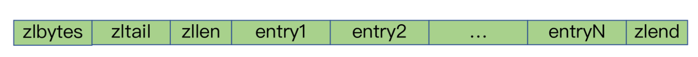
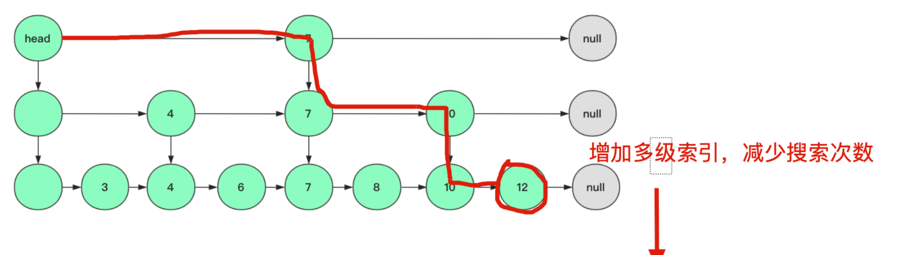
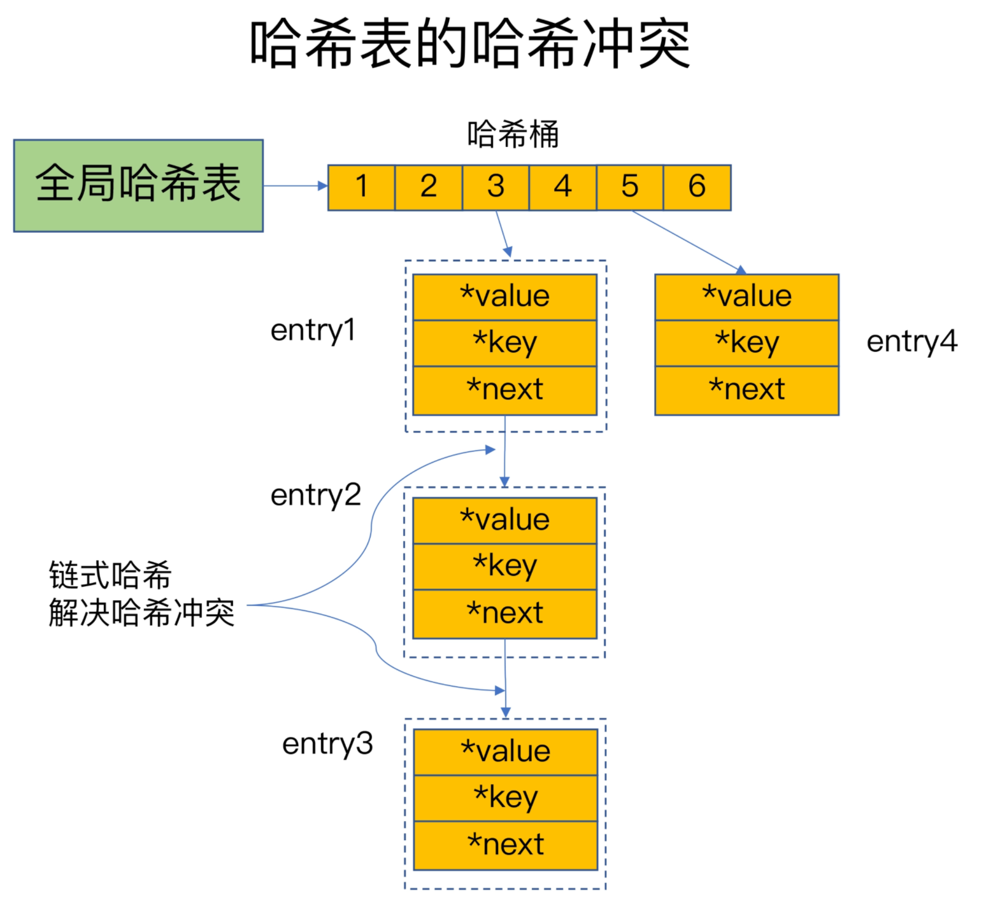
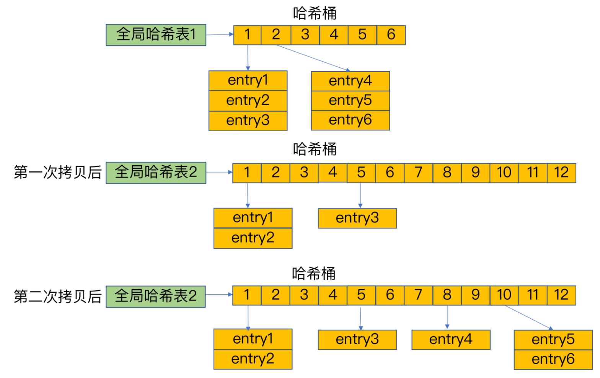
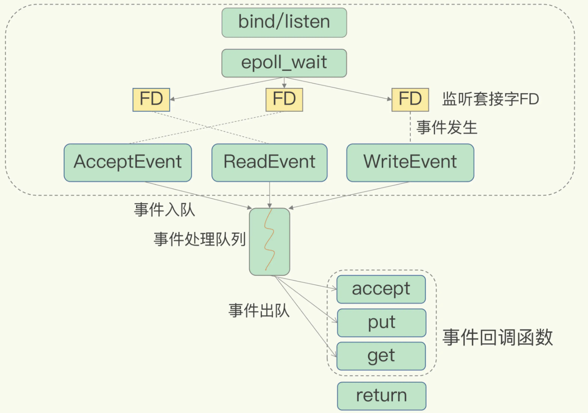
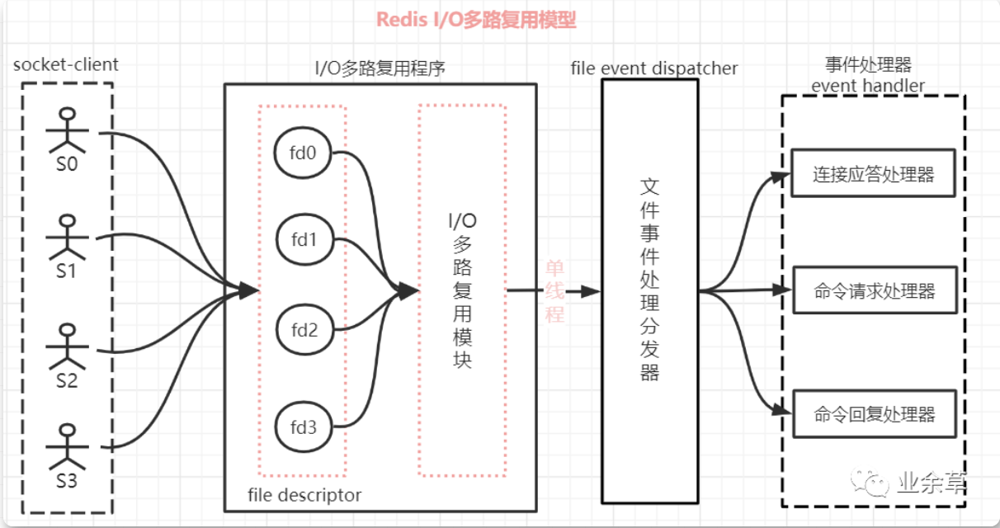

## 理论知识相关

## 1、基本数据类型

+ 字符串(String): 缓存简单字符串，json格式的字符串，计数器，session共享
+ 哈希表(Hash): 适合存储key-value键值对，更适合存储对象
+ 列表(List)：可以做栈，队列
+ 集合(Set)：自动去重。集合可以做交集，并集，差集。适合做共同关注，朋友圈点赞
+ 有序集合(SortedSet)：有序集合通过权重的值进行排序。


## 2、redis缓存淘汰机制

- noeviction: 不删除策略, 达到最大内存限制时, 如果需要更多内存, 直接返回错误信息。 大多数写命令都会导致占用更多的内存(有极少数会例外, 如 [DEL](https://redis.io/commands/del) )。
- allkeys-lru：所有key通用; 优先删除最近最少使用(less recently used ,LRU) 的 key。
- allkeys-random： 所有key通用; 随机删除一部分key。
- volatile-lru：只限于设置了 expire 的部分; 优先删除最近最少使用(less recently used ,LRU) 的 key。
- volatile-random：只限于设置了 expire 的部分; 随机删除一部分 key。
- volatile-ttl：只限于设置了 expire 的部分; 优先删除剩余时间(time to live,TTL) 短的key。


## 3、redis持久化方式

方式两种：

- RDB（数据快照模式），定期存储，保存的是数据本身，存储文件是紧凑的，某一时刻的内存数据保存到硬盘的文件当中，默认保存的文件名为dump.rdb

  #### Redis提供两种方式生成RDB文件:

  1. Save: 在主线程中执行，会阻塞
  2. bgsave： 创建一个子进程，专门用于写入RDB文件，避免了主线程的阻塞。

  默认是使用bgsave。
  redis如何保证写入rdb文件的时候，主线程不阻塞？

  redis借助操作系统提供的写时复制（copy-on-write）技术，执行快照的同时正常处理写操作。

  主线程对数据的修改，复制并生成这块数据的副本。bgsave子线程将副本写入rdb文件。

  ```
参考文章：
  1.写时复制 https://segmentfault.com/a/1190000039869422
  ```
  
  

- AOF（追加模式），每次修改数据时，同步到硬盘(写操作日志)，保存的是数据的变更记录
  先执行命令，将数据写入内存；然后才写入日志。只有命令执行成功才会记录到日志。避免日志恢复的时候出错。

  ##### 三种写回策略：

  1. always，同步写回：每个写命令执行完都同步
  2. everysec，每秒写回：写命令先写到aof_buf的缓冲区，每秒一次把缓冲区写入磁盘
  3. No，只写入aof_buf缓冲区，让操作系统控制写回

  ##### aof重写机制

  Redis创建一个新的AOF文件，也就是说，读取数据库中的所有键值对，然后对每一个键值对用一条命令记录它的写入。旧日志对一个key多次修改，在新aof日志只会保留一条最新的命令

  ##### aof重写过程

  1. 主线程fork一个后台bgrewrireaof子线程，并将内存拷贝一份给子进程。
  2. 主线程不阻塞继续处理，最新写操作写入aof缓冲以及aof重写缓冲。
  3. 子线程重写完成，aof重写缓存写入新的aof文件，在将新的aof文件替代就的aof文件

- aof日志和rdb混合使用
  1.内存快照以一定的频率执行，
  2.在两次快照之间，使用AOF日志记录这期间的所有命令操作。
  3.在第二次全量快照的时候情况aof日志
  优点：RDB文件小，恢复数据速度。aof文件小，避免aof重写。


## 4、redis底层数据结构

1. 简单动态字符串（simple dynamic string,SDS）
   在 C 语言中，字符串可以用一个 `\0` 结尾的 `char` 数组来表示。
   redis的字符串必须是二进制安全：只关心二进制化的字符串,不关心具体格式.只会严格的按照二进制的数据存取。不会妄图已某种特殊格式解析数据

   ```
   typedef char *sds;
   struct sdshdr {
       int len;	// buf 已占用长度
       int free; // buf 剩余可用长度
       char buf[]; // 实际保存字符串数据的地方
   };
   ```

   优点：

   1. sds字符串长度只需读取其len属性，时间复杂度为O(1)

   2. 修改字符串，不会出现缓冲区溢出。因为会根据len和free检查内存空间是否足够，不够进行扩容。

   3. 减少修改字符的内存重新分配次数。
      空间预分配：字符串进行扩容时，比实际需要扩得多。减少分配次数。规则为内存小于1m时翻倍，大于1m每次加1m
      惰性空间释放：字符串缩短时，不立即回收。

   4. 二进制安全：可以存图片，可以存协议。
      
      
      

2. 双向链表（listNode）

   ```
   typedef  struct listNode{
          //前置节点
          struct listNode *prev;
          //后置节点
          struct listNode *next;
          //节点的值
          void *value;  
   }listNode
   ```

    listNode 结构就可以组成链表，这是一个双向链表

3. 压缩列表(ziplist)

   类似数组，但表头有三个字段表示列表相关，数组中的每一个元素都对应保存一个数据；可以存字符串或整数
   

   zlbytes：列表长度；

   zltail：列表的偏移量；
   zlen：entry个数；

   zlend：表示列表结束；
   entry的一般结构：<prevlen> <encoding> <entry-data>

   `prevlen`：前一个entry的大小，编码方式见下文；

   `encoding`：不同的情况下值不同，用于表示当前entry的类型和长度；

   `entry-data`：真是用于存储entry表示的数据；

   entry中存储的是int类型时，encoding和entry-data会合并在encoding中表示

   #### 为什么压缩列表省内存？

   尽量让每个元素按照实际的内容大小存储，**所以增加encoding字段**，针对不同的encoding来细化存储大小但是ziplist中每个data占据的内存不一样，所以为了解决遍历，需要增加记录上一个元素的length，**所以增加了prelen字段**

4. 跳表 (skiplist)

   跳跃表结构在 Redis 中的运用场景只有一个，那就是作为有序列表 (Zset) 的使用。

   多级索引减少搜索次数
   

5. 哈希表/字典(dict)

   key 用来保存键，val 属性用来保存值，值可以是一个指针，也可以是uint64_t整数，也可以是int64_t整数。

   ##### 如何解决哈希冲突？

   链地址法，通过next这个指针可以将多个哈希值相同的键值对连接在一起，用来**解决哈希冲突**

   

   ##### 哈希冲突链过长就会触发rehash操作

   Redis默认使用了两个全局哈希表：哈希表1和哈希表2
   rehash过程：

   1. 给哈希表2分配更大的空间，例如是当前哈希表1大小的两倍；
   2. 把哈希表1中的数据重新映射并拷贝到哈希表2中；
   3. 释放哈希表1的空间。

   渐进式rehash：

   第二步拷贝数据时，Redis仍然正常处理客户端请求，每处理一个请求时，从哈希表1中的第一个索引位置开始，顺带着将这个索引位置上的所有entries拷贝到哈希表2中；等处理下一个请求时，再顺带拷贝哈希表1中的下一个索引位置的entries
    

    

   

6. 整数集合（intset）--  当一个集合只包含整数值元素且不多时候

   ```
   typedef struct intset {
   		//表示编码方式，的取值有三个：INTSET_ENC_INT16, INTSET_ENC_INT32, INTSET_ENC_INT64
       uint32_t encoding; 
       //代表其中存储的整数的个数
       uint32_t length;
       //指向实际存储数值的连续内存区域, 就是一个数组；整数集合的每个元素都是 contents 数组的一个数组项（item），各个项在数组中按值得大小从小到大有序排序，且数组中不包含任何重复项
       int8_t contents[];
   } intset;
   ```

   ##### 整数集合的升级

   当在一个int16类型的整数集合中插入一个int32类型的值，整个集合的所有元素都会转换成32类型.

```
https://segmentfault.com/a/1190000040206818
https://pdai.tech/md/db/nosql-redis/db-redis-x-redis-ds.html#%E7%AE%80%E5%8D%95%E5%8A%A8%E6%80%81%E5%AD%97%E7%AC%A6%E4%B8%B2---sds
http://118.25.23.115/redis/02-%E6%95%B0%E6%8D%AE%E7%BB%93%E6%9E%84%EF%BC%9A%E5%BF%AB%E9%80%9F%E7%9A%84Redis%E6%9C%89%E5%93%AA%E4%BA%9B%E6%85%A2%E6%93%8D%E4%BD%9C%EF%BC%9F.html
```


## 5、什么是缓存穿透、缓存雪崩、缓存击穿，如何解决？

+ 缓存雪崩--同一个时间点有大量的缓存过期，大量请求直接到了数据库、导致数据库的压力激增。
  解决方案:
  1. 避免大量数据设置相同的时间。如果需要对大量缓存同时失效，可以给设置时间设置小范围的随机值。热点数据不过期
  2. 互斥锁。redis写个互斥锁，缓存失效的时候，先锁住等有缓存了再解锁。
  3. 缓存预热。
  4. 当雪崩发生的时候，通过服务降级来应对。对于非核心数据暂停访问，直接返回预定义的错误。核心数据允许查询缓存也允许查数据库。
  5. 如果是redis服务器宕机导致的缓存雪崩如何处理？

```
参考文章：
《我们一起进大厂》系列-缓存雪崩、击穿、穿透 https://juejin.cn/post/6844903986475057165
Redis核心技术与实战 http://118.25.23.115/
```

+ 缓存穿透--数据库和缓存中都没有数据，导致所有的请求落在数据库，一般是数据误删或者恶意攻击

  解决方案:
  1.接口层面直接加校验，如用户鉴权，参数做过滤提前返回结果，id做基础校验<=0，分页做限制

  2.如果读取不到数据可以将数据设置为null，在设置一个比较短过期时间(30s)。

  3.采用布隆过滤器，可能存在的数据哈希到一个足够大的bitmap中。

+ 缓存击穿--数据库有数据但缓存没有，且被大量访问。
  解决方案：

  1. 热点数据不过期。
  2. 互斥锁。

## 6、更新数据的时候，数据库和缓存哪个先更新？为什么？

1. 先更新mysql，在更新redis。缺点，如果redis更新失败，数据不一致。

2. 先删除redis缓存数据，在更新mysql。再次查询的时候数据就会添加到数据库中。缺点，mysql更新数据过程中可能有其他线程读取老数据，导致在更新了一次老数据

3. 延时双删。先删除redis缓存在更新mysql，延时几百毫秒在更新redis缓存。

   

## 7、redis为什么快？为什么是单线程的？

redis单线程主要指**Redis的网络IO和键值对读写是由一个线程来完成的**。
redis为什么快？
	1）大部分操作在内存上完成
	2）高效的数据结构
	3）采用io多路复用
	4）单线程避免上下文切换
redis基于多路复用的高性能I/O模型





1）一个 socket 客户端与服务端连接时，会生成对应一个套接字描述符(套接字描述符是文件描述符的一种)，每一个 socket 网络连接其实都对应一个文件描述符，简写FD。
2）多个客户端与服务端连接时，Redis 使用 **「I/O 多路复用程序」** 将客户端 socket 对应的 FD 注册到监听列表(一个队列)中。当客服端执行 read、write 等操作命令时，I/O 多路复用程序会将命令封装成一个事件，并绑定到对应的 FD 上。
3）**「文件事件处理器」**使用 I/O 多路复用模块同时监控多个文件描述符（fd）的读写情况，当 `accept`、`read`、`write` 和 `close` 文件事件产生时，文件事件处理器就会回调 FD 绑定的事件处理器进行处理相关命令操作。
4）整个文件事件处理器是在单线程上运行的，但是通过 I/O 多路复用模块的引入，实现了同时对多个 FD 读写的监控，当其中一个 client 端达到写或读的状态，文件事件处理器就马上执行，从而就不会出现 I/O 堵塞的问题，提高了网络通信的性能。

总结：1）Redis的处理网络请求的**文件事件处理器**是在**单线程**上运行。
		   2）在linux内核的多路复用机制是指select/epoll机制，一个线程可以同时监听多个socket。
		   3）当监听socket请求到达，事件发生并且入队到事件处理队列
		   4） 每次队列出队一个事件给分发器
           5） 分发器会调用相应的处理函数(事先注册的)

注意：redis6.0之后网络读写请求是多线程处理，但是读写还是单线程

```
参考文章: 
1. redis核心技术于实战
	http://118.25.23.115/redis/03-%E9%AB%98%E6%80%A7%E8%83%BDIO%E6%A8%A1%E5%9E%8B%EF%BC%9A%E4%B8%BA%E4%BB%80%E4%B9%88%E5%8D%95%E7%BA%BF%E7%A8%8BRedis%E8%83%BD%E9%82%A3%E4%B9%88%E5%BF%AB%EF%BC%9F.html
2. 面试官：说说Redis之I/O多路复用模型实现原理 
	https://jishuin.proginn.com/p/763bfbd5f0b1
3. b站视频：
	https://www.bilibili.com/video/BV1xQ4y1h7xq?p=8
4. select、poll、epoll的区别：
	https://mp.weixin.qq.com/s?__biz=MzAxODI5ODMwOA==&mid=2666555795&idx=1&sn=c412269d17238660f0da71e5370d11a6&chksm=80dcad38b7ab242e5a2cbc95ff2c8a92fc1ed568baeb5de3985a9ce087b8202f56b79b14bb11&scene=21#wechat_redirect
```


## 8、缓存污染如何解决？

有些数据被访问的次数非常少，甚至只会被访问一次。当这些数据服务完访问请求后，如果还继续留存在缓存中的话，就只会白白占用缓存空间。这种情况，就是缓存污染。
缓存淘汰策略：

 1. **noeviction**
    旦缓存被写满了，再有写请求来时，Redis 不再提供服务，而是直接返回错误。无法解决缓存污染

 2. **volatile-random**
    在设置了过期时间的键值对中，进行随机删除。无法解决缓存污染

 3. **volatile-ttl**
    删除时多进行一步过期时间的排序。越早过期的数据越优先被选择

 4. **volatile-lru**
    按照最近最少使用的原则来筛选数据。LRU 算法筛选设置了过期时间的键值对。

    Redis会记录每个数据的最近一次被访问的时间戳。在Redis在决定淘汰的数据时，第一次会随机选出 N 个数据，把它们作为一个候选集合。接下来，Redis 会比较这 N 个数据的 lru 字段，把 lru 字段值最小的数据从缓存中淘汰出去

 5. **volatile-lfu**
    LFU 缓存策略是在 LRU 策略基础上，为每个数据增加了一个计数器，来统计这个数据的访问次数。访问次数最低的数据淘汰出缓存。次数相同则比较过期时间。

 6. **allkeys-lru**
    使用 LRU 算法在所有数据中进行筛选

 7. **allkeys-random**

    从所有键值对中随机选择并删除数据

 8. **allkeys-lfu**
    使用 LFU 算法在所有数据中进行筛选

但是，在扫描式查询的应用场景中，LFU策略就可以很好地应对缓存污染问题了，建议你优先使用。

## 9、redis如何设置key的过期时间？实现的原理

实现原理：
	1. 定期扫描删除
	1. 懒汉式删除：get，getset使用时删除

redis将两种结合起来使用：①懒汉式删除，②定期遍历database(16个)，然后检查当前库随机20个key。


## 10、主从复制的原理

1.执行slaveof命令或设置slaveof选项，让一个服务器复制另一个服务器的数据。
2.主库可读写，从库只读。主库的写操作导致的数据变化会自动同步从库。

全量复制：
	1.主节点通过bgsave命令fork子进程进行RDB持久化，
	2.主节点通过网络发送RDB文件。
	3.从节点清空老数据，载入新RDB文件，载入过程是阻塞的。
部分复制：
	1.复制偏移量： 主从节点分别维护一个复制偏移量offset
	2.复制积压缓冲区：主节点维护一个固定长度、先进先出队列作为缓存区。主从offset差距超过缓冲区长度时，将无法执行部分复制，只能全量复制。
	3.服务器运行ID(runid):每个节点的runid在节点启动时自动生成，主节点会将自己的runid发送给从节点保存。从节点断开重连的时候，根据runid来判断同步进度：

+ 如果从节点保存runid和主节点runid一致，主从节点之间同步过，尝试使用部分复制
+ 如果runid不一致，全量复制

```
https://www.bilibili.com/video/BV1xQ4y1h7xq?p=10
```


## 11、redis事务

1. 事务开始
   multi命令的执行，标识着一个事务开始，并且将客户端状态的flags属性中打开REDIS_MULTI标识来完成

2. 命令入队
   客户端切换至事务状态之后，服务器根据客户端发送的命令来执行不同的操作。如果客户端发送的命令是MULTI、EXEC、WATCH、DISCARD。立即执行这个命令，否则放入一个事务队列中。

3. 事务执行
   客户端发送exec命令，服务器执行命令逻辑。

   + 客户端状态flags不含REDIS_MULTI,或者包含REDIS_DIRTY_CAS或REDIS_DIRTY_EXEC，取消事务。
   + 客户端处于事务状态，服务器遍历事务队列并执行，结果全部返回给客户端。

   redis不支持事务回滚机制，但是会检查命令语法错误

   + watch乐观锁，可以监控一个或多个key。一旦一个key被修改，之后的事务不执行。
   + mult命令开启一个事务，它总是返回ok。
   + exec：执行所有事务中命令
   + DISCard，清空事务队列的命令，放弃并退出事务
   + unwatch命令取消监控

## 12、使用redis做异步队列

一般使用list结构作为队列，rpush生成消息，lpop消费消息。当lpop没有消息的时候，要适当sleep一会在重试

#### 能不用sleep？

list还有个blpop，在没有消息的时候，它会阻塞住知道有消息到来

#### 能不生成一次消费多次？

pub/sub主题订阅模式，可以实现1：N消息队列

#### pub/sub有什么缺点

消费者下线生产的消息会丢失

#### 实现延时队列

生产:使用 sortedset，拿时间戳作为 score，消息内容作为 key 调用 zadd 来生产消息，

消费者用zrangebyscore 指令获取 N 秒之前的数据轮询进行处理

```
https://stor.51cto.com/art/202009/627546.htm
```

## 13、redis长链接和短链接的区别

 1.长连接的概念理解
长连接其实就是建立了一次连接 然后中间redis的命令都能一直使用，每次使用都不需要重新建立一个连接，这样可以减少建立redis连接时间。
redis的长连接的生命周期是一个php-fpm进程的时间。再php-fpm这个进程没有关闭之前，这个长连接都是有效的。直观的查看方式就是连续调用两次`$redis->connect();`和 `$redis->pconnect();` 第一个返回的两次的资源id是不一样的，第二个长连接的方式是一样的。
2.长连接的使用
长连接使用其实很简单，直接用pconnect的函数就表示长连接的了。

# 场景题

## 统计手机App每天的新增用户数和第二天的留存用户数。

我们可以用一个集合记录所有登录过App的用户ID，同时，用另一个集合记录每一天登录过App的用户ID。然后，再对这两个集合做聚合统计


## 最新评论列表sorted set

评论时间的先后给每条评论设置一个权重值，然后再把评论保存到Sorted Set中。Sorted Set的ZRANGEBYSCORE命令就可以按权重排序后返回元素。这样的话，即使集合中的元素频繁更新，Sorted Set也能通过ZRANGEBYSCORE命令准确地获取到按序排列的数据。
越新的评论权重越大，目前最新评论的权重是N

```
ZRANGEBYSCORE comments N-9 N
```


## 二值状态统计：统计用户签到

bitmap

假设我们要统计ID 3000的用户在2020年8月份的签到情况，就可以按照下面的步骤进行操作

```
SETBIT uid:sign:3000:202008 2 1 //记录该用户8月3号已签到
GETBIT uid:sign:3000:202008 2   //用户8月3日是否签到
BITCOUNT uid:sign:3000:202008   //统计该用户在8月份的签到次数
```


## 基数统计：统计网页的UV

HyperLogLog是一种用于统计基数的数据集合类型，它的最大优势就在于，当集合元素数量非常多时，它计算基数所需的空间总是固定的，而且还很小

```
PFADD page1:uv user1 user2 user3 user4 user5
```

```
PFCOUNT page1:uv
```


## 参考文章

```
redis核心技术与实战
https://pdai.tech/md/db/nosql-redis/db-redis-overview.html
b站视频：https://www.bilibili.com/video/BV1xQ4y1h7xq
				https://www.bilibili.com/video/BV1sK4y1x749
```


## 大key场景以及热key解决方案

线上的大key问题

因为redis是单线程删除key可能，导致阻塞；阻塞其他所有的请求都会超时；然后又有新的连接进来，会导致连接池耗尽

三种类型的大key

字符串，hash的属性过多，set和zset的成员过多
