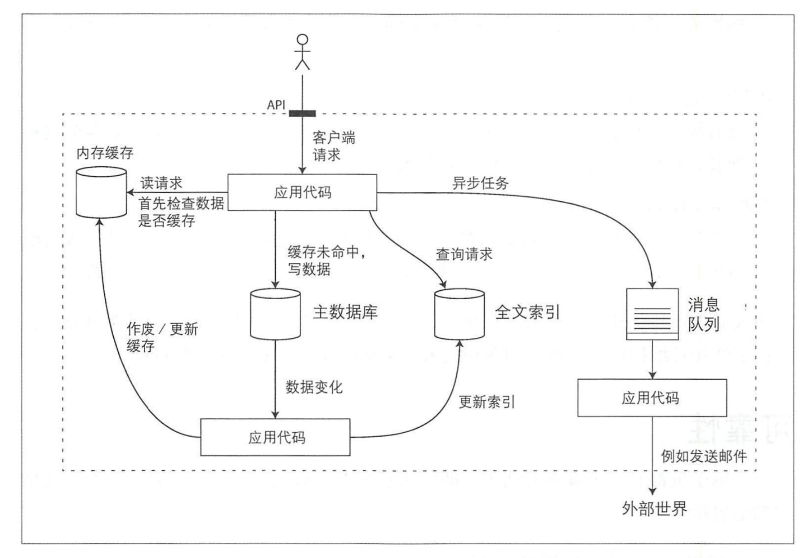

应用系统的模块

+ 数据库：存储数据
+ 高速缓存：缓存某些复杂或者 操作代价昂贵的结果，以加快下一次访问
+ 索引：用户可以按关键字搜索数据井支持各种过掳
+ 流式处理：持续发送消息到另一进程，处理采用异步方式
+ 批处理：定期处理大量的累积数据

#### 软件系统三个问题

+ 可靠性

  当出现意外情况如硬件、软件故障、人为失误等，系统应可以继续正常运转

+ 可扩展性

  着规模 增长 ，例如数据 、流量或复杂性，系统应以合理的方式来匹配这种增长

+ 可维护性

  许多新的人员参与到系统开发和运维， 以维护现有功能或适配新场景等，系统都应高效运转

  

### 可靠性

+ 应用程序执行用户所期望的功能。
+ 可以容忍用户出现错误或者不正确的软件使用方怯
+ 性能可以应对典型场 理负载压力和数据量。
+ 系统可防止任何未经授权的访问和滥用。

造成错误的原因叫做故障，能预料并应对故障的系统特性可成为 容错。

软件错误：
	接受特定的错误输入，导致所有应用服务器崩溃的bug；
	失控进程用尽一些共享资源；系统依赖的服务变慢，没有响应；

人为错误：

​	以最小化犯错机会的方式设计系统。

​	将人们最容易犯错的地方与可能导致失效的地方 **解耦（decouple）**。

​	在各个层次进行彻底的测试。

​	允许从人为错误中简单快速地恢复，以最大限度地减少失效情况带来的影响。

​	配置详细和明确的监控，比如性能指标和错误率。

### 可伸缩性

​	系统今天能可靠运行，并不意味未来也能可靠运行。可伸缩性是用来描述系统应对负载增长能力的术语。

#### 描述负载

​	首先要能简要描述系统的当前负载。负载可以用一些称为 **负载参数（load parameters）** 的数字来描述	

#### 描述性能

- 增加负载参数并保持系统资源（CPU、内存、网络带宽等）不变时，系统性能将受到什么影响？
- 增加负载参数并希望保持性能不变时，需要增加多少系统资源？

### 可维护性

