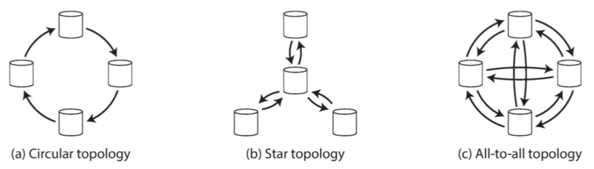

## 分布式数据

+ 可伸缩性
  数据量、读取负载、写入负载超过单台机器的处理能力，可以将负载分散到多台计算机上

+ 容错/高可用

  出现故障仍能可以继续工作，多台机器，以提供冗余

+ 延迟

  每个用户可以从地理上最近的数据中心获取服务，避免了等待网络数据包穿越半个世界

## 伸缩至更高的载荷

 水平伸缩，运行数据库软件的每台机器 / 虚拟机都称为 **节点（node）**。每个节点只使用各自的处理器，内存和磁盘。节点之间的任何协调，都是在软件层面使用传统网络实现的。

## 复制和分区

数据分布在多个节点上有两种常见的方式：

+ 复制replication

  在几个不同的节点上保存数据的副本。复制提供了冗余。

+ 分区partitioning

  将一个大型数据库拆分成较小的子集(分区，partitions)

## 数据副本的意义

+ 使得数据与用户在地理上接近，减少延迟
+ 允许系统出现部分故障，系统可以继续工作，提高可用性
+ 伸缩可以接受读请求的机器数量，提高读取的吞吐量

复制困难在于复制数据的变更。主流的变更复制算法：单领导者(sing leader),  多领导者(multi leader) 和无领导者(leaderless)。

## 领导者 和追随者

当数据存在多个副本的时候：如何确保所有的数据都落在所有的副本上。

最常见的解决方案被成为基于领导者的复制：

1. 当客户端要向数据库写入时，它必须将请求发送给领导者，领导者会将新数据写入其本地存储
2. 每当领导者将新数据写入本地存储时，他也会将数据变更发送给所有的追随者，称之为复制日志(replication log)
3. 当客户想要从数据库中读取时，它可以向领导者或追随者查询。

## 同步复制和异步复制

同步复制的优点，从库保证与主库一致的最新数据副本。主库失效，我们可以确信这些数据在从库可以找到。从库崩溃，主库无法处理写入操作。
所有的节点都拥有最新的数据副本是不切实际的，至少两个节点拥有最新的数据副本：主库和同步从库。这种方式叫做 版同步。

通常情况下，基于领导者的复制都配置为完全异步。库失效且不可恢复，则任何尚未复制给从库的写入都会丢失。

##### 设置新从库，如何快速拉起一个新的节点？

1. 在某个时刻获取主库的一致性快照（如果可能），而不必锁定整个数据库。
2. 将快照复制到新的从库节点
3. 从库连接到主库，并拉取快照之后发生的所有数据变更。

#### 处理节点宕机

从库失效：追赶恢复

​	从库可以从日志中知道，在发生故障之前处理的最后一个事务。因此，从库可以连接到主库，并请求在从库断开期间发生的所有数据变更。

主库失效：故障切换

自动故障切换：

+ 确认主库失效。
+ 选择一个新的主库。这可以通过选举过程（主库由剩余副本以多数选举产生）来完成，或者可以由之前选定的 **控制器节点（controller node）** 来指定新的主库
+ 重新配置系统以启用新的主库。

故障切换会有很多麻烦：

+ 如果使用异步复制，则新主库可能没有收到老主库宕机前最后的写入操作。在选出新主库后，如果老主库重新加入集群，新主库在此期间可能会收到冲突的写入。最常见的解决方案是丢弃老主库为复制的写入。
+ 如果数据库需要和其他外部存储相协调。
+ 发生某些故障是，两个节点都以为自己是主库的情况。
+ 主库被宣告死亡之前的正确超时应该怎么配置？

### 复制日志的实现

##### 基于语句的复制

+ 任何调用 **非确定性函数（nondeterministic）** 的语句，可能会在每个副本上生成不同的值。例如，使用 `NOW()` 获取当前日期时间，或使用 `RAND()` 获取一个随机数
+ 如果语句使用了 **自增列（auto increment）**，或者依赖于数据库中的现有数据（例如，`UPDATE ... WHERE <某些条件>`），则必须在每个副本上按照完全相同的顺序执行它们，否则可能会产生不同的效果。当有多个并发执行的事务时，这可能成为一个限制

##### 传输预写式日志（WAL）

通常写操作都是追加到日志中。日志都是包含所有数据写入的仅追加的字节序列，可以使用完全相同的日志在另一个节点上构建副本。

##### 基于逻辑日志的复制（基于行）

复制和存储引擎使用不同的日志格式，这样可以使复制日志从存储引擎内部分离出来。

+ 对于插入的行，日志包含所有列的新值
+ 对于删除的行，日志包含足够的信息来唯一标识已删除的行。通常是主键
+ 对于更新的行，日志包含足够的信息来唯一标识更新的行，以及所有列的新值

##### 基于触发器的复制

一些工具，可以通过读取数据库日志，使得其他应用程序可以使用数据。另一种方法是使用许多关系数据库自带的功能：触发器和存储过程。

触发器允许你注册在数据库系统中发生数据更改时自动执行的自定义应用程序代码。

**基于触发器的复制通常比其他复制方法具有更高的开销，并且比数据库的内置复制更容易出错，也有很多限制**。然而由于其灵活性，仍然是很有用的。

## 复制延迟的问题

基于主库的复制的特点：

+ 所有写入有一个节点处理，只读所有副本都可以
+ 增多追随者数量就可提高只读请求的服务容量。这种方法只适用于异步复制。
+ 从库落后，应用程序可能看到过时的数据。
+ 但是停止写入并等待一段时间，从库最终会赶上并与主库保持一致。

##### 读己之写(读写一致性)

对于异步复制，用户写入数据后立即查看数据 ，但是新数据尚未复制到副本。对于用户来说，提交的数据丢失了。

基于领导者复制系统实现读写一致性

+ 读用户 **可能已经修改过** 的内容时，都从主库读。个人资料只能由自己编辑。
+ 如果大部分数据都能被所有人修改，就不能限定从主库读。根据**上一次更新时间**来决定是不是从主库读。
+ 客户端可以记住最近一次写入的时间戳，系统需要确保从库为该用户提供任何查询时，该时间戳前的变更都已经传播到了本从库中。如果当前从库不够新，则可以从另一个从库读，或者等待从库追赶上来。

##### 单调读

有多个从库并且进行多次读取，先读到已经同步完的从库，第二次从同步未完成的从库读。

**单调读（Monotonic reads）**保证这种异常不会发生。这是一个比 **强一致性（strong consistency）** 更弱，但比 **最终一致性（eventual consistency）** 更强的保证。

解决方案：可以基于用户 ID 的散列来选择副本，而不是随机选择副本。

##### 一致前缀读

**一致前缀读（consistent prefix reads）** 这个保证说：如果一系列写入按某个顺序发生，那么任何人读取这些写入时，也会看见它们以同样的顺序出现。

这是 **分区（partitioned）** 或 **分片（sharded）** 数据库中的一个特殊问题，如果数据库总是以相同的顺序应用写入，则读取总是会看到一致的前缀，所以这种异常不会发生。

一种解决方案是，确保任何因果相关的写入都写入相同的分区。

## 多主复制

处理写入的每个节点都必须将该数据更改转发给所有其他节点。多主复制往往被认为是危险的领域，应尽可能避免。

#### 处理写入冲突

1. 避免冲突
2. 多次写入最后一次成功
   给写入一个唯一id，最高id写入作为胜利者。如果使用时间戳，这种技术叫最后写入胜利（lww，last write wins）
3. 为每个副本分配一个唯一id，id更高权限更高。

#### 自定义冲突解决逻辑

作为解决冲突最合适的方法可能取决于应用程序，大多数多主复制工具允许使用应用程序代码编写冲突解决逻辑。该代码可以在写入或读取时执行：

+ 写时执行。只要数据库系统检测到复制更改日志中存在冲突，就会调用冲突处理程序
+ 读时执行。当检测到冲突时，所有冲突写入被存储。下一次读取数据时，会将这些多个版本的数据返回给应用程序。应用程序可能会提示用户或自动解决冲突，并将结果写回数据库。

#### 多主复制拓扑

在环形和星形拓扑中，写入可能需要在到达所有副本之前通过多个节点。因此，节点需要转发从其他节点收到的数据更改。为了防止无限复制循环，每个节点被赋予一个唯一的标识符，并且在复制日志中，每个写入都被标记了所有已经过的节点的标识符【43】。当一个节点收到用自己的标识符标记的数据更改时，该数据更改将被忽略，因为节点知道它已经被处理过。

环形和星形拓扑的问题是，如果只有一个节点发生故障，则可能会中断其他节点之间的复制消息流，导致它们无法通信，直到节点修复。

## 无主复制

客户端（用户 1234）并行发送写入到所有三个副本，并且两个可用副本接受写入，但是不可用副本错过了它。假设三个副本中的两个承认写入是足够的：在用户 1234 已经收到两个确定的响应之后，我们认为写入成功。客户简单地忽略了其中一个副本错过了写入的事实。

当一个客户端从数据库中读取数据时，它不仅仅发送它的请求到一个副本：读请求也被并行地发送到多个节点。客户可能会从不同的节点获得不同的响应。即来自一个节点的最新值和来自另一个节点的陈旧值。

#### 读修复和反熵

+ 读修复（Read repair）
  当客户端并行读取多个节点时，它可以检测到任何陈旧的响应，用户 2345 获得了来自副本 3 的版本 6 值和来自副本 1 和 2 的版本 7 值。客户端发现副本 3 具有陈旧值，并将新值写回到该副本。这种方法适用于读频繁的值
+ 反熵过程（Anti-entropy process）
  此外，一些数据存储具有后台进程，该进程不断查找副本之间的数据差异，并将任何缺少的数据从一个副本复制到另一个副本。与基于领导者的复制中的复制日志不同，此反熵过程不会以任何特定的顺序复制写入，并且在复制数据之前可能会有显著的延迟。

#### 读写的法定人数

究竟多少个副本完成才可以认为写成功？

每个成功的写操作意味着在三个副本中至少有两个出现，这意味着至多有一个副本可能是陈旧的

如果有 n 个副本，每个写入必须由 w 节点确认才能被认为是成功的，并且我们必须至少为每个读取查询 r 个节点。

只要 $w + r> n$，我们期望在读取时获得最新的值，因为 r 个读取中至少有一个节点是最新的

法定人数条件 $w + r> n$ 允许系统容忍不可用的节点，如下所示：

- 如果 $w <n$，如果节点不可用，我们仍然可以处理写入。
- 如果 $r <n$，如果节点不可用，我们仍然可以处理读取。
- 对于 $n = 3，w = 2，r = 2$，我们可以容忍一个不可用的节点。
- 对于 $n = 5，w = 3，r = 3$，我们可以容忍两个不可用的节点

如果少于所需的 w 或 r 节点可用，则写入或读取将返回错误

#### 最后写入胜利（丢弃并发写入）

实现最终融合的一种方法是声明每个副本只需要存储最 **“最近”** 的值，并允许 **“更旧”** 的值被覆盖和抛弃

##### “此前发生”的关系和并发

