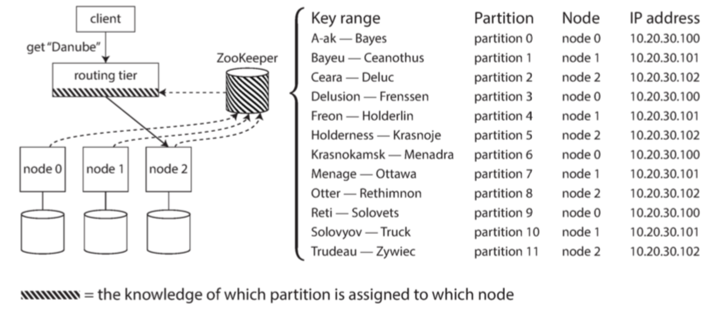

分区定义，每条记录只属于某个特定分区。

## 分区与复制

分区与复制通常结合使用，使得每个分区的副本存储在多个节点上。每条记录属于一个分区，它仍然可以存储在多个不同的节点上以获得容错能力。一个节点可能存储多个分区。

## 键值数据的分区

分区的目标：将**数据**和**查询负载均匀**分布在所有节点上面。

倾斜：分区不均匀导致有些分区承担了更多的数据量和查询负载。

系统热点，负载严重不成比例的分区。

### 1、根据键的范围分区

根据键的范围分区，为每个分区指定一块连续的键范围（从最小值到最大值）。如果知道范围之间的边界，则可以轻松确定哪个分区包含某个值。

### 2、根据键的散列分区

由于偏斜和热点的风险，许多分布式数据存储使用散列函数来确定给定键的分区。

一个合适的键散列函数可以为每个分区分配一个散列范围。

散列分区，不能高效执行范围查询的能力

### 负载偏斜与热点消除

哈希分区可以帮助减少热点，但是并不能避免。

## 分区与次级索引

次级索引的问题是它们不能整齐地映射到分区。

有两种用次级索引对数据库进行分区的方法：**基于文档的分区（document-based）** 和 **基于关键词（term-based）的分区**

#### 基于文档的次级索引进行分区

 每个列表都有一个唯一的 ID， 称之为文档 ID—— 并且用文档 ID 对数据库进行分区。在这种索引方法中，每个分区是完全独立的：每个分区维护自己的次级索引，仅覆盖该分区中的文档。

在这种索引方法中，每个分区是完全独立的：每个分区维护自己的次级索引，仅覆盖该分区中的文档。它不关心存储在其他分区的数据。无论何时你需要写入数据库（添加，删除或更新文档），只需处理包含你正在编写的文档 ID 的分区即可。出于这个原因，**文档分区索引** 也被称为 **本地索引**

如果要搜索红色汽车，则需要将查询发送到所有分区，并合并所有返回的结果。这种查询分区数据库的方法有时被称为 **分散 / 聚集（scatter/gather）**

### 基于关键词(Term)的次级索引进行分区

构建一个覆盖所有分区数据的 **全局索引**，全局索引也必须进行分区，避免在单个节点上面变成瓶颈，但可以采用与主键不同的分区方式。例如，比如按照**颜色**建立全局索引，在按照**字母**进行分区。这种方式就是关键词分区。

关键词分区的全局索引读取效率高：不需要 **分散 / 收集** 所有分区，只需要向包含关键词的分区发出请求。

全局索引的缺点在于写入速度较慢且较为复杂，因为写入单个文档现在可能会影响索引的多个分区

## 分区再平衡

+ 查询吞吐量增加，需要更多cpu来处理负载
+ 数据集大小增加，需要更多磁盘和ram
+ 节点故障，需要其他机器接管故障机器

以上更改都需要数据和请求从一个节点移动到另一个节点。将负载从集群中的一个节点向另一个节点移动的过程称为 **再平衡**

在平衡之后的要求：

+ 在平衡之后，数据存储、读取和写入请求应该在集群中的节点之间公平地共享
+ 在平衡发生时，数据库应该继续接受读取和写入
+ 节点之间只移动必须的数据，以便快速在平衡

#### 再平衡的策略

##### hash mod N

最好将可能的散列分成不同的范围，并将每个范围分配给一个分区。

模 N（$mod N$）方法的问题是，如果节点数量 N 发生变化，大多数键将需要从一个节点移动到另一个节点。

##### 固定数量的分区

创建比节点更多的分区，并为每个节点分配多个分区。例如，运行在 10 个节点的集群上的数据库可能会从一开始就被拆分为 1,000 个分区，因此大约有 100 个分区被分配给每个节点。

这样的话，分区数量不会改变。只有分区在节点之间移动。

现在，如果一个节点被添加到集群中，新节点可以从当前每个节点中 **窃取** 一些分区，直到分区再次公平分配。如果从集群中删除一个节点，则会发生相反的情况。

一开始配置的分区数就是你可以拥有的最大节点数量，所以你需要选择足够多的分区以适应未来的增长。但是，每个分区也有管理开销，所以选择太大的数字会适得其反。

##### 动态分区

对于使用键范围分区的数据库，则可能会导致一个分区中的所有数据或者其他分区中的所有数据为空。

按键的范围进行分区的数据库（如 HBase 和 RethinkDB）会动态创建分区。当分区增长到超过配置的大小时（在 HBase 上，默认值是 10GB），会被分成两个分区，每个分区约占一半的数据。与之相反，如果大量数据被删除并且分区缩小到某个阈值以下，则可以将其与相邻分区合并

每个分区分配给一个节点，每个节点可以处理多个分区，就像固定数量的分区一样。大型分区拆分后，可以将其中的一半转移到另一个节点，以平衡负载。

动态分区的一个优点是分区数量适应总数据量。如果只有少量的数据，少量的分区就足够了，所以开销很小；如果有大量的数据，每个分区的大小被限制在一个可配置的最大值。

##### 按节点比例分区

使分区数与节点数成正比--每个节点具有固定数量的分区。在这种情况下，每个分区的大小与数据集大小成比例地增长，而节点数量保持不变，但是当增加节点数时，分区将再次变小。由于较大的数据量通常需要较大数量的节点进行存储，因此这种方法也使每个分区的大小较为稳定

当一个新节点加入集群时，它随机选择固定数量的现有分区进行拆分，然后占有这些拆分分区中每个分区的一半，同时将每个分区的另一半留在原地。随机化可能会产生不公平的分割，但是平均在更大数量的分区上时（在 Cassandra 中，默认情况下，每个节点有 256 个分区），新节点最终从现有节点获得公平的负载份额。 Cassandra 3.0 引入了另一种再平衡的算法来避免不公平的分割

### 请求路由

数据集分割到多个机器上运行的多个节点上。但是仍然存在一个悬而未决的问题：当客户想要发出请求时，如何知道要连接哪个节点？随着分区重新平衡，分区对节点的分配也发生变化。为了回答这个问题，需要有人知晓这些变化：如果我想读或写键 “foo”，需要连接哪个 IP 地址和端口号？——服务发现

方案:

+ 允许客户端联系任何节点。如果该节点拥有请求的分区，则直接处理该请求；否则，转发到适当的节点，接收回复并传递给客户端。
+ 首先将所有来自客户端的请求发送到路由层，它决定了应该处理请求的节点，并相应地转发。此路由层本身不处理任何请求；它仅负责分区的负载均衡。
+ 要求客户端知道分区和节点的分配。在这种情况下，客户端可以直接连接到适当的节点，而不需要任何中介。

分布式数据系统都依赖于一个独立的协调服务，比如 ZooKeeper 来跟踪集群元数据。 每个节点在 ZooKeeper 中注册自己，ZooKeeper 维护分区到节点的可靠映射

#### 执行并行查询

我们只关注读取或写入单个键的非常简单的查询（加上基于文档分区的次级索引场景下的分散 / 聚集查询）。
