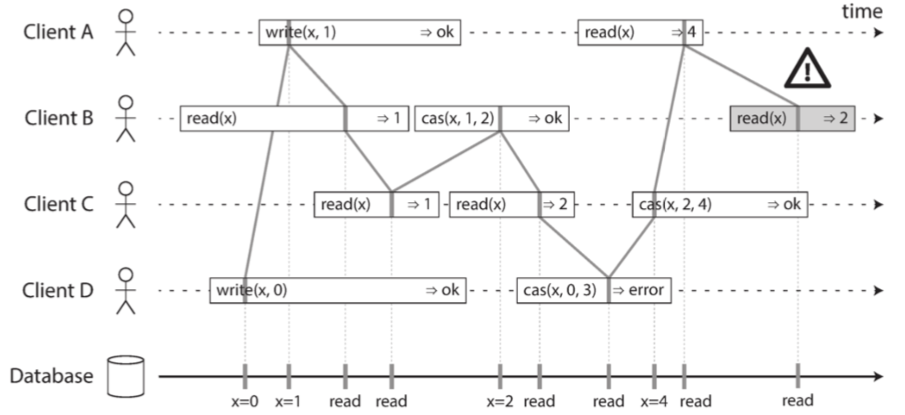
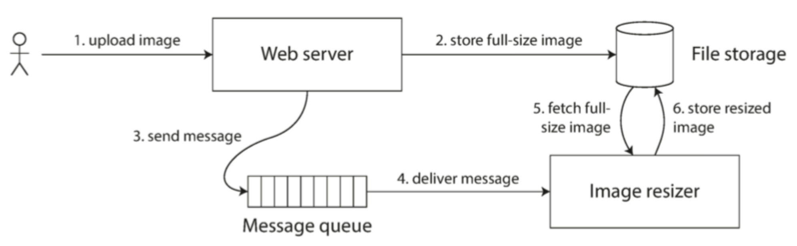
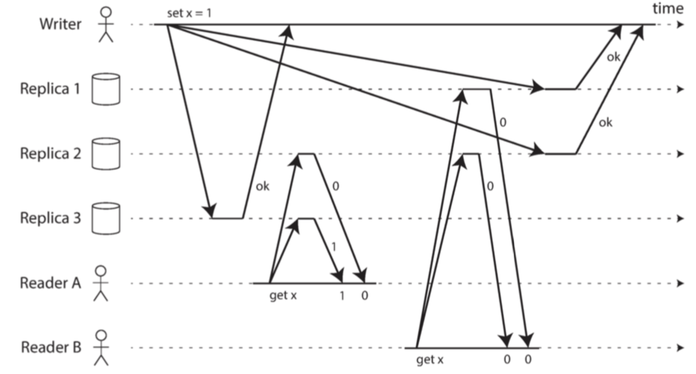
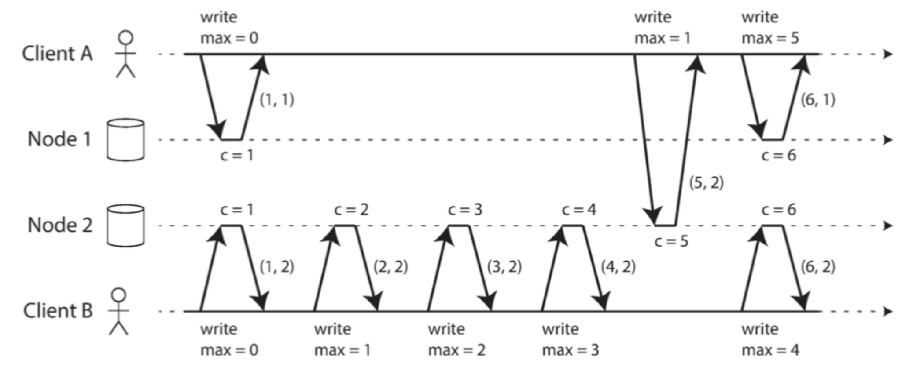

为了构建容错系统，最好先建立一套通用的抽象机制与之对应的技术保证。

## 一致性的保证

不同数据库节点之间的复制中发生的一些时序问题。写请求到达每个节点的时间不一致，同一时刻查看两个数据库节会有不同的数据。但大多数的复制数据库都要最少提供**最终一致性**。

## 线性一致性(强一致性)

线性一致性，让系统看起来像只有一份数据副本，且所有的操作都是**原子**的。线性一致性又叫强一致性，立即一致性。

#### 什么使得系统线性一致性？

与写操作在时间上重叠的任何读操作，可能会返回旧值或新值 ，因为这些操作是 **并发（concurrent）**的。我们期望的是**任何一个读取返回新值后，所有后续读取（在相同或其他客户端上）也必须返回新值。**

```
$cas(x, v_{old}, v_{new})⇒r$ 表示客户端请求进行原子性的 比较与设置 操作。
如果寄存器 $x$ 的当前值等于 $v_{old}$ ，则应该原子地设置为 $v_{new}$ 。
如果 $x≠v_{old}$ ，则操作应该保持寄存器不变并返回一个错误。 $r$ 是数据库的响应（正确或错误）。
```



线性一致性的要求是，操作标记的连线总是按时间（从左到右）向前移动，而不是向后移动。

```
线性一致性与可串行化容易混淆
可串行化（Serializability） 是事务的隔离属性，每个事务可以读写多个对象（行，文档，记录）—— 它确保事务的行为，与它们按照 某种 顺序依次执行的结果相同（每个事务在下一个事务开始之前运行完成）。这种执行顺序可以与事务实际执行的顺序不同。
线性一致性，线性一致性（Linearizability） 是读取和写入寄存器（单个对象）的 新鲜度保证。它不会将操作组合为事务，因此它也不会阻止写入偏差等问题。
一个数据库可以提供可串行化和线性一致性，这种组合被称为严格的可串行化或 强的单副本可串行化（strong-1SR）基于两阶段锁定的可串行化实现
```

#### 依赖线性一致性

线性一致性在什么情况下有用？

##### 1. 锁定和领导选举

单主复制的系统需要确保只有一个主节点。一种选择领导者的方法是使用锁：每个节点在启动时尝试获取锁，成功者成为领导者。

ZooKeeper 和 etcd 之类的协调服务通常用于实现分布式锁和领导者选举。它们使用一致性算法以容错的方式实现线性一致的操作。

##### 2. 约束和唯一性保证

用户名或电子邮件地址必须唯一标识一个用户，而在文件存储服务中，不能有两个具有相同路径和文件名的文件。

##### 跨信道的时序依赖

 

 首先将照片写入文件存储服务，写入完成后再将给缩放器的指令放入消息队列。文件存储服务是线性一致的，应该可以正常工作。

#### 实现线性一致的系统

这种方法无法容错：如果持有该副本的节点失效，数据将会丢失，或者至少无法访问，直到节点重新启动。

使系统容错最常用的方法是使用复制：

+ 单主复制（可能线性一致）
  主库具备写入数据的主副本，而追随者在其他节点上保留数据备份。如果从主库或同步更新的从库读取数据，它们 **可能（potential）** 是线性一致性的。
  从主库读取依赖一个假设，你确定地知道领导者是谁。使用异步复制，故障切换时甚至可能会丢失已提交的写入，这同时违反了持久性和线性一致性
+ 共识算法（线性一致）
  共识协议包含防止脑裂和陈旧副本的措施。正是由于这些细节，共识算法可以安全地实现线性一致性存储
+ 多主复制（非线性一致）
+ 无主复制（也许不是线性一致的）

##### 线性一致性和法定人数

当我们有可变的网络延迟时，就可能存在竞争条件。



这种方式只能实现线性一致的读写；不能实现线性一致的比较和设置（CAS）操作，因为它需要一个共识算法。

##### 线性一致性的代价

**网络中断迫使在线性一致性和可用性之间做出选择。**

如果两个数据中心之间发生网络中断会发生什么？

使用多主数据库，每个数据中心都可以继续正常运行：由于在一个数据中心写入的数据是异步复制到另一个数据中心的，所以在恢复网络连接时，写入操作只是简单地排队并交换。

如果使用单主复制，则主库必须位于其中一个数据中心。任何写入和线性一致的读取请求都必须发送给该主库，因此对于连接到从库所在数据中心的客户端，这些读取和写入请求必须通过网络同步发送到主库所在的数据中心。在单主配置的条件下，如果数据中心之间的网络被中断，则连接到从库数据中心的客户端无法联系到主库，因此它们无法对数据库执行任何写入，也不能执行任何线性一致的读取。它们仍能从从库读取，但结果可能是陈旧的。

如果客户端可以直接连接到主库所在的数据中心，这就不是问题了，那些应用可以继续正常工作。但只能访问从库数据中心的客户端会中断运行，直到网络链接得到修复

#### cap定理

CAP 有时以这种面目出现：一致性，可用性和分区容错性：三者只能择其二。

CAP 更好的表述成：在分区时要么选择一致，要么选择可用。

##### 线性一致性和网络延迟

虽然线性一致是一个很有用的保证，但实际上，线性一致的系统惊人的少。

分布式数据库也是如此：它们是 **为了提高性能** 而选择了牺牲线性一致性，而不是为了容错。


#### 顺序保证

事实证明，顺序、线性一致性和共识之间有着深刻的联系。

##### 顺序与因果关系

+ 在 “[一致前缀读](https://github.com/Vonng/ddia/blob/master/ch5.md#一致前缀读)”（[图 5-5](https://github.com/Vonng/ddia/blob/master/img/fig5-5.png)）中，问题和答案之间存在 **因果依赖（causal dependency）**
+ 一条记录必须先被创建，然后才能被更新。
+ 如果有两个操作 A 和 B，则存在三种可能性：A 发生在 B 之前，或 B 发生在 A 之前，或者 A 和 B**并发**。这种 **此前发生（happened before）** 关系是因果关系的另一种表述
+ 在事务快照隔离的上下文中，事务是从一致性快照中读取的。 **与因果关系保持一致（consistent with causality）**
  **读偏差（read skew）** 意味着读取的数据处于违反因果关系的状态
+ 事务之间 **写偏差（write skew）** 的例子（请参阅 “[写入偏斜与幻读](https://github.com/Vonng/ddia/blob/master/ch7.md#写入偏斜与幻读)”）也说明了因果依赖。
+ 在爱丽丝和鲍勃看球的例子中（[图 9-1](https://github.com/Vonng/ddia/blob/master/img/fig9-1.png)），在听到爱丽丝惊呼比赛结果后，鲍勃从服务器得到陈旧结果的事实违背了因果关系：爱丽丝的惊呼因果依赖于得分宣告，所以鲍勃应该也能在听到爱丽斯惊呼后查询到比分。相同的模式在 “[跨信道的时序依赖](https://github.com/Vonng/ddia/blob/master/ch9.md#跨信道的时序依赖)” 一节中，以 “图像大小调整服务” 的伪装再次出现。

这些因果依赖的操作链定义了系统中的因果顺序，即，什么在什么之前发生。如果一个系统服从因果关系所规定的顺序，我们说它是 **因果一致（causally consistent）** 的。例如，快照隔离提供了因果一致性：当你从数据库中读取到一些数据时，你一定还能够看到其因果前驱（假设在此期间这些数据还没有被删除）。

##### 因果顺序不是全序的

**全序（total order）** 允许任意两个元素进行比较，所以如果有两个元素，你总是可以说出哪个更大，哪个更小。例如，自然数集是全序的

**无法比较（incomparable）** 的，因此数学集合是 **偏序（partially order）** 的。

全序和偏序之间的差异反映在不同的数据库一致性模型中：

+ 线性一致性
  在线性一致的系统中，操作是全序的：如果系统表现的就好像只有一个数据副本，并且所有操作都是原子性的，这意味着对任何两个操作，我们总是能判定哪个操作先发生
+ 因果性

线性一致的数据存储中是不存在并发操作的：必须有且仅有一条时间线，所有的操作都在这条时间线上，构成一个全序关系。可能有几个请求在等待处理，但是数据存储确保了每个请求都是在唯一时间线上的某个时间点自动处理的，不存在任何并发。

并发意味着时间线会分岔然后合并 —— 在这种情况下，不同分支上的操作是无法比较的（即并发操作）

##### 线性一致性强于因果一致性

线性一致性 **隐含着（implies）** 因果关系：任何线性一致的系统都能正确保持因果性。线性一致性可以自动保证因果性，系统无需任何特殊操作。

线性一致可能会损害其性能和可用性。看上去需要线性一致性的系统，实际上需要的只是因果一致性，因果一致性可以更高效地实现。

##### 捕获因果关系

**happened before**，并发操作可以以任意顺序进行，但如果一个操作发生在另一个操作之前，那它们必须在所有副本上以那个顺序被处理。

为了防止丢失更新，我们需要检测到对同一个键的并发写入。因果一致性则更进一步：它需要跟踪整个数据库中的因果依赖，而不仅仅是一个键

##### 序列号顺序

可以使用 **序列号（sequence nunber）** 或 **时间戳（timestamp）** 来排序事件。它提供了一个全序关系：也就是说每个操作都有一个唯一的序列号，而且总是可以比较两个序列号，确定哪一个更大。

可以使用 **与因果一致（consistent with causality）** 的全序来生成序列号。单主复制的数据库中复制日志定义了与因果一致的写操作。主库为每个操作自增一个计数器，从而为复制日志中的每个操作分配一个单调递增的序列号。

##### 非因果序列号生成器

+ 每个节点都可以生成自己独立的一组序列号。例如有两个节点，一个节点只能生成奇数，而另一个节点只能生成偶数。
+ 可以预先分配序列号区块。节点 A 可能要求从序列号 1 到 1,000 区块的所有权，而节点 B 可能要求序列号 1,001 到 2,000 区块的所有权。然后每个节点可以独立分配所属区块中的序列号，并在序列号告急时请求分配一个新的区块。

这三个选项都比单一主库的自增计数器表现要好，并且更具可伸缩性。它们为每个操作生成一个唯一的，近似自增的序列号。然而它们都有同一个问题：生成的序列号与因果不一致。


##### 兰伯特时间戳

每个节点都有一个唯一标识符，和一个保存自己执行操作数量的计数器。兰伯特时间戳就是两者的简单组合：（计数器，节点 ID）$(counter, node ID)$。两个节点有时可能具有相同的计数器值，但通过在时间戳中包含节点 ID，每个时间戳都是唯一的。

 

兰伯特时间戳提供了一个全序，如果你有两个时间戳，则 **计数器** 值大者是更大的时间戳。如果计数器值相同，则节点 ID 越大的，时间戳越大。

##### 光有时间戳排序还不够

为了实现诸如用户名上的唯一约束这种东西，仅有操作的全序是不够的，你还需要知道这个全序何时会尘埃落定。

##### 全序广播

单主复制通过选择一个节点作为主库来确定操作的全序，并在主库的单个 CPU 核上对所有操作进行排序。接下来的挑战是，如果吞吐量超出单个主库的处理能力，这种情况下如何扩展系统；以及，如果主库失效，如何处理故障切换。在分布式系统文献中，这个问题被称为 **全序广播（total order broadcast）** 或 **原子广播（atomic broadcast）**

全序广播通常被描述为在节点间交换消息的协议：

+ 可靠交付

  没有消息丢失：如果消息被传递到一个节点，它将被传递到所有节点。

+ 全序交付（totally ordered delivery）

  消息以相同的顺序传递给每个节点。

正确的全序广播算法必须始终保证可靠性和有序性，即使节点或网络出现故障。当然在网络中断的时候，消息是传不出去的，但是算法可以不断重试，以便在网络最终修复时，消息能及时通过并送达

##### 使用全序广播

ZooKeeper 和 etcd 这样的共识服务实际上实现了全序广播。

全序广播正是数据库复制所需的：如果每个消息都代表一次数据库的写入，且每个副本都按相同的顺序处理相同的写入，那么副本间将相互保持一致。

全序广播的一个重要表现是，顺序在消息送达时被固化：如果后续的消息已经送达，节点就不允许追溯地将（先前）消息插入顺序中的较早位置。这个事实使得全序广播比时间戳排序更强。

##### 使用全序广播实现线性一致的存储

全序广播是异步的：消息被保证以固定的顺序可靠地传送，但是不能保证消息 **何时** 被送达。

线性一致性是新鲜性的保证：读取一定能看见最新的写入值。

全序广播当成仅追加日志的方式来实现这种线性一致的 CAS 操作：

1. 在日志中追加一条消息，试探性地指明你要声明的用户名。
2. 读日志，并等待你刚才追加的消息被读回
3. 检查是否有任何消息声称目标用户名的所有权。如果这些消息中的第一条就是你自己的消息，那么你就成功了：你可以提交声称的用户名（也许是通过向日志追加另一条消息）并向客户端确认。如果所需用户名的第一条消息来自其他用户，则中止操作

日志项是以相同顺序送达至所有节点，因此如果有多个并发写入，则所有节点会对最先到达者达成一致。选择冲突写入中的第一个作为胜利者，并中止后来者，以此确定所有节点对某个写入是提交还是中止达成一致。

##### 使用线性一致性存储实现全序广播

每个要通过全序广播发送的消息首先对线性一致寄存器执行 **自增并返回** 操作。然后将从寄存器获得的值作为序列号附加到消息中。然后你可以将消息发送到所有节点（重新发送任何丢失的消息），而收件人将按序列号依序传递（deliver）消息。


## 分布式事务与共识

共识，目标只是 **让几个节点达成一致**。

例如：

+ 领导选举

  单主复制的数据库，所以节点就哪个节点是领导者达成一致。错误的故障切换会导致两个节点都认为自己是领导者

+ 原子提交

  在支持跨多节点或跨多分区事务的数据库中，一个事务可能在某些节点上失败，但在其他节点上成功。我们必须让所有节点对事务的结果达成一致：要么全部中止 / 回滚（如果出现任何错误），要么它们全部提交（如果没有出错）。这个共识的例子被称为 **原子提交（atomic commit）**

### 原子提交和两阶段提交

##### 从单节点到分布式原子提交

对于在单个数据库节点执行的事务，原子性通常由存储引擎实现。

多节点的事务，仅向所有节点发送请求并提交每个节点的事务是不够，因为：

+ 有些节点可能会检测到违反约束或冲突，需要中止，而其他节点提交了。
+ 某些提交请求可能在网络中丢失了，超时而终止，而其他节点成功提交。
+ 在提交记录完全写入之前，某些节点可能会崩溃，并在恢复时回滚，而其他节点则成功提交

##### 两阶段提交（two pahse commit）

两阶段提交是一种用于实现跨多个节点的原子事务提交的算法，即确保所有节点提交或所有节点中止。

2PC使用**协调者**（coordinator，也称为 **事务管理器**，即 transaction manager）

2PC 事务以应用在多个数据库(参与者)节点上读写数据开始。阶段一，协调者发送一个准备(prepare)到各个节点，询问能否提交，然后协调者会跟踪参与者的响应：

+ 如果所有参与者都回答 “是”，表示它们已经准备好提交，那么协调者在阶段 2 发出 **提交（commit）** 请求，然后提交真正发生。
+ 如果任意一个参与者回复了 “否”，则协调者在阶段 2 中向所有节点发送 **中止（abort）** 请求。


##### 系统承诺

分解两阶段提交过程：

1. 当应用想要启动一个分布式事务时，它向协调者请求一个事务 ID。此事务 ID 是全局唯一的。
2. 应用在每个参与者上启动单节点事务，并在单节点事务上捎带上这个全局事务 ID。所有的读写都是在这些单节点事务中各自完成的。如果在这个阶段出现任何问题（例如，节点崩溃或请求超时），则协调者或任何参与者都可以中止。
3. 当应用准备提交时，协调者向所有参与者发送一个 **准备** 请求，并打上全局事务 ID 的标记。如果任意一个请求失败或超时，则协调者向所有参与者发送针对该事务 ID 的中止请求。
4. 参与者收到准备请求时，需要确保在任意情况下都的确可以提交事务。这包括将所有事务数据写入磁盘（出现故障，电源故障，或硬盘空间不足都不能是稍后拒绝提交的理由）以及检查是否存在任何冲突或违反约束。通过向协调者回答 “是”，节点承诺，只要请求，这个事务一定可以不出差错地提交。换句话说，参与者放弃了中止事务的权利，但没有实际提交。
5. 当协调者收到所有准备请求的答复时，会就提交或中止事务作出明确的决定（只有在所有参与者投赞成票的情况下才会提交）。协调者必须把这个决定写到磁盘上的事务日志中，如果它随后就崩溃，恢复后也能知道自己所做的决定。这被称为 **提交点（commit point）**。
6. 一旦协调者的决定落盘，提交或放弃请求会发送给所有参与者。如果这个请求失败或超时，协调者必须永远保持重试，直到成功为止。没有回头路：如果已经做出决定，不管需要多少次重试它都必须被执行。如果参与者在此期间崩溃，事务将在其恢复后提交 —— 由于参与者投了赞成，因此恢复后它不能拒绝提交。

##### 协调者失效

如果协调者崩溃，会发生什么情况就不太清楚了。

如果协调者在发送 **准备** 请求之前失败，参与者可以安全地中止事务。但是，一旦参与者收到了准备请求并投了 “是”，就不能再单方面放弃 —— 必须等待协调者回答事务是否已经提交或中止。如果此时协调者崩溃或网络出现故障，参与者什么也做不了只能等待。参与者的这种事务状态称为 **存疑（in doubt）** 的或 **不确定（uncertain）** 的。

可以完成 2PC 的唯一方法是等待协调者恢复。这就是为什么协调者必须在向参与者发送提交或中止请求之前，将其提交或中止决定写入磁盘上的事务日志：协调者恢复后，通过读取其事务日志来确定所有存疑事务的状态。任何在协调者日志中没有提交记录的事务都会中止。因此，2PC 的 **提交点** 归结为协调者上的常规单节点原子提交。

#### 三阶段提交

通常，非阻塞原子提交需要一个 **完美的故障检测器（perfect failure detector）**—— 即一个可靠的机制来判断一个节点是否已经崩溃。在具有无限延迟的网络中，超时并不是一种可靠的故障检测机制，因为即使没有节点崩溃，请求也可能由于网络问题而超时

##### XA事务

*X/Open XA*，跨异构技术实现两阶段提交的标准。XA 不是一个网络协议 —— 它只是一个用来与事务协调者连接的 C API。

XA 假定你的应用使用网络驱动或客户端库来与 **参与者**（数据库或消息服务）进行通信。如果驱动支持 XA，则意味着它会调用 XA API 以查明操作是否为分布式事务的一部分 —— 如果是，则将必要的信息发往数据库服务器。驱动还会向协调者暴露回调接口，协调者可以通过回调来要求参与者准备、提交或中止。

##### 怀疑时持有锁

问题在于 **锁（locking）**。正如在 “[读已提交](https://github.com/Vonng/ddia/blob/master/ch7.md#读已提交)” 中所讨论的那样，数据库事务通常获取待修改的行上的 **行级排他锁**，以防止脏写。此外，如果要使用可串行化的隔离等级，则使用两阶段锁定的数据库也必须为事务所读取的行加上共享锁。因此，在使用两阶段提交时，事务必须在整个存疑期间持有这些锁。如果协调者已经崩溃，需要 20 分钟才能重启，那么这些锁将会被持有 20 分钟

##### 从协调者故障中恢复

理论上，如果协调者崩溃并重新启动，它应该干净地从日志中恢复其状态，并解决任何存疑事务。然而在实践中，**孤立（orphaned）** 的存疑事务确实会出现

这些事务无法自动解决，所以它们永远待在数据库中，持有锁并阻塞其他事务。因为在 2PC 的正确实现中，即使重启也必须保留存疑事务的锁（否则就会冒违反原子性保证的风险）

许多 XA 的实现都有一个叫做 **启发式决策（heuristic decisions）** 的紧急逃生舱口：允许参与者单方面决定放弃或提交一个存疑事务，而无需协调者做出最终决定

这里 **启发式** 是 **可能破坏原子性（probably breaking atomicity）** 的委婉说法，因为它违背了两阶段提交的系统承诺

##### 分布式事务的限制

##### 容错共识

共识问题通常形式化如下：一个或多个节点可以 **提议（propose）** 某些值，而共识算法 **决定（decides）** 采用其中的某个值。

在这种形式下，共识算法必须满足以下性质：

- 一致同意（Uniform agreement）

  没有两个节点的决定不同。

- 完整性（Integrity）

  没有节点决定两次。

- 有效性（Validity）

  如果一个节点决定了值 `v` ，则 `v` 由某个节点所提议。

- 终止（Termination）

  由所有未崩溃的节点来最终决定值。

##### 共识算法和全序广播

最著名的容错共识算法是 **视图戳复制（VSR, Viewstamped Replication）**。

所以，全序广播相当于重复进行多轮共识（每次共识决定与一次消息传递相对应）：

- 由于 **一致同意** 属性，所有节点决定以相同的顺序传递相同的消息。
- 由于 **完整性** 属性，消息不会重复。
- 由于 **有效性** 属性，消息不会被损坏，也不能凭空编造。
- 由于 **终止** 属性，消息不会丢失。


##### 单领导者复制与共识

一些数据库会自动执行领导者选举和故障切换，如果旧主库失效，会提拔一个从库为新主库。

##### 纪元编号和法定人数

##### 共识的局限性

共识算法对于分布式系统来说是一个巨大的突破：它为其他充满不确定性的系统带来了基础的安全属性（一致同意，完整性和有效性），然而它们还能保持容错（只要多数节点正常工作且可达，就能取得进展）。它们提供了全序广播，因此它们也可以以一种容错的方式实现线性一致的原子操作。

大多数共识算法假定参与投票的节点是固定的集合，这意味着你不能简单的在集群中添加或删除节点。共识算法的 **动态成员扩展（dynamic membership extension）** 允许集群中的节点集随时间推移而变化，但是它们比静态成员算法要难理解得多。

共识系统通常依靠超时来检测失效的节点。在网络延迟高度变化的环境中，特别是在地理上散布的系统中，经常发生一个节点由于暂时的网络问题，错误地认为领导者已经失效。虽然这种错误不会损害安全属性，但频繁的领导者选举会导致糟糕的性能表现，因系统最后可能花在权力倾扎上的时间要比花在建设性工作的多得多。

##### 成员与协调服务

像 ZooKeeper 或 etcd 这样的项目通常被描述为 “分布式键值存储” 或 “协调与配置服务”。数据库复制需要的就是全序广播：如果每条消息代表对数据库的写入，则以相同的顺序应用相同的写入操作可以使副本之间保持一致。

ZooKeeper实现了全序广播（因此也实现了共识），而且还构建了一组有趣的其他特性，这些特性在构建分布式系统时变得特别有用：

- 线性一致性的原子操作

  使用原子 CAS 操作可以实现锁：如果多个节点同时尝试执行相同的操作，只有一个节点会成功。共识协议保证了操作的原子性和线性一致性，即使节点发生故障或网络在任意时刻中断。分布式锁通常以 **租约（lease）** 的形式实现，租约有一个到期时间，以便在客户端失效的情况下最终能被释放（请参阅 “[进程暂停](https://github.com/Vonng/ddia/blob/master/ch8.md#进程暂停)”）。

- 操作的全序排序

  如 “[领导者和锁](https://github.com/Vonng/ddia/blob/master/ch8.md#领导者和锁)” 中所述，当某个资源受到锁或租约的保护时，你需要一个防护令牌来防止客户端在进程暂停的情况下彼此冲突。防护令牌是每次锁被获取时单调增加的数字。ZooKeeper 通过全序化所有操作来提供这个功能，它为每个操作提供一个单调递增的事务 ID（`zxid`）和版本号（`cversion`）【15】。

- 失效检测

  客户端在 ZooKeeper 服务器上维护一个长期会话，客户端和服务器周期性地交换心跳包来检查节点是否还活着。即使连接暂时中断，或者 ZooKeeper 节点失效，会话仍保持在活跃状态。但如果心跳停止的持续时间超出会话超时，ZooKeeper 会宣告该会话已死亡。当会话超时时（ZooKeeper 称这些节点为 **临时节点**，即 ephemeral nodes），会话持有的任何锁都可以配置为自动释放。

- 变更通知

  客户端不仅可以读取其他客户端创建的锁和值，还可以监听它们的变更。因此，客户端可以知道另一个客户端何时加入集群（基于新客户端写入 ZooKeeper 的值），或发生故障（因其会话超时，而其临时节点消失）。通过订阅通知，客户端不用再通过频繁轮询的方式来找出变更。

##### 将工作分配给节点

##### 服务发现

ZooKeeper、etcd 和 Consul 也经常用于服务发现 —— 也就是找出你需要连接到哪个 IP 地址才能到达特定的服务。

##### 成员资格服务

成员资格服务确定哪些节点当前处于活动状态并且是集群的活动成员。正如我们在 [第八章](https://github.com/Vonng/ddia/blob/master/ch8.md) 中看到的那样，由于无限的网络延迟，无法可靠地检测到另一个节点是否发生故障。但是，如果你通过共识来进行故障检测，那么节点可以就哪些节点应该被认为是存在或不存在达成一致。
