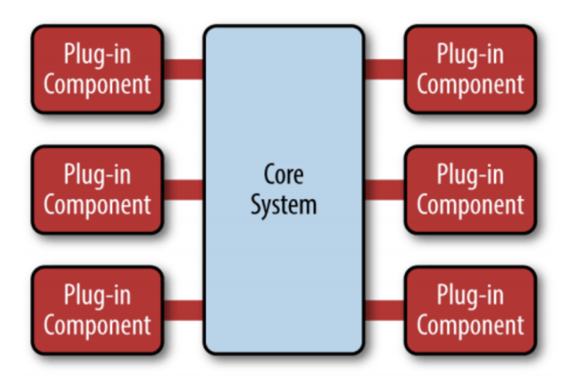
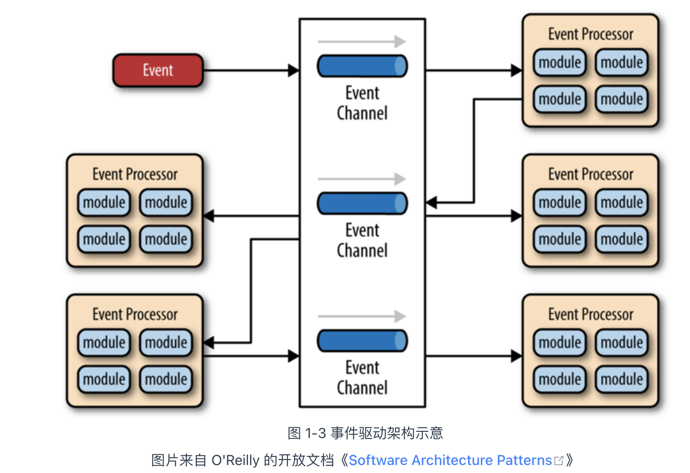
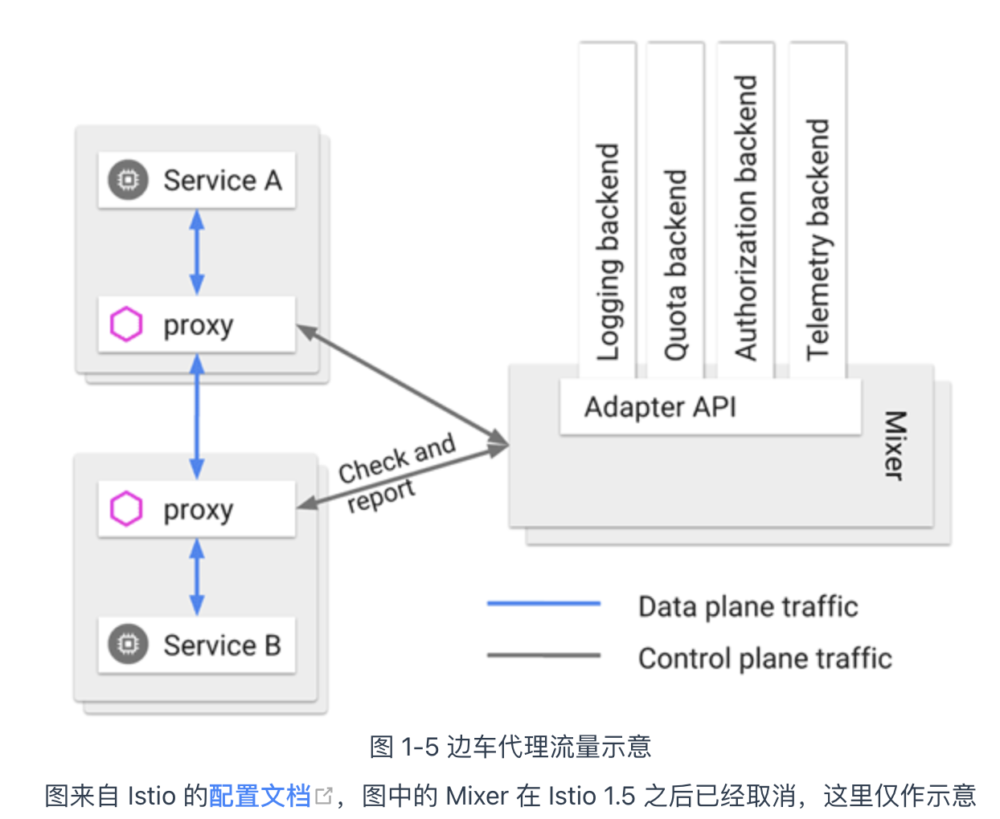

## 原始分布式

远程调用带来的问题：

+ 远程服务在哪里（服务发现）
+ 有多少个服务（负载均衡）
+ 网络出现分区、超时或者服务出错怎么办（熔断、隔离、降级）
+ 方法的参数和返回结果如何表示（序列化协议）
+ 信息如何传输（传输协议）
+ 服务权限如何管理（认证、授权）
+ 如何保证通信安全（网络安全层）
+ 如何令调用不同机器的服务返回相同的结果（分布式数据一致性）

## 单体系统时代

对于小型系统——即由单台机器就足以支撑其良好运行的系统，单体不仅易于开发、易于测试、易于部署，且由于系统中各个功能、模块、方法的调用过程都是进程内调用，不会发生[进程间通信](https://zh.wikipedia.org/wiki/行程間通訊)（Inter-Process Communication，IPC）。

由于所有代码都运行在同一个进程空间之内，所有模块、方法的调用都无须考虑网络分区、对象复制这些麻烦的事和性能损失。

获得了进程内调用的简单、高效等好处的同时，也意味着如果任何一部分代码出现了缺陷，过度消耗了进程空间内的资源，所造成的影响也是全局性的、难以隔离的。譬如内存泄漏、线程爆炸、阻塞、死循环等问题，都将会影响整个程序，而不仅仅是影响某一个功能、模块本身的正常运作

## SOA 架构（Service-Oriented Architecture）

为了对大型的单体系统进行拆分，让每一个子系统都能独立地部署、运行、更新，三种较有代表性的架构模式：

+ [烟囱式架构](https://en.wikipedia.org/wiki/Information_silo)（Information Silo Architecture）：它指的是一种完全不与其他相关信息系统进行互操作或者协调工作的设计模式。两个不发生交互的信息系统，让它们使用独立的数据库和服务器即可实现拆分，而唯一的问题，也是致命的问题是，企业中真的存在完全不发生交互的部门吗？

+ [微内核架构](https://en.wikipedia.org/wiki/Microkernel)（Microkernel Architecture）：微内核架构也被称为插件式架构（Plug-in Architecture）：共享人员、组织、权限等一些的公共的主数据，那不妨就将这些主数据，连同其他可能被各子系统使用到的公共服务、数据、资源集中到一块，成为一个被所有业务系统共同依赖的核心（Kernel，也称为 Core System），具体的业务系统以插件模块（Plug-in Modules）的形式存在，这样也可提供可扩展的、灵活的、天然隔离的功能特性，即微内核架构

  

+ [事件驱动架构](https://en.wikipedia.org/wiki/Event-driven_architecture)（Event-Driven Architecture）：为了能让子系统互相通信，一种可行的方案是在子系统之间建立一套事件队列管道（Event Queues），来自系统外部的消息将以事件的形式发送至管道中，各个子系统从管道里获取自己感兴趣、能够处理的事件消息，也可以为事件新增或者修改其中的附加信息，甚至可以自己发布一些新的事件到管道队列中去，如此，每一个消息的处理者都是独立的，高度解耦的，但又能与其他处理者（如果存在该消息处理者的话）通过事件管道进行互动

  

## 微服务时代

微服务架构（Microservices）

微服务是一种通过多个小型服务组合来构建单个应用的架构风格，这些服务围绕业务能力而非特定的技术标准来构建。各个服务可以采用不同的编程语言，不同的数据存储技术，运行在不同的进程之中。服务采取轻量级的通信机制和自动化的部署机制实现通信与运维。

**微服务是一种通过多个小型服务组合来构建单个应用的架构风格，这些服务围绕业务能力而非特定的技术标准来构建。各个服务可以采用不同的编程语言，不同的数据存储技术，运行在不同的进程之中。服务采取轻量级的通信机制和自动化的部署机制实现通信与运维**。

+ **围绕业务能力构建**。
+ **分散治理**。服务对应的开发团队有直接对服务运行质量负责的责任，也应该有着不受外界干预地掌控服务各个方面的权力
+ **通过服务来实现独立自治的组件**（Componentization via Services）。
+ **产品化思维**（Products not Projects）。避免把软件研发视作要去完成某种功能，而是视作一种持续改进、提升的过程。
+ **数据去中心化**（Decentralized Data Management）微服务明确地提倡数据应该按领域分散管理、更新、维护、存储，在单体服务中，一个系统的各个功能模块通常会使用同一个数据库，诚然中心化的存储天生就更容易避免一致性问题，但是，同一个数据实体在不同服务的视角里，它的抽象形态往往也是不同的
+ **强终端弱管道**（Smart Endpoint and Dumb Pipe）。弱管道（Dumb Pipe）几乎算是直接指名道姓地反对 SOAP 和 ESB 的那一堆复杂的通信机制
+ **容错性设计**（Design for Failure）。不再虚幻地追求服务永远稳定，而是接受服务总会出错的现实，要求在微服务的设计中，有自动的机制对其依赖的服务能够进行快速故障检测，在持续出错的时候进行隔离，在服务恢复的时候重新联通。所以“断路器”这类设施，对实际生产环境的微服务来说并不是可选的外围组件，而是一个必须的支撑点，如果没有容错性的设计，系统很容易就会被因为一两个服务的崩溃所带来的雪崩效应淹没。
+ **演进式设计**（Evolutionary Design）。容错性设计承认服务会出错，演进式设计则是承认服务会被报废淘汰。一个设计良好的服务，应该是能够报废的，而不是期望得到长存永生。假如系统中出现不可更改、无可替代的服务，这并不能说明这个服务是多么的优秀、多么的重要，反而是一种系统设计上脆弱的表现，微服务所追求的独立、自治，也是反对这种脆弱性的表现。
+ **基础设施自动化**（Infrastructure Automation）。基础设施自动化，如 CI/CD 的长足发展，显著减少了构建、发布、运维工作的复杂性。由于微服务下运维的对象比起单体架构要有数量级的增长，使用微服务的团队更加依赖于基础设施的自动化，人工是很难支撑成百上千乃至成千上万级别的服务的。

服务的注册发现、跟踪治理、负载均衡、故障隔离、认证授权、伸缩扩展、传输通信、事务处理，等等，这些问题，在微服务中不再会有统一的解决方案

