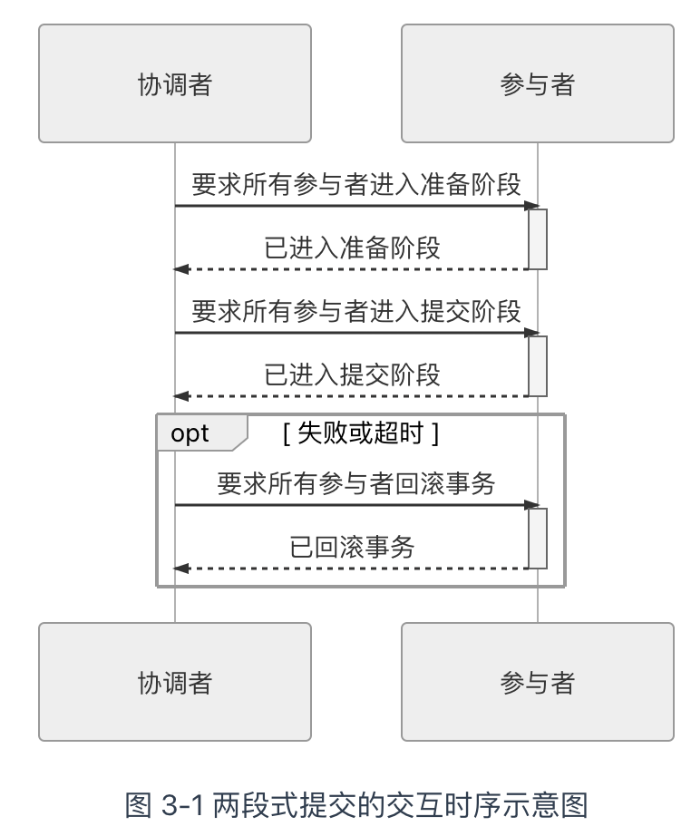
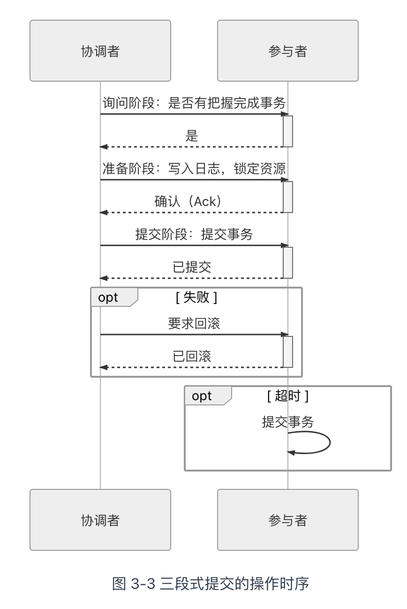
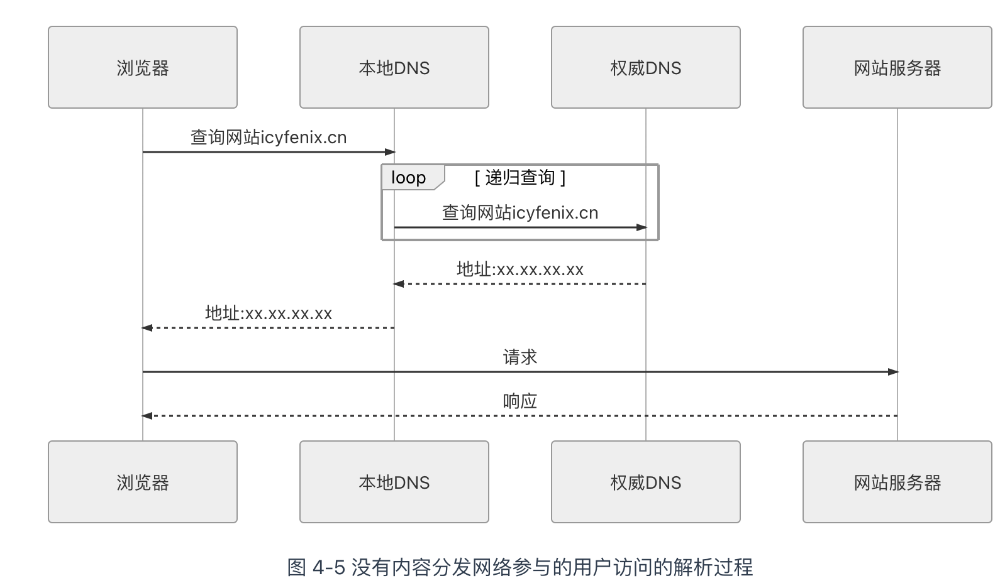
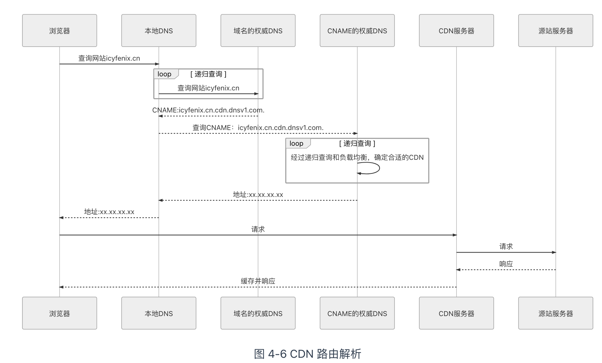

## 远程调用

PRC，远程服务调用（Remote Procedure Call，RPC），**为了让计算机能够跟调用本地方法一样去调用远程方法**

## 进程间通信

+ **管道**（Pipe）或者**具名管道**（Named Pipe）
+ 信号。
+ 信号量。信号量用于两个进程之间同步协作手段，它相当于操作系统提供的一个特殊变量
+ 消息队列。进程可以向队列添加消息，被赋予读权限的进程则可以从队列消费消息。消息队列克服了信号承载信息量少，管道只能用于无格式字节流以及缓冲区大小受限等缺点，但实时性相对受限
+ 共享内存。允许多个进程访问同一块公共的内存空间，这是效率最高的进程间通信形式。原本每个进程的内存地址空间都是相互隔离的，但操作系统提供了让进程主动创建、映射、分离、控制某一块内存的程序接口。当一块内存被多进程共享时，各个进程往往会与其它通信机制，譬如信号量结合使用，来达到进程间同步及互斥的协调操作
+ 套接字接口。消息队列和共享内存只适合单机多进程间的通信，套接字接口是更为普适的进程间通信机制，可用于不同机器之间的进程通信。套接字（Socket）起初是由 UNIX 系统的 BSD 分支开发出来的，现在已经移植到所有主流的操作系统上。出于效率考虑，当仅限于本机进程间通信时，套接字接口是被优化过的，不会经过网络协议栈，不需要打包拆包、计算校验和、维护序号和应答等操作，只是简单地将应用层数据从一个进程拷贝到另一个进程，这种进程间通信方式有个专名的名称：UNIX Domain Socket，又叫做 IPC Socket。

## 通信的成本

将 RPC 作为 IPC 的一种特例来看待的。

Socket 是各个操作系统都有提供的标准接口，完全有可能把远程方法调用的通信细节隐藏在操作系统底层，从应用层面上看来可以做到远程调用与本地的进程间通信在编码上完全一致

## 三个基本问题

1. 如何表示数据：

这里数据包括了传递给方法的参数，方法执行后的返回值。无论是将参数传递给另外一个进程，还是从另外一个进程中取回执行结果，都涉及到它们应该如何表示。进程内的方法调用，使用程序语言预置的和程序员自定义的数据类型，就很容易解决数据表示问题，远程方法调用则完全可能面临交互双方各自使用不同程序语言的情况；即使只支持一种程序语言的 RPC 协议，在不同硬件指令集、不同操作系统下，同样的数据类型也完全可能有不一样表现细节，譬如数据宽度、字节序的差异等等。有效的做法是将交互双方所涉及的数据转换为某种事先约定好的中立数据流格式来进行传输，将数据流转换回不同语言中对应的数据类型来进行使用，这个过程说起来拗口，但相信大家一定很熟悉，就是序列化与反序列化。每种 RPC 协议都应该要有对应的序列化协议

2. 如何传递数据 

准确地说，是指如何通过网络，在两个服务的 Endpoint 之间相互操作、交换数据。实际传输一般是基于标准的 TCP、UDP 等标准的传输层协议来完成的。Wire Protocol 有：

- Java RMI 的[Java Remote Message Protocol](https://docs.oracle.com/javase/8/docs/platform/rmi/spec/rmi-protocol3.html)（JRMP，也支持[RMI-IIOP](https://zh.wikipedia.org/w/index.php?title=RMI-IIOP&action=edit&redlink=1)）
- CORBA 的[Internet Inter ORB Protocol](https://en.wikipedia.org/wiki/General_Inter-ORB_Protocol)（IIOP，是 GIOP 协议在 IP 协议上的实现版本）
- DDS 的[Real Time Publish Subscribe Protocol](https://en.wikipedia.org/wiki/Data_Distribution_Service)（RTPS）
- Web Service 的[Simple Object Access Protocol](https://en.wikipedia.org/wiki/SOAP)（SOAP）
- 如果要求足够简单，双方都是 HTTP Endpoint，直接使用 HTTP 协议也是可以的（如 JSON-RPC）

3. 如何确定方法

   这在本地方法调用中并不是太大的问题，编译器或者解释器会根据语言规范，将调用的方法签名转换为进程空间中子过程入口位置的指针。不过一旦要考虑不同语言，事情又立刻麻烦起来，每门语言的方法签名都可能有所差别，所以“如何表示同一个方法”，“如何找到对应的方法”还是得弄个跨语言的统一的标准才行。这个标准做起来可以非常简单，譬如直接给程序的每个方法都规定一个唯一的、在任何机器上都绝不重复的编号，调用时压根不管它什么方法签名是如何定义的，直接传这个编号就能找到对应的方法

## rest设计风格

REST 所说的“表征状态转移”的含义

- **资源**（Resource）：譬如你现在正在阅读一篇名为《REST 设计风格》的文章，这篇文章的内容本身（你可以将其理解为其蕴含的信息、数据）我们称之为“资源”。无论你是购买的书籍、是在浏览器看的网页、是打印出来看的文稿、是在电脑屏幕上阅读抑或是手机上浏览，尽管呈现的样子各不相同，但其中的信息是不变的，你所阅读的仍是同一份“资源”。
- **表征**（Representation）：当你通过电脑浏览器阅读此文章时，浏览器向服务端发出请求“我需要这个资源的 HTML 格式”，服务端向浏览器返回的这个 HTML 就被称之为“表征”，你可能通过其他方式拿到本文的 PDF、Markdown、RSS 等其他形式的版本，它们也同样是一个资源的多种表征。可见“表征”这个概念是指信息与用户交互时的表示形式，这与我们软件分层架构中常说的“表示层”（Presentation Layer）的语义其实是一致的。
- **状态**（State）：当你读完了这篇文章，想看后面是什么内容时，你向服务器发出请求“给我下一篇文章”。但是“下一篇”是个相对概念，必须依赖“当前你正在阅读的文章是哪一篇”才能正确回应，这类在特定语境中才能产生的上下文信息即被称为“状态”。我们所说的有状态（Stateful）抑或是无状态（Stateless），都是只相对于服务端来说的，服务器要完成“取下一篇”的请求，要么自己记住用户的状态：这个用户现在阅读的是哪一篇文章，这称为有状态；要么客户端来记住状态，在请求的时候明确告诉服务器：我正在阅读某某文章，现在要读它的下一篇，这称为无状态。
- **转移**（Transfer）：无论状态是由服务端还是客户端来提供的，“取下一篇文章”这个行为逻辑必然只能由服务端来提供，因为只有服务端拥有该资源及其表征形式。服务器通过某种方式，把“用户当前阅读的文章”转变成“下一篇文章”，这就被称为“表征状态转移”。

+ **统一接口**（Uniform Interface）：URI 的含义是统一资源标识符，是一个名词，如何能表达出“转移”动作的含义呢？答案是 HTTP 协议中已经提前约定好了一套“统一接口”，它包括：GET、HEAD、POST、PUT、DELETE、TRACE、OPTIONS 七种基本操作，任何一个支持 HTTP 协议的服务器都会遵守这套规定，对特定的 URI 采取这些操作，服务器就会触发相应的表征状态转移。
+ **超文本驱动**（Hypertext Driven）：尽管表征状态转移是由浏览器主动向服务器发出请求所引发的，该请求导致了“在浏览器屏幕上显示出了下一篇文章的内容”这个结果的出现。但是，你我都清楚这不可能真的是浏览器的主动意图，浏览器是根据用户输入的 URI 地址来找到网站首页，服务器给予的首页超文本内容后，浏览器再通过超文本内部的链接来导航到了这篇文章，阅读结束时，也是通过超文本内部的链接来再导航到下一篇。浏览器作为所有网站的通用的客户端，任何网站的导航（状态转移）行为都不可能是预置于浏览器代码之中，而是由服务器发出的请求响应信息（超文本）来驱动的。这点与其他带有客户端的软件有十分本质的区别，在那些软件中，业务逻辑往往是预置于程序代码之中的，有专门的页面控制器（无论在服务端还是在客户端中）来驱动页面的状态转移
+ **自描述消息**（Self-Descriptive Messages）：由于资源的表征可能存在多种不同形态，在消息中应当有明确的信息来告知客户端该消息的类型以及应如何处理这条消息。一种被广泛采用的自描述方法是在名为“Content-Type”的 HTTP Header 中标识出[互联网媒体类型](https://en.wikipedia.org/wiki/Media_type)（MIME type），譬如“Content-Type : application/json; charset=utf-8”，则说明该资源会以 JSON 的格式来返回，请使用 UTF-8 字符集进行处理。

## restful系统

1. **服务端与客户端分离**（Client-Server）

将用户界面所关注的逻辑和数据存储所关注的逻辑分离开来，有助于提高用户界面的跨平台的可移植性。

2. **无状态**（Stateless）

​	REST 希望服务器不要去负责维护状态，每一次从客户端发送的请求中，应包括所有的必要的上下文信息，会话信息也由客户端负责保存维护，服务端依据客户端传递的状态来执行业务处理逻辑，驱动整个应用的状态变迁。客户端承担状态维护职责以后，会产生一些新的问题，譬如身份认证、授权等可信问题，它们都应有针对性的解决方案

3. **可缓存**（Cacheability）

REST 希望软件系统能够如同万维网一样，允许客户端和中间的通讯传递者（譬如代理）将部分服务端的应答缓存起来

4. **分层系统**（Layered System）

指客户端一般不需要知道是否直接连接到了最终的服务器，抑或连接到路径上的中间服务器。

5. **统一接口**（Uniform Interface）

这是 REST 的另一条核心原则，REST 希望开发者面向资源编程，希望软件系统设计的重点放在抽象系统该有哪些资源上，而不是抽象系统该有哪些行为（服务）上

1. **按需代码**（[Code-On-Demand](https://en.wikipedia.org/wiki/Code_on_demand)）


## 事务的处理

#### 本地事务

本地事务是最基础的一种事务解决方案，只适用于单个服务使用单个数据源的场景。

##### 实现原子性和持久性

由于写入中间状态与崩溃都是无法避免的，为了保证原子性和持久性，就只能在崩溃后采取恢复的补救措施，这种数据恢复操作被称为“崩溃恢复”。

必须将修改数据这个操作所需的全部信息，包括修改什么数据、数据物理上位于哪个内存页和磁盘块中、从什么值改成什么值，等等，以日志的形式——即仅进行顺序追加的文件写入的形式（这是最高效的写入方式）先记录到磁盘中。只有在日志记录全部都安全落盘，数据库在日志中看到代表事务成功提交的“提交记录”（Commit Record）后，才会根据日志上的信息对真正的数据进行修改，修改完成后，再在日志中加入一条“结束记录”（End Record）表示事务已完成持久化，这种事务实现方法被称为“Commit Logging”（提交日志）

Write-Ahead Logging 先将何时写入变动数据，按照事务提交时点为界，划分为 FORCE 和 STEAL 两类情况。

- **FORCE**：当事务提交后，要求变动数据必须同时完成写入则称为 FORCE，如果不强制变动数据必须同时完成写入则称为 NO-FORCE。现实中绝大多数数据库采用的都是 NO-FORCE 策略，因为只要有了日志，变动数据随时可以持久化，从优化磁盘 I/O 性能考虑，没有必要强制数据写入立即进行。
- **STEAL**：在事务提交前，允许变动数据提前写入则称为 STEAL，不允许则称为 NO-STEAL。从优化磁盘 I/O 性能考虑，允许数据提前写入，有利于利用空闲 I/O 资源，也有利于节省数据库缓存区的内存。

Write-Ahead Logging 允许 NO-FORCE，也允许 STEAL，它给出的解决办法是增加了另一种被称为 Undo Log 的日志类型，当变动数据写入磁盘前，必须先记录 Undo Log，注明修改了哪个位置的数据、从什么值改成什么值，等等。以便在事务回滚或者崩溃恢复时根据 Undo Log 对提前写入的数据变动进行擦除。Undo Log 现在一般被翻译为“回滚日志”，此前记录的用于崩溃恢复时重演数据变动的日志就相应被命名为 Redo Log，一般翻译为“重做日志”。由于 Undo Log 的加入，Write-Ahead Logging 在崩溃恢复时会执行以下三个阶段的操作。

- **分析阶段**（Analysis）：该阶段从最后一次检查点（Checkpoint，可理解为在这个点之前所有应该持久化的变动都已安全落盘）开始扫描日志，找出所有没有 End Record 的事务，组成待恢复的事务集合，这个集合至少会包括 Transaction Table 和 Dirty Page Table 两个组成部分。
- **重做阶段**（Redo）：该阶段依据分析阶段中产生的待恢复的事务集合来重演历史（Repeat History），具体操作为：找出所有包含 Commit Record 的日志，将这些日志修改的数据写入磁盘，写入完成后在日志中增加一条 End Record，然后移除出待恢复事务集合。
- **回滚阶段**（Undo）：该阶段处理经过分析、重做阶段后剩余的恢复事务集合，此时剩下的都是需要回滚的事务，它们被称为 Loser，根据 Undo Log 中的信息，将已经提前写入磁盘的信息重新改写回去，以达到回滚这些 Loser 事务的目的。


## 隔离性

加锁同步：

- **写锁**（Write Lock，也叫作排他锁，eXclusive Lock，简写为 X-Lock）：如果数据有加写锁，就只有持有写锁的事务才能对数据进行写入操作，数据加持着写锁时，其他事务不能写入数据，也不能施加读锁。
- **读锁**（Read Lock，也叫作共享锁，Shared Lock，简写为 S-Lock）：多个事务可以对同一个数据添加多个读锁，数据被加上读锁后就不能再被加上写锁，所以其他事务不能对该数据进行写入，但仍然可以读取。对于持有读锁的事务，如果该数据只有它自己一个事务加了读锁，允许直接将其升级为写锁，然后写入数据。
- **范围锁**（Range Lock）：对于某个范围直接加排他锁，在这个范围内的数据不能被写入。


MVCC 是只针对“读+写”场景的优化，如果是两个事务同时修改数据，即“写+写”的情况，那就没有多少优化的空间了，此时加锁几乎是唯一可行的解决方案


#### 全局事务

为了解决分布式事务的一致性问题，XA 是 eXtended Architecture 的缩写的处理事务架构，其核心内容是定义了全局的事务管理器（Transaction Manager，用于协调全局事务）和局部的资源管理器（Resource Manager，用于驱动本地事务）之间的通信接口。XA 接口是双向的，能在一个事务管理器和多个资源管理器（Resource Manager）之间形成通信桥梁，通过协调多个数据源的一致动作，实现全局事务的统一提交或者统一回滚

+ **准备阶段**：又叫作投票阶段，在这一阶段，协调者询问事务的所有参与者是否准备好提交，参与者如果已经准备好提交则回复 Prepared，否则回复 Non-Prepared。
+ **提交阶段**：又叫作执行阶段，协调者如果在上一阶段收到所有事务参与者回复的 Prepared 消息，则先自己在本地持久化事务状态为 Commit，在此操作完成后向所有参与者发送 Commit 指令，所有参与者立即执行提交操作；否则，任意一个参与者回复了 Non-Prepared 消息，或任意一个参与者超时未回复，协调者将自己的事务状态持久化为 Abort 之后，向所有参与者发送 Abort 指令，参与者立即执行回滚操作。对于数据库来说，这个阶段的提交操作应是很轻量的，仅仅是持久化一条 Commit Record 而已，通常能够快速完成，只有收到 Abort 指令时，才需要根据回滚日志清理已提交的数据，这可能是相对重负载的操作。

 

#### tcc三阶段提交

 

### 分布式事务

#### cap理论

- **一致性**（**C**onsistency）：代表数据在任何时刻、任何分布式节点中所看到的都是符合预期的。一致性在分布式研究中是有严肃定义、有多种细分类型的概念，以后讨论分布式共识算法时，我们还会再提到一致性，那种面向副本复制的一致性与这里面向数据库状态的一致性严格来说并不完全等同，具体差别我们将在后续分布式共识算法中再作探讨。
- **可用性**（**A**vailability）：代表系统不间断地提供服务的能力，理解可用性要先理解与其密切相关两个指标：可靠性（Reliability）和可维护性（Serviceability）。可靠性使用平均无故障时间（Mean Time Between Failure，MTBF）来度量；可维护性使用平均可修复时间（Mean Time To Repair，MTTR）来度量。可用性衡量系统可以正常使用的时间与总时间之比，其表征为：A=MTBF/（MTBF+MTTR），即可用性是由可靠性和可维护性计算得出的比例值，譬如 99.9999%可用，即代表平均年故障修复时间为 32 秒。
- **分区容忍性**（**P**artition Tolerance）：代表分布式环境中部分节点因网络原因而彼此失联后，即与其他节点形成“网络分区”时，系统仍能正确地提供服务的能力。

#### 可靠事件队列

BASE 分别是基本可用性（**B**asically **A**vailable）、柔性事务（**S**oft State）和最终一致性（**E**ventually Consistent）的缩写

#### TCC 事务

- **Try**：尝试执行阶段，完成所有业务可执行性的检查（保障一致性），并且预留好全部需用到的业务资源（保障隔离性）。
- **Confirm**：确认执行阶段，不进行任何业务检查，直接使用 Try 阶段准备的资源来完成业务处理。Confirm 阶段可能会重复执行，因此本阶段所执行的操作需要具备幂等性。
- **Cancel**：取消执行阶段，释放 Try 阶段预留的业务资源。Cancel 阶段可能会重复执行，也需要满足幂等性。

# 透明多级分流系统

在用户使用信息系统的过程中，请求从浏览器出发，在域名服务器的指引下找到系统的入口，经过网关、负载均衡器、缓存、服务集群等一系列设施，最后触及到末端存储于数据库服务器中的信息，然后逐级返回到用户的浏览器之中。这其中要经过很多技术部件。

- 有一些部件位于客户端或网络的边缘，能够迅速响应用户的请求，避免给后方的 I/O 与 CPU 带来压力，典型如本地缓存、内容分发网络、反向代理等。
- 有一些部件的处理能力能够线性拓展，易于伸缩，可以使用较小的代价堆叠机器来获得与用户数量相匹配的并发性能，应尽量作为业务逻辑的主要载体，典型如集群中能够自动扩缩的服务节点。
- 有一些部件稳定服务对系统运行有全局性的影响，要时刻保持着容错备份，维护着高可用性，典型如服务注册中心、配置中心。
- 有一些设施是天生的单点部件，只能依靠升级机器本身的网络、存储和运算性能来提升处理能力，如位于系统入口的路由、网关或者负载均衡器（它们都可以做集群，但一次网络请求中无可避免至少有一个是单点的部件）、位于请求调用链末端的传统关系数据库等，都是典型的容易形成单点部件。

#### 客户端缓存

```
客户端缓存（Client Cache）
HTTP 协议的无状态性决定了它必须依靠客户端缓存来解决网络传输效率上的缺陷
```

#### 强制缓存

强制缓存在浏览器的地址输入、页面链接跳转、新开窗口、前进和后退中均可生效，但在用户主动刷新页面时应当自动失效。HTTP 协议中设有以下两类 Header 实现强制缓存。

强制缓存的两种实现：

1. **Expires**：Expires 是 HTTP/1.0 协议中开始提供的 Header，后面跟随一个截至时间参数。当服务器返回某个资源时带有该 Header 的话，意味着服务器承诺截止时间之前资源不会发生变动，浏览器可直接缓存该数据，不再重新发请求，

2. **Cache-Control**：Cache-Control 是 HTTP/1.1 协议中定义的强制缓存 Header，它的语义比起 Expires 来说就丰富了很多，如果 Cache-Control 和 Expires 同时存在，并且语义存在冲突（譬如 Expires 与 max-age / s-maxage 冲突）的话，规定必须以 Cache-Control 为准。

#### 协商缓存

“协商缓存”是基于检测的缓存机制。 HTTP 中协商缓存与强制缓存并没有互斥性，这两套机制是并行工作。

协商缓存有两种变动检查机制：

+ 根据资源的修改时间进行检查
+ 根据资源唯一标识是否发生变化来进行检查

它们都是靠一组成对出现的请求、响应 Header 来实现的：

+ **Last-Modified 和 If-Modified-Since**：Last-Modified 是服务器的响应 Header，用于告诉客户端这个资源的最后修改时间
+ **Etag 和 If-None-Match**：Etag 是服务器的响应 Header，用于告诉客户端这个资源的唯一标识。

## 域名解析

1. 客户端先检查本地的 DNS 缓存，查看是否存在并且是存活着的该域名的地址记录。DNS 是以[存活时间](https://en.wikipedia.org/wiki/Time_to_live)（Time to Live，TTL）来衡量缓存的有效情况的，所以，如果某个域名改变了 IP 地址，DNS 服务器并没有任何机制去通知缓存了该地址的机器去更新或者失效掉缓存，只能依靠 TTL 超期后的重新获取来保证一致性
2. 客户端将地址发送给本机操作系统中配置的本地 DNS（Local DNS），这个本地 DNS 服务器可以由用户手工设置，也可以在 DHCP 分配时或者在拨号时从 PPP 服务器中自动获取到。
3. 本地 DNS 收到查询请求后，会按照“是否有`www.icyfenix.com.cn`的权威服务器”→“是否有`icyfenix.com.cn`的权威服务器”→“是否有`com.cn`的权威服务器”→“是否有`cn`的权威服务器”的顺序，依次查询自己的地址记录，如果都没有查询到，就会一直找到最后点号代表的根域名服务器为止


# 传输链路

#### 连接数优化

为了缓解 HTTP 与 TCP 之间的矛盾，聪明的程序员们一面致力于减少发出的请求数量，另外一方面也致力于增加客户端到服务端的连接数量

### 传输压缩

由于启用即时压缩后就无法给出 Content-Length 了，如果是 HTTP/1.0 的话，持久链接和即时压缩只能二选其一

增加了另一种“[分块传输编码](https://en.wikipedia.org/wiki/Chunked_transfer_encoding)”（Chunked Transfer Encoding）的资源结束判断机制，彻底解决了 Content-Length 与持久链接的冲突问题。分块编码原理相当简单：在响应 Header 中加入“Transfer-Encoding: chunked”之后，就代表这个响应报文将采用分块编码

# 内容分发网络

#### 路由解析

 

加了cdn



#### 负载均衡

- 四层负载均衡的优势是性能高，七层负载均衡的优势是功能强。
- 做多级混合负载均衡，通常应是低层的负载均衡在前，高层的负载均衡在后（想一想为什么？）。

### 负载均衡策略

- **轮循均衡**（Round Robin）：每一次来自网络的请求轮流分配给内部中的服务器，从 1 至 N 然后重新开始。此种均衡算法适合于集群中的所有服务器都有相同的软硬件配置并且平均服务请求相对均衡的情况。
- **权重轮循均衡**（Weighted Round Robin）：根据服务器的不同处理能力，给每个服务器分配不同的权值，使其能够接受相应权值数的服务请求。譬如：服务器 A 的权值被设计成 1，B 的权值是 3，C 的权值是 6，则服务器 A、B、C 将分别接收到 10%、30％、60％的服务请求。此种均衡算法能确保高性能的服务器得到更多的使用率，避免低性能的服务器负载过重。
- **随机均衡**（Random）：把来自客户端的请求随机分配给内部中的多个服务器，在数据足够大的场景下能达到相对均衡的分布。
- **权重随机均衡**（Weighted Random）：此种均衡算法类似于权重轮循算法，不过在分配处理请求时是个随机选择的过程。
- **一致性哈希均衡**（Consistency Hash）：根据请求中某些数据（可以是 MAC、IP 地址，也可以是更上层协议中的某些参数信息）作为特征值来计算需要落在的节点上，算法一般会保证同一个特征值每次都一定落在相同的服务器上。一致性的意思是保证当服务集群某个真实服务器出现故障，只影响该服务器的哈希，而不会导致整个 服务集群的哈希键值重新分布。
- **响应速度均衡**（Response Time）：负载均衡设备对内部各服务器发出一个探测请求（例如 Ping），然后根据内部中各服务器对探测请求的最快响应时间来决定哪一台服务器来响应客户端的服务请求。此种均衡算法能较好的反映服务器的当前运行状态，但这最快响应时间仅仅指的是负载均衡设备与服务器间的最快响应时间，而不是客户端与服务器间的最快响应时间。
- **最少连接数均衡**（Least Connection）：客户端的每一次请求服务在服务器停留的时间可能会有较大的差异，随着工作时间加长，如果采用简单的轮循或随机均衡算法，每一台服务器上的连接进程可能会产生极大的不平衡，并没有达到真正的负载均衡。最少连接数均衡算法对内部中需负载的每一台服务器都有一个数据记录，记录当前该服务器正在处理的连接数量，当有新的服务连接请求时，将把当前请求分配给连接数最少的服务器，使均衡更加符合实际情况，负载更加均衡。此种均衡策略适合长时处理的请求服务，如 FTP 传输。

### 服务端缓存

### 命中率与淘汰策略

- **FIFO**（First In First Out）：优先淘汰最早进入被缓存的数据。FIFO 实现十分简单，但一般来说它并不是优秀的淘汰策略，越是频繁被用到的数据，往往会越早被存入缓存之中。如果采用这种淘汰策略，很可能会大幅降低缓存的命中率。
- **LRU**（Least Recent Used）：优先淘汰最久未被使用访问过的数据。LRU 通常会采用 HashMap 加 LinkedList 双重结构（如 LinkedHashMap）来实现，以 HashMap 来提供访问接口，保证常量时间复杂度的读取性能，以 LinkedList 的链表元素顺序来表示数据的时间顺序，每次缓存命中时把返回对象调整到 LinkedList 开头，每次缓存淘汰时从链表末端开始清理数据。对大多数的缓存场景来说，LRU 都明显要比 FIFO 策略合理，尤其适合用来处理短时间内频繁访问的热点对象。但相反，它的问题是如果一些热点数据在系统中经常被频繁访问，但最近一段时间因为某种原因未被访问过，此时这些热点数据依然要面临淘汰的命运，LRU 依然可能错误淘汰价值更高的数据。
- **LFU**（Least Frequently Used）：优先淘汰最不经常使用的数据。LFU 会给每个数据添加一个访问计数器，每访问一次就加 1，需要淘汰时就清理计数器数值最小的那批数据。LFU 可以解决上面 LRU 中热点数据间隔一段时间不访问就被淘汰的问题，但同时它又引入了两个新的问题，首先是需要对每个缓存的数据专门去维护一个计数器，每次访问都要更新，在上一节“吞吐量”里解释了这样做会带来高昂的维护开销；另一个问题是不便于处理随时间变化的热度变化，譬如某个曾经频繁访问的数据现在不需要了，它也很难自动被清理出缓存。