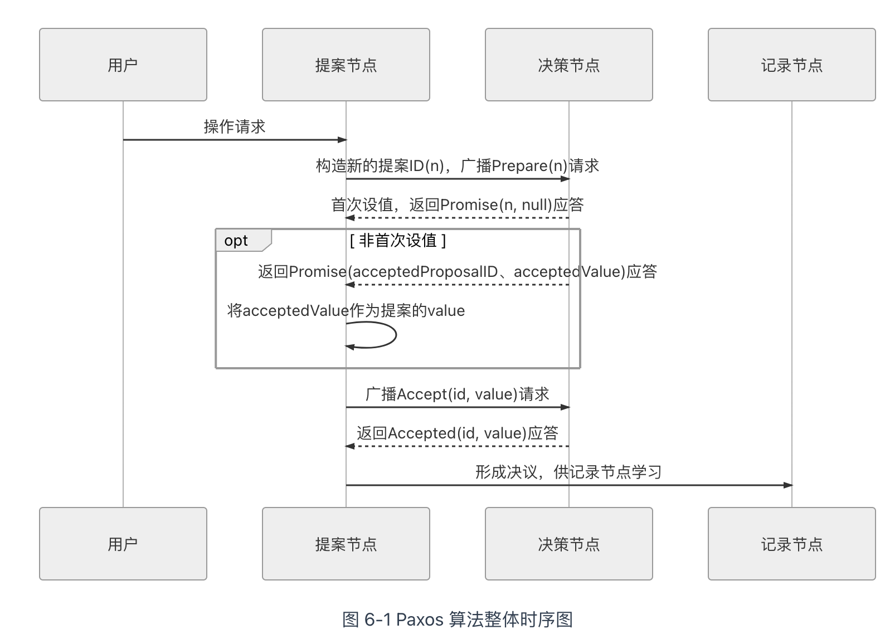
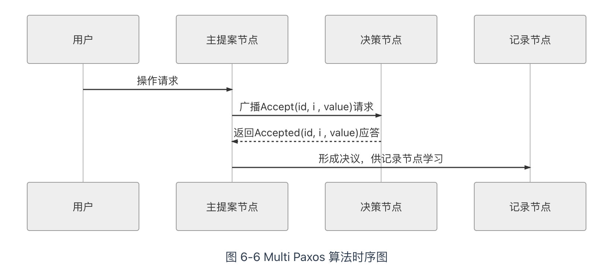
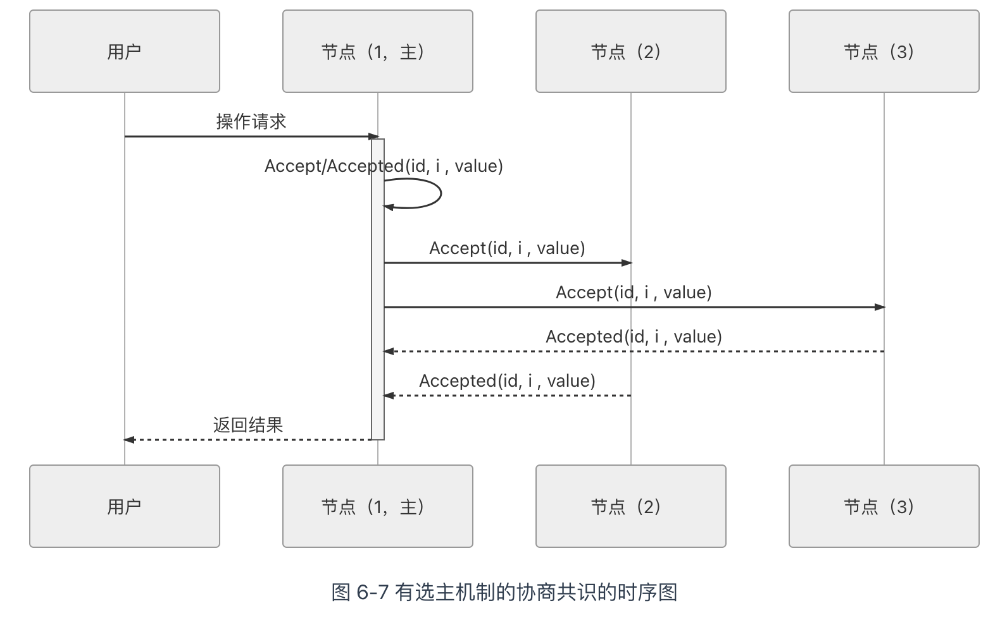
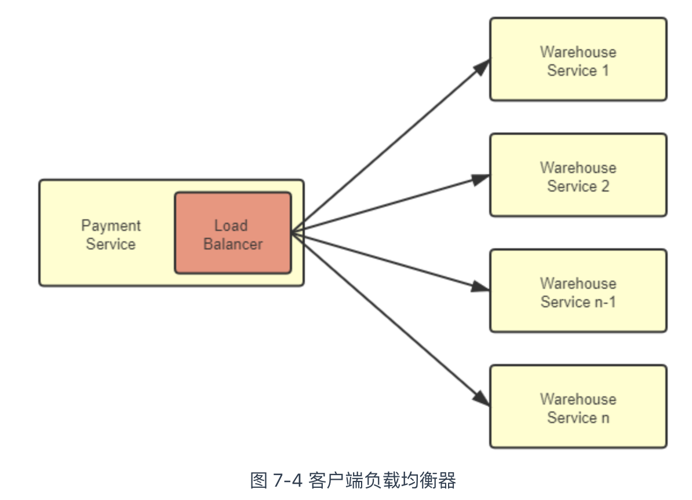
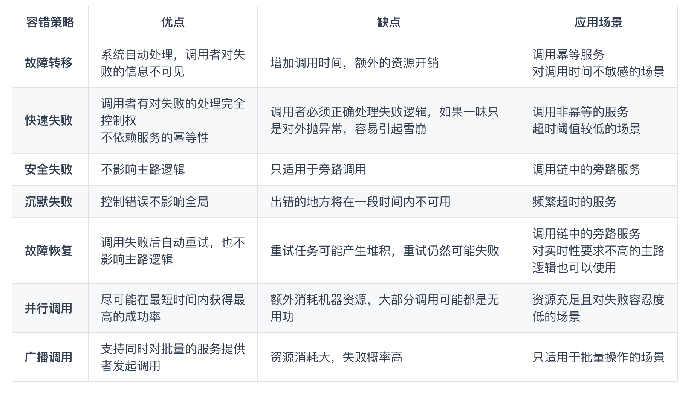
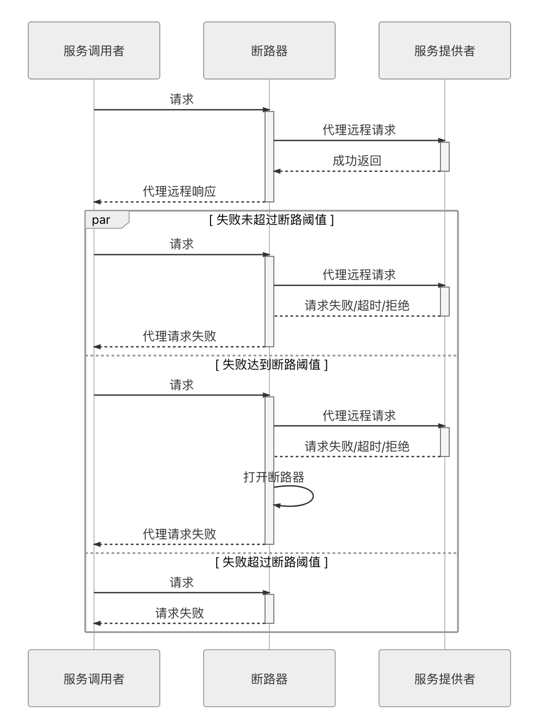
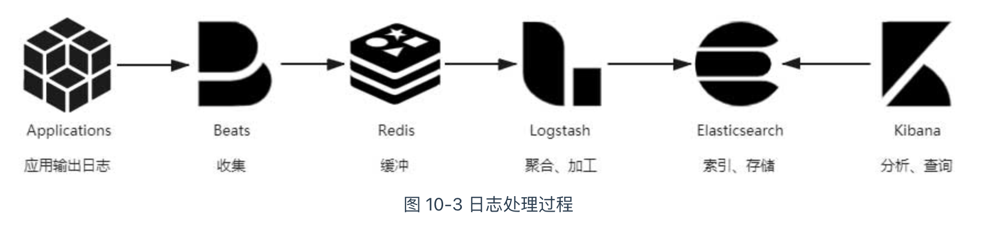

## paxos

Paxos 算法的目标就是让城邦能够在每一位居民都不承诺一定会及时参与的情况下，依然可以按照少数服从多数的原则，最终达成一致意见


## 算法流程

+ 提案节点（Proposer），能发起提案（Proposal）。提案指提出对某个值进行设置。值一旦设置成功，就是不会丢失也不可变的。
+ **决策节点**（ Acceptor）是应答提案的节点，决定该提案是否可被投票、被接受。提案过半数决策节点的接受，即称该提案被**批准**（Accept），提案被批准即意味着该值不能再被更改，也不会丢失，且最终所有节点都会接受该它。
+ **记录节点**（Learner），不参与提案与决策，仅从提案、决策节点中学习已经达成共识的提案

使用 Paxos 算法的分布式系统里的，所有的节点都是平等的，它们都可以承担以上某一种或者多种的角色，决策节点一般设置为奇数个。且在系统初始化阶段，网络中每个节点都知道所有决策节点的个数和地址。

就某个值达成一致，主要受到两个方面影响：

+ 各个节点之间的通信不可靠，也就是网络不可靠
+ 用户的访问是并发的

因此，对同一个变量的并发修改必须先加锁后操作。

Paxos 算法包括两个阶段，

+ 第一阶段“准备”（Prepare）就相当于上面抢占锁的过程。

  + 如果某个提案节点准备发起提案，必须先向所有的决策节点广播一个许可申请（称为 Prepare 请求）。提案节点的 Prepare 请求中会附带一个全局唯一的数字 n 作为提案 ID，决策节点收到后，将会给予提案节点两个承诺与一个应答。
    + 承诺不会再接受提案 ID 小于或等于 n 的 Prepare 请求。
    + 承诺不会再接受提案 ID 小于 n 的 Accept 请求。
    + 不违背以前作出的承诺的前提下，回复已经批准过的提案中 ID 最大的那个提案所设定的值和提案 ID，如果该值从来没有被任何提案设定过，则返回空值。如果违反此前做出的承诺，即收到的提案 ID 并不是决策节点收到过的最大的，那允许直接对此 Prepare 请求不予理会。

+ 当提案节点收到了多数派决策节点的应答（称为 Promise 应答）后，可以开始第二阶段“批准”（Accept）过程，这时有如下两种可能的结果：

  + 如果提案节点发现所有响应的决策节点此前都没有批准过该值（即为空），那说明它是第一个设置值的节点，可以随意地决定要设定的值，将自己选定的值与提案 ID，构成一个二元组“(id, value)”，再次广播给全部的决策节点（称为 Accept 请求）。
  + 如果提案节点发现响应的决策节点中，已经有至少一个节点的应答中包含有值了，那它就不能够随意取值了，必须无条件地从应答中找出提案 ID 最大的那个值并接受，构成一个二元组“(id, maxAcceptValue)”，再次广播给全部的决策节点（称为 Accept 请求）

  

# Multi Paxos

Multi Paxos 对 Basic Paxos 的核心改进是增加了“选主”的过程，提案节点会通过定时轮询（心跳），确定当前网络中的所有节点里是否存在有一个主提案节点，一旦没有发现主节点存在，节点就会在心跳超时后使用 Basic Paxos 中定义的准备、批准的两轮网络交互过程，向所有其他节点广播自己希望竞选主节点的请求，希望整个分布式系统对“由我作为主节点”这件事情协商达成一致共识，如果得到了决策节点中多数派的批准，便宣告竞选成功。当选主完成之后，除非主节点失联之后发起重新竞选，否则从此往后，就只有主节点本身才能够提出提案。





当以下三个问题同时被解决时，即等价于达成共识：

- 如何选主（Leader Election）。
- 如何把数据复制到各个节点上（Entity Replication）。
- 如何保证过程是安全的（Safety）。、


# 类库到服务

微服务架构其中一个重要设计原则是“通过服务来实现独立自治的组件”（Componentization via Services），强调应采用“服务”（Service）而不再是“类库”（Library）来构建组件化的程序，这两者的差别在于类库是在编译期静态链接到程序中的，通过调用本地方法来使用其中的功能，而服务是进程外组件，通过调用远程方法来使用其中的功能

微服务架构在复杂性与执行性能方面做出了极大的让步。一套由多个微服务相互调用才能正常运作的分布式系统中，每个节点都互相扮演着服务的生产者与消费者的多重角色，形成了一套复杂的网状调用关系，此时，至少有（但不限于）以下三个问题是必须考虑并得到妥善解决的：

- 对消费者来说，外部的服务由谁提供？具体在什么网络位置？
- 对生产者来说，内部哪些服务需要暴露？哪些应当隐藏？应当以何种形式暴露服务？以什么规则在集群中分配请求？
- 对调用过程来说，如何保证每个远程服务都接收到相对平均的流量，获得尽可能高的服务质量与可靠性？

这三个问题的解决方案，在微服务架构中通常被称为“服务发现”、“服务的网关路由”和“服务的负载均衡”

### 服务发现

所有的远程服务调用都是使用**全限定名**（Fully Qualified Domain Name，[FQDN](https://en.wikipedia.org/wiki/Fully_qualified_domain_name)）、**端口号**与**服务标识**所构成的三元组来确定一个远程服务的精确坐标的。

“服务发现”具体是指进行过什么操作？这其实包含三个必须的过程。

1. **服务的注册**（Service Registration）: 当服务启动的时候需要把自己的坐标信息通知到服务注册中心（如调用 API、产生事件消息、在 ZooKeeper/Etcd 的指定位置记录、存入数据库，等等）。
2. **服务的维护**（Service Maintaining）：现在的服务发现框架，往往都能支持多种协议（HTTP、TCP 等）、多种方式（长连接、心跳、探针、进程状态等）去监控服务是否健康存活，将不健康的服务自动从服务注册表中剔除
3. **服务的发现**（Service Discovery）：这里的发现是特指狭义上消费者从服务发现框架中，把一个符号（譬如 Eureka 中的 ServiceID、Nacos 中的服务名、或者通用的 FQDN）转换为服务实际坐标的过程。

可选的扩展功能，譬如在服务发现时进行的负载均衡、流量管控、键值存储、元数据管理、业务分组。

服务发现既要高可用，也要高可靠是由它在整个系统中所处的位置所决定的。

服务提供者在服务注册中心中注册、续约和下线自己的真实坐标，服务消费者根据某种符号从服务注册中心中获取到真实坐标，无论是服务注册中心、服务提供者还是服务消费者，它们都是系统服务中的一员，相互间的关系应是对等的

尽最大努力保证服务发现的可用性。实际用于生产的分布式系统，服务注册中心都是以集群的方式进行部署的，通常使用三个或者五个节点。


#### 注册中心实现

当下，直接以服务发现、服务注册中心为目标的组件库，或者间接用来实现这个目标的工具主要有以下三类：

+ 在分布式 K/V 存储框架上自己开发的服务发现，这类的代表是 ZooKeeper、Doozerd、Etcd。
+ 以基础设施（主要是指 DNS 服务器）来实现服务发现，这类的代表是 SkyDNS、CoreDNS。
+ 专门用于服务发现的框架和工具，这类的代表是 Eureka、Consul 和 Nacos。


#### 网关路由

微服务中网关的首要职责就是作为统一的出口对外提供服务，将外部访问网关地址的流量，根据适当的规则路由到内部集群中正确的服务节点之上，因此，微服务中的网关，也常被称为“服务网关”或者“API 网关”，微服务中的网关。

```
网关 = 路由器（基础职能） + 过滤器（可选职能）
```

如果服务集群只提供像 Etcd 这样直接基于 TCP 的访问的服务，那只部署四层网关便可满足，网关以 IP 报文中源地址、目标地址为特征进行路由；如果服务集群要提供 HTTP 服务的话，那就必须部署一个七层网关，网关根据 HTTP 报文中的 URL、Header 等信息为特征进行路由；如果服务集群还要提供更上层的 WebSocket、SOAP 等服务，那就必须要求网关同样能够支持这些上层协议，才能从中提取到特征。

#### 网关的io模型

在套接字接口抽象下，网络 I/O 的出入口就是 Socket 的读和写，Socket 在操作系统接口中被抽象为数据流，网络 I/O 可以理解为对流的操作。每一次网络访问，从远程主机返回的数据会先存放到操作系统内核的缓冲区中，然后内核的缓冲区复制到应用程序的地址空间，所以当发生一次网络请求发生后，将会按顺序经历“等待数据从远程主机到达缓冲区”和“将数据从缓冲区拷贝到应用程序地址空间”两个阶段，根据实现这两个阶段的不同方法，人们把网络 I/O 模型总结为两类、五种模型：两类是指**同步 I/O**与**异步 I/O**，五种是指在同步 IO 中又分有划分出**阻塞 I/O**、**非阻塞 I/O**、**多路复用 I/O**和**信号驱动 I/O**四种细分模型。

网关的可用性方面，我们应该考虑到以下几点：

+ 网关应尽可能轻量，尽管网关作为服务集群统一的出入口，可以很方便地做安全、认证、授权、限流、监控，等等的功能，但给网关附加这些能力时还是要仔细权衡，取得功能性与可用性之间的平衡，过度增加网关的职责是危险的。
+ 网关选型时，应该尽可能选择较成熟的产品实现，譬如 Nginx Ingress Controller、KONG、Zuul 这些经受过长期考验的产品，性能与可用性之间的平衡也需要权衡。

- 在需要高可用的生产环境中，应当考虑在网关之前部署负载均衡器或者[等价路由器](https://en.wikipedia.org/wiki/Equal-cost_multi-path_routing)（ECMP），让那些更成熟健壮的设施（往往是硬件物理设备）去充当整个系统的入口地址，这样网关也可以进行扩展了。

## BFF 网关

网关不必为所有的前端提供无差别的服务，而是应该针对不同的前端，聚合不同的服务，提供不同的接口和网络访问协议支持。


## 客户端负载均衡器Client-Side Load Balancer

服务集群的收到的请求来源不再局限于外部，越来越多的访问请求是由集群内部的某个服务发起，由集群内部的另一个服务进行响应的，对于这类流量的负载均衡，既有的方案依然是可行的，但针内部流量的特点，直接在服务集群内部消化掉，肯定是更合理更受开发者青睐的办法。由此一种全新的、独立位于每个服务前端的、分散式的负载均衡方式正逐渐变得流行起来，这就是本节我们要讨论的主角：客户端负载均衡器（Client-Side Load Balancer）



客户端均衡器是和服务实例一一对应的，而且与服务实例并存于同一个进程之内：

+ 均衡器与服务之间信息交换是进程内的方法调用，不存在任何额外的网络开销。
+ 不依赖集群边缘的设施，所有内部流量都仅在服务集群的内部循环，避免了出现前文那样，集群内部流量要“绕场一周”的尴尬局面。
+ 分散式的均衡器意味着天然避免了集中式的单点问题，它的带宽资源将不会像集中式均衡器那样敏感，这在以七层均衡器为主流、不能通过 IP 隧道和三角传输这样方式节省带宽的微服务环境中显得更具优势。
+ 客户端均衡器要更加灵活，能够针对每一个服务实例单独设置均衡策略等参数，访问某个服务，是不是需要具备亲和性，选择服务的策略是随机、轮询、加权还是最小连接等等，都可以单独设置而不影响其它服务。

客户端均衡器的缺点：

+ 它与服务运行在同一个进程之内，意味着它的选型受到服务所使用的编程语言的限制
+ 从个体服务来看，由于是共用一个进程，均衡器的稳定性会直接影响整个服务进程的稳定性，消耗的 CPU、内存等资源也同样影响到服务的可用资源。
+ 从个体服务来看，由于是共用一个进程，均衡器的稳定性会直接影响整个服务进程的稳定性，消耗的 CPU、内存等资源也同样影响到服务的可用资源。
+ 由于请求的来源可能是来自集群中任意一个服务节点，而不再是统一来自集中式均衡器，这就使得内部网络安全和信任关系变得复杂，当攻破任何一个服务时，更容易通过该服务突破集群中的其他部分。

## 代理负载均衡器


Kubernetes 严格保证了同一个 Pod 中的容器不会跨越不同的节点，这些容器共享着同一个网络名称空间，因此代理均衡器与服务实例的交互，实质上是对本机回环设备的访问，仍然要比真正的网络交互高效且稳定得多。代理均衡器付出的代价较小，但从服务进程中分离出来所获得的收益却是非常显著的：

+ 代理均衡器不再受编程语言的限制。


## 流量治理

容错性设计。

+ 由于一个服务崩溃，导致所有的服务都不能使用。
+ 服务由于处理能力有限，面对超出预期的请求，大部分请求无法处理

### 容错策略

+ 故障转移

高可用的服务集群中，多数的服务均会部署有多个副本。这些副本可能部署在不同的节点、不同的网络交换机甚至是不同的可用区中。

故障转移是指当调用的服务器故障，系统不会立即向调用者返回失败，而是自动切换到其他服务副本进行尝试，从而保证了整体的高可用性。
故障转移的容错策略应该有一定的调用次数限制，譬如允许最多重试三个服务，如果都发生报错，那还是会返回调用失败。

+ 快速失败

故障转移策略能够实施的前提是要求服务具备幂等性。对于非幂等的服务，重复调用就可能产生脏数据，引起的麻烦远大于单纯的某次服务调用失败，此时就应该以快速失败作为首选的容错策略。

+ 安全失败

在一个调用链路中的服务通常也有主路和旁路之分，并不见得其中每个服务都是不可或缺的，有部分服务失败了也不影响核心业务的正确性。

+ 沉默失败

如果大量的请求需要等到超时（或者长时间处理后）才宣告失败，很容易由于某个远程服务的请求堆积而消耗大量的线程、内存、网络等资源，进而影响到整个系统的稳定。面对这种情况，一种合理的失败策略是当请求失败后，就默认服务提供者一定时间内无法再对外提供服务，不再向它分配请求流量，将错误隔离开来，避免对系统其他部分产生影响，此即为沉默失败策略。

+ **故障恢复**（Failback）

故障恢复一般不单独存在，而是作为其他容错策略的补充措施，一般在微服务管理框架中，如果设置容错策略为故障恢复的话，通常默认会采用快速失败加上故障恢复的策略组合。它是指当服务调用出错了以后，将该次调用失败的信息存入一个消息队列中，然后由系统自动开始异步重试调用。
故障恢复策略一方面是尽力促使失败的调用最终能够被正常执行，另一方面也可以为服务注册中心和负载均衡器及时提供服务恢复的通知信息。故障恢复显然也是要求服务必须具备幂等性的，由于它的重试是后台异步进行，即使最后调用成功了，原来的请求也早已经响应完毕，所以故障恢复策略一般用于对实时性要求不高的主路逻辑，同时也适合处理那些不需要返回值的旁路逻辑。为了避免在内存中异步调用任务堆积，故障恢复与故障转移一样，应该有最大重试次数的限制。

+ 并行调用

它是指一开始就同时向多个服务副本发起调用，只要有其中任何一个返回成功，那调用便宣告成功，这是一种在关键场景中使用更高的执行成本换取执行时间和成功概率的策略

+ **广播调用**（Broadcast）

广播调用与并行调用是相对应的，都是同时发起多个调用，但并行调用是任何一个调用结果返回成功便宣告成功，广播调用则是要求所有的请求全部都成功，这次调用才算是成功，任何一个服务提供者出现异常都算调用失败，广播调用通常会被用于实现“刷新分布式缓存”这类的操作




### 断路器模式

就是通过代理（断路器对象）来一对一地（一个远程服务对应一个断路器对象）接管服务调用者的远程请求。断路器会持续监控并统计服务返回的成功、失败、超时、拒绝等各种结果，当出现故障（失败、超时、拒绝）的次数达到断路器的阈值时，它状态就自动变为“OPEN”，后续此断路器代理的远程访问都将直接返回调用失败，而不会发出真正的远程服务请求。通过断路器对远程服务的熔断，避免因持续的失败或拒绝而消耗资源，因持续的超时而堆积请求，最终的目的就是避免雪崩效应的出现

 

- **CLOSED**：表示断路器关闭，此时的远程请求会真正发送给服务提供者。断路器刚刚建立时默认处于这种状态，此后将持续监视远程请求的数量和执行结果，决定是否要进入 OPEN 状态。
- **OPEN**：表示断路器开启，此时不会进行远程请求，直接给服务调用者返回调用失败的信息，以实现快速失败策略。
- **HALF OPEN**：这是一种中间状态。断路器必须带有自动的故障恢复能力，当进入 OPEN 状态一段时间以后，将“自动”（一般是由下一次请求而不是计时器触发的，所以这里自动带引号）切换到 HALF OPEN 状态。该状态下，会放行一次远程调用，然后根据这次调用的结果成功与否，转换为 CLOSED 或者 OPEN 状态，以实现断路器的弹性恢复。

服务熔断和服务降级的区别：

+ 断路器做的事情是自动进行服务熔断，这是一种快速失败的容错策略的实现方法
+ 在明确反馈了故障信息给上游服务以后，上游服务必须能够主动处理调用失败的后果，而不是坐视故障扩散，这里的“处理”指的就是一种典型的服务降级逻辑。降级逻辑可以包括，但不应该仅仅限于是把异常信息抛到用户界面去，而应该尽力想办法通过其他路径解决问题，譬如把原本要处理的业务记录下来，留待以后重新处理是最低限度的通用降级逻辑

### 舱壁隔离模式

为了不让某一个远程服务的局部失败演变成全局性的影响，就必须设置某种止损方案，这便是服务隔离的意义。

+ 局部线程池
+ 信号量


##### 重试模式

重试模式的前提：

+ 仅在主路逻辑的关键服务上进行同步的重试，不是关键的服务，一般不把重试作为首选容错方案，尤其不该进行同步重试
+ 仅对由瞬时故障导致的失败进行重试。
+ 仅对具备幂等性的服务进行重试。
+ 重试有明确的终止
  + 超时终止
  + 次数终止

熔断、隔离、重试、降级、超时等概念都是建立具有韧性的微服务系统必须的保障措施。


## 流量控制

健壮的系统需要做到恰当的流量控制，更具体地说，需要妥善解决以下三个问题：

+ 依据什么限流
+ 具体如何限流
+ 超额流量如何处理


#### 流量统计指标

+ **每秒事务数**（Transactions per Second，TPS）：TPS 是衡量信息系统吞吐量的最终标准。“事务”可以理解为一个逻辑上具备原子性的业务操作。
+ **每秒请求数**（Hits per Second，HPS）：HPS 是指每秒从客户端发向服务端的请求数
+ **每秒查询数**（Queries per Second，QPS）：QPS 是指一台服务器能够响应的查询次数。

以上这三个指标都是基于调用计数的指标，在整体目标上我们当然最希望能够基于 TPS 来限流，因为信息系统最终是为人类用户来提供服务的，用户不关心业务到底是由多少个请求、多少个后台查询共同协作来实现。

主流系统大多倾向使用 HPS 作为首选的限流指标，它是相对容易观察统计的，而且能够在一定程度上反应系统当前以及接下来一段时间的压力

#### 限流设计模式

本节将介绍**流量计数器**、**滑动时间窗**、**漏桶**和**令牌桶**四种限流设计模式。

1. 流量计数器

   设置一个计算器，根据当前时刻的流量计数结果是否超过阈值来决定是否限流。譬如该系统能承受的最大持续流量是 80 TPS，超过 80 次业务请求就直接拒绝掉超额部分。

2. 滑动时间窗口

   当频率固定每秒一次的定时器被唤醒时，它应该完成以下工作：

   1. 将数组最后一位的元素丢弃掉，并把所有元素都后移一位，然后在数组第一个插入一个新的空元素。这个步骤即为“滑动窗口”。
   2. 将计数器中所有统计信息写入到第一位的空元素中。
   3. 对数组中所有元素进行统计，并复位清空计数器数据供下一个统计周期使用。

3. 漏桶模式

   漏桶的实现，一个以请求对象作为元素的先入先出队列（FIFO Queue），队列长度就是漏桶的大小，当队列已满时便拒绝新的请求进入。如果桶设置得太大，那服务依然可能遭遇到流量过大的冲击，不能完全发挥限流的作用；如果设置得太小，那很可能就会误杀掉部分正常的请求。

4. 令牌桶

   每个一段时间间隔往桶放一个令牌，当有请求进来时，从桶中取得一个准入的令牌。一旦请求进入桶中却发现没有令牌可取了，就应该马上失败或进入服务降级逻辑。

   1. 让系统以一个由限流目标决定的速率向桶中注入令牌，譬如要控制系统的访问不超过 100 次每秒，速率即设定为 100 个令牌每秒，每个令牌注入间隔为 1/100=10 毫秒。
   
   2. 桶中最多可以存放 N 个令牌，N 的具体数量是由超时时间和服务处理能力共同决定的。如果桶已满，第 N+1 个进入的令牌会被丢弃掉。
   3. 请求到时先从桶中取走 1 个令牌，如果桶已空就进入降级逻辑。

## 分布式限流

一种常见的简单分布式限流方法是将所有服务的统计结果都存入集中式缓存（如 Redis）中，以实现在集群内的共享，并通过分布式锁、信号量等机制，解决这些数据的读写访问时并发控制的问题。在可以共享统计数据的前提下，原本用于单机的限流模式理论上也是可以应用于分布式环境中的，可是其代价也显而易见：每次服务调用都必须要额外增加一次网络开销，所以这种方法的效率肯定是不高的，流量压力大时，限流本身反倒会显著降低系统的处理能力。

由于任何一个服务在响应请求时都需要消耗集群一定量的处理资源，所以访问每个服务时都要求消耗一定量的“货币”，假设服务 X 要消耗的额度表示为 CostX，那当用户 A 访问了 N 个服务以后，他剩余的额度 LimitN即表示为：

```
LimitN = QuanityA - ∑NCostX
```

时，我们可以把剩余额度 LimitN作为内部限流的指标，规定在任何时候，只要一旦剩余额度 LimitN小于等于 0 时，就不再允许访问其他服务了。此时必须先发生一次网络请求，重新向令牌桶申请一次额度，成功后才能继续访问，不成功则进入降级逻辑。除此之外的任何时刻，即 LimitN不为零时，都无须额外的网络访问，因为计算 LimitN是完全可以在本地完成的


## 零信任安全模型的特征

| 传统、边界安全模型                                           | 云原生、零信任安全模型                                       | 具体需求                                             |
| :----------------------------------------------------------- | :----------------------------------------------------------- | :--------------------------------------------------- |
| 基于防火墙等设施，认为边界内可信                             | 服务到服务通信需认证，环境内的服务之间默认没有信任           | 保护网络边界（仍然有效）；服务之间默认没有互信       |
| 用于特定的 IP 和硬件（机器）                                 | 资源利用率、重用、共享更好，包括 IP 和硬件                   | 受信任的机器运行来源已知的代码                       |
| 基于 IP 的身份                                               | 基于服务的身份                                               | 同上                                                 |
| 服务运行在已知的、可预期的服务器上                           | 服务可运行在环境中的任何地方，包括私有云/公有云混合部署      | 同上                                                 |
| 安全相关的需求由应用来实现，每个应用单独实现                 | 由基础设施来实现，基础设施中集成了共享的安全性要求。         | 集中策略实施点（Choke Points），一致地应用到所有服务 |
| 对服务如何构建、评审、实施的安全需求的约束力较弱             | 安全相关的需求一致地应用到所有服务                           | 同上                                                 |
| 安全组件的可观测性较弱                                       | 有安全策略及其是否生效的全局视图                             | 同上                                                 |
| 发布不标准，发布频率较低                                     | 标准化的构建和发布流程，每个微服务变更独立，变更更频繁       | 简单、自动、标准化的变更发布流程                     |
| 工作负载通常作为虚拟机部署或部署到物理主机，并使用物理机或管理程序进行隔离 | 封装的工作负载及其进程在共享的操作系统中运行，并有管理平台提供的某种机制来进行隔离 | 在共享的操作系统的工作负载之间进行隔离               |

### 服务安全

PKI 是构建[传输安全层](https://en.wikipedia.org/wiki/Transport_Layer_Security)（Transport Layer Security，TLS）的必要基础。

- **单向 TLS 认证**：只需要服务端提供证书，客户端通过服务端证书验证服务器的身份，但服务器并不验证客户端的身份。单向 TLS 用于公开的服务，即任何客户端都被允许连接到服务进行访问，它保护的重点是客户端免遭冒牌服务器的欺骗。
- **双向 TLS 认证**：客户端、服务端双方都要提供证书，双方各自通过对方提供的证书来验证对方的身份。双向 TLS 用于私密的服务，即服务只允许特定身份的客户端访问，它除了保护客户端不连接到冒牌服务器外，也保护服务端不遭到非法用户的越权访问。


### 认证

按照目标对象划分：

+ 一种是以机器作为认证对象，即访问服务的流量来源是另外一个服务，称为**服务认证**
+ 另一种是以人类作为认证对象，即访问服务的流量来自于最终用户，称为**请求认证**（Request Authentication）


## 授权

只根据其身份角色来进行权限访问控制，即我们常说的 RBAC。


## 可观测性

+ 日志（logging）：日志的职责是记录离散事件，通过这些记录事后分析出程序的行为，譬如调用过的方法，操作过的数据等等。
+ 追踪（tracing）：单体系统时代追踪的范畴基本只局限于栈追踪（Stack Tracing），调试程序时，在 IDE 打个断点，看到的 Call Stack 视图上的内容便是追踪；微服务时代的追踪，一个外部请求需要内部若干服务的联动响应，这时候完整的调用轨迹将跨越多个服务，同时包括服务间的网络传输信息与各个服务内部的调用堆栈信息，因此，分布式系统中的追踪在国内常被称为“全链路追踪”
+ **度量**（Metrics）：度量是指对系统中某一类信息的统计聚合。


#### 日志

此时，从打印日志到分析查询之间，还隔着收集、缓冲、聚合、加工、索引、存储等若干个步骤。



##### 日志应该 避免的输出

+ 避免打印敏感信息。

不该将密码，银行账号，身份证件这些敏感信息打到日志里

+ 避免引用慢操作。日志中打印的信息应该是上下文可以直接取到的。

日志中打印的信息应该是上下文中可以直接取到的，如果当前上下文中根本没有这项数据，需要专门调用远程服务或者从数据库获取，又或者通过大量计算才能取到的话，那应该先考虑这项信息放到日志中是不是必要且恰当的。

+ 避免打印追踪诊断信息。

日志中不要打印方法输入参数、输出结果、方法执行时长之类的调试信息。

+ 避免误导他人。

##### 建议应该输出到日志的内容：

+ 处理请求时的TraceID。
+ 系统运行过程中的关键事件。
+ 启动输出配置信息。


#### 收集和缓存

写日志是在服务节点中进行的，但我们不可能在每个节点都单独建设日志查询功能。

分布式系统处理一个请求要跨越多个服务节点，为了能看到跨节点的全部日志，就要有能覆盖整个链路的全局日志系统。

这个需求决定了每个节点输出日志到文件后，必须将日志文件统一收集起来集中存储、索引，由此便催生了专门的日志收集器。

#### 加工与聚合

Elasticsearch 就只能以全文检索的原始方式去使用日志，既不利于统计对比，也不利于条件过滤

```shell
14.123.255.234 - - [19/Feb/2020:00:12:11 +0800] "GET /index.html HTTP/1.1" 200 1314 "https://icyfenix.cn" "Mozilla/5.0 (Windows NT 10.0; WOW64) AppleWebKit/537.36 (KHTML, like Gecko) Chrome/80.0.3987.163 Safari/537.36"
```

| 数据项   | 值                                                           |
| -------- | ------------------------------------------------------------ |
| IP       | 14.123.255.234                                               |
| Username | null                                                         |
| Datetime | 19/Feb/2020:00:12:11 +0800                                   |
| Method   | GET                                                          |
| URL      | /index.html                                                  |
| Protocol | HTTP/1.1                                                     |
| Status   | 200                                                          |
| Size     | 1314                                                         |
| Refer    | https://icyfenix.cn                                          |
| Agent    | Mozilla/5.0 (Windows NT 10.0; WOW64) AppleWebKit/537.36 (KHTML, like Gecko) Chrome/80.0.3987.163 Safari/537.36 |

Logstash 的基本职能是把日志行中的非结构化数据，通过 Grok 表达式语法转换为上面表格那样的结构化数据，进行结构化的同时，还可能会根据需要，调用其他插件来完成时间处理（统一时间格式）、类型转换（如字符串、数值的转换）、查询归类（譬如将 IP 地址根据地理信息库按省市归类）等额外处理工作，然后以 JSON 格式输出到 Elasticsearch 中

## 存储与查询

Elasticsearch 本身是一款优秀产品有关，然而更关键的是 Elasticsearch 的优势正好与日志分析的需求完美契合：

+ 从数据特征的角度看，日志是基于时间的数据流，但已写入后不怎么变动。
+ 从数据价值的角度看，日志基本上只会以最近的数据为检索目标。这点决定了可以很容易区分出冷数据和热数据，
+ 从数据使用的角度看，分析日志很依赖全文检索和及时查询，对实时性的要求是“将近实时”，即不强求日志产生后立刻能查到，但也不能接受日志产生之后按小时甚至按天的频率来更新。

Elasticsearch 只提供了 API 层面的查询能力，它通常搭配 Kibana 使用。Kibana 把存储在 Elasticsearch 中的数据被检索、聚合、统计后，定制形成各种图形、表格、指标、统计，以此观察系统的运行状态，找出日志事件中潜藏的规律和隐患


## 追踪与跨度

分布式追踪系统应该由**数据收集**、**数据存储**和**数据展示**三个相对独立的子系统构成，而狭义上讲的追踪则就只是特指链路追踪数据收集部分。

追踪Trace：从客户端发起请求抵达系统边界开始，记录请求流经的每个服务，直到客户端返回响应为止。

跨度span：每次 Trace 都可能会调用数量不定、坐标不定的多个服务，为了能够记录具体调用了哪些服务，以及调用的顺序、开始时点、执行时长等信息，每次开始调用服务前都要先埋入一个调用记录，这个记录就叫跨度

Span 的数据结构应该足够简单，以便于能放在日志或者网络协议的报文头里；也应该足够完备，起码应含有时间戳、起止时间、Trace 的 ID、当前 Span 的 ID、父 Span 的 ID 等能够满足追踪需要的信息。每一次 Trace 实际上都是由若干个有顺序、有层级关系的 Span 所组成一颗“追踪树”（Trace Tree）


#### 数据收集

追踪系统根据数据收集方式的差异，可分为三种主流的实现方式，分别是**基于日志的追踪**（Log-Based Tracing），**基于服务的追踪**（Service-Based Tracing）和**基于边车代理的追踪**（Sidecar-Based Tracing），笔者分别介绍如下：

+ 基于日志的追踪的思路是将 Trace、Span 等信息直接输出到应用日志中，然后随着所有节点的日志归集过程汇聚到一起，再从全局日志信息中反推出完整的调用链拓扑关系。日志追踪对网络消息完全没有侵入性，对应用程序只有很少量的侵入性，对性能影响也非常低。但其缺点是直接依赖于日志归集过程，日志本身不追求绝对的连续与一致，这也使得基于日志的追踪往往不如其他两种追踪实现来的精准
+ 基于服务的追踪是目前最为常见的追踪实现方式，被 Zipkin、SkyWalking、Pinpoint 等主流追踪系统广泛采用。服务追踪的实现思路是通过某些手段给目标应用注入追踪探针（Probe），针对 Java 应用一般就是通过 Java Agent 注入的。探针在结构上可视为一个寄生在目标服务身上的小型微服务系统，它一般会有自己专用的服务注册、心跳检测等功能，有专门的数据收集协议，把从目标系统中监控得到的服务调用信息，通过另一次独立的 HTTP 或者 RPC 请求发送给追踪系统。因此，基于服务的追踪会比基于日志的追踪消耗更多的资源，也有更强的侵入性，换来的收益是追踪的精确性与稳定性都有所保证，不必再依靠日志归集来传输追踪数据。
+ 基于边车代理的追踪是服务网格的专属方案，也是最理想的分布式追踪模型，它对应用完全透明，无论是日志还是服务本身都不会有任何变化；它与程序语言无关，无论应用采用什么编程语言实现，只要它还是通过网络（HTTP 或者 gRPC）来访问服务就可以被追踪到；它有自己独立的数据通道，追踪数据通过控制平面进行上报，避免了追踪对程序通信或者日志归集的依赖和干扰，保证了最佳的精确性

#### 聚合度量

##### 指标收集

+ **计数度量器**（Counter）：计数器就是对有相同量纲、可加减数值的合计量，譬如业务指标像销售额、货物库存量、职工人数等等；技术指标像服务调用次数、网站访问人数等都属于计数器指标。
+ **瞬态度量器**（Gauge）：瞬态度量器比计数器更简单，它就表示某个指标在某个时点的数值，连加减统计都不需要。
+ **吞吐率度量器**（Meter）：吞吐率度量器顾名思义是用于统计单位时间的吞吐量，即单位时间内某个事件的发生次数。譬如交易系统中常以 TPS 衡量事务吞吐率，即每秒发生了多少笔事务交易
+ **直方图度量器**（Histogram）：直方图是常见的二维统计图，它的两个坐标分别是统计样本和该样本对应的某个属性的度量，以长条图的形式表示具体数值。
+ **采样点分位图度量器**（Quantile Summary）：分位图是统计学中通过比较各分位数的分布情况的工具，用于验证实际值与理论值的差距，评估理论值与实际值之间的拟合度。

对于“如何将这些指标告诉服务端”这个问题，通常有两种解决方案：**拉取式采集**（Pull-Based Metrics Collection）和**推送式采集**（Push-Based Metrics Collection）

### 存储查询

指标从目标系统采集过来之后，应存储在度量系统中，以便被后续的分析界面、监控预警所使用。

如何解决，让我们先来观察一段 Prometheus 的真实度量数据

```
{
	// 时间戳
	"timestamp": 1599117392,
	// 指标名称
	"metric": "total_website_visitors",
	// 标签组
	"tags": {
		"host": "icyfenix.cn",
		"job": "prometheus"
	},
	// 指标值
	"value": 10086
}
```

每一个度量指标由时间戳、名称、值和一组标签构成，除了时间之外，指标不与任何其他因素相关。指标的数据总量固然是不小的，但它没有嵌套、没有关联、没有主外键，不必关心范式和事务，这些都是可以针对性优化的地方。事实上，业界早就已经存在了专门针对该类型数据的数据库了，即“时序数据库”（Time Series Database）。

写操作，时序数据通常只是追加，很少删改或者根本不允许删改。针对数据热点只集中在近期数据、多写少读、几乎不删改、数据只顺序追加这些特点，时序数据库被允许做出很激进的存储、访问和保留策略（Retention Policies）：

- 以[日志结构的合并树](https://en.wikipedia.org/wiki/Log-structured_merge-tree)（Log Structured Merge Tree，LSM-Tree）代替传统关系型数据库中的[B+Tree](https://en.wikipedia.org/wiki/B%2B_tree)作为存储结构，LSM 适合的应用场景就是写多读少，且几乎不删改的数据。
- 设置激进的数据保留策略，譬如根据过期时间（TTL）自动删除相关数据以节省存储空间，同时提高查询性能。对于普通数据库来说，数据会存储一段时间后就会被自动删除这种事情是不可想象的。
- 对数据进行再采样（Resampling）以节省空间，譬如最近几天的数据可能需要精确到秒，而查询一个月前的数据时，只需要精确到天，查询一年前的数据时，只要精确到周就够了，这样将数据重新采样汇总就可以极大节省存储空间。


## 监控预警

指标度量是手段，最终目的是做分析和预警。界面分析和监控预警是与用户更加贴近的功能模块，但对度量系统本身而言，它们都属于相对外围的功能。