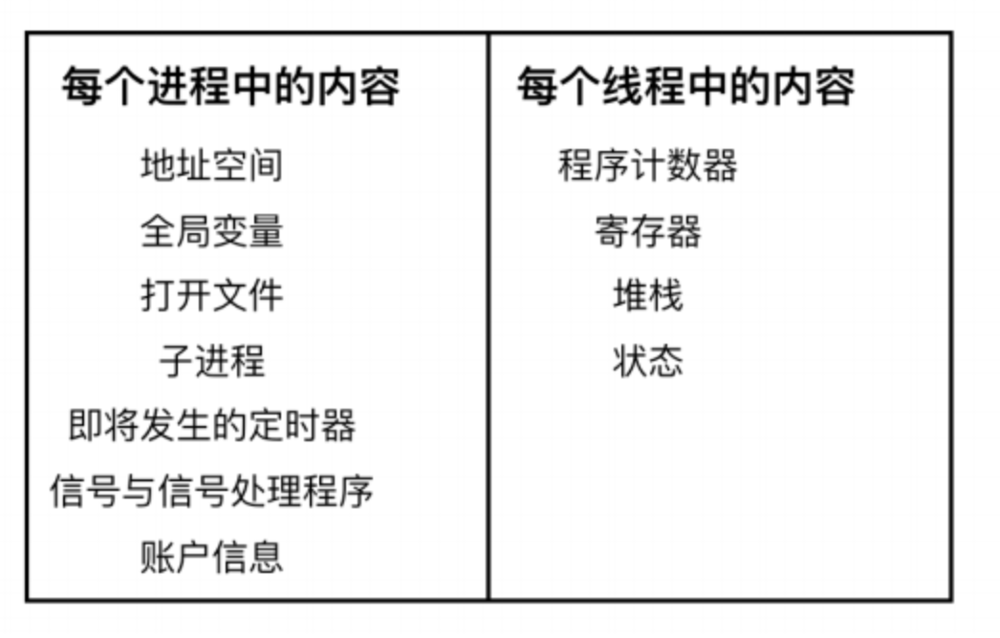

```
https://segmentfault.com/a/1190000040178092
https://juejin.cn/post/6934500044057870350
https://www.cnblogs.com/cxuanBlog/p/13297199.html
https://wizardforcel.gitbooks.io/wangdaokaoyan-os/content/7.html
https://github.com/CyC2018/CS-Notes/blob/master
```

什么是编程？

```
Data structures + Algorithms = Programming
数据结构+算法 就是程序
```


## 一、操作系统的组成

1. 什么是操作系统

   ```
   1.计算机系统自下而上可粗分为四个部分：硬件、操作系统、应用程序和用户。
   2.操心系统是软件和硬件的中间层
   ```

2. 计算机硬件

   ```
   5个部分：运算器、控制器、存储器、输入设备和输出设备。
   运算器：由算数逻辑单元(ALU)和寄存器构成，负责数据的加工和运算。
   控制器：指定顺序改变主电路或控制电路的部件，它主要起到了控制命令执行的作用。控制器是由程序计数器、指令寄存器、解码译码器
   cpu = 运算器 + 控制器
   存储器：保存信息。分两种：主内即内存，外存即磁盘
   输入设备：输入信息，键盘鼠标等
   输出设备：输出信息，显示器、打印机等
   ```


       

   


​			 
+ 总线：传输字节信息，总是传送定长的字节块，也就是字。
+ io设备：每个I/O 设备连接 I/O 总线都被称为`控制器(controller)` 或者是 `适配器(Adapter)`。
+ 主存：主存既保存程序又保存程序运行时的数据。
+ 处理器：cpu。解释（并执行）存储在主存储器中的指令的引擎。

3. 操作系统特征

   + 并发：在一小片时间段里面，多个程序同时运行。并行则指的是同一个时刻
   + 共享：系统的资源被并发的程序共享。有互斥的方式、也有共享。
   + 虚拟：虚拟处理器、虚拟内存和虚拟外部设备。虚拟可以理解成逻辑层面的
   + 异步：程序不是一直持续运行到结束，而且多种状态不断切换

4. 运行机制

   1. 内核态和用户态

      根据能否运行特权指令划分。用户态的程序不能直接使用的io指令、中断指令。

   2. 操作系统内核

      + 时钟管理
        计时。和进程的切换相关

      + 中断机制

        什么是中断？程序自动停止，转而处理新程序。处理完毕返回被暂停程序，继续执行。
        中断的代价：要保存程序运行时的状态(即切换堆栈内存)，要调用系统调用。
        软中断和硬中断的区别：软的，中断指令造成的；硬的，硬件造成的。
        异常是什么？也是一种中断，不能被屏蔽，一旦出现异常立即处理。常见异常，地址越界，缺页

      + 原语

        定义：若干条指令组成的程序段，用来实现某个特定功能，在执行过程中不可被中断

        特点：原子性。

      + 系统控制的数据结构及处理
        作业控制块、进程控制块、设备控制块、各类链表、消息队列、缓冲区、空闲区登记表、内存分配表

## 二、进程管理

1. 什么是进程？

   程序运行时的一种抽象。进程包括是**程序段**、**数据段**和**PCB**。

   程序段就保存程序代码的地方。

   数据段就是运行时的相关数据。

   PCB就是用一个数据结构，用来描述和控制控制，(prossecc control block)

2. 进程创建

   unix系统中通过系统调用fork来创建一个新的进程。父子进程之间共享内存，打开的文件等资源。

   写时复制：copy on write。子进程与父进程共用相同的内存页，而当子进程或者父进程对内存页进行修改时才会进行复制。

   ```
   https://segmentfault.com/a/1190000039869422
   ```

3. 进程的终止

   正常退出、错误退出、严重错误、被其他进程杀死

4. 进程体系

   在 UNIX 中，所有的进程都隶属于一个单个以 init 为根的进程树。进程和它的所有子进程以及子进程的子进程共同组成一个进程组

5. 进程的状态

   1. `运行态`，运行态指的就是进程实际占用 CPU 时间片运行时
   2. `就绪态`，就绪态指的是可运行，但因为其他进程正在运行而处于就绪状态
   3. `阻塞态`，除非某种外部事件发生，否则进程不能运行
   4. `创建态`，进程正在被创建，尚未转到就绪状态。
   5. `结束状态`，进程被标记为结束，本身资源还没有被收回

6. 进程的实现

   1. 进程表

      每个进程占用一个进程表的表项。表项记录进程的状态，如下
      
       
   2. 进程创建时，操作系统就新建一个PCB结构，它之后就常驻内存，任意时刻可以存取。在进程结束时删除

7. 进程间的通信

   六种方式信号、管道、共享内存、先入先出队列、消息队列、套接字

   ```
   信号
   	信号通过 shell 将任务发送给子进程。
   管道pipe
   	两个进程建立通道进行通信。
   	一个进程向这个通道里写入字节流；
   	另一个进程从这个管道中读取字节流。
   	管道是同步的，当进程尝试从空管道读取数据时，该进程会被阻塞，直到有可用数据为止
   共享内存
   	两个进程之间还可以通过共享内存进行进程间通信
   先入先出队列FIFO
   	先入先出队列又叫命名管道。未命名的管道没有备份文件。
   	命名管道具有支持文件和独特 API，当所有的进程通信完成后，命名管道将保留在文件系统中以备后用
   消息队列message queue
   	进程间的数据交换，是以格式化的消息Message为单位的
   套接字
   	网络通信
   ```

8. 调度算法

   三种分类批处理、交互式和实时。

   **批处理**

   1. 先来先服务(first-come,first-serverd)。举个例子，高速路口出口
   2. 最短作业优先(Shortest Job First)。
   3. 最短剩余时间优先(Shortest Remaining Time Next)。总是选择剩余运行时间最短的那个进程运行

   **交互式**

   1. 轮询算法(round-robin)。
      每个进程都会被分配一个时间段，称为`时间片(quantum)`，在这个时间片内允许进程运行。时间片结束前阻塞或结束，cpu切换一个。
   2. 优先级调度
      每个进程都被赋予一个优先级，优先级高的进程优先运行
   3. 多级队列
   4. 最短进程优先
      最短进程优先是根据进程过去的行为进行推测，并执行估计运行时间最短的那一
   5. 保证调度
      所有的进程都等价，则每个进程将获得 1/n 的 CPU 时间
   6. 彩票调度
      就随机抽奖。
   7. 公平分享调度

   **实时系统中的调度**

   

9. 线程

   1. 特点：

   + 线程实际上 CPU 上调度执行的实体
   + 多线程之间会共享同一块地址空间和所有可用数据的能力
   + 更轻量、容易创建也容易销毁

   2. 线程模型

    

  同一个进程中`每个线程共享`的内容，上图右边是`每个线程`中的内容。也就是说左边的列表是进程的属性，右边的列表是线程的属性.**线程之间的状态转换和进程之间的状态转换是一样**

   3. 线程实现的方式

      1.在用户空间中实现；2.在内核空间中实现；3.在用户和内核空间中混合实现线程。
      
      1. 在用户空间中实现
         整个线程包放在用户空间中，内核对线程一无所知，它不知道线程的存在。
         
          
  2. 在内核中实现线程
     通过系统调用创建的，在内核的线程表中有对应的线程项。内核中的线程表持有每个线程的寄存器、状态和其他信息。

 

  3. 混合实现

     用户级线程与某些或者全部内核线程多路复用起来。协程就是这种方式。编程人员可以自由控制用户线程和内核线程的数量，具有很大的灵活度


  

 

## 三、内存管理

 

1. 内存管理的功能

   - 内存的分配和回收：进程创建后系统为它们分配内存空间。进程销毁时回收
   - 地址转换：逻辑地址转内存中的物理地址
   - 内存空间的扩充：利用虚拟存储技术或自动覆盖技术，从逻辑上扩充内存
   - 存储保护：保证个个作业在自己的内存空间内运行，互不干扰

2. 地址空间

   地址空间也创建了一种抽象的内存供程序使用，来保护内存不会错误访问和重定位。

3. 交换技术

   内存不足的处理方式：交换技术和虚拟内存。

   `交换技术`，一个进程完整的调入内存，然后再内存中运行一段时间，再把它放回磁盘

   `虚拟内存(virtual memory)`，虚拟内存技术能够允许应用程序部分的运行在内存中

4. 空闲内存管理

   + 位图

     内存被划分为几个字或几千字节的分配单位。维护一个位图，0变空闲，1表占用。

   + 空闲列表

     维护一个链表，节点分为两种：已分配的内存段，空闲内存段。

     每个节点都有占用或空间的标识、起始位置、长度三个属性。

5. 虚拟内存管理

   为了更好的管理内存，操作系统将内存抽象成地址空间，每个程序拥有自己的地址空间。这个地址空间被分割成多个块，每一块称为一页。这些页被映射到物理内存，但不需要映射到连续的物理内存，也不需要所有页都必须在物理内存中。当程序引用到不在物理内存中的页时，由硬件执行必要的映射，将缺失的部分装入物理内存并重新执行失败的指令

   1. 分页

      内存管理单元管理着地址空间和物理内存的转换。

      页，程序的地址空间

      页框，程序物理内存空间

      页表，页和页框之间的映射

      页表项，一条页和页框之间的映射记录

      虚拟地址分成两个部分，一部分存储页面号，一部分存储偏移量

      虚拟页号可作为页表的索引用来找到虚拟页中的内容。由页表项可以找到页框号（如果有的话）。然后把页框号拼接到偏移量的高位端，以替换掉虚拟页号，形成物理地址。
      
       
   2. 页面置换算法

      在程序运行过程中，如果要访问的页面不在内存中，就发生缺页中断从而将该页调入内存中。

      页面置换算法的主要目标是使页面置换频率最低（也可以说缺页率最低）

      1. 最佳
         所选择的被换出的页面将是最长时间内不再被访问，通常可以保证获得最低的缺页率
      2. 最近最久未使用LRU
      3. 最近未使用
      4. 先进先出
      5. 第二次机会算法
      6. 时钟
   
   3. 分段
      程序的地址空间划分成多个拥有独立地址空间的段，每个段上的地址空间划分成大小相同的页。这样既拥有分段系统的共享和保护，又拥有分页系统的虚拟内存功能
   
      

   

## 四、文件系统

#### 1. 什么是文件系统？

提供一种对操作系统和用户的数据和程序的存储与访问机制。文件系统的基本数据单位是文件

文件系统是基于设备的

#### 2. 文件的概念

定义：一组有结构的信息集合。是信息的逻辑存储单位

+ 用户角度：有逻辑结构
+ 系统角度：一堆二进制(物理结构)
+ 文件系统的作用，逻辑结构和成物理结构之间相互转换

#### 文件属性

+ 文件名：按名存取
+ 扩展名：识别文件类型。
+ 日期和时间
+ 用户属性：owner、group、other
+ 访问控制属性：read、write、execute
+ 大小
+ 位置(目录)

#### 文件目录

作用：一种保存文件控制信息的数据结构

+ 列出所有的文件
+ 增加
+ 删除
+ 更名

### 文件系统的实现

#### 文件的实现

 1. linux文件系统的每个文件都有索引节点和目录项两个数据结构

    + 索引节点，是文件的唯一标识以及元信息(大小，权限，时间，地址)
    + 目录项，记录文件名，索引节点的地址和其他目录项的关系
    + 目录也是文件

 2. 磁盘读写

    + 磁盘读写的最小单位是扇区，512字节，现在不止了4k都有了。

    + 文件系统读写的最小单位是逻辑块，由多个扇区组成，linux是4k。

  
=======

+ 磁盘格式化后的划分

  + 超级块，文件系统的相信信息
  + 索引节点区，索引节点
  + 数据块，文件的数据或目录的数据


### 虚拟文件系统


对多种文件系统的抽象，对用户程序隐藏复杂的文件系统的细节，提供一组接口。

 


## 五、io 设备

### 块设备

块设备是一个能存储`固定大小块`信息的设备，它支持**以固定大小的块，扇区或群集读取和（可选）写入数据**。每个块都有自己的`物理地址`。通常块的大小在 512 - 65536 之间。所有传输的信息都会以`连续`的块为单位。块设备的基本特征是每个块都较为对立，能够独立的进行读写。常见的块设备有 **硬盘、蓝光光盘、USB 盘**

#### 字符设备

字符设备以`字符`为单位发送或接收一个字符流，而不考虑任何块结构。字符设备是不可寻址的，也没有任何寻道操作

**打印机、网络设备、鼠标、以及大多数与磁盘不同的设备**

