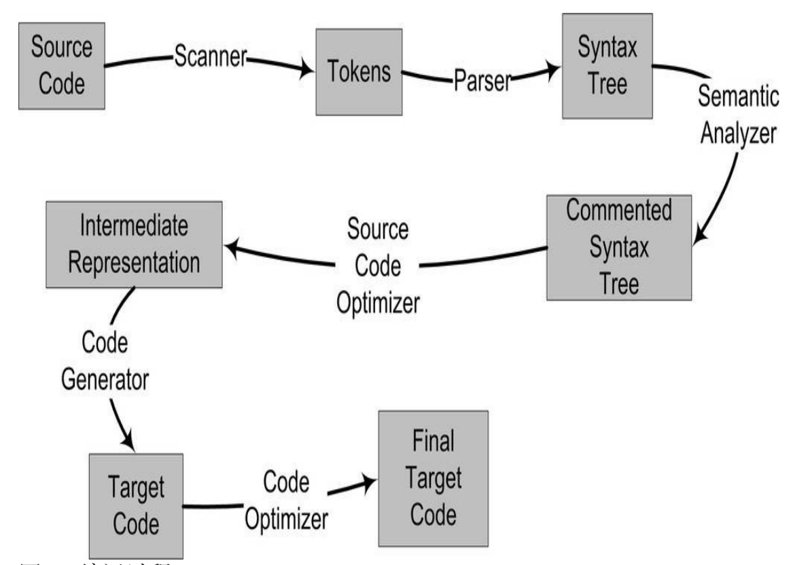
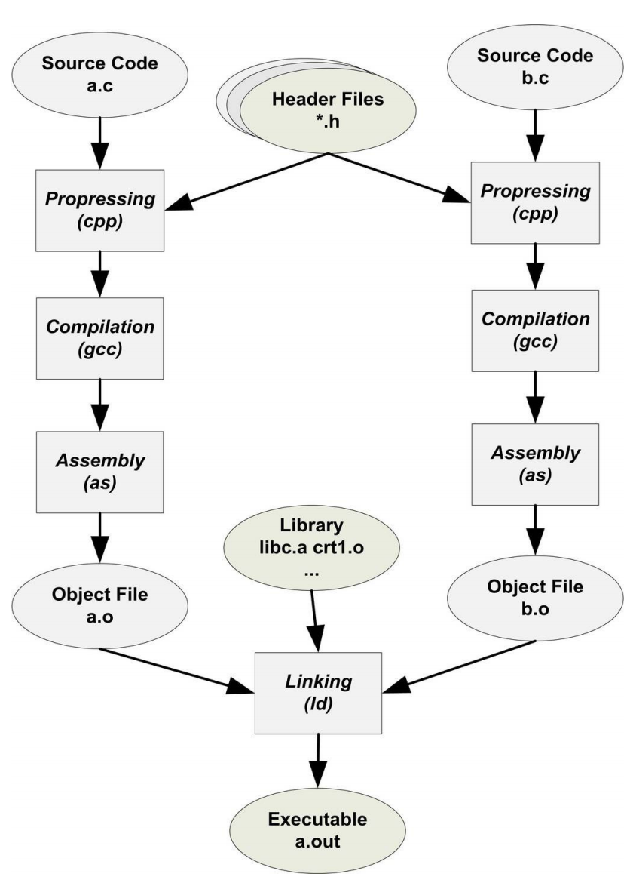

gcc编译程序过程分为4个步骤：预处理(Prepressing)、 编译(Compilation)、 汇编(Assembly) 和链接(Linking)。

预处理的过程主要：

​	将所有的#define删除，并展开所有的宏定义
​	处理所有条件预编译指令，如#if等
​	处理#include预编译指令
​	删除所有的注释
​	添加行号和文件名标识
​	保留所有的#pragma编译器指令

编译
	词法分析、语法分析、语义分析及优化后⽣产相应的汇编代码⽂件，

汇编

​	汇编器是将汇编代码转变成机器可以执⾏的指令，每⼀个汇编语句⼏乎都对应⼀条机器指令。

链接

​	扫描、语法分析、语义分析、源代码优化、代码⽣成和⽬标代码优化

###### 词法分析

⾸先源代码程序被输⼊到扫描器（Scanner），扫描器的任务很简单，它只是简单地进⾏词法分析，运⽤⼀种类似于有限状态机（Finite State Machine）的算法可以很轻松地将源代码的字符序列分割成⼀系列的记号 （Token）。词法分析产⽣的记号⼀般可以分为如下⼏类：关键字、标识符、字⾯量 （包含数字、字符串等）和特殊符号（如加号、等号）

###### 语法分析

语法分析器将对由扫描器产生的记号进行语法分析，从而产生语法树。整个分析过程采用上下文无关语法的分析手段。

###### 语义分析

编译器所能分析的语义是静态语义，就是编译期就可以确定的语义。动态语义（Dynamic Semantic）就是只有在运⾏期才能确定的语义。静态语义通常包括声明和类型的匹配，类型的转换。⽐如当⼀个浮点型的 表达式赋值给⼀个整型的表达式时，其中隐含了⼀个浮点型到整型转换的过程，语义分析过程中需要完成这个步骤。

###### 中间语言生成

源代码优化器(Source Code Optimizer)将整个语法树转换成中间代码（Intermediate Code）。
中间代码使得编译器可以被分为前端和后端。编译器前端负责产⽣机器⽆关的中间代码，编译器后端将中间代码转换成⽬标机器代码。这样对于⼀ 些可以跨平台的编译器⽽⾔，它们可以针对不同的平台使⽤同⼀个前端和针对不同机器平台的数个后端。 

###### 目标代码生成与优化

编译器后端主要包括代码生成器(code Gennerator) 和目标代码优化器(Target code optimizer)。代码生成器将中间代码转换成目标机器代码。这个过程十分依赖目标机器，因为不同的机器有着不同字长、寄存器、整数数据和浮点数数据类型。

##### 模块拼装——静态链接

⼀个复杂的软件也如此，⼈们把每个源代码模块独⽴地编译，然后按照需要将它们“组装”起来，这个组装模块的过程就是链接 （Linking）。链接过程主要包括了地址和空间分配（Address and Storage Allocation）、符号决议（Symbol Resolution）和重定位（Relocation）。

每个模块的源代码文件经过编译器编译成目标文件，目标文件和库一起链接。

使⽤链接器，你可以直接引⽤其他模块的函数和全局变量⽽⽆须知道它们的地址，因为链接器在链接的时候，会根据你所引⽤的符号 foo，⾃动去相应的func.c模块查找foo的地址，然后将main.c模块中所有引⽤到foo的指令重新修正，让它们的⽬标地址为真正的foo函数的地址。这就是静态链接的最基本的过程和作⽤。

由于在编译⽬标⽂件B的时候，编译器并不知道变量var的⽬标地址，所以编译器在没法确定地址的情况下，将这条mov指令的⽬标地址置为0，等待链接器在将⽬标⽂件A和B链接起来的时候再将其修正。我们假设A和B链接后，变量var的地址确定下来为0x1000，那么链接器将会把这个指令的⽬标地址部分修改成0x10000。这个地址修正的过程也被叫做重定位 （Relocation），每个要被修正的地⽅叫⼀个重定位⼊⼜（Relocation Entry）。重定位所做的就是给程序中每个这样的绝对地址引⽤的位置“打补丁”，使它们指向正确的地址。