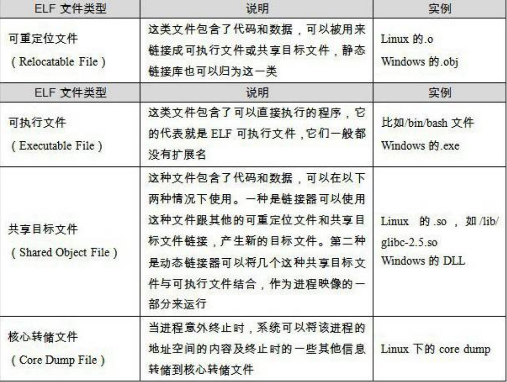

### 1.目标文件的格式

可执行文件格式（executable）:

+ windows下的PE（Portable Executable）
+ Linux的ELF (Executable Linkable Format)

目标文件就是源代码编译后但未进行链接的中间文件。动态链接库和静态链接库文件都按照可执行文件格式存储。

### 2. 目标文件是什么样de

​		目标文件中包含编译后的机器指令代码、数据，还包含链接所需要的信息----符号表、调试信息、字符串等。目标文件按不同属性，以节（section）或者段（segment）的形式存储。

​		程序源代码编译后的机器指令放在代码段(code section)里，".code"和".text" 。
​		已经初始化全局变量和局部静态变量放在数据段(Data Section), ".data".
​		未初始化的全局变量和局部静态变量⼀般放在⼀个叫.“bss”的段⾥ ---- block started by symbol

​		ELF文件开头是一个文件头，描述整个文件的文件属性----文件 是否可执行、目标硬件、目标操作系统、还有一个描述文件中各个段的属性的段表。段表描述了文件中各个段在文件中的偏移位置及段的属性。

​		程序源代码被编译以后主要分成两种段：程序指令和程序数据。代码段属于程序指令，而数据段和.bss属于程序数据。指令和数据分开放的好处：①数据区可读写，代码区只可读。②cpu的缓存被设计成数据缓存和指令缓存分离③当系统运行多个程序，因代码指令一样的，所以无需每个进程对应一份代码指令。

### 3. 深挖SimpleSection.o

