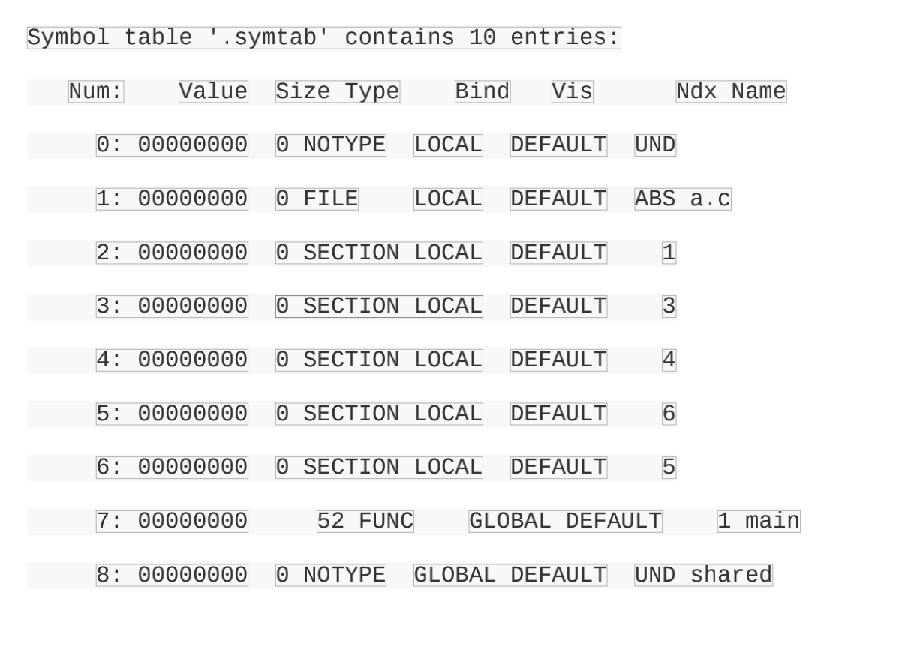

### 1. 空间与地址分配

#### 1.1 按序叠加

​		将输⼊的⽬标⽂件按照次序叠加起来

​		

​		这种方式的缺点：会有许多零散的段。段的装载地址和空间的对齐单位是页，也就是4 096字节。⼀个段的长度只有1个字节，它也要在内存中占⽤4 096字节。造成大量的内存碎片。

#### 1.2 相似段合并

将相同性质的段合并在一块，“.text”合并到输出⽂件的“.text”段，接着是“.data”段、“.bss”段


第⼀个是在输出的可执⾏⽂件中的空间；第⼆个是在装载后的虚拟地址中的虚拟地址空间。对于有实际数据的段，⽐如“.text”和“.data”来说，它们在⽂件中和虚拟地址中都要分配空间，因为它们在这两者中都存在；⽽对于“.bss”这样的段来说，分配空间的意义只局限于虚拟地址空间，因为它在⽂件中并没有内容

现在的连接器空间分配的策略基本上采用第二种，两步链接的方法。

第⼀步 空间与地址分配 扫描所有的输⼊⽬标⽂件，并且获得它们的各个段 的长度、属性和位置，并且将输⼊⽬标⽂件中的符号表中所有的符号定义和符号引⽤收集起来，统⼀放到⼀个全局符号表

第⼆步 符号解析与重定位 使⽤上⾯第⼀步中收集到的所有信息，读取输⼊⽂件中段的数据、重定位信息，并且进⾏符号解析与重定位、调整代码中的地址等。事实上第⼆步是链接过程的核⼼，特别是重定位过程。


VMA表⽰Virtual Memory Address，即虚拟地址，LMA表⽰Load Memory Address，即加载地址。

##### 1.3 符号地址的确定

​		当前⾯⼀步完成之后，链接器开始计算各个符号的虚拟地址。因为各个符号在段内的相对位置是固定的，所以这时候其实“main”、“shared”和“swap”的地址也已经是确定的了，只不过链接器须要给每个符号加上⼀个偏移量，使它们能够调整到正确的虚拟地址


#### 2. 符号解析与重定位

##### 2.1 重定位

程序的代码⾥⾯使⽤的都是虚拟地址。


最左边那列是每条指令的偏移量，每⼀⾏代表⼀条指令（有些指令的长度很长，如第偏移为0x18的mov指令，它的⼆进制显⽰占据了两⾏）

当源代码“a.c”在被编译成⽬标⽂件时，编译器并不知道“shared”和“swap”的 地址，因为它们定义在其他⽬标⽂件中。所以编译器就暂时把地址0看作是“shared”的地址，我们可以看到这条“mov”指令中，关于“shared”的地址部分“0x00000000”。

##### 2.2 重定位表

有⼀个叫重定位表（Relocation Table的结构专门⽤来保存这些与重定位相关的信息。对于每个要被重定位的ELF段都有⼀个对应的重定位表，⽽⼀个重定位表往往就是ELF⽂件中的⼀个段，所以其实重定位表也可以叫重定位段，我们在这⾥统⼀称作重定位表。⽐如代码段“.text”如有要被重定位的地⽅，那么会有⼀个相对应叫“.rel.text”的段保存了代码段的重定位表


每个要被重定位的地⽅叫⼀个重定位⼊⼜（Relocation Entry），我们可以看到“a.o”⾥⾯有两个重定位⼊⼜。重定位⼊⼜的偏移（Offset）表⽰该⼊⼜在要被重定位的段中的位置，“RELOCATION RECORDSFOR[.text]”表⽰这个重定位表是代码段的重定位表，所以偏移表⽰代码段中须要被调整的位置

```c
typedef struct{
	Elf32_Addr r_offset;
	Elf32_word r_info;
} Elf32_Rel;
```

| 描述     |                                                              |
| -------- | ------------------------------------------------------------ |
| r_offset | 重定位的入口。对于可重定位文件来说，这个值是该重定位入口所要修正的位置的第一个字节相对于段起始的偏移。对于可执行文件或共享对象来说，这个值是该重定位入口所要修正的位置的第一个字节的虚拟地址。 |
| r_info   | 重定位人口的类型和符号。这个成员的低8位表示重定位入口类型，高24位表示重定位人口的符号在符号表的下标。 |

##### 2.3 符号解析

​	链接时符号未定义，导致这个问题一般是缺少库，目标路径不正确或符号的声明和定义不一样。重定位的过程，每个重定位的入口都是对一个符号的引用，那么当链接器要对某个符号的引用进行重定位时，它就要确定这个符号的目标地址。这时候链接器就会去查找由所有输⼊⽬标⽂件的符号表组成的全局符号表，找到相应的符号后进⾏重定位



##### 2.4 指令修正方式

​	对于32位x86平台下的ELF⽂件的重定位⼊⼜所修正的指令寻址⽅式只有两种：绝对近址32位寻址和相对近址32位寻址。

​	这两种方式被修正的位置长度都是32位(4字节)。
​	

|            | X86基本重定位类型 |                    |
| ---------- | ----------------- | :----------------- |
| 宏定义     | 值                | 重定位修正方法     |
| R_386_32   | 1                 | 绝对寻址修正 S+A   |
| R_386_PC32 | 2                 | 相对寻址修正 S+A-P |

A = 保存在被修正位置的值

P = 被修正的位置

S = 符号的实际地址


#### 3. COMMENT块

弱符号机制允许同⼀个符号的定义存在于多个文件中。如果一个弱符号定义在多个目标文件中，而它们类型又不同？不同的情况有三种：

+ 两个或以上的强类型定义
+ 只有一个强类型
+ 没有强类型，两个或两个以上弱符号类型不一致。

第一种情况无须处理，链接器会报符号多重定义；链接器要处理的就是后面两种情况
编译器和链接器都⽀持⼀种叫COMMON块（Common Block）的机制，编译器将未初始化的全局变量定义作为弱符号处理


#### 5. 静态链接库链接

程序如何使用操作系统提高的API。一般一种语言的开发环境往往会附带有语言库。很⼤⼀部分库函数都是要调⽤操作系统的API的，⽐如最常⽤的往终端输出格式化字符串的printf就是会调⽤操作系统，往终端⾥⾯打印⼀些字符串