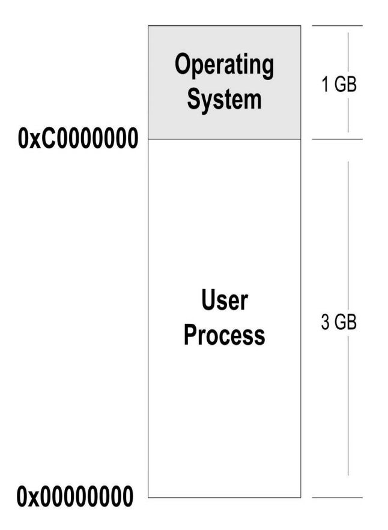
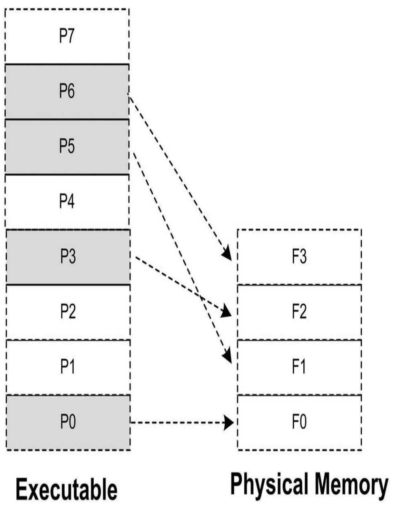
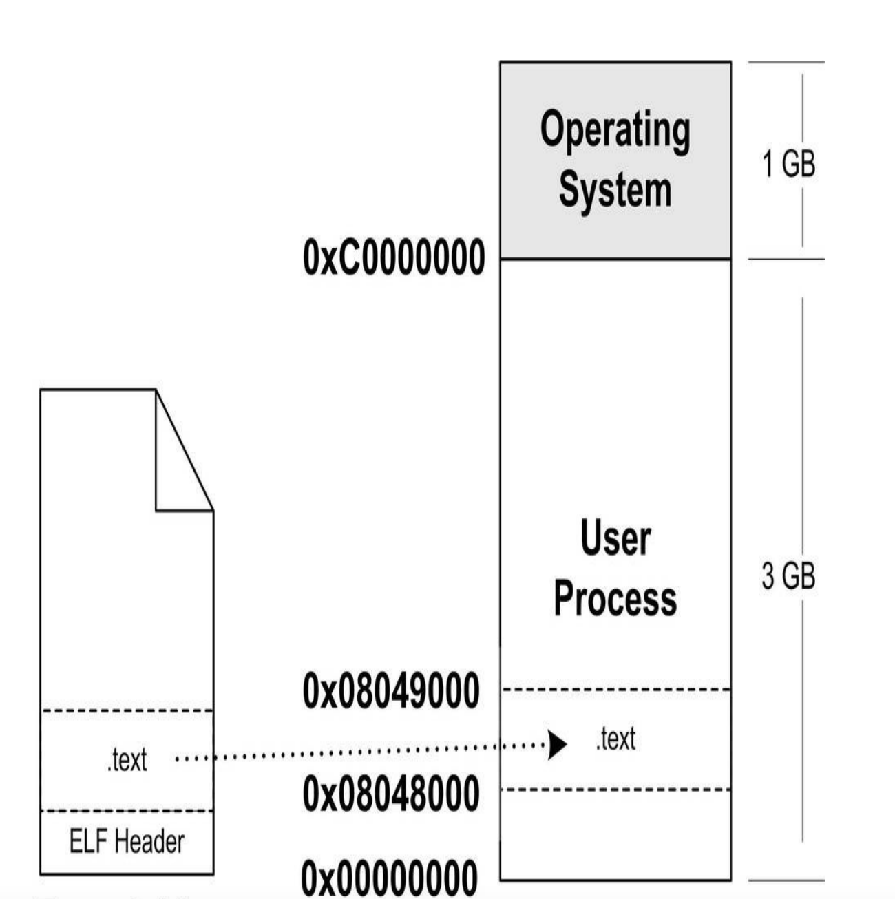
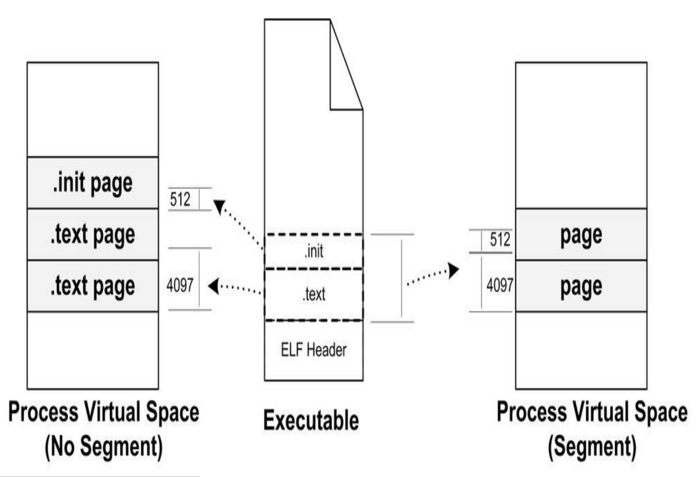

# 可执⾏⽂件的装载与进程

可执⾏⽂件只有装载到内存以后才能被CPU执⾏。

### 1. 进程的虚拟空间

##### 进程和程序的区别

程序是一个静态的概念，是预先编译好的指令和数据的一个文件。进程是一个动态的概念，程序运行时的一个过程。
进程只能使⽤那些操作系统分配给进程的地址，如果访问未经允许的空间，那么操作系统就会捕获到这些访问，将进程的这种访问当作⾮法操作，强制结束进程


整个4GB被划分成两部分，其中操作系统本⾝⽤去了⼀部分：从地址0xC00000000到0xFFFFFFFF，共1GB。剩下的从0x00000000地址开始到0xBFFFFFFF共3GB的空间都是留给进程使⽤的。那么从原则上讲，我们的进程最多可以使⽤3GB的虚拟空间，也就是说整个进程在执⾏的时候，所有的代码、数据包括通过C语⾔malloc()等⽅法申请的虚拟空间之和不可以超过3GB

### 2. 装载的方式

程序执⾏时所需要的指令和数据必须在内存中才能够正常运⾏，最简单的办法就是将程序运⾏所需要的指令和数据全都装⼊内存中，这样程序就可以顺利运⾏，这就是最简单的静态装⼊的办法。
程序运⾏时是有局部性原理的，所以我们可以将程序最常⽤的部分驻留在内存中，⽽将⼀些不太常⽤的数据存放在磁盘⾥⾯，这就是动态装⼊的基本原理
覆盖装⼊（Overlay）和页映射（Paging）是两种很典型的动态装载⽅法，

##### 2.1 覆盖装入

##### 2.2页映射

将内存和所有磁盘中的数据和指令按照“页（Page）”为单位划分成若⼲个页，以后所有的装载和操作的单位就是页


##### 3.  从操作系统角度来看可执行文件的装载

##### 3.1 进程的创建

创建⼀个进程，然后装载相应的可执⾏⽂件并且执⾏：

+ 创建一个独立的虚拟内存空间
+ 读取可执行文件头，并且建立虚拟空间与可执行文件的映射关系
+ 将cpu指令寄存器设置成可执行文件的入口地址，启动执行



##### 3.2 页错误

假设程序的⼊⼜地址为0x08048000，即刚好是.text段的起始地址。当CPU开始打算执⾏这个地址的指令时，发现页⾯0x08048000～0x08049000是个空页⾯，于是它就认为这是⼀个页错误（PageFault）。CPU将控制权交给操作系统，操作系统有专门的页错误处理例程来处理这种情况。这时候我们前⾯提到的装载过程的第⼆步建⽴的数据结构起到了很关键的作⽤，操作系统将查询这个数据结构，然后找到空页⾯所在的VMA，计算出相应的页⾯在可执⾏⽂件中的偏移，然后在物理内存中分配⼀个物理页⾯，将进程中该虚拟页与分配的物理页之间建⽴映射关系，然后把控制权再还回给进程，进程从刚才页错误的位置重新开始执⾏

#### 4. 进程虚拟内存空间分布

##### 4.1ELF⽂件链接视图和执⾏视

每个段在映射时的长度应该都是系统页长度的整数倍。

段的权限往往只有为数不多的⼏种组合，基本上是三种：

+ 以代码段为代表的权限为可读可执⾏的段。
+ 以数据段和BSS段为代表的权限为可读可写的段。
+ 以只读数据段为代表的权限为只读的段。

对于相同权限的段，把它们合并到⼀起当作⼀个段进⾏映射




ELF可执⾏⽂件中有⼀个专门的数据结构叫做程序头表（ProgramHeader 
Table）⽤来保存“Segment”的信息。因为ELF⽬标⽂件不需要被装载，所以它没有程序头表，⽽ELF的可执⾏⽂件和共享库⽂件都有


##### 5. linux内核装载ELF过程简介

bash进程会调用fork系统调用创建一个新的进程，新的进程调用execve()系统调用执行指定的ELF文件，原先的bash进程继续返回等待刚才启动的进程结束。

```c
int execve(const char *filename, char *const argv[], char *const envp[])
```

三个参数分别是被执行的文件名，执行参数和环境变量。Glibc对execve进行的包装，提供了execl()， excelp()， execv()和execvp()5个API。

execve()系统调用相应的入口是sys_execve(),调用do_execve()。
