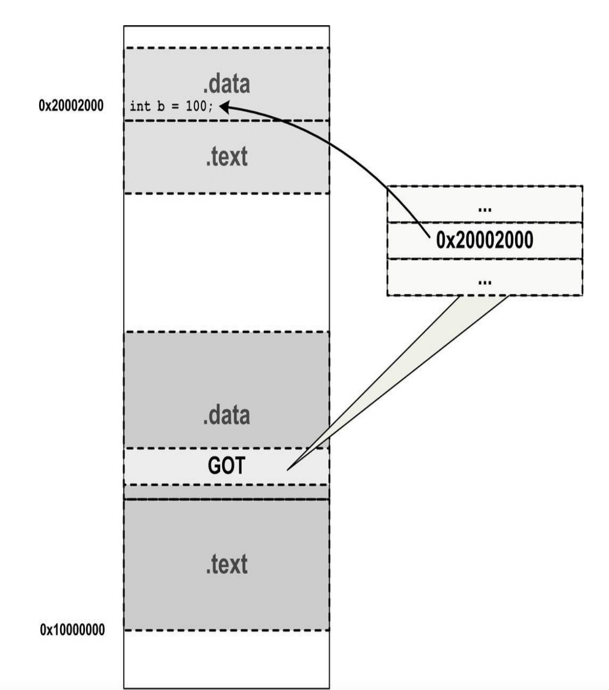
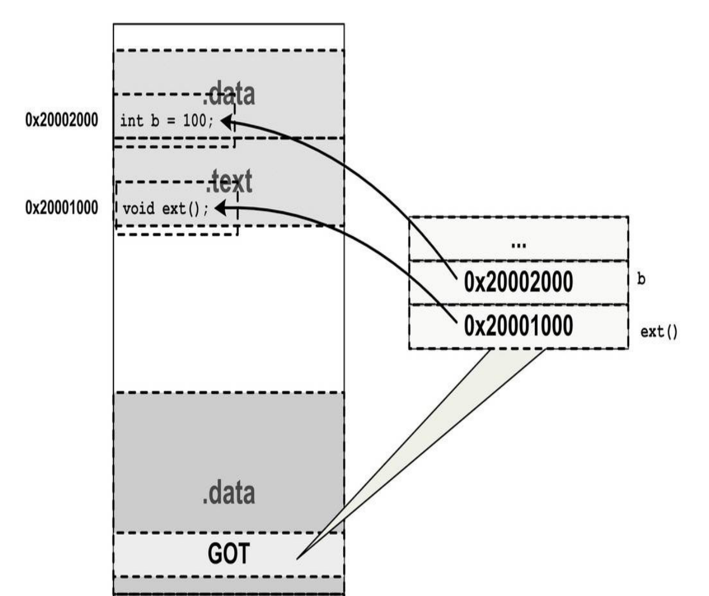

# 动态链接

#### 为什么要动态链接

静态链接浪费内存和磁盘空间、模块更新难。等到程序要运⾏时才进⾏链接，这样可以共享多个目标文件的副本的

在linux系统中， ELF动态链接文件被称为动态共享对象(Dynamic Shared Objects), 以.so结尾。在Linux中，常⽤的C语⾔库的运⾏库glibc，它的动态链接形式的版本保存在“/lib”⽬录下，⽂件名叫做“libc.so”。动态链接是把链接这个过程从本来的程序装载前被推迟到了装载的时候。
动态链接下的可执⾏⽂件和共享对象都可以看作是程序的⼀个模块。对于动态共享对象中的函数，链接器就会将这个符号的引⽤标记为⼀个动态链接的符号，把地址重定位留到装载时进⾏。

##### 动态链接程序运行时地址空间分布

共享对象的最终装载地址在编译的时候是不确定的，而是在装载的时候，装载器根据当前地址空间的空闲情况，动态分配一块足够大小的虚拟地址空间给相应的共享对象

#### 3. 地址无关代码

##### 3.2 装载时重定向

##### 3.3 地址无关代码

装载时重定位是解决动态模块中有绝对地址引用的办法之一。

第⼀种是模块内部的函数调⽤、跳转等。 
第⼆种是模块内部的数据访问，⽐如模块中定义的全局变量、静态变量。 
第三种是模块外部的函数调⽤、跳转等。 
第四种是模块外部的数据访问，⽐如其他模块中定义的全局变量。

###### 类型一 模块内部调用或跳转

调用的函数与调用者都处于同一模块上面，它们之间相对位置固定，不需要重定位。

###### 类型二 模块内部数据访问

一个模块前面一般是若干页的代码，后面紧跟若干个页的数据，页之间的相对是固定的。也就是说，任何一条指令与它需要访问的模块内部数据之间的相对位置是固定的。

###### 类型三 模块间数据访问

ELF的做法是在数据段里面建立一个指向这些变量的指针数组，也被称为全局偏移表(Global offset Table，GOT)


编译时确定GOT相对于当前指令的偏移，通过得到PC值然后加上⼀个偏移量，就可以得到GOT的位置。

###### 类型四  模块间调用、跳转

GOT中相应的项保存的是⽬标函数的地址，当模块需要调⽤⽬标函数时，可以通过GOT中的项进⾏间接跳转



|          | 各种地址引用方式       |                   |
| -------- | ---------------------- | ----------------- |
| 模块内部 | (1) 相对跳转和调用     | (2) 相对地址访问  |
| 模块外部 | (2)间接跳转和调用(GOT) | (4) 间接访问(GOT) |

#### 3.4 共享模块的全局变量问题

有⼀种很特殊的情况是，当⼀个模块引⽤了⼀个定义在共享对象的全局变量的时候。由于可执⾏⽂件在运⾏时并不进⾏代码重 定位，所以变量的地址必须在链接过程中确定下来。为了能够使得链接过程正常进⾏，链接器会在创建可执⾏⽂件时，在它的“.bss”段创建⼀个global变量的副本现在global变量定义在原先的共享对象中，⽽在可执⾏⽂件的“.bss”段还有⼀个副本。如果同⼀个变量同时存在于多个位置中，这在程序实际运⾏过程中肯定是不可⾏的。 解决的办法只有⼀个，那就是所有的使⽤这个变量的指令都指向位于可执⾏⽂件中的那个副本。

### 3.5 数据段地址无关性

于数据段来说，它在每个进程都有⼀份独⽴的副本，所以并不担⼼被进程改变。

### 4. 延迟绑定PLT

动态链接下对于全局和静态的数据访问都要进⾏复杂的GOT定位，然后间接寻址；对于模块间的调⽤也要先定位 GOT，然后再进⾏间接跳转，如此⼀来，程序的运⾏速度必定会减慢

###### 延迟绑定实现

延迟绑定（Lazy Binding）的做法，基本的思想就是当函数第⼀次被⽤到时才进⾏绑定（符号查找、重定位等）。

当我们调用某个外部模块的函数时，如果按照通常的做法应该是通过GOT中相应的项进行间接跳转。PTL为了实现延迟绑定，在这个过程中间又增加了一层间接跳转，这层就是PLT项。

```
bar@plt:
jmp *（bar@GOT）
push n	//这个数字是 bar这个符号引⽤在重定位表“.rel.plt”中的下标
push moduleID	//模块的ID压⼊到堆栈
jump _dl_runtime_resolve
//⼀旦 bar() 这个函数被解析完毕，当我们再次调⽤bar@plt时，第⼀条jmp指 令就能够跳转到真正的 bar() 函数中， bar() 函数返回的时候会根据堆栈⾥⾯ 保存的EIP直接返回到调⽤者，⽽不会再继续执⾏bar@plt中第⼆条指令开 始的那段代码，那段代码只会在符号未被解析时执⾏⼀次
```

ELF将GOT拆分成两个表“.got” 和 “.got.plt”：

+ “.got”用来保存全局变量引用的地址
+ “.got.plt”用来保存函数引用的地址

“.got.plt”还有⼀个特殊的地⽅是它的前三项是有特殊意义的：

+ “.dynamic”, 描述本模块动态链接相关信息
+ 本模块的moduleID
+ _dl_runtime_resolve()的地址

其余项分别对应每个外部函数的引用。

### 5. 动态链接相关结构

##### 5.1  .interp段

动态链接器的位置由ELF可执行文件的决定。.interp就是可执⾏⽂件所需要的动态链接器的路径，在Linux下，可执⾏⽂件所需要的动态链接器的路径⼏乎都是“/lib/ld-linux.so.2”。

##### 5.2  .dynamic段

```c
typedef struct {
	ELF32_Sword d_tag;
	union{
			Elf32_Word d_val;
			Elf32_Addr d_ptr;
	}
}
```

##### 5.3  动态符号表 

“.dynsym”只保存了与动态链接相关的符号，对于那些模块内部的符号，⽐如模块私有变量则不保存。很多时候动态链接的模块同时拥有“.dynsym”和“.symtab”两个表，“.symtab”中往往保存了所有符号，包括“.dynsym”中的符号。

##### 5.4  动态链接重定位表

动态链接中，导⼊符号的地址在运⾏时才确定，所以需要在运⾏时将这些导⼊符号的引⽤修正，即需要重定位。