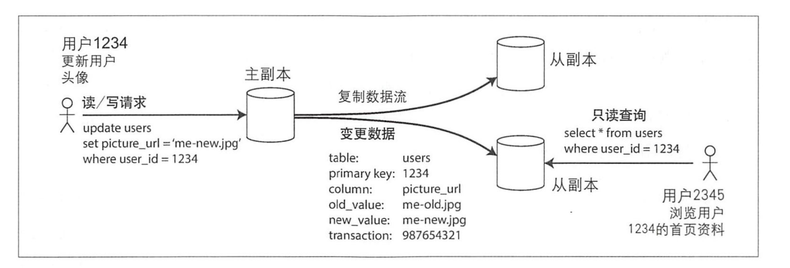
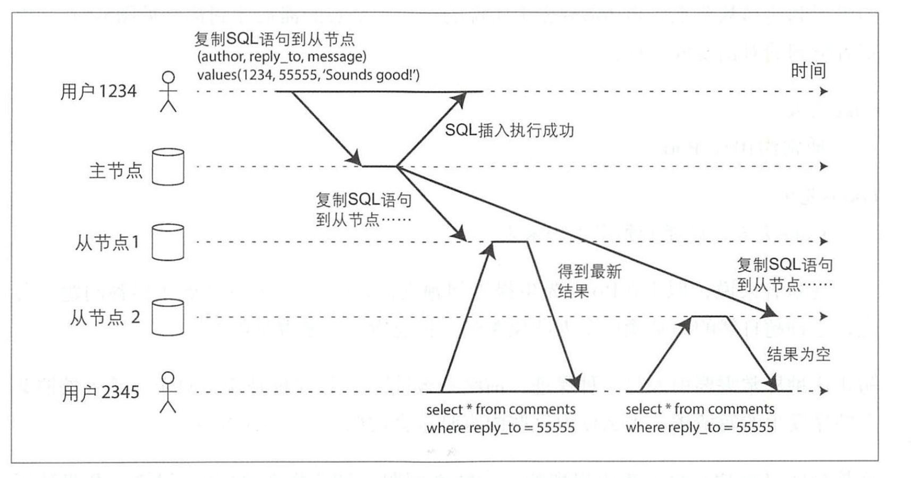

## 主节点和从节点

### 如何确保所有副本之间的数据一致？

主从复制的原理：

1. 选定一个副本为主副本；先写主副本，主副本先写入本地存储
2. 其他副本都是从副本。主副本把新数据写入本地存储，然后将数据更改作为复制的日志或更改流发送给所有的副本。副本在将更改应用到本地
3. 主才能接受写请求，主副本和写副本都可以执行查询

### 同步复制和异步复制

同步复制，即主节点需要等待到从节点1确认写入完成，才会向用户报告完成。

异步复制，无法保证复制时间。

### 配置新的节点

1. 在某个时间点对主节点的数据副本产生一个一致性的快照
2. 将此快照拷贝到的从节点
3. 从节点连接到主节点并请求快照点之后所发生的数据更改日志。
4. 获得日志之后，从节点来用用这些快照点之后所有的数据变更

### 处理节点失效

从节点失效

从节点的本地磁盘保存了副本收到的数据变更日志。根据副本的复制日志，从节点可以知道在发生故障之前所处理的最后 笔事务，然后连接到主节点，并请求自那笔 务之后中断期间内所有的数据变更

主节点失效

选择某个从节点提升为主节点。客户端也需要更新。其他从节点也要更新

自动切换

1. 确认主节点失效
2. 选举新的节点
3. 重新配置系统使新的主节点生效

### 复制日志的实现

基于语句的复制。记录所执行每个写请求。但是也有不适应的场景：

+ 非确定性的语句，now()
+ 使用到自增序列
+ 有副作用的语句(触发器，存储过程，用户定义函数)

### 基于先前日志wal传输

### 基于行的逻辑日志复制

关系数据库的逻辑日志通常是指一系列记录来描述数据表行级别的写请求：

+ 对于行插入，日志包含所有相关列的心智
+ 对于行删除，日志中有信息来唯一标已删除的行，
+ 对于行更新，日志包含足够的信息来唯一标识更新的行，以及所有列的新值

### 复制滞后的问题

写后读一致性：

+ 如果用户访问可能会被修改的内容，从主节点读取 ，在从节点读取

+ 如果应用的大部分内容都可能被所有用户修改

+ 客户端还可以记住最近更新时的时间戳 ，井附带在读请求中，据此信息，系统可

  以确保对该用户提供读服务时都应该至少 含了该时间戳的更新

+ 如果副本分布在多数据中心

### 单调读

异步复制读异常，出现用户数据向后回滚的情况。两次查询访问了两个节点的数据库。第一个节点同步到了最新数据，第二个节点没有同步到数据。

实现单调读的 种方式是，确保每个用户总是从固定的同 副本执行读取

### 前缀一致读

读取内容也要按照写入的顺序。

### 多节点复制

