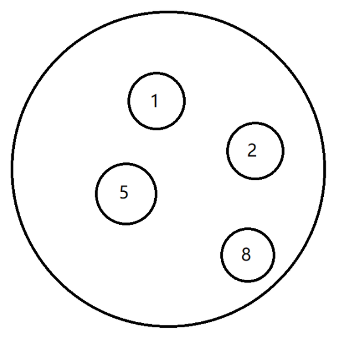
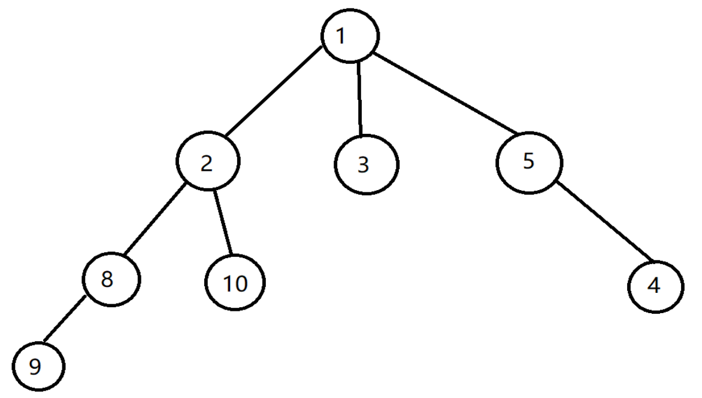
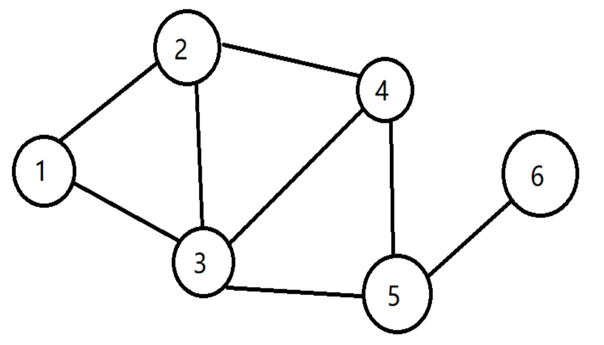

## 为什么学数据结构与算法

因为程序是数据结构+算法组成

## 数学基础

1. 指数

   指数是幂运算aⁿ(a≠0)中的一个参数，a为底数，n为指数，指数位于底数的右上角，幂运算表示指数个底数相乘

2. 对数

   在数学中，对数是对求幂的逆运算，正如除法是乘法的倒数，反之亦然。因此，对于公式，有且仅当

3. 级数

   指将数列的项依次用加号连接起来的函数。我们使用∑

4. Π运算

​		由∑的加法变成了乘法，其代表“求乘积”

## 逻辑结构

1. 集合结构

    

2. 线性结构

   数据元素之间是一对一的关系

    

3. 树形结构

    

4. 图形结构

    

   

## 复杂度

1. 时间复杂度

   n表示问题的规模，也就是操作的重复次数T(n)表示时间频度

   若有辅助函数f(n),使得当n趋近于无穷大时，T（n)/f(n)的极限值为不等于零的常数，则称f(n)是T(n)的同数量级函数。

   记作T(n)=Ｏ(f(n)),称Ｏ(f(n)) 为算法的渐进时间复杂度，简称时间复杂度

   

2. 空间复杂

   运行完程序所需内存的大小，分两个部分：

   + 固定部分。常量，静态变量，程序本身代码。
   + 可变空间。动态分配的空间，以及递归栈所需的空间

3. 估算时间复杂度

   〇表示最坏情况，Ω表示最好情况，θ表示平均情况。

   一般都是用〇表示。

   基本公式：

   a)O(a）=O(1)   其中a为常数

   b)O(an)=O(n)   其中a为常数

   c)O(an2++bn+c)=O(n2)   其中a,b,c均为常数，结果只与最大项n有关

