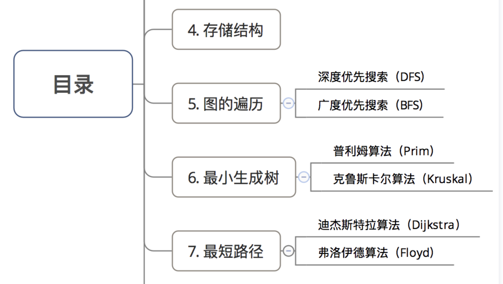

## 基本概念

1. 定义

   图：顶点和边组成；表示方式 G（V, E）顶点不为空，边可以为空

2. 边的分类

​	无向边，顶点之间没有方向；用(vi, vj)表示；(vi, vj) == (vj, vi)

​	有向边，顶点之间有方向；用<vi, vj>表示；<vi, vj> 不等 <vj, vi>

​	顶点的度：

​			对于无向边，与顶点相关联的边的数目，图的边数 = 图中各顶点度数和的一半

​			对于有向边，顶点的度 = 出度+入度，图的边数 = 各顶点出度和 = 各顶点入度和

​	路径长度，顶点间路径的边

3. 图的类型

   1. 无向图

      边都是无向图，顶点集合V， 边集合E

   2. 有向图

      边都有向图，顶点集合V， 边集合E

   3. 无向完全图

      顶点之间都存在边

   4. 有向完全图

      任意顶点之间都存在正反两个方向的边

   连通图

   1. 定义：图中任意顶点都是连通的图

   2. 无向图的连通图

      任意顶点之间都是连通的，

      极大连通子图，子图中是连通的而且顶点尽可能的多，同时包含这些顶点的边

      极小连通子图，连通，含有图中顶点=n，含有图中边= n-1，不能构成环

   3. 有向图的连通图

      顶点强连通，顶点与顶点之间存在双向路径

      强连通图，任意顶点都是强连通的

      极大强连通子图，极大顶点数，子图，强连通，

      有向树，仅有一个顶点的入度为0，其余至少一个

      生成森林，由多个有向树组成

      

- ​			

## 图的遍历

#### 深度优先遍历，DFS，depth first search

过程：

1. 从初始顶点出发，访问初始顶点
2. 访问一个节点，继续访问与当前节点邻接的点。右边邻接点优先
3. 直到所有和初始节点相通的顶点都被访问

#### 广度优先遍历

过程：

1. 从上->下，左->访问图中所有顶点

### 最小生成树

1. 网图：带有权值的图
2. 最小成本：用（n-1）条边 含n个顶点的连通图连接起来

寻找最小生成树的算法

+ Prim普利姆
+ Kruskal克鲁斯卡尔算法

### 最短路径

+ 对于无权图，最短路径 = 两顶点经过的边数最少的路径
+ 对于带权图，最短路径 = 两顶点间经过的边上权值和最少的路径

 寻找最短路径的算法：

+ 迪杰斯特拉算法`（Dijkstra）`
+ 弗洛伊德算法`（Floyd）`

|          | 原理                                                         | 时间复杂度                                         | 应用场景 |
| -------- | ------------------------------------------------------------ | -------------------------------------------------- | -------- |
| Dijkstra | 1. 按路径长度递增的次序，从而产是最短的路径 2.基于已求成的最短路径，求得更远顶点的最短路径 | 单源点->单终点：o(n^2) 多源点->多终点：o(n^3) |          |
| Floyd    | 应用矩阵的变换                                               | 单源点->单终点：o(n^2) 多源点->多终点：o(n^3) |          |

