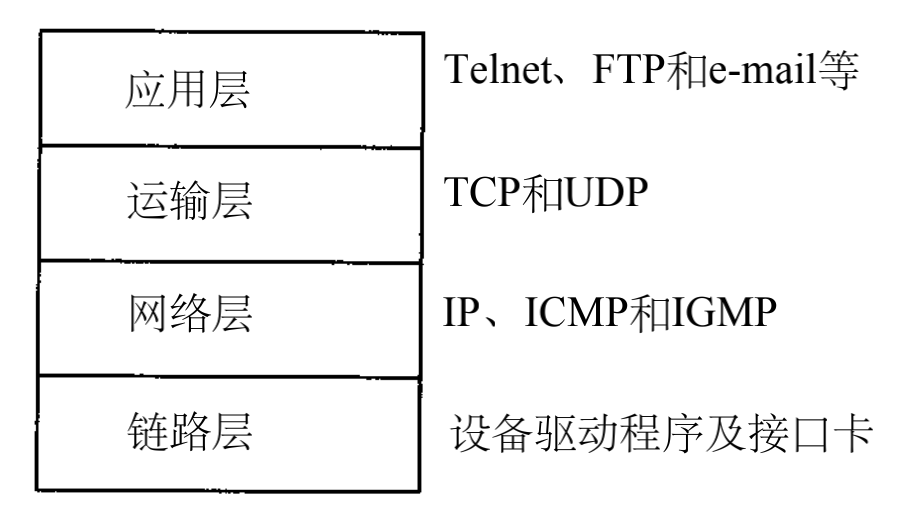
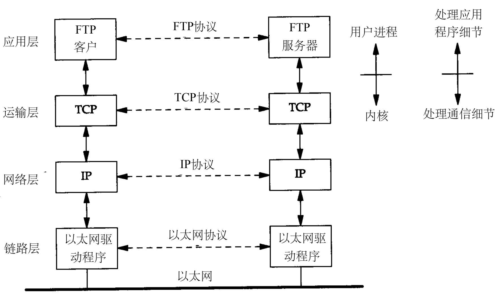
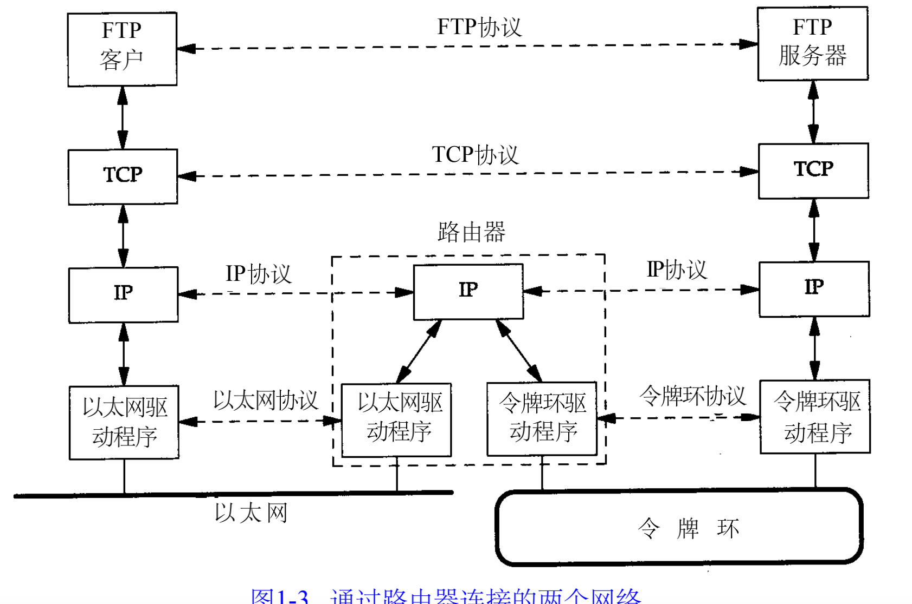
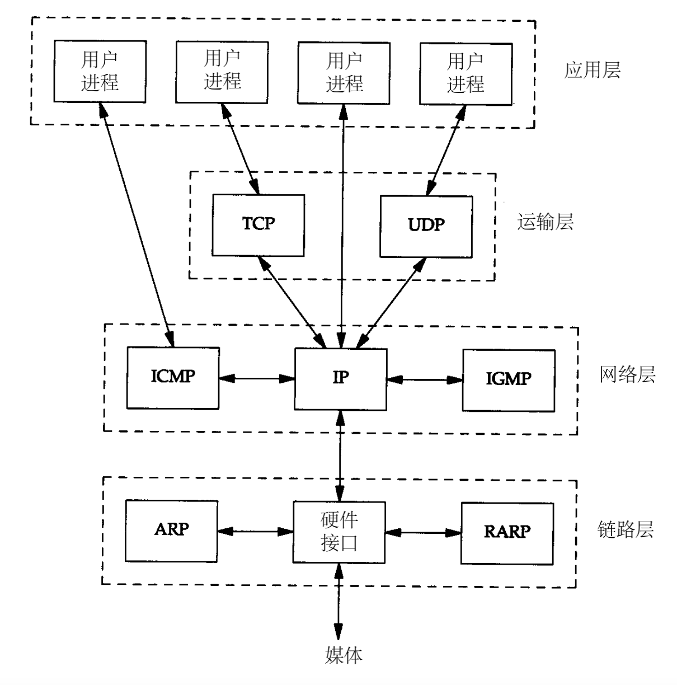
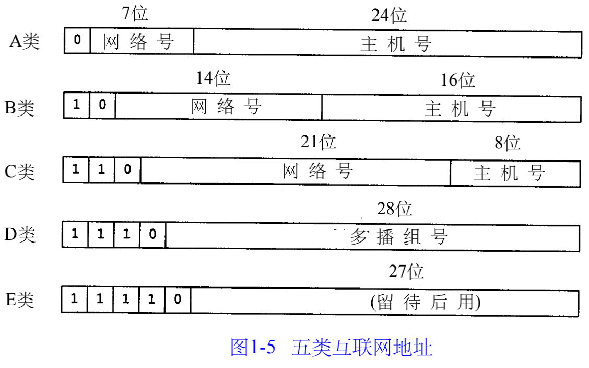
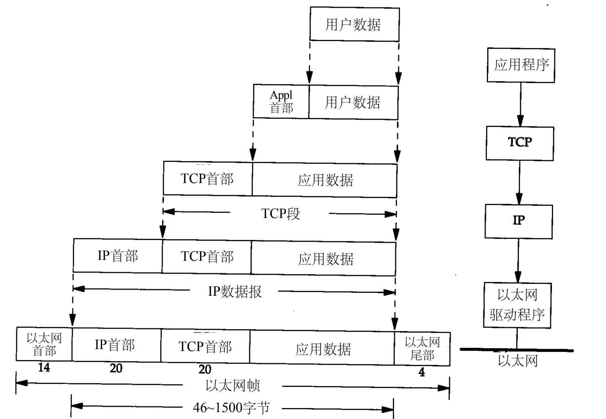
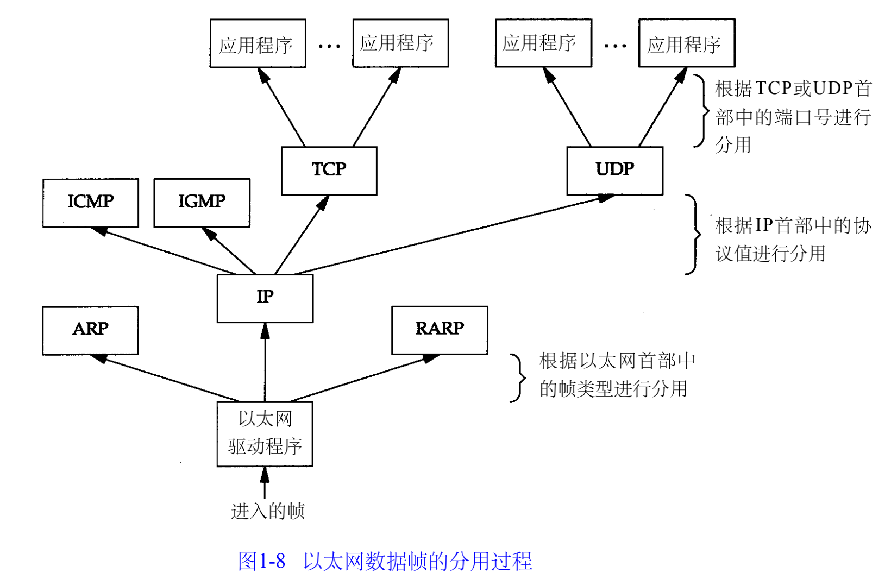

#### 分层

1. 数据链路层，包括设备驱动程序和网络接口卡。

2. 网络层，处理分组在网络的活动。网络层协议包括IP协议，ICMP协议，IGMP协议

3. 运输层，两台主机的应用程序提供端到端的通信，因此应用层可以忽略所有这些细节。TCP、UDP协议。T C P为两台主机提供可靠的数据通信。它把应用程序发送的数据分块交给下一层的网络层，确认接收到的分组，设置发送最后确认分组的超时时钟。UDP作数据报的分组从一台主机发送到另一台主机，但并不保证该数据报能可达

4. 应用层负责处理特定的应用程序细节。几乎各种不同的 T C P / I P实现都会提供：

   • Telnet 远程登录。

   • FTP 文件传输协议。

   • SMTP 简单邮件传送协议。

   • SNMP 简单网络管理协议。

下三层则一般在（操作系统）内核中执行。

构造互连网的方法是把两个或多个网络通过路由器进行连接。路由器用router这个术语形容。而网关用来表示：一个连接两种不同协议族的进程

端系统（ End system ）（两边的两台主机）和中间系统（Intermediate system）（中间的路由器）。应用层和运输层使用端到端（ En d - t o - e n d）协议。但是，网络层提供的却是逐跳（ Ho p - b y - h o p）协议，两个端系统和每个中间系统都要使用它。在T C P / I P协议族中，网络层 I P提供的是一种不可靠的服务。它只是尽可能快地把分组从源结点送到目的结点，但是并不提供任何可靠性保证。而另一方面， T C P在不可靠的I P层上提供了一个可靠的运输层。为了提供这种可靠的服务， T C P采用了超时重传、发送和接收端到端的确认分组等机制。由此可见，运输层和网络层分别负责不同的功能。

互联网的目的之一是在应用程序中隐藏所有的物理细节。连接网络的另一个途径是使用网桥。。网桥是在链路层上对网络进行互连，而路由器则是在网络层上对网络进行互连。网桥使得多个局域网（ L A N）组合在一起，这样对上层来说就好像是一个局域网。

##### 1.3 TCP/IP的分层

##### 1.4 ip地址

I P地址长32 bit。

ip地址通常写成4个十进制数。

三类I P地址：单播地址（目的为单个主机）、广播地址（目的端为给定网络上的所有主机）以及多播地址（目的端为同一组内的所有主机）

##### 1.5 域名系统

在 T C P / I P领域中，域名系统（ D N S）是一个分布的数据库，由它来提供 I P地址和主机名之间的映射信息。

##### 1.6 封装

应用程序用 T C P传送数据时，数据被送入协议栈中，然后逐个通过每一层直到被当作一串比特流送入网络。其中每一层对收到的数据都要增加一些首部信息。

+ T C P传给I P的数据单元称作 T C P报文段
+ I P传给数据链路层的数据单元称作 I P数据报
+ 通过以太网传输的比特流称作帧(Fr a m e )。 

I P和网络接口层之间传送的数据单元应该是分组（ p a c k e t）。分组既可以是一个I P数据报，也可以是I P数据报的一个片（f r a g m e n t）。

U D P数据与T C P数据基本一致。唯一的不同是 U D P传给I P的信息单元称作 U D P数据报（UDP datagram），而且U D P的首部长为8字节。

由于T C P、U D P、I C M P和I G M P都要向I P传送数据，为此， I P在首部中存入一个长度为8 b i t的数值，称作协议域,用来标识数据属于哪一层。

数据链路层分别要发送和接收 I P、A R P和R A R P数据，16 bit的帧类型域

##### 1.7 分用

当目的主机收到一个以太网数据帧时，数据就开始从协议栈中由底向上升，同时去掉各层协议加上的报文首部。每层协议盒都要去检查报文首部中的协议标识，以确定接收数据的上层协议。这个过程称作分用（ D e m u l t i p l e x i n g），

##### 1.8 客户--服务器模型

重复性服务器：

I1. 等待一个客户请求的到来。
I2. 处理客户请求。
I3. 发送响应给发送请求的客户。
I4. 返回I 1步。

并发型服务器采用以下步骤：

C1. 等待一个客户请求的到来。
C2. 启动一个新的服务器来处理这个客户的请求。在这期间可能生成一个新的进程、任务或线程，并依赖底层操作系统的支持。。处理结束后，终止这个新服务器。
C3. 返回C 1步。

##### 1.9 端口号

T C P和U D P采用16 bit的端口号来识别应用程序。

F T P服务器的T C P端口号都是2 1，
Te l n e t服务器的T C P端口号都是2 3，
T F T P (简单文件传送协议)服务器的U D P端口号都是6 9。

任何T C P / I P实现所提供的服务都用知名的 1～1 0 2 3之间的端口号。

##### 1.15 应用编程接口

T C P / I P协议的应用程序通常采用两种应用编程接口（ A P I）：s o c k e t和T L I（运输层接口：Transport Layer Interface）

