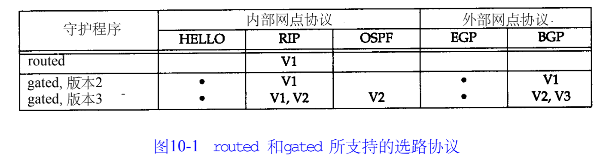
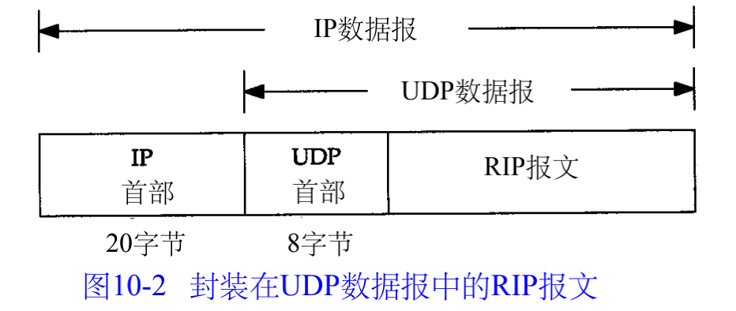
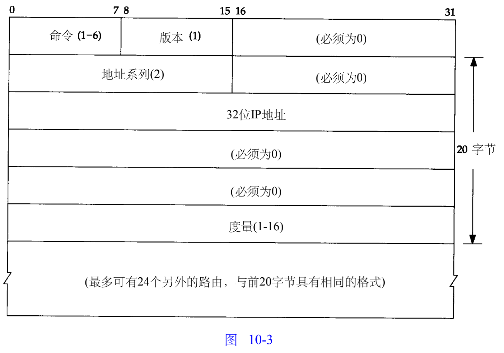

##### 10.2 动态路由选路

相邻路由器之间进行通信，以告知对方每个路由器当前所连接的网络，这时就出现了动态选路。路由守护程序根据它从相邻路由器接收到的信息，更新内核中的路由表。
 Internet是以一组自治系统的方式组织的，每个自治系统通常由单个实体管理。常常将一个公司或大学校园定义为一个自治系统。 每个自治系统可以选择该自治系统中各个路由器之间的选路协议。这种协议我们称之为内部网关协议IGP。最常用的I G P是选路信息协议 R I P。外部网关协议E G P（Exterier Gateway Protocol）或域内选路协议的分隔选路协议用于不同自治系统之间的路由器

##### 10.3 Unix选路守护程序

U n i x系统上常常运行名为r o u t e d路由守护程序。几乎在所有的 T C P / I P实现中都提供该程序。该程序只使用R I P进行通信。

##### 10.4 RIP:选路信息协议

###### 10.4.1 报文格式

RIP报文格式

命令字段为：1请求，2应答，3和4舍弃；非正式的命令：轮询（ 5）、轮询表项（ 6）。