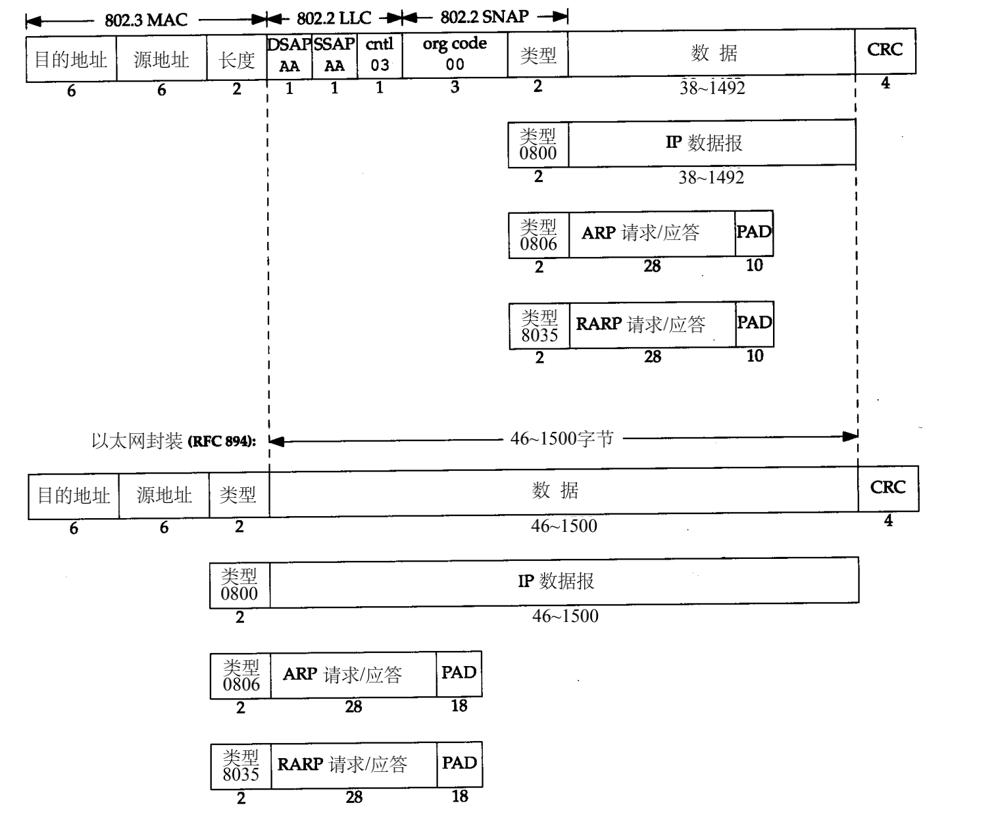
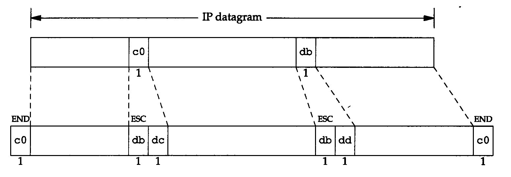
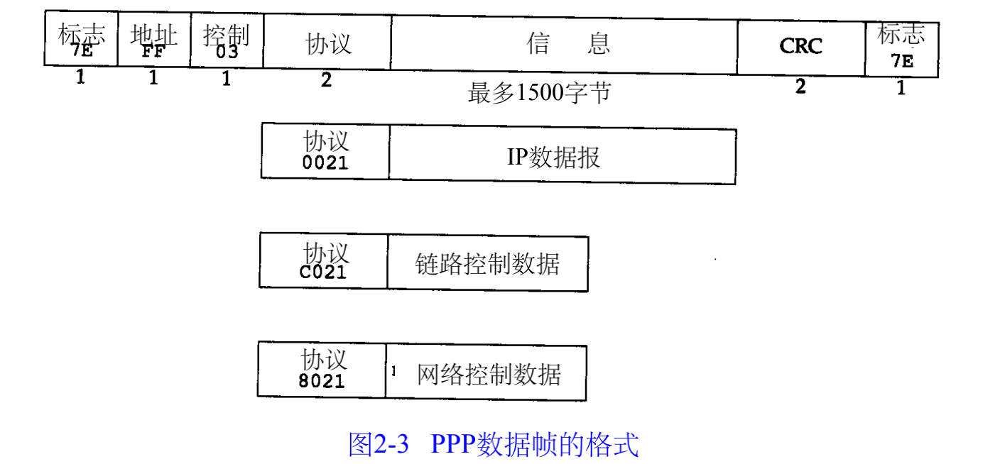
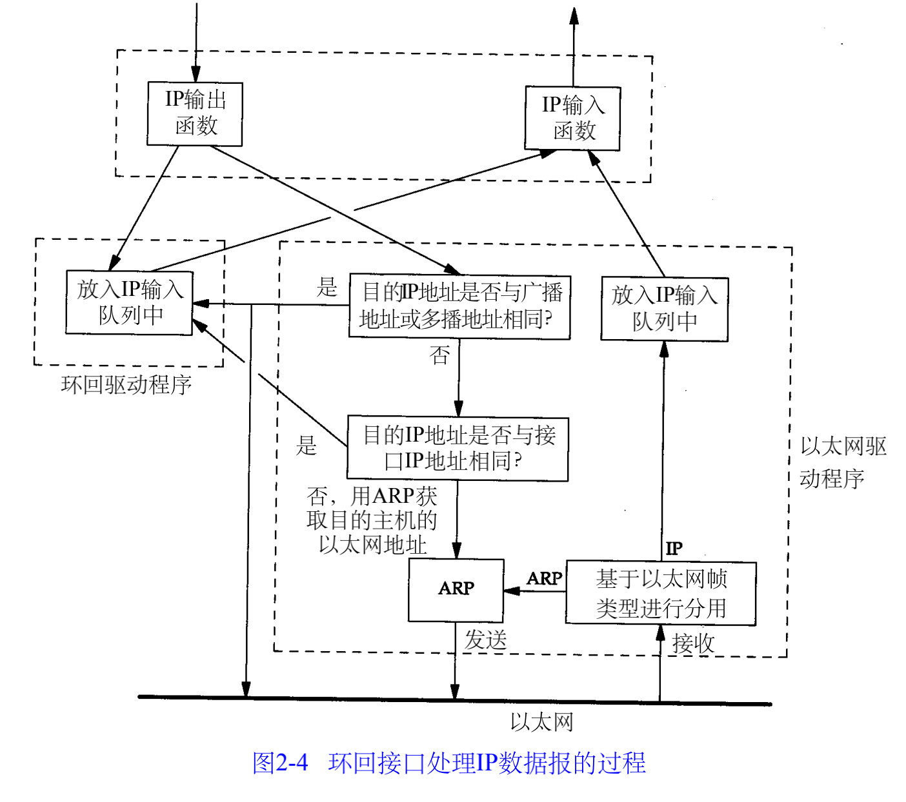

##### 1.1 链路层的作用

链路层主要有三个目的：

+ 为I P模块发送和接收I P数据报；
+ 为A R P模块发送A R P请求和接收A R P应答；
+ 为R A R P发送R A R P请求和接收R A R P应答

##### 2.2 以太网和IEEE 802 封装

以太网是当今 T C P / I P采用的主要的局域网技术。它采用一种称作 C S M A / C D的媒体接入方法，其意思是带冲突检测的载波侦听多路接入（Carrier Sense, Multiple Access with Collision Detection）。它的速率为10 Mb/s，地址为48 bit。

在T C P / I P世界中，以太网I P数据报的封装是在RFC 894[Hornig 1984]中定义的，IEEE 802网络的I P数据报封装是在RFC 1042[Postel and Reynolds 1988]中定义的。主机需求R F C要求每台I n t e r n e t主机都与一个10 Mb/s的以太网电缆相连接：

1) 必须能发送和接收采用RFC 894（以太网）封装格式的分组。

2) 应该能接收与RFC 894混合的RFC 1042（IEEE 802）封装格式的分组。

3) 也许能够发送采用RFC 1042格式封装的分组

两种帧格式都采用48 bit（6字节）的目的地址和源地址。A R P和R A R P协议对32 bit的I P地址和48 bit的硬件地址进行映射。

接下来的2个字节在两种帧格式中互不相同。在 8 0 2标准定义的帧格式中，长度字段是指它后续数据的字节长度，但不包括 C R C检验码。而在 8 0 2帧格式中，跟随在后面的是 3字节的802.2 LLC和5字节的802.2 SNAP。目的服务访问点（ Destination Service Access Point,D S A P）和源服务访问点（Source Service Access Point, SSAP）的值都设为0 x a a。Ct r l字段的值设为3。随后的3个字节o rg code都置为0

以太网帧格式中，类型字段之后就是数据。C R C字段用于帧内后续字节差错的循环冗余码检验（检验和）（它也被称为F C S或帧检验序列）。

##### 2.3 尾部封装

RFC 893[Leffler and Karels 1984]描述了另一种用于以太网的封装格式，称作尾部封装（trailer encapsulation）。

##### 2.4  SLIP：串行线路IP

S L I P的全称是Serial Line IP。它是一种在串行线路上对 I P数据报进行封装的简单形式。

S L I P协议定义的帧格式：

1.  IP数据报以一个称作 E N D（0 x c 0）的特殊字符结束。
2.  如果I P报文中某个字符为 E N D，那么就要连续传输两个字节 0 x d b和0 x d c来取代它。0 x d b这个特殊字符被称作S L I P的E S C字符，但是它的值与A S C I I码的E S C字符（0 x 1 b）不同。
3. 如果I P报文中某个字符为 S L I P的E S C字符，那么就要连续传输两个字节 0 x d b和0 x d d来取代它。

##### 2.5 压缩的SLIP

##### 2.6 ppp: 点对点协议

P P P，点对点协议修改了S L I P协议中的所有缺陷。P P P包括以下三个部分：

+ 在串行链路上封装 I P数据报的方法。 P P P既支持数据为 8位和无奇偶检验的异步模式
+  建立、配置及测试数据链路的链路控制协议（ L C P：Link Control Protocol）。
+ 针对不同网络层协议的网络控制协议（ N C P：Network Control Protocol）体系。当前R F C定义的网络层有I P、O S I网络层、D E C n e t以及A p p l e Ta l k。例如，IP NCP允许双方商定是否对报文首部进行压缩，类似于 C S L I P

C R C字段（或F C S，帧检验序列）是一个循环冗余检验码，以检测数据帧中的错误。

由于标志字符的值是 0 x 7 e，因此当该字符出现在信息字段中时， P P P需要对它进行转义

##### 2.7 环回接口

以允许运行在同一台主机上的客户程序和服务器程序通过 T C P / I P进行通信。A类网络号1 2 7就是为环回接口预留的。根据惯例，大多数系统把I P地址1 2 7 . 0 . 0 . 1分配给这个接口，并命名为 l o c a l h o s t

1) 传给环回地址（一般是1 2 7 . 0 . 0 . 1）的任何数据均作为I P输入。

2) 传给广播地址或多播地址的数据报复制一份传给环回接口，然后送到以太网上。这是因为广播传送和多播传送的定义（第 1 2章）包含主机本身。

3. 任何传给该主机I P地址的数据均送到环回接口。

##### 2.8 最大传输单元

以太网和8 0 2 . 3对数据帧的长度都有一个限制，其最大值分别是1 5 0 0和1 4 9 2字节。链路层的这个特性称作M T U，最大传输单元。

I P层有一个数据报要传，而且数据的长度比链路层的 M T U还大，那么 I P层就需要进行分片（ f r a g m e n t a t i o n），把数据报分成若干片，这样每一片都小于 M T U

##### 2.9 路径MTU

两台主机之间的通信要通过多个网络，那么每个网络的链路层就可能有不同的 M T U。重要的不是两台主机所在网络的 M T U的值，重要的是两台通信主机路径中的最小 M T U。它被称作路径M T U

##### 2.10 串行线路吞吐量计算