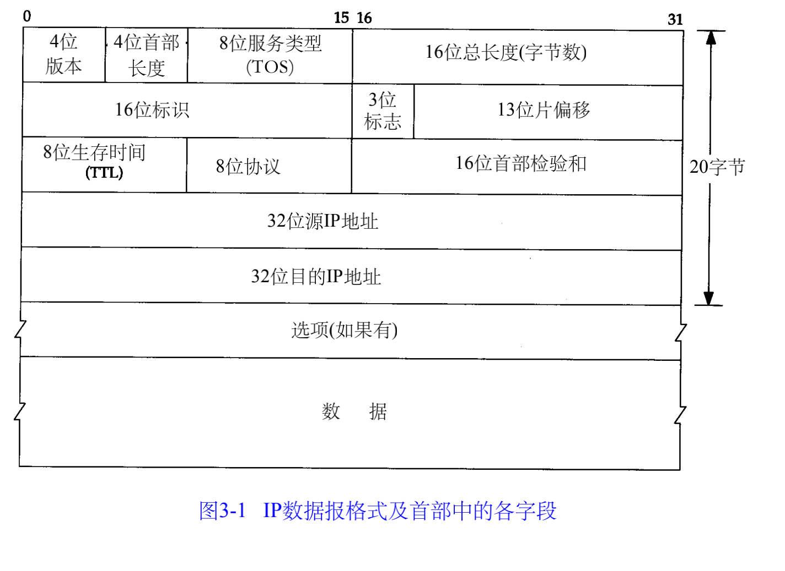
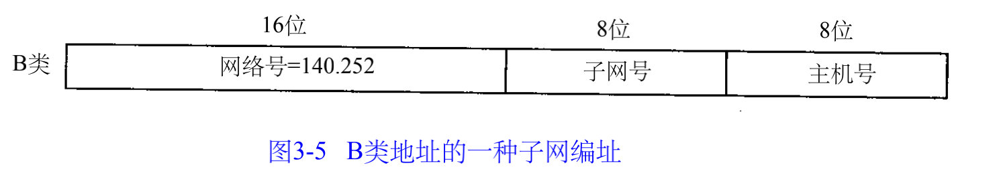
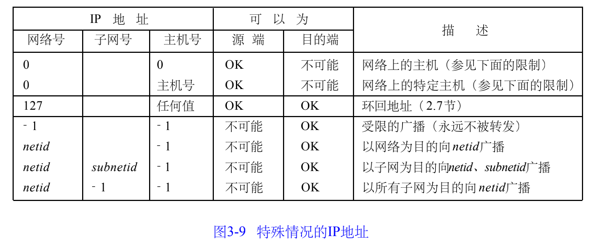

##### 3.1 

I P是T C P / I P协议族中最为核心的协议。所有的 T C P、U D P、I C M P及I G M P数据都以I P数据报格式传输。

不可靠（u n r e l i a b l e）的意思是它不能保证 I P数据报能成功地到达目的地。

无连接（c o n n e c t i o n l e s s）这个术语的意思是 I P并不维护任何关于后续数据报的状态信息。

##### 3.2 IP首部

4个字节的32 bit值以下面的次序传输：首先是 0～7 bit，其次8～15 bit，然后1 6～23 bit，最后是24~31 bit。这种传输次序称作big endian字节序。由于T C P / I P首部中所有的二进制整数在网络中传输时都要求以这种次序，因此它又称作网络字节序。

协议版本号是4，因此I P有时也称作IPv4。

首部长度指的是首部占 32 bit字的数目，包括任何选项，4bit字段，首部最长60个字节。

服务类型（TOS）字段包括一个3 bit的优先权子字段（现在已被忽略），4 bit的TOS子字段和1 bit未用位但必须置0。4 bit的TO S分别代表：最小时延、最大吞吐量、最高可靠性和最小费用。4 bit中只能置其中1 bit。如果所有4 bit均为0，那么就意味着是一般服务。

总长度字段是指整个 I P数据报的长度，以字节为单位。利用首部长度字段和总长度字段，就可以知道 I P数据报中数据内容的起始位置和长度。由于该字段长 1 6比特，所以 I P数据报最长可达 65535字节。

总长度字段是 I P首部中必要的内容，因为一些数据链路（如以太网）需要填充一些数据以达到最小长度。

标识字段唯一地标识主机发送的每一份数据报。通常每发送一份报文它的值就会加 1

T T L（t i m e - t o - l i v e）生存时间字段设置了数据报可以经过的最多路由器数。

##### 3.3 路由选择

如果目的主机与源主机直接相连（如点对点链路）或都在一个共享网络上（以太网或令牌环网），那么I P数据报就直接送到目的主机上。否则，主机把数据报发往一默认的路由器上，由路由器来转发该数据报。
IP层在内存中有一个路由表。当数据报来自某个网络接口时，I P首先检查目的I P地址是否为本机的I P地址之一或者I P广播地址。如果确实是这样，数据报就被送到由 I P首部协议字段所指定的协议模块进行处理。如果数据报的目的不是这些地址。那么（ 1）如果I P层被设置为路由器的功能，那么就对数据报进行转发（也就是说，像下面对待发出的数据报一样处理）；否则（ 2）数据报被丢弃

###### 路由表的内容：

+ 目标ip地址
+ 下一跳路由器的ip地址，或有直接连接的网络ip
+ 标志。一个标志指明目的ip地址是网络地址还是主机地址。另一个标志指明下一跳是否为真正的下一跳是路由器还是直连网络
+ 为数据报的传输指定一个网络接口

IP路由选择是逐跳（hop by hop）进行的。IP并不知完整路径。所有的I P路由选择只为数据报传输提供下一站路由器的 I P地址。

###### IP路由选择的功能

1. 搜索路由表，找到与目的ip地址匹配的表目
2. 搜索路由表，寻找能与目的网络号相匹配的表目
3. 搜索路由表，寻找标为“默认（ default）”的表目。如果找到，则把报文发送给该表目指定的下一站路由器

如果上面这些步骤都没有成功，那么该数据报就不能被传送。

先匹配主机ip地址，在匹配网络号。都失败后才选择默认路由。为一个网络指定一个路由器

##### 3.4 子网寻址

##### 3.5 子网掩码

​	

这个掩码是一个 32 bit的值，其中值为 1的比特留给网络号和子网号，为0的比特留给主机号。

我们的主机地址是 140.252.1.1（一个B类地址），而子网掩码为255.255.255.0（其中8bit为子网号，8bit为主机号）。

• 如果目的IP地址是140.252.4.5，那么我们就知道 B类网络号是相同的（ 140.252），但是子网号是不同的（1和4）。用子网掩码在两个I P地址之间的比较如图3 - 8所示。

• 如果目的I P地址是140.252.1.22，那么B类网络号还是一样的（ 140.252），而且子网号也是一样的（1），但是主机号是不同的。

• 如果目的I P地址是192.43.235.6（一个C类地址），那么网络号是不同的，因而进一步的比较就不用再进行了

##### 3.6 特殊情况的ip地址

##### 3.8 ifconfig

##### 3.9 netstat
