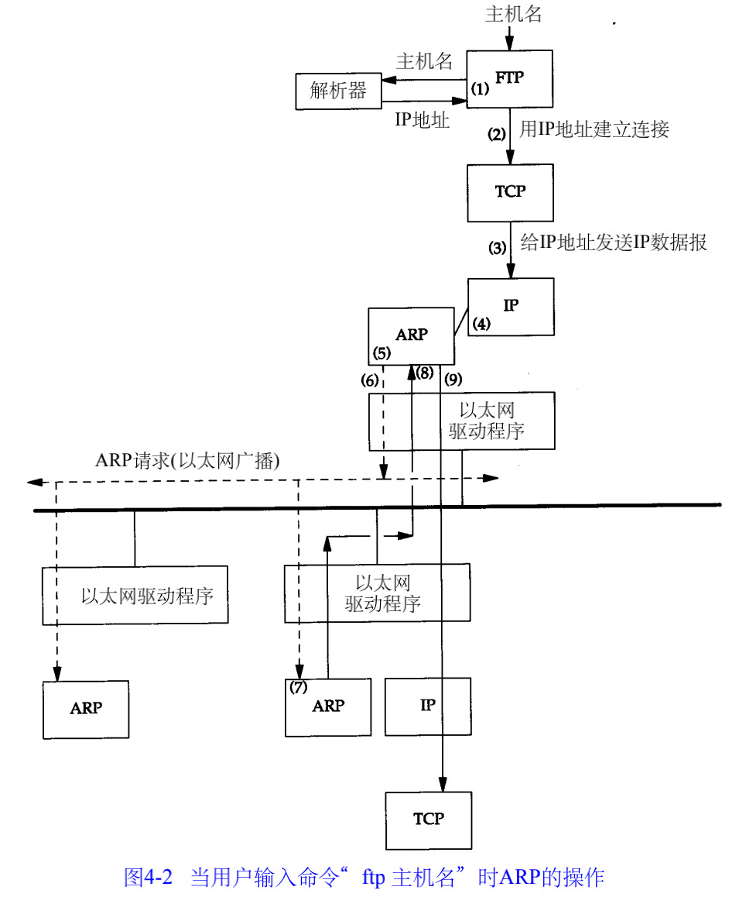
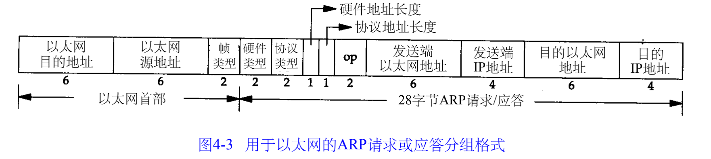
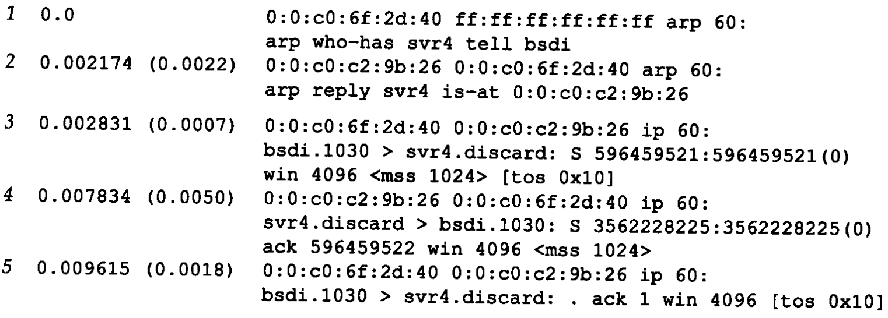
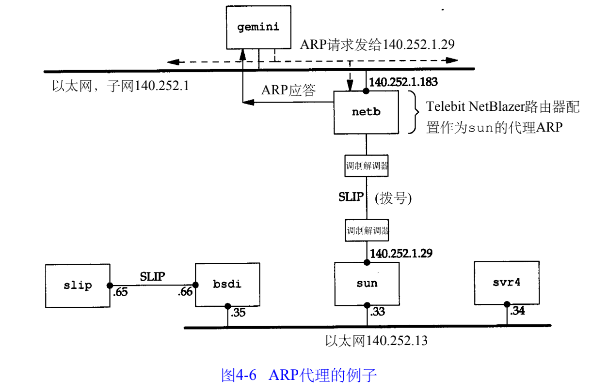

##### 4.1 引言

A R P为I P地址到对应的硬件地址之间提供动态映射。

##### 4.2 例子

```
ftp bsdi
```

- 应用程序FTP客户端调用函数g e t h o s t b y n a m e(3)把主机名（bsdi）转换成32 bit的IP地址。这个函数在D N S（域名系统）中称作解析器，在较小网络中使用一个静态的主机文件（/e t c / h o s t s）
- F T P客户端请求T C P用得到的I P地址建立连接
- T C P发送一个连接请求分段到远端的主机，即用上述 I P地址发送一份 I P数据报
- 如果目的主机在本地网络上,那么I P数据报可以直接送到目的主机上.目的主机在一个远程网络上，那么就通过 I P选路函数来确定位于本地网络上的下一站路由器地址，并让它转发 I P数据报
- 假定是一个以太网，那么发送端主机必须把 32 bit的I P地址变换成48 bit的以太网地址。从逻辑I n t e r n e t地址到对应的物理硬件地址需要进行翻译。这就是 A R P的功能
- A R P发送一份称作 A R P请求的以太网数据帧给以太网上的每个主机。这个过程称作广播
  
- 目的主机的A R P层收到这份广播报文后，识别出这是发送端在寻问它的 I P地址，于是发送一个A R P应答。
- 收到A R P应答后，使A R P进行请求—应答交换的I P数据报现在就可以传送了。
- 发送I P数据报到目的主机。

在A R P背后有一个基本概念，那就是网络接口有一个硬件地址（一个 48 bit的值，标识不同的以太网或令牌环网络接口）。

在硬件层次上进行的数据帧交换必须有正确的接口地址。但是，T C P / I P有自己的地址：32 bit的I P地址。内核（如以太网驱动程序）必须知道目的端的硬件地址才能发送数据。 A R P的功能是在32 bit的I P地址和采用不同网络技术的硬件地址之间提供动态映射。

##### 4.3 ARP高速缓存

ARP高速缓存。这个高速缓存存放了最近I n t e r n e t地址到硬件地址之间的映射记录。

##### 4.4 ARP的分组格式



以太网报头中的前两个字段是以太网的源地址和目的地址。目的地址为全 1的特殊地址是广播地址。电缆上的所有以太网接口都要接收广播的数据帧 。
两个字节长的以太网帧类型表示后面数据的类型
硬件类型字段表示硬件地址的类型。它的值为 1即表示以太网地址。协议类型字段表示要映射的协议地址类型。它的值为 0 x 0 8 0 0即表示I P地址。它的值与包含 I P数据报的以太网数据帧中的类型字段的值相同
硬件地址长度和协议地址长度分别指出硬件地址和协议地址的长度，以字节为单位。对于以太网上 I P地址的A R P请求或应答来说，它们的值分别为 6和4
操作字段指出四种操作类型，它们是 A R P请求（1）、A R P应答（2）、R A R P请求（3）和R A R P应答（4）这个字段必需的，因为 A R P请求和A R P应答的帧类型字段值是相同的

##### 4.5 ARP举例

tcpdump

#####   

源端主机（b s d i）的硬件地址是0 : 0 : c 0 : 6 f : 2 d : 4 0。目的端主机的硬件地址是ff : ff : ff : ff : ff : ff，这是一个以太网广播地址。电缆上的每个以太网接口都要接收这个数据帧并对它进行处理
每行中，单词 a r p或i p后面的值6 0指的是以太网数据帧的长度。A R P请求或回答的数据帧长都是4 2字节，因此，每一帧都必须加入填充字符以达到以太网的最小长度要求： 60字节输出字段 arp who-has表示作为A R P请求的这个数据帧中，目的 I P地址是s v r 4的地址，发送端的 I P地址是b s d i的地址
第3行是第一个请求建立连接的 T C P段。它的目的硬件地址是目的主机 (s v r 4)。
在每一行中，行号后面的数字表示 t c p d u m p收到分组的时间（以秒为单位）。

###### ARP高速缓存超时设置

表项设置超时值为2 0分钟，而对不完整的表项设置超时值为 3分钟

##### 4.6 ARP代理

如果A R P请求是从一个网络的主机发往另一个网络上的主机，那么连接这两个网络的路由器就可以回答该请求，这个过程称作委托 A R P或A R P代理(Proxy ARP)。



  

##### 4.7 免费ARP

它是指主机发送A R P查找自己的I P地址