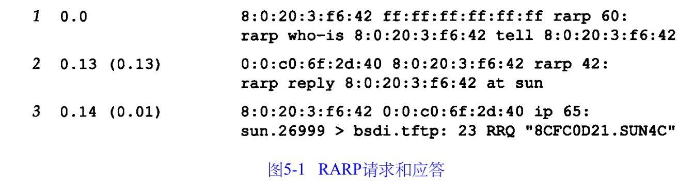

##### 5.1 引言

**无盘系统**是用于[网吧](https://baike.baidu.com/item/网吧)，[卡拉OK](https://baike.baidu.com/item/卡拉OK)，办公室的一种[网络传输技术](https://baike.baidu.com/item/网络传输技术)。使用无盘系统的计算机将不使用本机的硬盘获得启动系统，而是通过网络的指定服务器去获得启动系统的镜像，并下载回本机后用于机器启动。同时也不需要使用传统[硬盘](https://baike.baidu.com/item/硬盘)读取资料，而是通过局域网内的[服务器](https://baike.baidu.com/item/服务器)读取资料

无盘系统的R A R P实现过程是从接口卡上读取唯一的硬件地址，然后发送一份 R A R P请求（一帧在网络上广播的数据），请求某个主机响应该无盘系统的 I P地址（在R A R P应答中）。

##### 5.2 RAPR的分组格式

R A R P分组的格式与A R P分组基本一致（见图 4 - 3）。它们之间主要的差别是 R A R P请求或应答的帧类型代码为0 x 8 0 3 5，而且R A R P请求的操作代码为3，应答操作代码为4。对应于A R P，R A R P请求以广播方式传送，而R A R P应答一般是单播( u n i c a s t )传送的。

##### 5.4 RARP服务器的设计

R A R P服务器的复杂性在于，服务器一般要为多个主机（网络上所有的无盘系统）提供硬件地址到I P地址的映射。该映射包含在一个磁盘文件中（在 U n i x系统中一般位于/ e t c / e t h e r s目录中）。由于内核一般不读取和分析磁盘文件，因此 R A R P服务器的功能就由用户进程来提供。

R A R P请求是作为一个特殊类型的以太网数据帧来传送的（帧类型字段值为0 x 8 0 3 5，如图2 - 1所示）。这说明R A R P服务器必须能够发送和接收这种类型的以太网数据帧。在附录A中，我们描述了 B S D分组过滤器、 S u n的网络接口栓以及 S V R 4数据链路提供者接口都可用来接收这些数据帧。