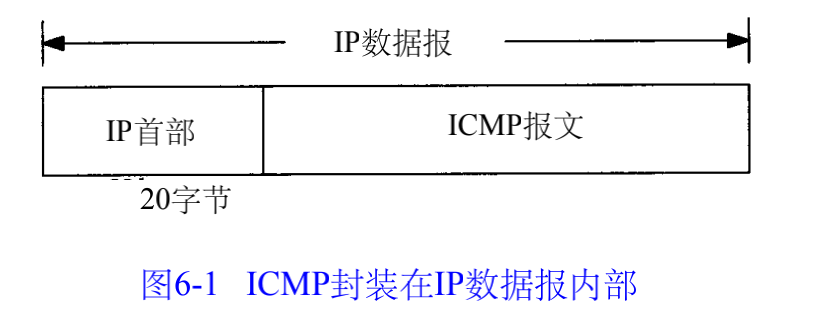
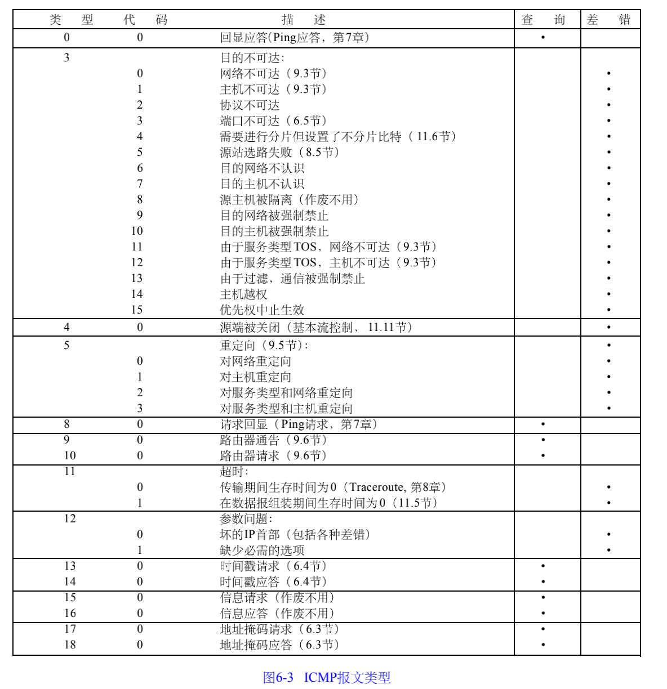
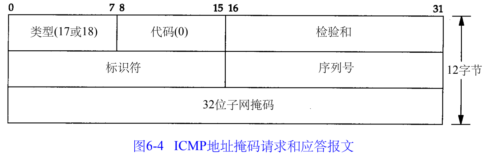

##### 6.1 引言

ICMP（Internet Control Message Protocol）Internet控制[报文](https://baike.baidu.com/item/报文/3164352)协议。它是[TCP/IP协议簇](https://baike.baidu.com/item/TCP%2FIP协议簇)的一个子协议，用于在IP[主机](https://baike.baidu.com/item/主机/455151)、[路由](https://baike.baidu.com/item/路由)器之间传递控制消息。控制消息是指[网络通](https://baike.baidu.com/item/网络通)不通、[主机](https://baike.baidu.com/item/主机/455151)是否可达、[路由](https://baike.baidu.com/item/路由/363497)是否可用等网络本身的消息。这些控制消息虽然并不传输用户数据，但是对于用户数据的传递起着重要的作用。

ICMP使用IP的基本支持，就像它是一个更高级别的协议，但是，ICMP实际上是IP的一个组成部分，必须由每个IP模块实现。

##### 6.2 ICMP报文的类型

最后两列表明 I C M P报文是一份查询报文还是一份差错报文。

1) ICMP差错报文（但是，I C M P查询报文可能会产生I C M P差错报文）。

2) 目的地址是广播地址（见图 3 - 9）或多播地址（D类地址，见图1 - 5）的I P数据报。

3) 作为链路层广播的数据报。

4) 不是I P分片的第一片（将在11 . 5节介绍分片）。

5) 源地址不是单个主机的数据报。这就是说，源地址不能为零地址、环回地址、广播地

址或多播地址。

##### 6.3 ICMP地址掩码请求与应答

ICMP地址掩码请求用于无盘系统在引导过程中获取自己的子网掩码。

I C M P报文中的标识符和序列号字段由发送端任意选择设定，这些值在应答中将被返回

##### 6.4 ICMP时间戳请求与应答

ICMP时间戳请求允许系统向另一个系统查询当前的时间。

##### 6.5 ICMP端口不可达错误

