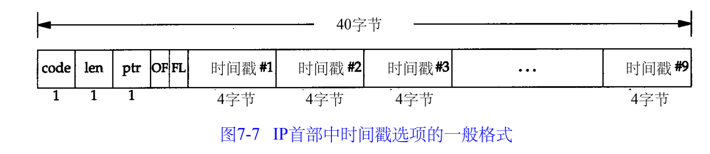

##### 7.1 引言

Ping该程序发送一份 ICMP回显请求报文给主机，并等待返回 ICMP回显应答

##### 7.2  ping程序

发送回显请求的 p i n g程序为客户，而称被 p i n g的主机为服务器。大多数的 T C P / I P实现都在内核中直接支持 P i n g服务器

U n i x系统在实现p i n g程序时是把I C M P报文中的标识符字段置成发送进程的 I D号。这样即使在同一台主机上同时运行了多个 p i n g程序实例，p i n g程序也可以识别出返回的信息。

序列号从0开始，每发送一次新的回显请求就加 1。p i n g程序打印出返回的每个分组的序列号，允许我们查看是否有分组丢失、失序或重复。 I P是一种最好的数据报传递服务，因此这三个条件都有可能发生。

###### 7.2.1  LAN输出

回显应答是以发送的次序返回的。p i n g程序通过在I C M P报文数据中存放发送请求的时间值来计算往返时间。当应答返回时，用当前时间减去存放在 I C M P报文中的时间值，即是往返时间。

输出的第一行包括目的主机的 I P地址

###### 7.2.2 WAN输出

回显请求或回显应答在某个地方丢失。广域网还有可能看到重复的分组。

###### 7.2.3 线路SLIP链路

###### 7.2.4 拨号SLIP链路

链路的两端增加了调制解调器，调制解调器带来了时延。随着数据的压缩，分组长度可能会减小，但是由于使用了错误控制协议，分组长度又可能会增加。

##### 7.3 IP记录路由选项

这样，每个处理该数据报的路由器都把它的I P地址放入选项字段中。当数据报到达目的端时， I P地址清单应该复制到 I C M P回显应答中，这样返回途中所经过的路由器地址也被加入清单中。
由于I P首部固定长度为 2 0字节，R R选项用去3个字节，这样只剩下3 7个字节来存放 I P地址清单，也就是说只能存放 9个I P地址

code是一个字节，指明 I P选项的类型。对于RR选项来说，它的值为 7。len是R R选项总字节长度，在这种情况下为 39。ptr称作指针字段。它是一个基于 1的指针，指向存放下一个 I P地址的位置。它的最小值为4，指向存放第一个 I P地址的位置。随着每个 IP地址存入清单， ptr的值分别为8，12，16，最大到3 6。当记录下9个I P地址后，p t r的值为4 0，表示清单已满。

##### 7.4 时间戳选项

时间戳选项的代码为 0x44。 len和ptr与记录路由选项相同：选项的总长度（一般为3 6或4 0）和指向下一个可用空间的指针。O F表示溢出字段，F L表示标志字段。

​		

