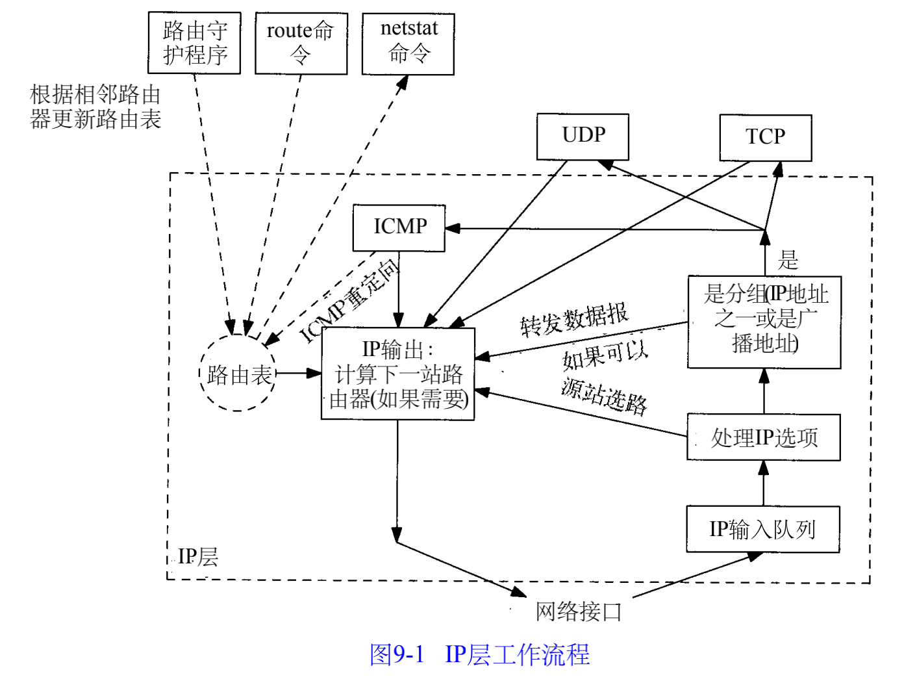
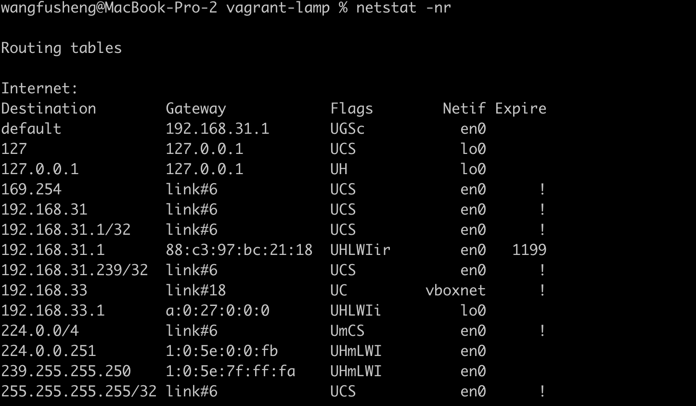

##### 9.1 引言

##### 9.2 选路的原理

Destination表示目的地

| flag | 描述                                                         |
| ---- | ------------------------------------------------------------ |
| U    | 路由可用                                                     |
| G    | 路由是个网关                                                 |
| H    | 该路由是到一个主机，也就是说，目的地址是一个完整的主机地址。如果没有设置该标志，说明该路由是到一个网络，而目的地址是一个网络地址：一个网络号，或者网络号与子网号的组合 |
| D    | 该路由是由重定向报文创建的                                   |
| M    | 该路由已被重定向报文修改                                     |

Refcnt（Reference count）列表正在使用路由的活动进程个数。面向连接的协议如T C P在建立连接时要固定路由

u s e表通过该路由发送的分组数

###### 9.2.2 初始哈路由表

系统引导时显式地在初始化文件中运行 route命令。

##### 9.3 ICMP主机与网络不可达差错

当路由器收到一份I P数据报但又不能转发时，就要发送一份 I C M P“主机不可达”差错报文

##### 9.4 转发或不转发

系统都有一个内核变量 ipforwarding，只有在该变量值不为0的情况下才转发数据报

##### 9.5 ICMP重定向差错

当I P数据报应该被发送到另一个路由器时，收到数据报的路由器就要发送 I C M P重定向差错报文给I P数据报的发送端

##### 9.6 ICMP路由器发现报文

