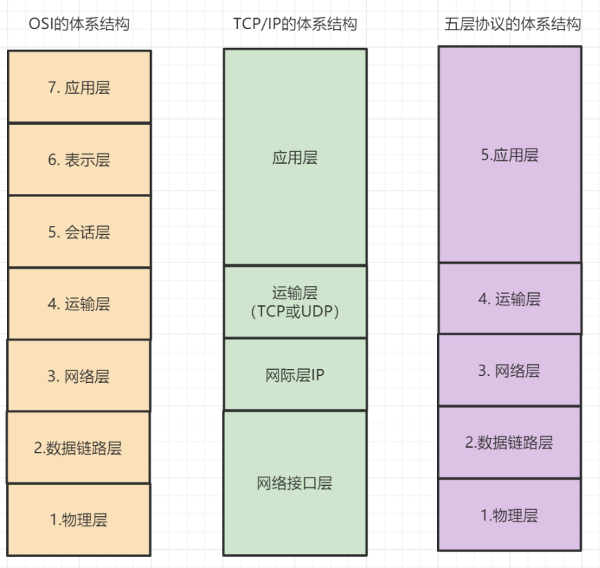
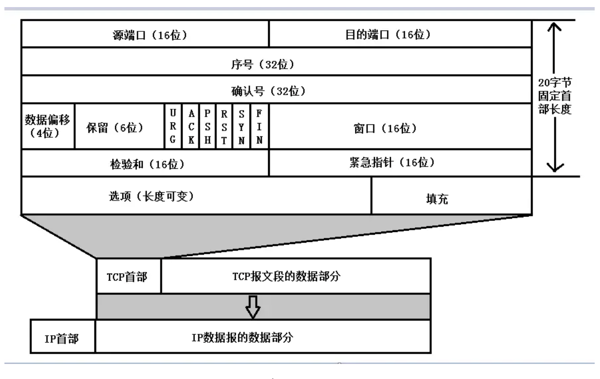
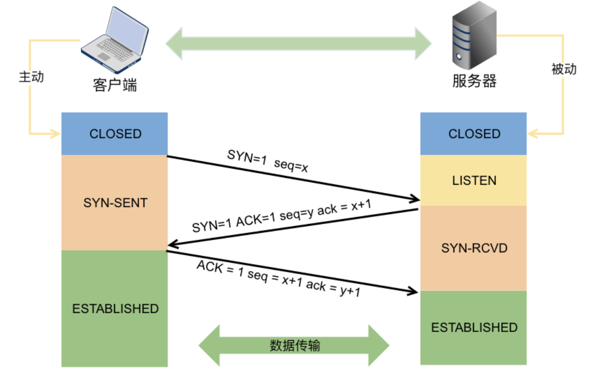

## 计算机网络分层

#### 

+ 应用层： 用户程序之间的交互
+ 表示层：数据的表示、安全、压缩
+ 会话层：建立通信连接，保持通信，决定通信何时中断
+ 传输层：两台主机进程之间的通信提供数据传输服务
+ 网络层：选择合适的网间路由和交换结点，确保数据及时送达。常见的协议有IP协议
+ 数据链路层：物理层提供比特流服务的基础上，建立相邻结点之间的数据链路，通过差错控制提供数据帧（Frame）在信道上无差错的传输，并进行各电路上的动作系列
+ 物理层：计算机结点之间比特流的透明传输，并尽量屏蔽掉具体传输介质和物理设备的差异


## DNS相关

### 1.什么是dns

DNS 是域名系统(Domain Name System，缩写：DNS)是互联网的一项服务。它将域名和IP地址相互映射的一个分布式数据库，在数据库中保存域名与IP的对照关系。

### 2.dns解析过程

1. 用户请求通过浏览器输入要访问网站的地址。浏览器会在自己的缓存中查找URL对应IP地址。没有执行第二步
2. 通过计算机本地的Host文件配置。没有进入第三步
3. 请求本地域名服务器，通过本地运营商获取URL和IP的映射关系。没有进入第四步
4. 通过顶级域名服务器进行解析，顶级域名服务器会根据请求的URL 返回给本地域名服务器的顶级域名服务器的地址
5. 返回顶级域名服务器的地址以后，进行访问，并且返回Name Server服务器地址。这个Name Server就是网站注册的域名服务器，上面包含了网站URL和IP的对应信息
6. Name Server会把指定域名的A记录或者CNAME返回给本地域名服务器，并且设置一个过期时间
7. 如果此时获取的是A记录，那么就可以直接访问网站的IP了。但是通常来说大型的网站都会返回CNAME

```
参考文章：https://network.51cto.com/art/202003/613009.htm
```


## HTTP相关

### 1.什么是HTTP

HTTP 是超文本传输协议，也就是**H**yperText **T**ransfer **P**rotocol。
“超文本”，连接单个网站内或多个网站间的网页的链接。
传输，用于传输。
协议就是标准、规范。

### 2.状态码

|      | 含义                                             | 常见的状态吗       |
| ---- | ------------------------------------------------ | ------------------ |
| 1xx  | 提示，表目前是协议处理的中间状态，还有或许操作   |                    |
| 2xx  | 成功，报文已经被正确处理                         | 200，204，206      |
| 3xx  | 重定向，资源位置发生变动，需要客户端重新发送请求 | 301，302，303，304 |
| 4xx  | 客户端报文错误，请求报文有误，服务器无法处理     | 400，403，404      |
| 5xx  | 服务器内部错误                                   | 500，501，502，503 |

### 3.HTTP 常见字段

+ content-Length： 表明本次请求响应的数据长度
+ connection：常用于客户端要求服务器使用 TCP 持久连接，以便其他请求复用，即keep-alive
+ content-type：数据格式
+ Content-Encoding：数据的压缩方法

### 4.请求方法get和post

1. `Get` 方法的含义是请求**从服务器获取资源**

2. `POST` 方法则是相反操作，它向 `URI` 指定的资源提交数据，数据就放在报文的 body 里

### 5.HTTP的特性

+ 无状态。不会记录请求的状态。前后两次的请求都是互不影响的。
+ 明文传输。裸奔
+ 无法证明报文完整性。
+ 不校验通信方身份。

### 6.session、cookie、token和jwt

#### cookie

1. 什么是cookie

   服务端在客户端第一次请求时会生成JSESSIONID(一种特殊的cookie)，然后向客户端颁发；通过报文set-cookie通知客户端浏览器保存cookie。下一次请求网站将携带cookie一通交给服务器。服务器通过检查cookie辨认用户的状态户权限

2. 生命周期
   会话cookie：不设置过期时间，cookie会保存在内存，关闭浏览器后被清除。
   持久化cookie：设置了过期时间，cookie会保存在硬盘，被多个浏览器进程共享。比如两个google窗口共享

3. cookie的不可跨域名性

#### session

1. session的创建

   Session对象是在客户端第一次请求服务器的时候在服务端创建的

2. session的生命周期

   session保存在内存中；可以设置超时时间。

#### 分布式session解决方案

多台服务器进行负载均衡，但是不同服务器之间的session并不是共享的，会造成session的不一致。

一般使用基于redis存储的session方案：将session复制到redis中；但是会多走一次网络。

#### token

1. 什么是token？

   令牌，是访问资源的凭证。

2. token认证过程

   - 客户端通过指定api发送用户名和密码到服务器。
   - 服务端校验用户名和密码，通过则生成一个加密过的token字符串，返回给浏览器
   - 客户端保存token，下一次请求时带上token给服务端

#### jwt

1. 什么是jwt

   jwt，json web token的缩写。它将用户信息加密到token里，服务器不保存任何用户信息。服务器通过使用保存的密钥验证token的正确性，只要正确即通过验证。

2. jwt的组成

   JWT是由三段信息构成的，将这三段信息文本用`.`链接一起就构成了Jwt字符串

   - header(请求头)声明信息。其中typ代表token的类型，这里是jwt；alg表示使用的hash算法

     ```json
     {
       'typ': 'JWT',
       'alg': 'HS256'
     }
     //将头部进行base64加密
     eyJ0eXAiOiJKV1QiLCJhbGciOiJIUzI1NiJ9
     ```

   - Payload载荷。它存放一些有效信息的地方。

     ```
     {
       "sub": "1234567890",
       "name": "John Doe",
       "admin": true
     }
     //base64加密
     eyJzdWIiOiIxMjM0NTY3ODkwIiwibmFtZSI6IkpvaG4gRG9lIiwiYWRtaW4iOnRydWV9
     ```

   - Signature(签名)。检验信息是否被修改。它由header(base64处理）、payload(base64处理)、sercret组成

     header(base64处理）、payload(base64处理)通过.拼接然后用header中声明的加密方式进行加盐secret组合加密；三段加密过的信息在通过.拼接起来

3. 使用过程

   1. 在请求头加入Authorization，并加上bearer标注：

      ```
      fetch('api/user/1', {
        headers: {
          'Authorization': 'Bearer ' + token
        }
      })
      ```

   2. 服务器验证token通过，生成jwt和公钥，返回jwt

   3. 客户端发送请求时在头部的Authorization字段发送jwt

   4. 服务端收到jwt，校验jwt，从jwt里面获取用户信息

```
参考文章：https://www.jianshu.com/p/576dbf44b2ae
```


### 7.HTTPS

1.什么是HTTPS
	HTTPS在HTTP和tcp之间加了一层 ssl/tls。HTTPS 协议需要向 CA（证书权威机构）申请数字证书，来保证服务器的身份是可信的

2. HTTPS混合加密
   - 在通信建立前采用**非对称加密**的方式交换「会话秘钥」，后续就不再使用非对称加密。
   - 在通信过程中全部使用**对称加密**的「会话秘钥」的方式加密明文数据。
   
3. 什么是非对称加密

   非对称加密就是加密和解密使用的不是相同的密钥：只有同一个公钥-私钥对才能正常加解密。

4. 什么是数字证书

   第三方权威机构 `CA` （数字证书认证机构）可以发布数字证书。将**服务器公钥放在数字证书**中，只要证书是可信的，公钥就是可信的。

5. SSL/TLS协议基本流程

   - 客户端向服务端索要并验证服务器的公钥
   - 双方协商生成会话密钥
   - 双方采用会话秘钥进行加密通信


## HTTP2.0的特性

#### 头部压缩

**压缩头**（Header）如果你同时发出多个请求，他们的头是一样的或是相似的，那么，协议会帮你**消除重复的部分**

#### 二进制格式

头信息和数据体都是二进制，并且统称为帧（frame）

#### 数据流

数据包不是按顺序发送的，同一个连接里面连续的数据包，可能属于不同的回应。因此，必须要对数据包做标记，指出它属于哪个回应

#### 多路复用

**一个连接中并发多个请求或回应，而不用按照顺序一一对应**

#### *服务器推送*

也可以**主动**向客户端发送消息


## TCP/IP

#### 什么是socket

1. socket在应用层和tcp/ip之间的中间层。它对tcp/ip协议进行封装，然后对用户层提供一组接口。在Linux中一切皆文件，Linux 会给每个文件分配一个 整数ID，被称为文件描述符。socket就是一种用于通信的特殊文件。socket也可以像访问普通文件来进行网络通信：用 read() 读取从远程计算机传来的数据；用 write() 向远程计算机写入数据

2. 网络通信的必要信息

   协议(tcp或udp)，本机ip，本机端口，远端ip，远端端口

3. 建立socket连接

   1. 建立连接需要一对socket，clientSocket和serverClient
   2. 建立连接的过程：服务器监听，客户端请求，连接确认

4. 和tcp/ip、http之间的关系

   tcp/ip只负责数据传输，http负责对数据的识别。如果无法识别数据，那么数据传输就没有意义。socket是tcp/ip和应用层的中间抽象层。它让程序员更方便使用tcp/ip协议

5. 总结：

   socket是个文件，用于通信。

   socket是tcp/ip和http的中间层。

#### 什么是tcp

1. 特点

   tcp是传输层协议，面向连接、可靠性、面向字节流

2. 什么叫面向连接

   连接是一系列信息，用于保证可靠性和流控制的信息，这些信息包括socket、序列号以及窗口大小。

   其中socket是由地址和端口组成，窗口用于流控制，序列号用于确定数据包的发送和接受。

   所以面向连接就是，建立连接的双方对这三种信息达成共识。

3. tcp的数据结构
   

   + **源端口(source port)**

   + **目标端口(destination port)**

   + **序列号(Sequence Number，seq)**

     本报文段所发送的数据的第一个字节的序号

   + **确认序列号(acknowledgement number，ack)**

     确认字节的序号

   + **数据偏移(offset)**

   + **tcp标记(tcp flags)**

     **ack**:仅当ACK = 1时确认号字段才有效，当ACK = 0时确认号无效; 

     **syn**:在连接建立时用来同步序号。当**SYN=1**而**ACK=0**时，表明这是一个**连接请求报文段**。对方若同意建立连接，则应在响应的报文段中使SYN=1和ACK=1

     **reset**：重新建立传输连接

     **fin**：释放一个连接

   + **窗口(window)**

     从本报文段首部中的确认号算起，接收方目前允许对方一次发送的数据量。也就是告诉发送方，我还可以接受多少字节的数据。

   总结：

   ​	tcp是面向字节流，意思就是按照字节传输，那么每个字节按顺序标号。

   ​	所以序列号seq标记了本tcp报文段发送的数据的第一个字节的序号。

   ​	确认ack则告诉发送方下一次发送的字节的序列号，等于这次接收的序列号最大值+1。

   ​	而窗口值则是告诉发送方，接收方还能接受多少数据。

   ​	还要有个信息(tcp flags)告诉双方，连接的状态以及下一步操作。

4. 三次握手的过程

    

   第一次握手(SYN=1, seq=x)，发送完毕后，客户端进入 SYN_SEND 状态

   第二次握手(SYN=1, ACK=1, seq=y, ACKnum=x+1)， 发送完毕后，服务器端进入 SYN_RCVD 状态。

   第三次握手(ACK=1，ACKnum=y+1)，发送完毕后，客户端进入 ESTABLISHED 状态，当服务器端接收到这个包时,也进入 ESTABLISHED 状态，TCP 握手，即可以开始数据传输

5. 为什么要三次握手

   两次握手只是确认客户端和服务端都有接收和发送的能力。

   通过三次握手才能阻止重复历史连接的初始化。

   通过三次握手才能对通信双方的初始序列号进行初始化。

6. 断开连接为什么要四次挥手

   建立连接的时候， 服务器在LISTEN状态下，收到建立连接请求的SYN报文后，把ACK和SYN放在一个报文里发送给客户端。
   而关闭连接时，服务器收到对方的FIN报文时，仅仅表示对方不再发送数据了但是还能接收数据，而自己也未必全部数据都发送给对方了，所以己方可以立即关闭，也可以发送一些数据给对方后，再发送FIN报文给对方来表示同意现在关闭连接，因此，己方ACK和FIN一般都会分开发送，从而导致多了一次
   
6. TCP的重传机制、滑动窗口、流量控制、拥塞控制

   1. 重传机制
   
      + 超时重传
   
        发送数据时，设定一个定时器，当超过指定的时间后，没有收到对方的 `ACK` 确认应答报文，就会重发该数据。
   
        超时时间RTO设定：
   
        ​	`RTT` 就是**数据从网络一端传送到另一端所需的时间**，也就是包的往返时间。
   
        ​	RTO应该略大于RTT
   
      + 快速重传
   
        快速重传的工作方式是当收到三个相同的 ACK 报文时，会在定时器过期之前，重传丢失的报文段
   
      + SACK
   
        TCP 头部「选项」字段里加一个 `SACK` 的东西，它**可以将缓存的地图发送给发送方**。根据缓存地图重传未到达的数据
   
      + D-SACK
   
        **使用了 SACK 来告诉「发送方」有哪些数据被重复接收了**
   
   2. 滑动窗口
   
      通过tcp的window字段告诉对方，缓存区情况。**发送端就可以根据这个接收端的处理能力来发送数据，而不会导致接收端处理不过来**
   
   3. 流量控制
   
      **TCP 提供一种机制可以让「发送方」根据「接收方」的实际接收能力控制发送的数据量，这就是所谓的流量控制**
   
      接收方发送的确认报文中的窗口字段可以用来控制发送方窗口大小，从而影响发送方的发送速率。将窗口字段设置为 0，则发送方不能发送数据
   
   4. 拥塞控制
   
      如果网络出现拥塞，分组将会丢失，此时发送方会继续重传，从而导致网络拥塞程度更高。因此当出现拥塞时，应当控制发送方的速率。这一点和流量控制很像，但是出发点不同。流量控制是为了让接收方能来得及接收，而拥塞控制是为了降低整个网络的拥塞程度
   
      拥塞控制主要是四个算法：
      	发送方需要维护一个叫做拥塞窗口（cwnd）的状态变量，
   
      + 慢启动，在刚建立连接完成后，首先是有个慢启动的过程，这个慢启动的意思就是一点一点的提高发送数据包的数量，就是每次接收到确认报文，都让cwnd翻倍
   
      + 拥塞避免，设置一个慢开始门限 ssthresh，当 cwnd >= ssthresh 时，进入拥塞避免，每个轮次只将 cwnd 加 1；如果出现了超时，则令 ssthresh = cwnd / 2，然后重新执行慢开始
   
      + 快重传和快恢复
   
        在接收方，要求每次接收到报文段都应该对最后一个已收到的有序报文段进行确认。例如已经接收到 M1 和 M2，此时收到 M4，应当发送对 M2 的确认。
   
        在发送方，如果收到三个重复确认，那么可以知道下一个报文段丢失，此时执行快重传，立即重传下一个报文段。例如收到三个 M2，则 M3 丢失，立即重传 M3。
   
        在这种情况下，只是丢失个别报文段，而不是网络拥塞。因此执行快恢复，令 ssthresh = cwnd / 2 ，cwnd = ssthresh，注意到此时直接进入拥塞避免。

#### 什么是udp

udp是无连接的，即发送数据之前不需要建立连接

udp不保证可靠交付。

udp是面向报文的。

没有流控制，没有应答确认机制，不能解决丢包、重发、错序问题

```
http://kerneltravel.net/blog/2020/report_dx_3/
https://cloud.tencent.com/developer/article/1393499
https://draveness.me/whys-the-design-tcp-three-way-handshake/
https://segmentfault.com/a/1190000022144695
```


## 网络攻击方式

1. ### 跨站脚本(xss)

   Cross-Site Scripting（跨站脚本攻击）简称 XSS，是一种代码注入攻击。攻击者通过在目标网站上注入恶意脚本，使之在用户的浏览器上运行。利用这些恶意脚本，攻击者可获取用户的敏感信息如 Cookie、SessionID 等，进而危害数据安全。

   ```
   https://developer.mozilla.org/zh-CN/docs/Glossary/Cross-site_scripting
   https://tech.meituan.com/2018/09/27/fe-security.html
   ```

   没事别瞎点别人的链接。

2. ### Sql注入攻击

   注入攻击方法直接针对网站和服务器的数据库。执行时，攻击者注入一段能够揭示隐藏数据和用户输入的代码，获得数据修改权限，全面俘获应用。

3. ### **分布式拒绝服务（DDoS）**

   DDoS旨在用请求洪水压垮目标Web服务器，让其他访客无法访问网站

3. ### **CSRF**

    因为是基于cookie来进行用户识别的, cookie如果被截获，用户就会很容易受到跨站请求伪造的攻击

   

   