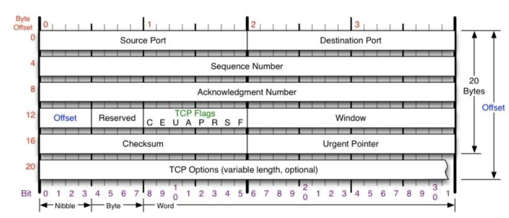
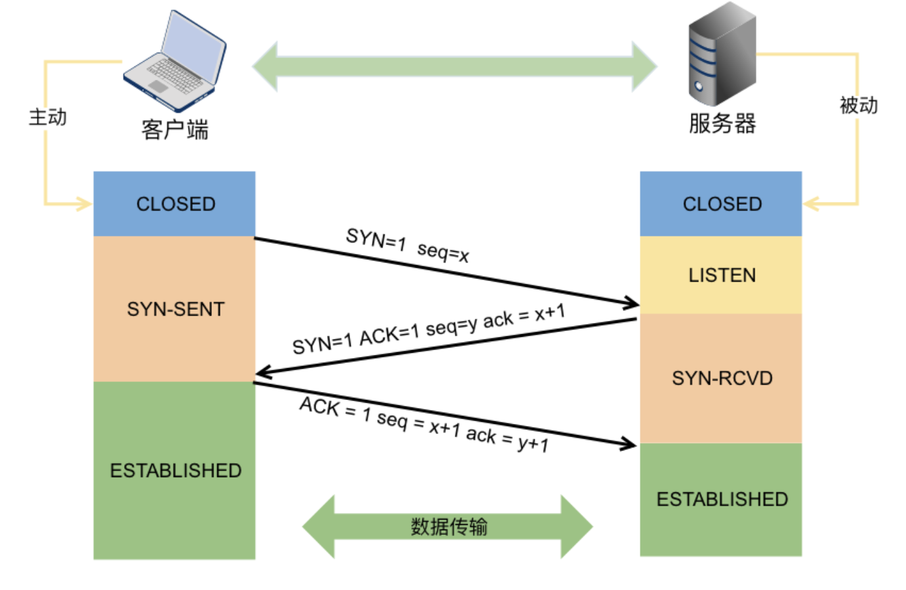

## 从浏览器地址栏输入 url 到显示主页的过程

1. DNS 解析，查找真正的 ip 地址
2. 与服务器建立 TCP 连接
3. 发送 HTTP 请求
4. 服务器处理请求并返回 HTTP 报文
5. 浏览器解析渲染页面
6. 连接结束
   

## 如何理解HTTP是无状态的

每次请求都是独立。对于事务处理没有记忆[能力](https://baike.baidu.com/item/能力/33045)。缺少状态意味着如果后续处理需要前面的信息，则它必须重传，这样可能导致每次连接传送的数据量增大。

## POST 和 GET 有哪些区别？

```
参考文章：https://github.com/febobo/web-interview/issues/145
```

## HTTP1.0、HTTP1.1、HTTP2区别

http1.0 默认短连接
http1.1
	引入了长连接，即 TCP 连接默认不关闭，可以被多个请求复用。
    引入了管道机制（pipelining），即在同一个 TCP 连接里面，客户端可以同时发送多个请求。
    缓存处理，引入了更多的缓存控制策略，如 Cache-Control、Etag/If-None-Match 等。
    错误状态管理，新增了 24 个错误状态响应码，如 409 表示请求的资源与资源的当前状态发生冲突
Http2 

- 采用了**多路复用**，即在一个连接里，客户端和浏览器都可以同时发送多个请求或回应，而且不用按照顺序一一对应。
- 服务端推送，HTTP 2 允许服务器未经请求，主动向客户端发送资源

## http和https、TTL和SSL

- HTTPS = HTTP + SSL/TLS，即用 SSL/TLS 对数据进行加密和解密，Http 进行传输。

## 什么是 XSS 攻击，如何避免？


## osi五层和tcp/ip分成模型


## 请详细介绍一下tcp的连接需要三次握手的机制？

tcp的特点：面向连接、可靠性、面向字节流

#### 什么是连接：

用于保证可靠性和流控制机制的信息，包括socket、序列号以及窗口大小叫做连接。其中socket是由地址和端口组成，窗口大小主要用来做流控制，序列号用于追踪通信发起方发送的数据包序列号，接收方可以通过序列号向发送方确认某个数据包的成功接收。所以，建立 TCP 连接就是通信的双方需要对上述的三种信息达成共识。

#### TCP  数据结构图



#### Sequence Number

​	Sequence Number 是记录包的序号，TCP 会按照报文字节进行编号，它是用来解决包在网络中乱序的问题

#### Acknowledgement Number 

Acknowledgement Number确认序列号，是用于向发送方确认已经收到了哪些包，用来解决不丢包的问题

#### window

`Windows` 也叫 `Advertised-Windows`，也就是著名的滑动窗口，主要是用来解决流控的


#### TCP的FLAGS标记

在TCP层，有个FLAGS字段，这个字段有以下几个标识：SYN, FIN, ACK, PSH, RST, URG.

SYN表示建立连接，

FIN表示关闭连接，

ACK表示响应，

PSH表示有 DATA数据传输，

RST表示连接重置


#### 三次握手的过程



第一次：客户端发送建立连接的报文syn报文，进入等待服务器确定的状态。
第二次：服务端收到SYN报文之后，给客户端发送syn+ack报文。服务进入等待客户端确认。这个阶段服务端确认了客户端有发送报文的能力。
第三次：客户端收到 `SYN + ACK` 报文向服务器发送确认包，客户端进入 `ESTABLISHED` 状态。待服务器收到客户端发送的 `ACK` 包也会进入 `ESTABLISHED` 状态，完成三次握手。


#### TCP 连接使用三次握手的首要原因  

为了阻止历史的重复连接初始化造成的混乱问题，防止使用 TCP 协议通信的双方建立了错误的连接。
TCP 选择使用三次握手来建立连接并在连接引入了 `RST` 这一控制消息，接收方当收到请求时会将发送方发来的 `SEQ+1` 发送给对方，这时由发送方来判断当前连接是否是历史连接：

- 如果当前连接是历史连接，即 `SEQ` 过期或者超时，那么发送方就会直接发送 `RST` 控制消息中止这一次连接；
- 如果当前连接不是历史连接，那么发送方就会发送 `ACK` 控制消息，通信双方就会成功建立连接


#### 初始序列号

使用三次握手的重要的原因就是通信双方都需要获得一个用于发送信息的初始化序列号

有了序列号我们就可以：

- 接收方可以通过序列号对重复的数据包进行去重；
- 发送方会在对应数据包未被 ACK 时进行重复发送；
- 接收方可以根据数据包的序列号对它们进行重新排序


#### 通信次数

强调使用『两次握手』没有办法建立 TCP 连接，使用三次握手是建立连接所需要的最小次数


总结: 


1. 建立连接最少需要三次，因为要确定客户端和服务端都有接受和发送数据包的能力。
2. tcp 是面向连接，可靠，面向字节流。连接指的是，通信的双方在通信之前约定一些共识，其中就包括socket、序列号、以及窗口。socket用来确定地址和端口，序列号用来对数据包去重，排序，窗口用来对流量的控制。


```
https://blog.csdn.net/u011168837/article/details/110848170
https://draveness.me/whys-the-design-tcp-three-way-handshake/
https://zhuanlan.zhihu.com/p/53374516
https://www.eet-china.com/mp/a44399.html
```

## TCP重发机制


## 什么是socket


Socket是应用层与TCP/IP协议族通信的中间软件抽象层，它是一组接口。在设计模式中，Socket其实就是一个门面模式，它把复杂的TCP/IP协议族隐藏在Socket接口后面，对用户来说，一组简单的接口就是全部，让Socket去组织数据，以符合指定的协议。

在unix中一切皆文件，都可以用“打开open –> 读写write/read –> 关闭close”模式来操作。socket就是一种特殊的文件。


```
参考文章：https://blog.csdn.net/pashanhu6402/article/details/96428887
参考文章：https://www.jianshu.com/p/066d99da7c
```


## unix网络io模型

#### select、poll、epoll区别


## cookie、session、token、jwt的区别


## 参考文章

```

https://www.jianshu.com/p/066d99da7c
https://www.eet-china.com/mp/a68780.html
```

