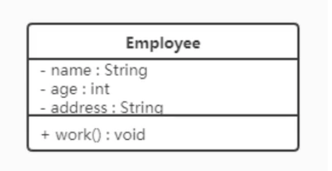
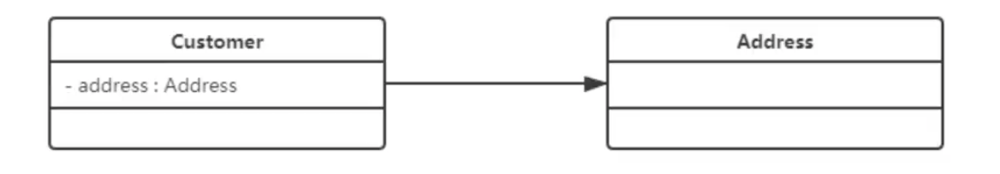
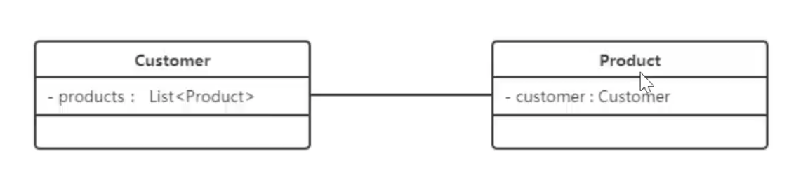
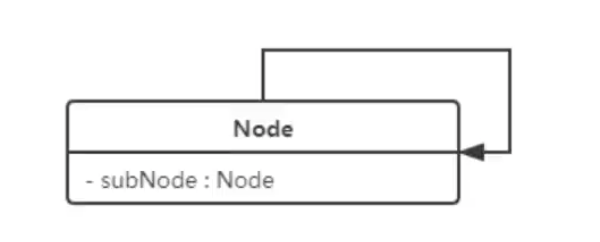
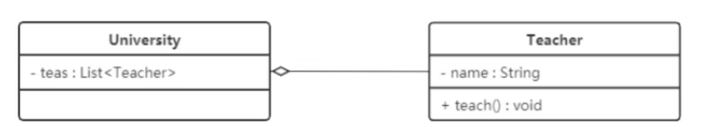
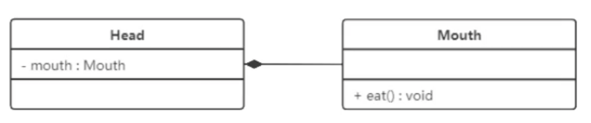
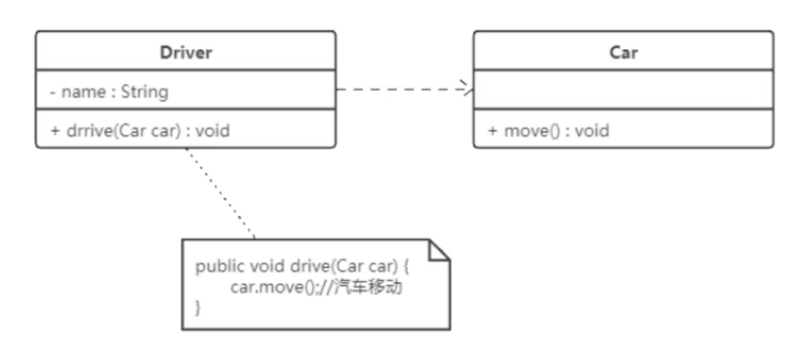
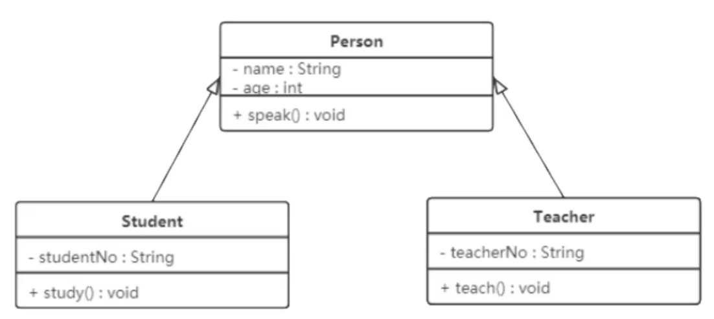
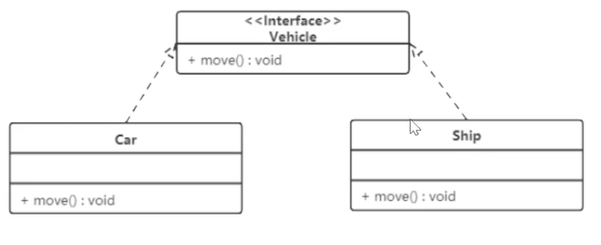

**2.3.1**类的表示方式

在UML类图中，类使用包含类名、属性、方法且带有分割线的矩形来表示。

在属性/方法添加符号表示可见性：
	+表public、   -表private、   #表示protected

​	

类与类之间的关系
关联关系是对象之间的一种引用关系，用于表示一类对象与另一个对象之间的联系。
关联关系分为，一般关联关系，聚合关系，组合关系

1.单向关联， 用一个带箭头的实线表示。

2.双向关联，双方都持有对方类型的成员变量，用不带箭头的连线
	

3.自关联，一个箭头且指向自身的箭头
	

4.聚合关系是关联关系的一种，表示整体和部分的关系。带空心的菱形表示，菱形指向整体。整体不存了，部分可以单独存在

5.组合关系表示整体和部分的关系，是一种更强烈的聚合关系。整体不存在了，部分也随之消亡

6.依赖关系。耦合度最低的一种关联关系。在代码中，某个类的方法通过局部变量，方法的参数或者对静态方法的调用来访问另一类中的某些方法来完成一些职责。带箭头的虚线来表示
		

7.继承关系。耦合度最高的一种关系，使用实线且带有空心的三角箭头指向父类。

8.实现关系。表示接口和实现类之间的关系。使用虚线且带有空闲的三角箭头指向父类。

聚合和组合要作为成员变量使用，而依赖作为局部变量使用