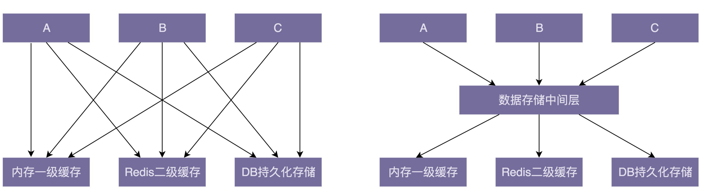

## 解耦为什么重要

减少复杂性。

## 如何给代码解耦

#### 1。封装与抽象

封装和抽象可以有效地隐藏实现的复杂性，隔离实现的易变性，给依赖的模块提供稳定且易用的抽象接口。

Unix 系统提供的 open() 文件操作函数，我们用起来非常简单，但是底层实现却非常复杂，涉及权限控制、并发控制、物理存储等等

#### 2.中间层

引入中间层能简化模块或类之间的依赖关系。

在引入数据存储中间层之前，A、B、C 三个模块都要依赖内存一级缓存、Redis 二级缓存、DB 持久化存储三个模块。在引入中间层之后，三个模块只需要依赖数据存储一个模块即可

中间层也可以用于重构第一阶段：

+ 引入一个中间层，包裹老的接口，提供新的接口定义。
+ 第二阶段：新开发的代码依赖中间层提供的新接口。
+ 第三阶段：将依赖老接口的代码改为调用新接口。
+ 第四阶段：确保所有的代码都调用新接口之后，删除掉老的接口。

#### 3.模块化

我们再聚焦到代码层面。合理地划分模块能有效地解耦代码，提高代码的可读性和可维护性。所以，我们在开发代码的时候，一定要有模块化意识，将每个模块都当作一个独立的lib 一样来开发，只提供封装了内部实现细节的接口给其他模块使用，这样可以减少不同模块之间的耦合度。

#### 4.**其他设计思想和原则**

##### 单一职责原则

​	模块或者类的职责设计得单一，而不是大而全，那依赖它的类和它依赖的类就会比较少，代码耦合也就相应的降低了

##### 基于接口而非实现编程

基于接口而非实现编程能通过接口这样一个中间层，隔离变化和具体的实现。这样做的好处是，在有依赖关系的两个模块或类之间，一个模块或者类的改动，不会影响到另一个模块或类。实际上，这就相当于将一种强依赖关系（强耦合）解耦为了弱依赖关系（弱耦合）

##### 依赖注入

依赖注入也是将代码之间的强耦合变为弱耦合

##### 多用组合少用继承

继承是一种强依赖关系，父类与子类高度耦合，且这种耦合关系非常脆弱，牵一发而动全身，父类的每一次改动都会影响所有的子类