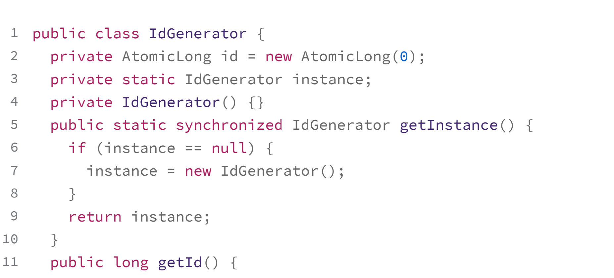

## 为什么使用单例

一个类只允许创建一个对象（或者实例），那这个类就是一个单例类，这种设计模式就叫作单例设计模式，简称单例模式

## 处理资源访问冲突

Logger 设计成一个单例类，程序中只允许创建一个 Logger 对象，所有的线程共享使用的这一个 Logger 对象，共享一个 FileWriter 对象，而 FileWriter 本身是对象级别线程安全的，也就避免了多线程情况下写日志会互相覆盖的问题

## 表示唯一全局类

数据在系统中只应保存一份，那就比较适合设计为单例类。比如，配置信息类

## 如何实现单例

#### 1.饿汉式

在类加载的时候，instance 静态实例就已经创建并初始化好了，所以，instance 实例的创建过程是线程安全的

#### 2.懒汉式

有饿汉式，对应地，就有懒汉式。懒汉式相对于饿汉式的优势是支持延迟加载

