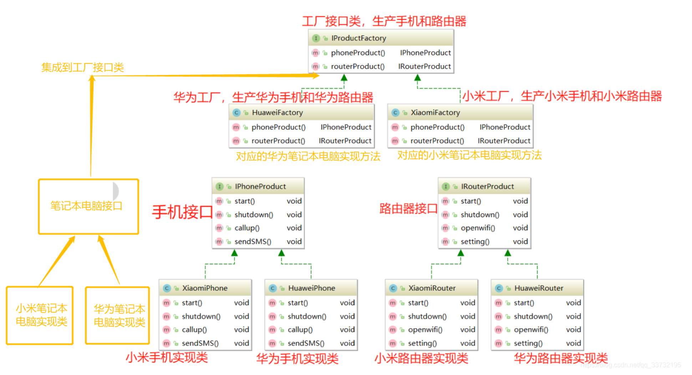
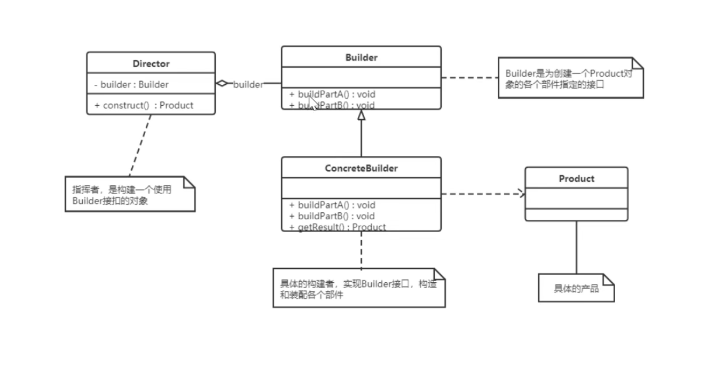

# 理论知识

## 1、类之间的关系

在UML类图中，类使用包含类名、属性、方法且带有分割线的矩形来表示。


在属性/方法添加符号表示可见性：
	+表public、   -表private、   #表示protected

​	

类与类之间的关系
关联关系是对象之间的一种引用关系，用于表示一类对象与另一个对象之间的联系。
关联关系分为，一般关联关系，聚合关系，组合关系

1.单向关联， 用一个带箭头的实线表示。

2.双向关联，双方都持有对方类型的成员变量，用不带箭头的连线
	

3.自关联，一个箭头且指向自身的箭头
	

4.聚合关系是关联关系的一种，表示整体和部分的关系。带空心的菱形表示，菱形指向整体。整体不存了，部分可以单独存在


5.组合关系表示整体和部分的关系，是一种更强烈的聚合关系。整体不存在了，部分也随之消亡


6.依赖关系。耦合度最低的一种关联关系。在代码中，某个类的方法通过局部变量，方法的参数或者对静态方法的调用来访问另一类中的某些方法来完成一些职责。带箭头的虚线来表示
		

7.继承关系。耦合度最高的一种关系，使用实线且带有空心的三角箭头指向父类。


8.实现关系。表示接口和实现类之间的关系。使用虚线且带有空闲的三角箭头指向父类。


聚合和组合要作为成员变量使用，而依赖作为局部变量使用

## 2、六大原则

### 1.开闭原则

**对扩展放开，对修改关闭**。在程序需要扩展的时候，不能修改原有的代码。

想要这种效果需要使用接口和抽象类

#### 接口和抽象类的区别

###### 抽象类

+ 抽象类不允许被实例化，只能被继承
+ 抽象类可以包含属性和方法。方法既可以包含代码实现，也可以不包含代码实现。不包含的代码叫抽象方法
+ 子类继承抽象类，必须实现抽象类中的所有抽象方法

###### 接口

+ 接口不能包含属性（也就是成员变量）
+ 接口只能声明方法，方法不能包含代码实现
+ 类实现接口的时候，必须实现接口中声明的所有方法

###### 抽象类解决什么问题

+ 代码复用
+ 多态

###### 接口解决了什么问题

+ 解耦，接口是一种行为的协议，降低代码的耦合性，提高代码的可扩展性

###### **该用抽象类还是接口**

+ 如果我们要表示一种 is-a 的关系，并且是为了解决代码复用的问题，我们就用抽象类；
+ 如果我们要表示 一种 has-a 关系，并且是为了解决抽象而非代码复用的问题，那我们就可以使用接口


### 2.里氏替换原则

任何基类可以出现的地方子类一定可以出现。也就是说子类可以扩展父类的方法，不能改变父类的原有功能。

子类继承父类最后新增方法，尽量不用修改父类的方法。


### 3.依赖倒转

高层模块不能依赖底层模块，两者都应该依赖其抽象。抽象不应该依赖细节，细节应该依赖抽象。这里的细节指的具体的实现的类，抽象指抽象类或接口。


### 4.接口隔离原则

客户端不应该被迫依赖于它不使用的方法；一个类对另外一个类的依赖应该建立在最小的接口上。继承会导致子类继承到不需要的接口，应该抽出一个接口来。


### 5.迪米特法则

不该有直接依赖关系的类之间，不要有依赖；有依赖关系的类之间，尽量只依赖必要的接口。迪米特法则是希望减少类之间的耦合，让类越独立越好。每个类都应该少了解系统的其他部分。一旦发生变化，需要了解这一变化的类就会比较少。


### 6.合成复用 

尽量使用组合或者聚合等关联方式来实现，其次才考虑继承关系来实现。


### 7.单一职责

一个类只负责一个功能领域中的相应职责。


### 总结：

1. 在程序需要扩展的时候，最好新增代码，不能修改原有的代码。
2. 子类尽量别重写父类方法，最好只新增方法。
3. 抽象类表示is-a，是某一类事物；接口表示has-a，具体的行为，扫地；
4. 一个模块和一个类最好只负责一种职责
5. 高层模块和底层模块不要直接依赖，通过抽象(接口或抽象类)依赖。抽象不应该依赖细节，细节应该依赖抽象
6. 不用让类被迫依赖它不需要代码。比如，只需某个类的方法，应该使用接口去扩展，而不是继承。
7. 不该有直接依赖关系的类之间，不要有依赖；有依赖关系的类之间，尽量只依赖必要的接口。让代码调用的链条简单。
8. 少用继承，多组合和聚合。就是用成员变量来引入某个类或局部变量注入某个类。
9. 像是解码和编码有逆向关系的类，可以合成一个类来写，这样可以把相关代码集合起来放在一个类，方便维护；调用的时候也不用实例化两个类。


## 3、23种设计模式

### 设计模型分类

+ #### 创建型模式

  用于描述`怎样创建对象`,特点使对象创建和使用分开。

  主要有单例、原型、工厂方法、抽象方法、建造者等5种

+ #### 结构性模式

  用于描述如何将类或对象按某种布局组成更大的结构。

  代理、适配器、桥接、装饰、外观、享元、组合等7种

+ #### 行为型模式

​		用于描述类或对象之间的协作共同完成单个对象无法完成的任务，以及怎么分配职业。

​		模板方法、策略、命令、职责链、状态、观察者、中介者、迭代器、访问者、备忘录、解释器等11种


## 4.创建者模式

### 1、单例模式

类负责创建自己的对象且确保只创建一个对象。因为创建和使用放在一个类中，其实是有点反设计模式的。

### 饿汉式、懒汉式

饿汉式是类加载的时候就已经实例化好了，是线程安全的。可能会浪费资源

懒汉式是调用的时候才创建。php仅支持懒汉式。线程不安全，因为线程访问具有随机性，并发环境可能出现多个singleton1实例

```php
#懒汉式创建--php
class Single
{
    private static $instance = null;
		#私有构造函数，不让实例化
    private function __construct(){}
		#私有克隆魔术方法，禁止对象克隆
    private function __clone(){// TODO: Implement __clone() method.}

    public static function getInstance()
    {
        if (!self::$instance instanceof Single) {
            self::$instance = new Single();
        }
        return self::$instance;
    }
}
#饿汉式-java
public class Singleton5 {
    //1、将默认构造方法私有化
    private Singleton5() {}
    //2、声明静态变量，在类实例化之前就初始化变量，将对象引用保存
    private static final Singleton5 singleton5 = new Singleton5();
    //3、开放静态方法，获取实例
    public static Singleton5 getInstance() {
        return singleton5;
    }
}

```


### 2、简单工厂、工厂方法、抽象工厂

 通过工厂生产对象，让类的实例创建和使用分开，达到解耦。

#### 简单工厂

三类角色

+ 抽象产品：定义产品规范、描述产品特性和功能
+ 具体产品：继承抽象产品的子类
+ 具体工厂：提供创建产品的方法，调用者通过该方法来创建产品

```php
/**
 * 产品类
 */  
abstract Class DataBase {  
    abstract function getOne($sql); //获取一条数据的方法
}  

Class SqlServer extends DataBase {  
    function __construct() { 
        $connect = "SqlServer 连接方法操作 （腾讯云服务器）";
        return $connect
    }

　　function getOne($sql){
        return "查询后返回数据结果";
    }
}  

Class MySql extends DataBase{  
   function __construct(){  
       $connect = "MySql 连接方法操作 （阿里云服务器）";
       return $connect
   }

    function getOne($sql){
        return "查询后返回数据结果";
    }
}
```

工厂类

```php
/** 
 *  
 * 创建数据库的工厂类 
 */  
class Factory {  
      static function  createDataBase($type) {  
        switch ($type) {  
          case SqlServer:  
             return new SqlServer();  
          case MySql:  
             return new MySql();  
        //....  
   }  
}
```

```php
/** 
 *  
 * 客户通过工厂获取数据 
 */  
class Customer {  
    private $database;  
    
    function getDataBase($type) {  
        return $this->database =  Factory::createDataBase($type);  
    } 
}

$custome = new Customer;
$db = $custome->getDataBase("SqlServer"); // 我要获取阿里云的SQL Server数据库的数据。
$data = $db->getOne($sql);
```


#### 工厂方法

定义一个创建对象的接口，让子类决定实例化那个产品类对象。工厂方法使产品类的实例化延迟到其工厂的子类

四类对象：

+ 抽象工厂：提供创建产品的接口，调用者通过它访问具体工厂的工厂方法来创建产品
+ 具体工厂：主要实现抽象工厂的抽象方法，完成具体产品的创建
+ 抽象产品：定义产品的规范，描述了产品的主要特性和功能
+ 具体产品： 实现了抽象产品所定义的接口，由具体的工厂来创建，与具体工厂一一对应 

 把简单工厂的具体工厂类的创建逻辑中ifelse(Switch)替代变成一个抽象工厂类以及对应多个具体工厂类。

 优点：新增具体的产品的同时要新增具体工厂类，不用修改代码。符合放开扩展对修改关闭

 缺点：具体产品越多，具体工厂类越多。


### 抽象工厂

是一种为访问类提供一个创建一组相关或互相依赖对象的接口，且访问类无须指定所要的产品的具体类就能得到同族的不同等级的产品的模式的结构。

(同族可以理解产品品牌，等级可以理解成产品品类)

四类对象：

+ 抽象工厂：提供创建产品的接口，它包含多个创建产品的方法，可以创建多个不同等级的产品
+ 具体工厂：主要实现抽象工厂的多个抽象方法，完成具体产品的创建
+ 抽象产品：定义产品的规范，描述了产品的主要特性和功能，抽象工厂模式有多个抽象产品
+ 具体产品： 实现了抽象产品所定义的接口，由具体的工厂来创建，与具体工厂多对一 



优点：当一个产品族的多个对象被设计成一起工作时，它能保证客户始终只是用一个产品族中的对象

缺点：新增新的产品，所有的工厂类都要修改


### 原型模式

通过复制一个已经创建的对象来创建一个新的对象
三类角色：

+ 抽象原型类：必须实现clone()方法
+ 具体原型类：实现抽象类的clone()方法，它是可被复制的对象
+ 访问类：使用具体原型类的clone()方法来复制新的对象

浅克隆和深克隆

浅克隆：创建一个新对象，新对象的属性和原来的完全相同

深克隆：创建一个新对象，属性中引用的其他对象也会被克隆，不在指向原来对象地址


### 建造者模式

将一个复杂对象的构建与表示分离，使得同样的构建过程可以创建不同的表示方法。
角色：

+ 抽象建造者类：这个抽象规定要实现复杂对象的哪些部分的创建，并设计具体对象部件的创建
+ 具体建造类：实现builer接口，完成复杂产品的各个部件的具体创建方法。在构建过程完成后，提供产品的实例
+ 产品类：要创建的复杂对象
+ 指挥类：调用具体建造者来创建复杂对象的各个部分，在指导中不涉及具体产品的信息，只负责保证对象各部分创建或按某种顺序创建

**当一个类的构造函数参数个数超过4个，而且这些参数有些是可选的参数或参数之间有关联(参数之间，要么都有，要么都没有之类的判定)，考虑使用构造者模式。**
就可以产品类里面只设置属性的方法，校验的逻辑放到建造者类builer类里面



优点：

+ 一般产品类和建造者类是比较稳定的
+ 客户端不必知道产品内部组成细节，将产品本身与产品的创建过程解耦，使得相同的创建过程可以创建不同的产品对象
+ 创建过程清晰，容易控制
+ 容易扩展

缺点：

产品之间差异性很大，不适合使用建造者。


## 5、结构性模式


