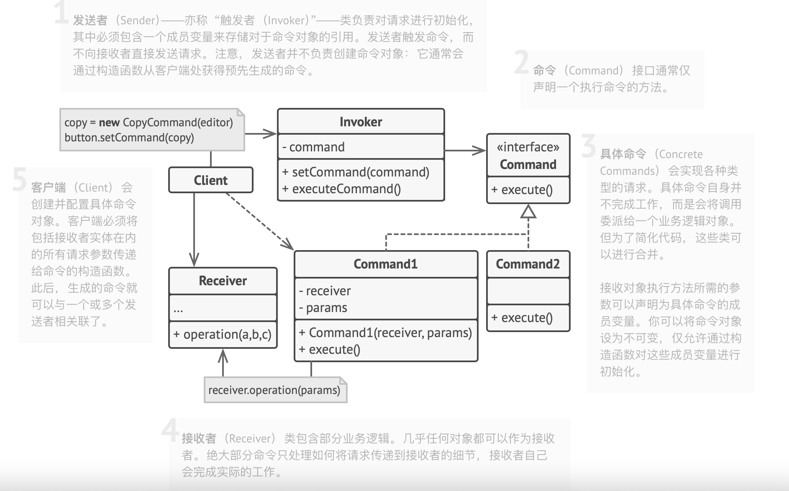

# 理论知识

## 1、类之间的关系

在UML类图中，类使用包含类名、属性、方法且带有分割线的矩形来表示。
在属性/方法添加符号表示可见性：
	+表public、   -表private、   #表示protected

​	

类与类之间的关系
关联关系是对象之间的一种引用关系，用于表示一类对象与另一个对象之间的联系。
关联关系分为，一般关联关系，聚合关系，组合关系

1. 单向关联， 用一个带箭头的实线表示。


2. 双向关联，双方都持有对方类型的成员变量，用不带箭头的连线

​	

3. 自关联，一个箭头且指向自身的箭头

​	

4. 聚合关系是关联关系的一种，表示整体和部分的关系。带空心的菱形表示，菱形指向整体。整体不存了，部分可以单独存在
   
5. 组合关系表示整体和部分的关系，是一种更强烈的聚合关系。整体不存在了，部分也随之消亡


6. 依赖关系。耦合度最低的一种关联关系。在代码中，某个类的方法通过局部变量，方法的参数或者对静态方法的调用来访问另一类中的某些方法来完成一些职责。带箭头的虚线来表示

   

   ​		

7. 继承关系。耦合度最高的一种关系，使用实线且带有空心的三角箭头指向父类。
   

8. 实现关系。表示接口和实现类之间的关系。使用虚线且带有空闲的三角箭头指向父类。
   

总结：聚合和组合要作为成员变量使用，而依赖作为局部变量使用

#### 接口和抽象类的区别

###### 抽象类

+ 抽象类不允许被实例化，只能被继承
+ 抽象类可以包含属性和方法。方法既可以包含代码实现，也可以不包含代码实现。不包含的代码叫抽象方法
+ 子类继承抽象类，必须实现抽象类中的所有抽象方法

###### 接口

+ 接口不能包含属性（也就是成员变量）
+ 接口只能声明方法，方法不能包含代码实现
+ 类实现接口的时候，必须实现接口中声明的所有方法

###### 抽象类解决什么问题

+ 代码复用
+ 多态

###### 接口解决了什么问题

+ 解耦，接口是一种行为的协议，降低代码的耦合性，提高代码的可扩展性

###### **该用抽象类还是接口**

+ 如果我们要表示一种 is-a 的关系，并且是为了解决代码复用的问题，我们就用抽象类；
+ 如果我们要表示 一种 has-a 关系，并且是为了解决抽象而非代码复用的问题，那我们就可以使用接口


## 2、六大原则

### 1.开闭原则

**对扩展放开，对修改关闭**。在程序需要扩展的时候，不能修改原有的代码。

想要这种效果需要使用接口和抽象类

### 2.里氏替换原则

任何基类可以出现的地方子类一定可以出现。也就是说子类可以扩展父类的方法，不能改变父类的原有功能。

子类继承父类最后新增方法，尽量不用修改父类的方法。

### 3.依赖倒转

高层模块不能依赖底层模块，两者都应该依赖其抽象。抽象不应该依赖细节，细节应该依赖抽象。这里的细节指的具体的实现的类，抽象指抽象类或接口。

### 4.接口隔离原则

客户端不应该被迫依赖于它不使用的方法；一个类对另外一个类的依赖应该建立在最小的接口上。继承会导致子类继承到不需要的接口，应该抽出一个接口来。

### 5.迪米特法则

不该有直接依赖关系的类之间，不要有依赖；有依赖关系的类之间，尽量只依赖必要的接口。迪米特法则是希望减少类之间的耦合，让类越独立越好。每个类都应该少了解系统的其他部分。一旦发生变化，需要了解这一变化的类就会比较少。

### 6.合成复用 

尽量使用组合或者聚合等关联方式来实现，其次才考虑继承关系来实现。

### 7.单一职责

一个类只负责一个功能领域中的相应职责。


### 总结：

1. 在程序需要扩展的时候，最好新增代码，不能修改原有的代码。
2. 子类尽量别重写父类方法，最好只新增方法。
3. 抽象类表示is-a，是某一类事物；接口表示has-a，具体的行为，扫地；
4. 一个模块和一个类最好只负责一种职责
5. 高层模块和底层模块不要直接依赖，通过抽象(接口或抽象类)依赖。抽象不应该依赖细节，细节应该依赖抽象
6. 不用让类被迫依赖它不需要代码。比如，只需某个类的方法，应该使用接口去扩展，而不是继承。
7. 不该有直接依赖关系的类之间，不要有依赖；有依赖关系的类之间，尽量只依赖必要的接口。让代码调用的链条简单。
8. 少用继承，多组合和聚合。就是用成员变量来引入某个类或局部变量注入某个类。
9. 像是解码和编码有逆向关系的类，可以合成一个类来写，这样可以把相关代码集合起来放在一个类，方便维护；调用的时候也不用实例化两个类。


## 3、23种设计模式

### 设计模型分类

+ #### 创建型模式

  用于描述`怎样创建对象`,特点使对象创建和使用分开。

  主要有单例、原型、工厂方法、抽象方法、建造者等5种

+ #### 结构性模式

  用于描述如何将类或对象按某种布局组成更大的结构。

  代理、适配器、桥接、装饰、外观、享元、组合等7种

+ #### 行为型模式

​		用于描述类或对象之间的协作共同完成单个对象无法完成的任务，以及怎么分配职业。

​		模板方法、策略、命令、职责链、状态、观察者、中介者、迭代器、访问者、备忘录、解释器等11种


## 4、创建者模式

### 1、单例模式

类负责创建自己的对象且确保只创建一个对象。因为创建和使用放在一个类中，其实是有点反设计模式的。

### 饿汉式、懒汉式

饿汉式是类加载的时候就已经实例化好了，是线程安全的。可能会浪费资源

懒汉式是调用的时候才创建。php仅支持懒汉式。线程不安全，因为线程访问具有随机性，并发环境可能出现多个singleton1实例

```php
#懒汉式创建--php
class Single
{
    private static $instance = null;
		#私有构造函数，不让实例化
    private function __construct(){}
		#私有克隆魔术方法，禁止对象克隆
    private function __clone(){// TODO: Implement __clone() method.}

    public static function getInstance()
    {
        if (!self::$instance instanceof Single) {
            self::$instance = new Single();
        }
        return self::$instance;
    }
}
#饿汉式-java
public class Singleton5 {
    //1、将默认构造方法私有化
    private Singleton5() {}
    //2、声明静态变量，在类实例化之前就初始化变量，将对象引用保存
    private static final Singleton5 singleton5 = new Singleton5();
    //3、开放静态方法，获取实例
    public static Singleton5 getInstance() {
        return singleton5;
    }
}

```


### 2、简单工厂、工厂方法、抽象工厂

 通过工厂生产对象，让类的实例创建和使用分开，达到解耦。

#### 简单工厂

三类角色

+ 抽象产品：定义产品规范、描述产品特性和功能
+ 具体产品：继承抽象产品的子类
+ 具体工厂：提供创建产品的方法，调用者通过该方法来创建产品

```php
/**
 * 产品类
 */  
abstract Class DataBase {  
    abstract function getOne($sql); //获取一条数据的方法
}  

Class SqlServer extends DataBase {  
    function __construct() { 
        $connect = "SqlServer 连接方法操作 （腾讯云服务器）";
        return $connect
    }

　　function getOne($sql){
        return "查询后返回数据结果";
    }
}  

Class MySql extends DataBase{  
   function __construct(){  
       $connect = "MySql 连接方法操作 （阿里云服务器）";
       return $connect
   }

    function getOne($sql){
        return "查询后返回数据结果";
    }
}
```

工厂类

```php
/** 
 *  
 * 创建数据库的工厂类 
 */  
class Factory {  
      static function  createDataBase($type) {  
        switch ($type) {  
          case SqlServer:  
             return new SqlServer();  
          case MySql:  
             return new MySql();  
        //....  
   }  
}
```

```php
/** 
 *  
 * 客户通过工厂获取数据 
 */  
class Customer {  
    private $database;  
    
    function getDataBase($type) {  
        return $this->database =  Factory::createDataBase($type);  
    } 
}

$custome = new Customer;
$db = $custome->getDataBase("SqlServer"); // 我要获取阿里云的SQL Server数据库的数据。
$data = $db->getOne($sql);
```

总结：将创建对象集中在工厂类中，虽然违背了开闭原则，但如果产品类很少，修改成本是可以接受的。多个产品对应一个工厂类。

#### 工厂方法

定义一个创建对象的接口，让子类决定实例化那个产品类对象。工厂方法使产品类的实例化延迟到其工厂的子类

四类对象：

+ 抽象工厂：提供创建产品的接口，调用者通过它访问具体工厂的工厂方法来创建产品
+ 具体工厂：主要实现抽象工厂的抽象方法，完成具体产品的创建
+ 抽象产品：定义产品的规范，描述了产品的主要特性和功能
+ 具体产品： 实现了抽象产品所定义的接口，由具体的工厂来创建，与具体工厂一一对应 

 把简单工厂的具体工厂类的创建逻辑中ifelse(Switch)替代变成一个抽象工厂类以及对应多个具体工厂类。

总结：之前的简单工厂模式，是一个工厂类生产多种产品。现在一个工厂类只生产一种产品。好处就是一个工厂坏了不影响其他工厂。缺点工厂太多。

 优点：新增具体的产品的同时要新增具体工厂类，不用修改代码。符合放开扩展对修改关闭

 缺点：具体产品越多，具体工厂类越多。


### 抽象工厂

是一种为访问类提供一个创建一组相关或互相依赖对象的接口，且访问类无须指定所要的产品的具体类就能得到同族的不同等级的产品的模式的结构。

(同族可以理解产品品牌，等级可以理解成产品品类)

四类对象：

+ 抽象工厂：提供创建产品的接口，它包含多个创建产品的方法，可以创建多个不同等级的产品
+ 具体工厂：主要实现抽象工厂的多个抽象方法，完成具体产品的创建
+ 抽象产品：定义产品的规范，描述了产品的主要特性和功能，抽象工厂模式有多个抽象产品
+ 具体产品： 实现了抽象产品所定义的接口，由具体的工厂来创建，与具体工厂多对一 


优点：当一个产品族的多个对象被设计成一起工作时，它能保证客户始终只是用一个产品族中的对象

缺点：新增新的产品，所有的工厂类都要修改

总结：一个工厂只能生产一定范围种类的产品，

### 简单工厂、工厂方法、抽象工厂的区别

简单工厂：一个工厂生产多个产品；这些产品是同一个种类的（都实现同一个抽象类或接口）

工厂方法：一个工厂只能生产一种产品，新增一种产品要同事新增一个工厂

抽象工厂类：
一个工厂可以生产多个不同种类的产品。
我们假设工厂生产产品的种类是由政府指定的规范，这个规范就是抽象类，所有工厂的遵守(继承)；新增产品种类，所有的工厂都要修改。
然而新开工厂创建一个品牌的生产产品，则不需要改规范。

### 原型模式

通过复制一个已经创建的对象来创建一个新的对象
三类角色：

+ 抽象原型类：必须实现clone()方法
+ 具体原型类：实现抽象类的clone()方法，它是可被复制的对象
+ 访问类：使用具体原型类的clone()方法来复制新的对象

浅克隆和深克隆

浅克隆：创建一个新对象，新对象的属性和原来的完全相同

深克隆：创建一个新对象，属性中引用的其他对象也会被克隆，不在指向原来对象地址


### 建造者模式

将一个复杂对象的构建与表示分离，使得同样的构建过程可以创建不同的表示方法。
角色：

+ 抽象建造者类：这个抽象规定要实现复杂对象的哪些部分的创建，并设计具体对象部件的创建
+ 具体建造类：实现builer接口，完成复杂产品的各个部件的具体创建方法。在构建过程完成后，提供产品的实例
+ 产品类：要创建的复杂对象
+ 指挥类：调用具体建造者来创建复杂对象的各个部分，在指导中不涉及具体产品的信息，只负责保证对象各部分创建或按某种顺序创建

**当一个类的构造函数参数个数超过4个，而且这些参数有些是可选的参数或参数之间有关联(参数之间，要么都有，要么都没有之类的判定)，考虑使用构造者模式。**
就可以产品类里面只设置属性的方法，校验的逻辑放到建造者类builer类里面


优点：

+ 一般产品类和建造者类是比较稳定的
+ 客户端不必知道产品内部组成细节，将产品本身与产品的创建过程解耦，使得相同的创建过程可以创建不同的产品对象
+ 创建过程清晰，容易控制
+ 容易扩展

缺点：

产品之间差异性很大，不适合使用建造者。


## 5、结构性模式

### 代理模式

代理模式可以在不修改被代理对象的基础上，通过扩展代理类，进行一些功能的附加与增强。

三种角色：

+ 抽象主题类：抽象类或者接口声明了真实主题和代理对象实现的业务方法
+ 真实主题：实现了抽象主题中的具体业务，是最终引用的对对象，是整个业务的支撑
+ 代理类：有和真实主题类相同的接口，内部包含对真实的引用，它可以访问、控制或扩展真实主题的功能

举个例子：租房行为，房东，中介，

```java
public interface IRentHouse {
    void rentHouse();
}
public class  Homewoner implements IRentHouse {
    @Override
    public void rentHouse() {}
}
public class MediationProxy implements IRentHouse {

    private Homewoner Homewoner;
  
    public MediationProxy(Homewoner Homewoner){
        Homewoner = Homewoner;
    }

    public void rentHouse() {
        System.out.println("交中介费");
        Homewoner.rentHouse();
        System.out.println("中介负责维修管理");
    }
}
```

房东有房源可以租房，房东将房子代理给中介，那么中介就有了租房的能力。中介代理了房东。

业务早期可以设计一个简单通用的类。

### 适配器模式

提供一个中间转换层，使得原本因为接口不兼容而不能工作的类能够一起工作。

适配器模式：类适配器和对象适配器。

三种角色：

+ 目标接口：当前系统业务所期待的接口，可以是抽象类或接口
+ 适配者类：它是被访问和适配的现存组件库的组件接口
+ 适配器类：他是一个转换器，通过继承或引用适配者对象，把适配者转换成目标接口，让客户按目标接口的格式访问适配者

#### 类适配器模式

实现方式:定义一个适配器来实现当前系统的业务接口，同时又继承现有组件库中已经组存在的组件。


总结：我们的系统要接入某个大公司的系统，他们给了一大堆的标准和要求。我们产品经理总结了一下要求(**抽象了一大堆的接口**)，让开发在原有的系统功能扩展开发了一个模块(不能破坏原有的系统功能,即继承原来的类)，实现了对方各种标准和要求即(**实现了接口)**。

要适配的内容抽象成一系列接口，中间层(适配器类)即要实现接口，又要继承被适配的类

#### 对象适配器

实现方式：对象适配器模式采用将现有组件库中已经实现的组件引入适配器类中，该类同时实现当前系统业务的接口


### 装饰器模式

指在不改变对象结构的情况下，动态地给该对象增加一些职责的模式

四种角色：

- 抽象构件角色：定义一个抽象接口以规范准备接收附加责任的对象
- 具体构件角色：实现构件通过装饰角色为其添加一些职责
- 抽象装饰角色：继承或实现抽象构件，并包含具体构件的实例，可以通过其子类扩展具体构件的功能
- 具体装饰角色：实现抽象装饰的相关方法，并给具体构件对象添加附加的责任


#### 实现方式

1. 确保业务逻辑可用一个基本组件及多个额外可选层次表示。
2. 找出基本组件和可选层次的通用方法。 创建一个组件接口并在其中声明这些方法。
3. 创建一个具体组件类， 并定义其基础行为。
4. 创建装饰基类， 使用一个成员变量存储指向被封装对象的引用。 该成员变量必须被声明为组件接口类型， 从而能在运行时连接具体组件和装饰。 装饰基类必须将所有工作委派给被封装的对象。
5. 确保所有类实现组件接口。
6. 将装饰基类扩展为具体装饰。 具体装饰必须在调用父类方法 （总是委派给被封装对象） 之前或之后执行自身的行为。
7. 客户端代码负责创建装饰并将其组合成客户端所需的形式。


#### 适用场景

如果你希望在无需修改代码的情况下即可使用对象，且希望在运行时为对象新增额外的行为， **可以使用装饰模式**


### 桥接模式


当一个类存两个独立变化的维度，且这两个维度都需要进行扩展时。

当一个系统不希望适用继承或因为多层继承导致系统类的个数急剧增加

当有A和B多对多的情况，A像上抽一个抽象类A-，B向上抽一个接口B-; 然后在抽象类A-加一个接口B-类型的成员变量；


### 外观模式(门面模式)


角色：

- 外观角色：为多个子系统对外提供一个共同的接口
- 子系统角色：实现系统部分功能，客户可以通过外观角色访问它


优点：降低了耦合性；屏幕子系统组件

缺点：不符合开闭原则，修改很麻烦


### 组合模式

角色：

- 抽象跟节点: 定义系统各层次的共有方法和属性
- 树枝节点：定义树枝的行为，存储子节点
- 叶子节点：叶子节点


#### 透明组合模式和安全组合模式的区别

透明组合：抽象类的也同时抽象了管理子节点的方法add，remove，getChild等方法，但是这样叶子节点就被迫实现了它不需要代码。违反了接口隔离

安全组合：抽象类没有抽象管理子节点的方法。树枝节点声明并且实现这些方法。缺点不够透明。


### 享元模式

运用共享技术来有效支持大佬细粒度对象的复用。

享元两种状态：

- 内部状态，不会随着环境变化而改变的部分
- 外部状态，会随着环境变化而改变的部分

四种角色：

- 抽象享元角色：通常是一个接口或抽象类，在抽象享元类中声明具体的享元类的公共方法，这些方法向外界提供享元对象的内部数据，同时提供用来设置外部数据
- 具体享元：实现了抽象享元类，称为享元对象。在具体享元类中为内部状态提供了存储空间。通常结合单例模式来设置享元类，为每一个具体享元类提供唯一实例
- 非享元角色：不是所有抽象享元类都可以共享，那么就要设计为非享元具体享元类，需要时直接通过实例化创建。
- 享元工厂角色：负责创建和管理享元角色。当客户对象请求一个享元对象是，享元工厂检查系统是否存在符合要求的享元对象。存则提供，不存创建一个新的。
- 

## 6、行为型模式

作用：负责对象间的高效沟通

行为型分为类行为和对象行为，前者采用继承机制在类间分派行为，后者采用组合或聚合在对象中分派。

### 模板方法模式

确定了一些关键步骤以及执行顺序，但还有些步骤未知。

定义：它在超类中定义了一个算法的框架， 允许子类在不修改结构的情况下重写算法的特定步骤


### 策略模式

**策略模式**是一种行为设计模式， 它能让你定义一系列算法， 并将每种算法分别放入独立的类中， 以使算法的对象能够相互替换。

角色：

+ 抽象策略类： 这是一个抽象角色，由接口或抽象类实现。
+ 不同任务的特定类：实现抽象策略类定义的接口，提供具体算法实现或行为
+ 上下文的原始类：包含一个成员变量来存储对于各种策略的引用


```java
//策略
public interface strategy {
	viod show();
}
```

```java
//具体策略类A
public class strategyA implements strategy{
  	public void show(){
      system.out.println(“满200-20”);
    }
}
//具体策略B
public class strategyB implements strategy{
  	public void show(){
      system.out.println(“满1200-20”);
    }
}
//具体策略类c
public class strategyC implements strategy{
  	public void show(){
      system.out.println(“满2200-20”);
    }
}
```

```java
//定义上下文：用于连接上下文，即把促销活动推销给用户
public class salesMan{
  private strategy strategy;
  public salesman(strategy strategy){
    this.strategy = strategy;
  }
  public void salesManShow(){
    stragegy.show();
  }
}
```

应用场景：

1. 策略模式让你能够将对象关联至可以不同方式执行特定子任务的不同子对象， 从而以间接方式在运行时更改对象行为
2. 执行某些行为时略有不同的相似类时可使用策略模式
3. 当类中使用了复杂条件运算符以在同一算法的不同变体中切换时，可使用该模式

优缺点：

1. 行时切换对象内的算法
2. 算法的实现和使用算法的代码隔离开来
3. 使用组合来代替继承

缺点：

1. 算法不改变，就增加程序的复杂度
2.  客户端必须知晓策略间的不同
3. 现代编程语言支持函数类型功能， 允许你在一组匿名函数中实现不同版本的算法。 这样， 你使用这些函数的方式就和使用策略对象时完全相同， 无需借助额外的类和接口来保持代码简洁


### 命令模式

+ 抽象命令类：定义命令的接口，声明执行的方法
+ 具体命令：具体的命令
+ 实现者/接收者(receiver)：接收者、真正执行命令的对象
+ 调用者/请求者(invoker)：要求命令对象执行请求，通常持有多个对象。

 

实现方式：

1. 声明仅有一个执行方法的命令接口
2. 抽取请求并使之成为实现命令接口的具体命令类。每个类都必须有一组成员变量来保存请求参数和对于实际接收者对象的引用。 所有这些变量的数值都必须通过命令构造函数进行初始化。
3. 找到担任*发送者*职责的类。 在这些类中添加保存命令的成员变量。 发送者只能通过命令接口与其命令进行交互。 发送者自身通常并不创建命令对象， 而是通过客户端代码获取。
4. 修改发送者使其执行命令， 而非直接将请求发送给接收者。
5. 客户端必须按照以下顺序来初始化对象：
   - 创建接收者。
   - 创建命令， 如有需要可将其关联至接收者。
   - 创建发送者并将其与特定命令关联。

总结：

	1. 发送者和接收者加了一层command命令，
	1. 发送者通过成员变量保存多个命令，只和命令交互，客户端实例化命令对象通过构造函数传入发送者
	1. 接收者的执行方法的参数就是命令对象的成员属性，通过接受者的构造函数传入


### 责任链模式


#### 适用场景

1. **使用不同方式处理不同种类请求，** **而且请求类型和顺序预先未知时**
2. **按顺序执行多个处理者时**， **可以使用该模式**
3. **其顺序必须在运行时进行改变**， **可以使用责任链模式**

#### 实现方式

1. 声明处理者接口并描述请求处理的方法的签名
   确定客户端如何将请求数据传递给方法。 最灵活的方式是将请求转换为对象， 然后将其以参数的形式传递给处理函数。
2. 为了在具体处理者中消除重复的样本代码， 你可以根据处理者接口创建抽象处理者基类
   具体处理者要有一个成员变量来存储指向链上下一个处理者的引用。
3. 依次创建具体处理者子类并实现其处理方法
   - 是否自行处理这个请求。
   - 是否将该请求沿着链进行传递。
4. 客户端可以自行组装链， 或者从其他对象处获得预先组装好的链。
5. 客户端可以触发链中的任意处理者， 而不仅仅是第一个。 请求将通过链进行传递， 直至某个处理者拒绝继续传递， 或者请求到达链尾。
6. 由于链的动态性， 客户端需要准备好处理以下情况：
   - 链中可能只有单个链接。
   - 部分请求可能无法到达链尾。
   - 其他请求可能直到链尾都未被处理


### 状态模式


#### 适用场景

1. **对象需要根据自身当前状态进行不同行为**， **同时状态的数量非常多且与状态相关的代码会频繁变更的话**， **可使用状态模式**
   模式建议你将所有特定于状态的代码抽取到一组独立的类中。 这样一来， 你可以在独立于其他状态的情况下添加新状态或修改已有状态， 从而减少维护成本。

2. **某个类需要根据成员变量的当前值改变自身行为**，从而需要使用大量的条件语句时**， **可使用该模式

   状态模式会将这些条件语句的分支抽取到相应状态类的方法中。 同时， 你还可以清除主要类中与特定状态相关的临时成员变量和帮手方法代码

3. **当相似状态和基于条件的状态机转换中存在许多重复代码时**， **可使用状态模式**。

   状态模式让你能够生成状态类层次结构， 通过将公用代码抽取到抽象基类中来减少重复

#### 实现方式

1. 确定哪些类是上下文。 它可能是包含依赖于状态的代码的已有类； 如果特定于状态的代码分散在多个类中， 那么它可能是一个新的类。

2. 声明状态接口。 虽然你可能会需要完全复制上下文中声明的所有方法， 但最好是仅把关注点放在那些可能包含特定于状态的行为的方法上。

3. 为每个实际状态创建一个继承于状态接口的类。 然后检查上下文中的方法并将与特定状态相关的所有代码抽取到新建的类中。

   在将代码移动到状态类的过程中， 你可能会发现它依赖于上下文中的一些私有成员。 你可以采用以下几种变通方式：

   - 将这些成员变量或方法设为公有。
   - 将需要抽取的上下文行为更改为上下文中的公有方法， 然后在状态类中调用。 这种方式简陋却便捷， 你可以稍后再对其进行修补。
   - 将状态类嵌套在上下文类中。 这种方式需要你所使用的编程语言支持嵌套类。

4. 在上下文类中添加一个状态接口类型的引用成员变量， 以及一个用于修改该成员变量值的公有设置器。

5. 再次检查上下文中的方法， 将空的条件语句替换为相应的状态对象方法。

6. 为切换上下文状态， 你需要创建某个状态类实例并将其传递给上下文。 你可以在上下文、 各种状态或客户端中完成这项工作。 无论在何处完成这项工作， 该类都将依赖于其所实例化的具体类。


### 观察者模式

发布-订阅模式。 定义一种一对多的依赖关系。多个观察者同事监听某个主题对象。主题对象发生状态发生改变的时候，会通知所有的观察者对象。

4个角色：

+ 抽象主题，抽象主题把所有观察者对象保存在一个集合里面。抽象主题提供一个接口，可增删观察者对象
+ 具体主题，将有关状态存入具体观察者对象，在具体主题的内部状态发生改变时，给所有注册过的观察者发送通知
+ 具体观察者：具体观察者，实现抽象观察者的更新接口，以便得到主题通知时更新自身的状态


#### 实现方式

1. 发布者和订阅者
2. 声明订阅接口。至少一个update
3. 发布者接口要定义增加和删除订阅者
4. 通常所有类型的发布者代码看上去都一样， 因此将列表放置在直接扩展自发布者接口的抽象类中是显而易见的。 具体发布者会扩展该类从而继承所有的订阅行为。
5. 创建具体发布者类
6. 在具体订阅者类中实现通知更新的方法
7. 客户端必须生成所需的全部订阅者， 并在相应的发布者处完成注册工作。

#### 优缺点

1. *开闭原则*。 你无需修改发布者代码就能引入新的订阅者类
2. 你可以在运行时建立对象之间的联系
3. 订阅者的通知顺序是随机的


### 中介者模式

作用：减少对象之间混乱无序的依赖关系。 该模式会限制对象之间的直接交互， 迫使它们通过一个中介者对象进行合作


角色：

1. 抽象中介者：中介者的，提供注册与转发同事对象信息的抽象方法
2. 具体中介者：定义一个List来管理同事对象，协调各个同事之间的交互关系，依赖同事角色
3. 抽象同事类：定义同事类的接口，保存中介者对象，提供同事对象交互的抽象方法，实现所有相互影响的同事类的公共功能
4. 具体同事类：是抽象同事类的实现者，当需要与其他同事对象交互时，由中介对象负责后续的交互


### 迭代器模式


作用：提供一个对象来顺序访问聚合对象的一系列数据，而不暴露聚合对象的内部表示

角色：

- 抽象聚合角色：定义存储、添加、删除聚合元素以及创建迭代器的接口
- 具体聚合角色：实现抽象聚合类，返回一个迭代器的实例
- 抽象迭代器角色：定义访问和遍历聚合元素的接口，通常包括hasNext()、next()等方法


### 访问者模式

复杂而且很少用到。


### 备忘录模式

作用：允许在不暴露对象实现细节的情况下保存和恢复对象之前的状态。

备忘录模式将创建状态快照 （Snapshot） 的工作委派给实际状态的拥有者*原发器* （Originator） 对象。 这样其他对

就不再需要从 “外部” 复制编辑器状态了， 编辑器类拥有其状态的完全访问权， 因此可以自行生成快照。

模式建议将对象状态的副本存储在一个名为*备忘录* （Memento） 的特殊对象中。


原发器生成快照，以及恢复自身状态；备忘录是原发器的状态值的快照；复杂人保存备忘录栈来记录原发器的历史状态

#### 备忘录模式适合的应用场景

**创建对象状态快照来恢复其之前的状态时，可以使用备忘录模式**

**直接访问对象的成员变量、获取器或设置器将导致封装被突破时，** **可以使用该模式**


### 解释器模式

定义一个语言，定义它的文法表示，并定义一个解释器，这个解释器使用该标识来解释语言中的句子

比较少用


```
参考网站和文章：
b站视频：https://www.bilibili.com/video/BV1Np4y1z7BU
https://refactoringguru.cn/design-patterns/decorator
```


## 面试经常问的设计模式

### 1.单例模式有特点，经常用在哪里

​	一个对象只能实例化一个对象。一般是私有化构造函数，私有化克隆方法，一个静态成员变量保存对象，然后提供一个静态方法去获取对象，getInstance()。一般用在数据库对象

​	饿汉式单例：类加载的时候就实例化，载入内存。php不支持

​	懒汉式：使用时才实例化，要判断对象实例化了没有。

​	懒汉式在多线程的情况下，保存对象的静态成员变量同一个时刻可能被多个线程读。然后多个线程进入了创建线程代码片段，导致了创建了多个对象。所以要加锁，让线程排队。一般的做法是双重检查

```java
public class Singleton {
    private static Singleton uniqueSingleton;

    private Singleton() {
    }

    public Singleton getInstance() {
      	//不能在这里加锁，每次拿对象都排队非常影响性能
        if (null == uniqueSingleton) {
            synchronized (Singleton.class) {
                if (null == uniqueSingleton) {//更新时判断，有点乐观锁的感觉
                    uniqueSingleton = new Singleton();   // error
                }
            }
        }
        return uniqueSingleton;
    }
}
```

### 2. 多种支付方式。

简单工厂方法。一个抽象类，抽象支付方式的共同的属性和方法。然后一种支付方式对应一个类。工厂类使用单例实现，根据type生成不同支付对象。


### 3. 订阅--发布，观察者模式，一个类的更新通知另一个类

​	首先一种类对应一种事件，这样减少复杂度，所有的事件类上抽一层抽象，事件接口或事件抽象类。

​	要求订阅者要实现一个方法更新自身状态，这里让订阅类实现一个update接口。

​	事件类必须实现三个方法，一个是新增一个订阅者，删除一个订阅者，已经发布事件

​	php代码实现：

```php
//事件类的抽象，定义事件类共同属性。
abstart class EventBus {
  private Subsribers
  public function addSubsriber(){}
  public function removeSubsriber(){}
  public function release(){}
}

class LoginEventBus extends EventBus {
  
}
```


### 5. 我有多种消息通知的方式。我怎么实现一个事情发生后，多种消息同时通知


### 6. 我有多个平台，一种消息通知多个平台。


