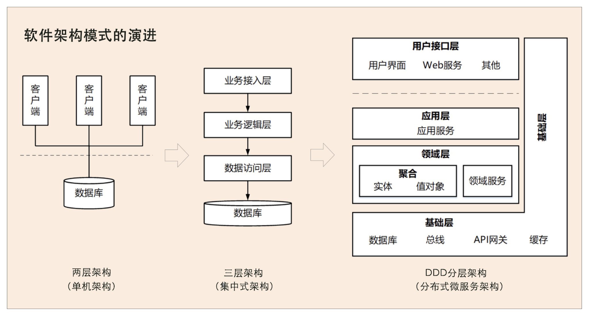
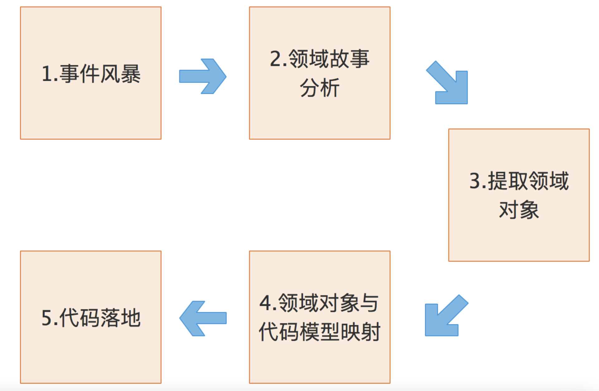
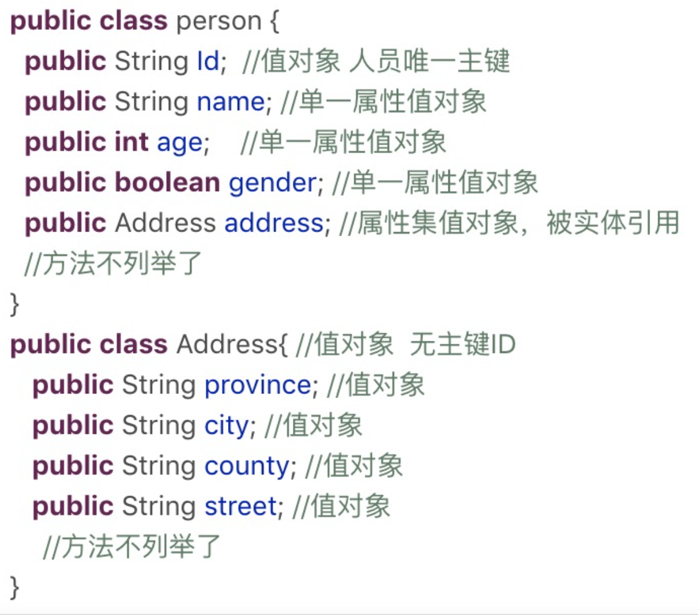

**第一阶段是单机架构：** 采用面向过程的设计方法，系统包括客户端 UI 层和数据库两层，采用 C/S 架构模式，整个系统围绕数据库驱动设计和开发，并且总是从设计数据库和字段开始。

**第二阶段是集中式架构：** 采用面向对象的设计方法，系统包括业务接入层、业务逻辑层和数据库层，采用经典的三层架构，也有部分应用采用传统的 SOA 架构。这种架构容易使系统变得臃肿，可扩展性和弹性伸缩性差。

**第三阶段是分布式微服务架构：** 随着微服务架构理念的提出，集中式架构正向分布式微服务架构演进。微服务架构可以很好地实现应用之间的解耦，**解决单体应用扩展性和弹性伸缩能力不足的问题** 。

#### 如何理解领域和子域

领域就是用来确定范围的，**范围即边界** ，这也是 DDD 在设计中不断强调边界的原因。DDD 会按照一定的规则 **将业务领域进行细分** ，当领域细分到一定的程度后，**DDD 会将问题范围限定在特定的边界内** ，在这个边界内建立领域模型，进而用代码实现该领域模型，解决相应的业务问题。简言之，**DDD 的领域就是这个边界内要解决的业务问题域** 。
**领域可以进一步划分为子领域。我们把划分出来的多个子领域称为子域** ，每个子域对应一个更小的问题域或更小的业务范围。

## 如何理解核心域、通用域和支撑域？

**子域可以根据自身重要性和功能属性划分为三类子域** ，它们分别是：核心域、通用域和支撑域。

+ 核心域：决定产品和公司核心竞争力的子域就是核心域。
+ 通用域：没有太多个性化诉求，同时被多个子域使用的通用功能子域就是通用域
+ 支撑域：必需的，但既不包含决定产品和公司核心竞争力的工作，也不包含通用功能的子域。

# 限界上下文：定义领域边界的利器

在 DDD 领域建模和系统建设过程中，有很多的参与者，包括领域专家、产品经理、项目经理、架构师、开发经理和测试经理等。对同样的领域知识，不同的参与角色可能会有不同的理解，那大家交流起来就会有障碍，怎么办呢？因此，在 DDD 中就出现了 **通用语言** 和 **限界上下文** 这两个重要的概念。

这两者相辅相成，**通用语言定义上下文含义，限界上下文则定义领域边界，** 以确保每个上下文含义在它特定的边界内都具有唯一的含义，领域模型则存在于这个边界之内。

#### 什么是通用语言

也就是说，通用语言是团队统一的语言，不管你在团队中承担什么角色，**在同一个领域的软件生命周期里都使用统一的语言进行交流**。
通用语言包含术语和用例场景，并且能够直接反映在代码中。通用语言中的名词可以给领域对象命名，如商品、订单等，对应实体对象；而动词则表示一个动作或事件，如商品已下单、订单已付款等，对应领域事件或者命令。

1. 在事件风暴的过程中，领域专家会和设计、开发人员一起建立领域模型，在领域建模的过程中会形成通用的业务术语和用户故事。事件风暴也是一个项目团队统一语言的过程。
2. 通过用户故事分析会形成一个个的领域对象，这些领域对象对应领域模型的业务对象，每一个业务对象和领域对象都有通用的名词术语，并且一一映射。
3. 微服务代码模型来源于领域模型，每个代码模型的代码对象跟领域对象一一对应。

## 什么是限界上下文？

**为了避免同样的概念或语义在不同的上下文环境中产生歧义** ，DDD 在战略设计上提出了 **限界上下文** 这个概念，用来确定语义所在的领域边界。

我们可以将限界上下文拆解为两个词：限界和上下文

- 限界就是领域的边界
- 而上下文则是语义环境

用来封装通用语言和领域对象，提供上下文环境，保证在领域之内的一些术语、业务相关对象等（通用语言）有一个确切的含义，没有二义性。这个边界定义了模型的适用范围，使团队所有成员能够明确地知道什么应该在模型中实现，什么不应该在模型中实现。

### 进一步理解限界上下文

同样的一个东西，由于业务领域的不同，赋予了这些术语不同的涵义和职责边界，这个边界就可能会成为未来微服务设计的边界。看到这，我想你应该非常清楚了，领域边界就是通过限界上下文来定义的

1. 客户投保时，业务人员记录投保信息，系统对应有投保单实体对象。
2. 缴费完成后，业务人员将投保单转为保单，系统对应有保单实体对象，保单实体与投保单实体关联。
3. 如客户需要修改保单信息，保单变为批单，系统对应有批单实体对象，批单实体与保单实体关联。
4. 如果客户发生理赔，生成赔案，系统对应有报案实体对象，报案实体对象与保单或者批单实体关联。

## 限界上下文和微服务的关系

每个领域模型都有它对应的限界上下文，团队在限界上下文内用通用语言交流。领域内所有限界上下文的领域模型构成整个领域的领域模型。

理论上限界上下文就是微服务的边界。我们将限界上下文内的领域模型映射到微服务，就完成了从问题域到软件的解决方案。

# 实体和值对象：从领域模型的基础单元看系统设计

TIP

- 贫血模型：像我们平时普通开发那样，Service 是业务逻辑，处理传递进来的 BO 或则参数对象，对于 BO 来说，BO 是贫血模型。**数据和业务逻辑被分割到不同的类中**
- 充血模型：相反的，**数据和对应的业务逻辑被封装到同一个类中**

##### 什么是实体

在DDD中有这样一类对象，它们拥有唯一标识符，且标识符在历经各种状态变更后扔能保持一致。对这些对象而言，重要的不是其属性，而是其延续性和标识，对象的延续性和标识会跨越甚至超过软件的生命周期。这样的对象称为实体。

1. 实体的业务形态
   在战略设计时，实体是领域模型的一个重要对象。领域模型中的实体是多个属性、操作或行为的载体。在事件风暴中，我们可以根据命令，操作或者事件，找出产生这些行为的业务实体对象，进而按照一定业务规则将依存度高和业务关联紧密的多个实体对象和值对象进行聚类，形成聚合。实体和值对象是组成领域模型的基础单元。
2. 实体的代码形态
   在代码模型中，实体的表现形式是实体类，这个类包含了实体的属性和方法，通过这些方法实现自身的业务逻辑。实体类通常采用充血模式。与这个实体相关的所有业务逻辑都在实体类的方法中实现。跨多个实体的领域逻辑则在领域服务中实现
3. 实体的运行形态
   实体以DO（领域对象）的形式存在，每个实体对象都有唯一的id。
4. 实体的数据库形态
   与传统数据模型设计优先不同，DDD是先构建领域模型，针对实际业务场景构建实体对象和行为，再将实体对象映射到数据持久化对象。

领域模型映射到数据模型时，一个实体可能对应 0 个、1 个或者多个数据库持久化对象。在某些场景中，有些实体只是暂驻静态内存的一个运行态实体，它不需要持久化。

#### 值对象

通过对象属性值来识别的对象，他讲多个相关属性组合为一个概念整体。在DDD中用来描述领域的特定方面，并且是一个没有标识符的对象，叫做值对象。也就说，值对象描述了领域中的一件东西，这个东西是不可变的，它将不同的相关属性组合成了一个概念整体。当度量和描述改变时，可以用另外一个值对象予以替换。它可以和其它值对象进行相等性比较，且不会对协作对象造成副作用。

简单来说，值对象本质上就是一个集。那这个集合里面有什么呢？若干个用于描述目的、具有整体概念和不可修改的属性。那这个集合存在的意义又是什么？在领域建模的过程中，值对象可以保证属性归类的清晰和概念的完整性，避免属性零碎。

##### 1. 值对象的业务形态

值对象时DDD领域模型中的一个基础对象，他跟实体一样都来源于事件风暴所构建的领域模型，都包含若干个属性，他与实体一起构建聚合。

实体是实实在在的业务对象，具有业务属性、业务行为和业务逻辑。而值对象只是若干个属性的集合，只有数据初始化操作和有限的不涉及修改数据的行为，基本不包含业务逻辑。值对象的属性虽然在物理独立出来了，但在逻辑上仍然是实体属性的一部分，用于描述实体的特征。

在值对象中也有部分共享的标准类型的值对象，它们有自己的限界上下文，有自己的持久化对象，可以建立共享的数据类微服务，比如数据字典。

##### 2. 值对象的代码形态

值对象在代码中有这样两种形态。如果值对象是单一属性，则直接定义为实体类的属性；如果值对象是属性集合，则把它设计为 Class 类，Class 将具有整体概念的多个属性归集到属性集合，这样的值对象没有 ID，会被实体整体引用。

##### 3. 值对象的运行形态

实体实例化后的 DO 对象的业务属性和业务行为非常丰富，但值对象实例化的对象则相对简单和乏味。除了值对象数据初始化和整体替换的行为外，其它业务行为就很少了。

值对象嵌入到实体的话，有这样两种不同的数据格式，也可以说是两种方式，分别是属性嵌入的方式和序列化大对象的方式。

引用单一属性的值对象或只有一条记录的多属性值对象的实体，可以采用属性嵌入的方式嵌入。引用一条或多条记录的多属性值对象的实体，可以采用序列化大对象的方式嵌入。比如，人员实体可以有多个通讯地址，多个地址序列化后可以嵌入人员的地址属性。值对象创建后就不允许修改了，只能用另外一个值对象来整体替换。

##### 4. 值对象的数据库形态

DDD 引入值对象是希望实现从**数据建模为中心**向**领域建模为中心**转变，减少数据库表的数量和表与表之间复杂依赖的关系，尽可能的简化数据库的设计，提升数据库的性能。

传统的数据建模大多是根据数据库范式设计的，每一个数据库表对应一个实体，每一个实体的属性值用单独的一列来存储，一个实体主表会对应 N 个实体从表。而值对象在数据库持久化方面简化了设计，它的数据库设计大多采用非数据库范式，值对象的属性值和实体对象的属性值保存在同一个数据库实体表中。

###### **那到底应该怎样设计，才能让业务含义清楚，同时又不让数据库变得复杂呢？**

在领域建模时，我们可以把地址作为值对象，人员作为实体，这样就可以保留地址的业务涵义和概念完整性。而在数据建模时，我们可以将地址的属性值嵌入人员实体数据库表中，只创建人员数据库表。这样既可以兼顾业务含义和表达，又不增加数据库的复杂度。

值对象就是通过这种方式，简化了数据库设计，总结一下就是：在领域建模时，我们可以将部分对象设计为值对象，保留对象的业务涵义，同时又减少了实体的数量；在数据建模时，我们可以将值对象嵌入实体，减少实体表的数量，简化数据库设计。

##### 5. 值对象的优势和局限

值对象采用序列化大对象的方法简化了数据库设计，减少了实体表的数量，可以简单、清晰地表达业务概念。这种设计方式虽然降低了数据库设计的复杂度，但却无法满足基于值对象的快速查询，会导致搜索值对象属性值变得异常困难。

##  实体和值对象的关系

实体和值对象是微服务底层的最基础的对象，一起实现实体最基本的核心领域逻辑。

值对象和实体在某些场景下可以互换，很多 DDD 专家在这些场景下，其实也很难判断到底将领域对象设计成实体还是值对象？

DDD 提倡从领域模型设计出发，而不是先设计数据模型。前面讲过了，传统的数据模型设计通常是一个表对应一个实体，一个主表关联多个从表，当实体表太多的时候就很容易陷入无穷无尽的复杂的数据库设计，领域模型就很容易被数据模型绑架。可以说，值对象的诞生，在一定程度上，和实体是互补的。

# 聚合和聚合根：怎样设计聚合？

在事件风暴中，我们会根据一些业务操作和行为找出实体（Entity）或值对象（ValueObject），进而将业务关联紧密的实体和值对象进行组合，构成聚合，再根据业务语义将多个聚合划定到同一个限界上下文（Bounded Context）中，并在限界上下文内完成领域建模。

##### 聚合

在DDD中，实体和值对象是很基础的领域对象。实体一般对应业务对象，它具有业务属性和业务行为。而值对象主要是属性集合，对实体的状态和特征进行描述。但实体和值对象都只是个体化的对象，它们的行为表现出来的是个体 能力。

###### 那聚合在其中起什么作用呢？

领域模型内的实体和值对象就好比个体，而能让实体和值对象协同工作的组织就是聚合，它用来确保这些领域对象在实现共同的业务逻辑时，能保证数据的一致性。
聚合就是由业务和逻辑紧密关联的实体和值对象组合而成的，聚合是数据修改和持久化的基本单元，每一个聚合对应一个仓储，实现数据的持久化。

你可以这么理解，聚合就是由业务和逻辑紧密关联的实体和值对象组合而成的，聚合是数据修改和持久化的基本单元，每一个聚合对应一个仓储，实现数据的持久化。

聚合有一个聚合根和上下文边界，这个边界根据业务单一职责和高内聚原则，定义了聚合内部应该包含哪些实体和值对象，而聚合之间的边界是松耦合的。按照这种方式设计出来的微服务很自然就是“高内聚、低耦合”的。

聚合在 DDD 分层架构里属于领域层，领域层包含了多个聚合，共同实现核心业务逻辑。聚合内实体以充血模型实现个体业务能力，以及业务逻辑的高内聚。跨多个实体的业务逻辑通过领域服务来实现，跨多个聚合的业务逻辑通过应用服务来实现。比如有的业务场景需要同一个聚合的 A 和 B 两个实体来共同完成，我们就可以将这段业务逻辑用领域服务来实现；而有的业务逻辑需要聚合 C 和聚合 D 中的两个服务共同完成，这时你就可以用应用服务来组合这两个服务。

##### 聚合根

聚合根的主要目的是为了避免由于复杂数据模型缺少统一的业务规则控制，而导致聚合、实体数据不一致性的问题。
传统数据模型中的每一个实体都是对等的，如果任由实体进行无控制地调用和数据修改，很可能会导致实体之间数据逻辑的不一致。而如果采用锁的方式则会增加软件的复杂度，也会降低系统的性能。

##### 怎么设计聚合

