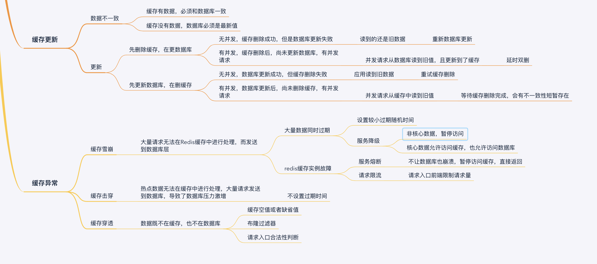

**面试做个汇总，答案瞎写的**

## 1月18号面试题汇总

1. 六台服务器做消息推送如何保证消息不重复

2. 如何设计一个web框架，一个web框架应该都有什么部分

   其实这个问题是问你对web框架源码的熟悉

3. 浏览器访问服务器的整个网络过程；

   1）网络分层；2）dns解析；3）什么是socket；4）tcp三次握手；

4. php-fpm模型

   php是fast-cgi协议的一种实现；fast-cgi是一种和web服务器

5. 进程，线程，协程的区别

   1）进程是程序的运行的实例；2）线程是进程的执行单位；3）协程是用户态线程；是N个用户线程对应M内核线程的一种实现；单位是一个func；共用一个线程的cpu时间片

6. 说说你对mysql的认识

7. 三台日志服务器做数据汇集

8. redis长链接和短连接

面试时长：hr25分钟；技术30分钟；

忘记让面试官评价了


## 1月20面试题汇总以及复盘

1. 文件上传系统可以用go，也可以用php；为什么要用go

2. web框架中间件的实现

   职责链模式

3. 线程的内存访问发生竞争如何处理

   加锁，channel(底层实现是互斥锁)

4. di容器管理如何实现对象的管理

5. 设计一个高并发的抢购活动

6. innodb、myisam的区别

7. 如何分布式事务如何保证数据一致性问题

8. php-fpm的模型

9. 公司开发模式的询问

10. redis的使用场景

##### 面试情况

面试时长：1小时15分；hr30分钟；技术45分钟

面试官评价：专注php相关技术栈，学习swoole；框架的实现和设计模式还需要多看看；项目偏简单；

hr评价：手势，让人觉得自信心很膨胀；

##### 面试个人总结：

有点听不懂面试官的问题，但是每个问题都结合自己的理解回答；面试官都说回答得差不多意思；设计模式这一块容易结合这框架设计一起问；面试官分成两种，一种偏爱你讲底层实现；一种偏爱考设计思想；

##### 反思：

实话实说因为工资不行所以想跳槽会不会不太好？

有些问题，我应该简单的回答还是展开讲？

要整理web框架设计常用的设计模式

有让面试官对自己评价


## 2月8号-2月10号临时面试

1. 如何避免协程泄露

   1） 不要主动调用者起协程，将是否起协程交给调用者

   2） 协程要有个终止的时刻或者要提供终止的方式，用context
   
1. 如何清洗历史数据

1. 处理过最复杂的数据库场景

4. 对业务场景你觉得如何改进


## 2月25日 

### 青瓷数码

1. 在字段a上面建立索引， select * from table wher a like "a%" 能用得上索引吗？

​	可以用得上索引。
​	因为检索条件是字符串以a开头的，是一个明确的范围；
​	%a则不行；因为%a表示一个不确定的范围，而且有可能非常大范围的数据；
​	而且检索的字段是 *。如果先查索引的的话，就必须回表。
​	这个时候全表扫描的成本会比使用索引在回表进行扫描小

2. select  a  from table where b=1 and c = 2 建立联合索引

   建立b, c, a索引；
   where条件b，c命中索引，且索引下推，不用回表；
   b, c, a索引上面有a字段，索引覆盖，不用回表；

3. 进程，线程，协程有什么区别？

   从cpu用户态内核态；linux进程树；进程调度和切换的；go调度模型；创建的开销上面的分析。

​	进程是程序运行时的实体，而线程是进程执行基本单位。而在linu话线程又被称为轻量级进程，task任务表示；linux启动之后 1号进程是所有用户态进程的父进程，2号进程是所有内核线程父进程。

​	所谓的内核态指就是cpu运行在特权状态，能够执行一些特权指令，比如内存管理；用户态进程可通过系统调用陷入内核态，让内核态的程序执行特权指令，然后在将调用结果返回，然后在切回用户态程序；进程和线程的切换，需要使用系统调用以及保存程序的上下文环境，内存不足的情况下还有可能涉及到暂时将上下文交换到磁盘暂时保存；

​	而在go的协程是用户态线程，是因为go在用户态层面实现了一套叫gmp调度的模型；用户态线程的意思，goroutine的切换和调度是处于cpu用户态。g是指goroutine，m是工作线程，p是处理器；p有自己的本地队列以及缓存；goroutine共享了m工作线程cpu时间片；
​	而在创建方面的开销，进程创建需要4g的虚拟内存；线程需要1m；而goroutine则需要1kb（问goroutine创建开销小？）

4. session ， cookie ，jwt， token 的区别

   服务端在客户端第一次请求时会生成jsessionid，然后发给客户端并且让其保存；然后下一次请求客户端带着cookie访问。

   token 是令牌，客户端发送用户名密码给服务端；服务端校验用户名和密码，通过则生成一个加密过的token字符串，返回给客户端；

   jwt它将用户信息加密到token里，服务器不保存任何用户信息。服务器通过使用保存的密钥验证token的正确性，只要正确即通过验证

5. 依赖倒置和依赖注入

   高层模块本来应该依赖底层模块。但是底层模块改了，高层模块也要跟着改；于是我们引用一个中间层抽象，然后让底层模块和高层模块都依赖抽象；这就和原来的`高层应该依赖底层`相反了，也就是依赖倒置了。抽象不依赖于具体实现，具体实现要依赖于抽象。

   主要是类的创建和使用分开。类A依赖类B，不要去类A代码中实例化类B；而是在外部实例化好对象，再通过成员变量以及成员方法的函数以传参形式引入；这样的好处，类B的修改构造函数；不需要每个实例化类B语句都要去改；

   laravel的话是用服务容器去实现依赖注入的，服务容器，服务提供者，服务注册，服务契约，服务本身。

6. mysql的mvvc和快照读

   undolog，版本链；

7. 并发扣库存

   update当前读，库存判断写在update where条件中；在根据受影响条数去判断

8. 分布式session如何解决
   请求被分到多台服务器上面，且客户端请求固定分配一台服务器来给访问；就会出现服务器给客户端session不一致，或者其他服务器上面；使用redis缓存session

9. gin的路由实现

   基数树

10. mysql主从同步原理

    binlog同步

11. redis 持久化过程

    rdb和aof； rdb是内存快照；aof是记录Redis命令；现在一般都是用rdb和aof混用的情况；以一定时间打rdb快照，时间间隔内用aof记录命令；只用aof会导致aof日志过大，触发aof重写；只用rdb会丢失一定时间内的数据；

12. 讲一下http的报文

    http是应用层的报文，是字符报文；请求相关的信息放在请求头，业务相关的信息放在请求体里面

    请求头第一行记录请求方法，uri 以及 ip地址

    第二行开始就是一些请求属性，比如keep-alive保持长链接，context-length报文长度，context-type报文类型

13. 消息队列如何保证不重复消费

    消息队列存取消息要**保证消息保序**、**处理重复消息**和**保证消息的可靠性**。

    + 消息保序。
    + 重复消息处理。一个业务逻辑被多次处理
    + 消息可靠性保证。因为故障或宕机导致消息没有处理完成的情况。

    基于List的消息队列解决方案

    + list先进先出保证了消息顺序，lpush生成消息；rpop消费。list没有通知机制，只能不断调用rpop，导致性能浪费；**BRPOP命令也称为阻塞式读取，客户端在没有读到队列数据时，自动阻塞，直到有新的数据写入队列，再开始读取新数据**

    + 重复消息处理。给每个消息全局唯一序列号。

      ```shell
      //我们执行以下命令，就把一条全局ID为101030001、库存量为5的消息插入了消息队列
      LPUSH mq "101030001:stock:5"
      ```

    + 消息的可靠性。BRPOPLPUSH命令读取消息插入到mqback队列中。消息处理程序宕机了，重启之后就可以mqback中再次读取消息。

    基于Streams的消息队列解决方案

    - XADD：插入消息，保证有序，可以自动生成全局唯一ID；
    - XREAD：用于读取消息，可以按ID读取数据；
    - XREADGROUP：按消费组形式读取消息；
    - XPENDING和XACK：XPENDING命令可以用来查询每个消费组内所有消费者已读取但尚未确认的消息，而XACK命令用于向消息队列确认消息处理已完成

    

14. 了解分布式吗

    我们公司只有主从。

15. docker有应用场景吗

    自己平时玩一玩

16. 聊一聊 go channel 

    一个读goroutine队列，一个写goroutine队列；

    读未就绪的时候不能写，会阻塞；

    一个环形队列的缓存区；

    一个互斥锁mutex；

17. 你的fweb框架怎么实现的中间件的

    先用装饰器实现了一边，一个方法包一个方法；后面改成pipeline；用一个数组去装所有的handle方法，然后index宝表示执行到那个中间件；（这边搞混了）

    

18. 了解过redis6.0新的底层数据结构吗？

    我了解的是简单动态字符串，压缩链表，跳表这些；不了解新出的

#### 他趣(只问redis和mysql)

### mysql

1. 索引失效的情况

   where条件上面字段发生了类型转换，比如字符串类型字段等于一个整型的值；然后就要每一条记录都要进行类型转换，然后在进行逻辑判断；这个时候mysql就会放弃使用索引；

   Where 使用like 以及通配符进行；通配符放在字符的左边；mysql就会认定是一个很大范围的搜索；

   where 条件使用 >=

   查的数据量很多而且select 字段在索引上面没有覆盖到，还要进行一次回表。

   order by 的字段不在索引上面。

2. mvvc以及快照读

   处理事务并发的读和写；写都是加锁；而读可以用加锁，也用mvvc去读；

   ​      用户记录是保存在数据页的user code部分，然后每一条记录除了自己本身记录的数据外还额外记录一些属性；比如有null值，变长字段，头信息以及两个隐藏列transaction_id(事务id)以及roll_pointer列(上一条旧undo log)；del，upd，insert都会产生undolog；通过roll_pointer形成单链表，就是版本版本链；

   ​     然后每一次我们在事务中select 一条sql语句，就会打一个快照。这个快照是一个数据结构，记录当前事务的id、当前事务执行的时候所有活跃的事务id 的数组以及最大事务id和最小事务id；拿着这个数据结构对着版本链查，是不是等于当前事务的id，是不是等于活跃事务id的一个，是不是比最小事务id还小；是这条数据对当前事务可见；不是，顺着roll_pointer指针找到下一跳undolog，在进行这样的判断；(判断可不可见好像讲错了)

   ​    不同隔离级别的打快照方式不一样；读已提交下面，在事务过程，每一次执行查询sql就打一次快照；而可重复度级别，相同查询sql就只生成一个快照。

   ​    然后你select可以用加锁去进行事务的并发访问；有select ... for update；也有加 lock in share；分别是加读锁，已经写锁；

      mvvc解决幻读，幻读可以用间隙锁去解决；但是间隙锁可能会造成死锁

3. 水平分表和垂直分表的情况

   什么情况要水平分表：b+树大于三层的情况，这个时候数据量已经到几千万了，这个跟一条数据的占多少字节；数据页是16k除以一记录占的字节数，得出一页能存几条记录；然后第二层只存主键id也是同样算；这个情况下单表文件大小基本大于几个g(具体数字我忘了)

   怎么垂直分表，看字段是不是经常被搜索，比如订单号，供应链编号，产品编号等；

4. 你工作中有遇到要优化sql以及解决方案的吗？

   主要还是建立合适的索引以及冗余字段减少join；

5. 你设计数据表一些思路？

   我们公司喜欢一张业务大表对应多个细分的小表；比如说，活动总表；新建一个秒杀活动就对应一个seckill活动表，如果在新增一个表促销就新增promotion表；

   然后就是多种支付方式的话，我们公司pay主表，如果接入的新支付出现了新的字段，在去pay主表上面新增

6. 如何建立索引思路和方法？

   一、where条件上面经常被搜索到的

   二、order by 可能会用到的

   三、select 字段可能会用到的，

   这些主要是利用索引下推和索引覆盖来减少回表来达到提高搜索的性能；

   还有一些具体细节

   比如说，要在值不重复度比较高的字段上面建立索引；对于字符串字段可以支取前N个字符建立索引；

7. 你了解事务提交的过程吗

   两阶段提交以及写前日志。先把记录载入buffer pool，有就不用载入；记录的旧值写入undolog；更新buffer pool；先写redo log，写binlog；然后在写redolog；

   

   

### redis

1. 缓存更新
   看缓存的作用以及对时效性要求；

   延时双删；

   先更数据库后删除缓存，可能会

   先删除缓存在更新数据库

2. redis缓存大key的情况
   不会

3. 缓存雪崩
   大量数据在同一个时间片段过期，请求一下子来到了数据库

   缓存的过期时间设置成在一段时间内随机；只读不更新的数据永不过期；

4. 缓存击穿

   一个热点缓存数据被大量请求持续访问；然后缓存数据缓存数据过期了；请求一下子达到了数据库；

5. 缓存穿透

   布隆过滤器；(记得不清楚，不敢回答)
   在php代码层面上做好过滤；比如id值的判断，日期的判断；及时返回null；
   如果数据库暂时也没有值的话；那么就要设置特殊的业务值，来表示缓存没有，数据库暂时也没有；比如说0值，null值；

6. 有序集合一般都有什么应用场景

   可以做延时订单取消，超过30分钟取消；分页

7. 如何保证缓存和数据库的一致性

8. 你们公司缓存的应用场景

9. 持久化机制

10. 你们公司消息队列应用场景
    订单生成通知，到货通知

    

11. redis实现分布式锁

    锁可以用一个变量来表示。变量值为0时，表示没有线程获取锁。变量值为1时，表示有线程获取锁。**加锁时判断锁变量的值，根据锁变量值来判断能否加锁成功；释放锁时需要把锁变量值设置为0，表明客户端不再持有锁**。

    1. 单节点redis实现分布式锁

       加锁的操作包含三个操作(读取锁变量、判断锁变量值以及把锁变量值设置为1)。可使用lua脚本和redis单命令操作。

       redis单命令操作：

       + SETNX和DEL命令组合来实现加锁和释放锁。

       + 并且给锁变量设置一个过期时间。解决有客户端持锁后异常，然后无法释放锁

       + 加锁时客户端给锁变量设置成一个唯一值。

         ```
         //nx表示不存在才设置，ex和px过期时间 
         SET key value [EX seconds | PX milliseconds]  [NX]
         ```

       + 释放锁(释放锁操作的逻辑也包含了读取锁变量、判断值、删除锁变量)]

         使用lua脚本保证原子性

11. redis 大key问题

    大key超512kb，大key一般都是热点数据；造成内存浪费，频繁触发lru清除，也会导致缓存穿透。

    解决方案：

    + 只保留必要的信息
+ 没必要全量缓存所有的数据，只保留前N条数据

### 安全方面

工作有遇到安全方面的问题吗？

聊了mysql注入，js注入，表单注入

### docker

问题忘记了

### 分布式

主从，分布式和集群有什么区别

集群

+ 单机：一个系统业务量很小的时，所有的代码都放在一个项目中，然后这个项目部署在一台服务器上就好了
+ 集群：单机处理到达瓶颈的时候，你就把单机复制几份，这样就构成了一个“集群”。集群中每台服务器就叫做这个集群的一个“节点”，所有节点构成了一个集群。每个节点都提供相同的服务
+ 集群的负载均衡服务器：根据当前所有节点的负载情况，决定将这个请求交给哪个节点处理

分布式

+ 按照业务功能，拆分成一个个独立的子系统，在分布式结构中，每个子系统就被称为“服务”


总结：二面挂了；二面有点抽象都是一些你为什么要写一个功能，选择学习的go的原因；你已经工作5年了，接下来有什么规划；虚了怂了；

都是聊到分布式和docker挂掉了


